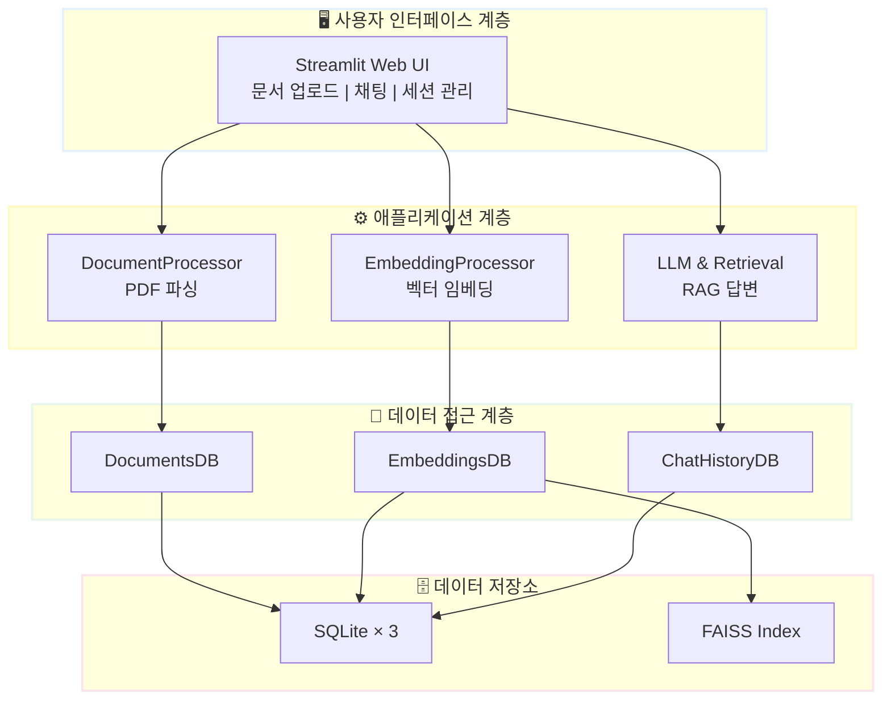
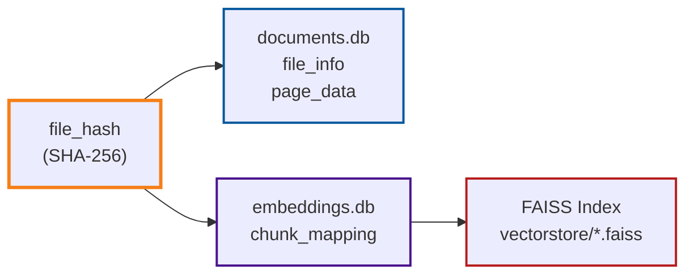
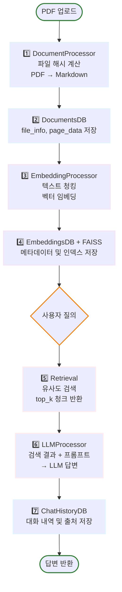

# RAG 기반 PEP 문서 처리 시스템

> **[중급 프로젝트]** OpenAI LLM + LangChain 기반 문서 검색 및 질의응답 시스템
>
> 📅 **프로젝트 기간**: 2025.11.08 ~ 2025.11.28 (3주)

[](https://www.python.org/)
[](https://openai.com/)
[](https://langchain.com/)
[](https://github.com/facebookresearch/faiss)

## 📋 프로젝트 개요

PDF/HWP 형태의 PEP(공공데이터) 문서를 자동으로 처리하여 벡터 임베딩을 생성하고, 사용자 질의에 대해 관련 문서를 검색하여 LLM 기반 답변을 제공하는 **RAG(Retrieval-Augmented Generation)** 시스템입니다.

### 📅 프로젝트 기간
**2025년 11월 10일 ~ 2025년 11월 28일**

## 📝 협업일지

팀원별 개발 과정 및 학습 내용을 기록한 협업일지입니다.

- [김명환 협업일지 (Project Manager)](https://c0z0c.github.io/codeit_ai_g2b_search/협업일지/김명환/)
- [신승목 협업일지 (Data Engineer)](https://c0z0c.github.io/codeit_ai_g2b_search/협업일지/신승일/)
- [오형주 협업일지 (Model Architect)](https://c0z0c.github.io/codeit_ai_g2b_search/협업일지/오형주/)
- [이민규 협업일지 (Experimentation Lead)](https://c0z0c.github.io/codeit_ai_g2b_search/협업일지/이민규/)

- [팀 회의록](https://c0z0c.github.io/codeit_ai_g2b_search/회의록/)


### 핵심 기능

- ✅ **문서 처리**: PDF → Markdown 자동 변환 (페이지 단위)
- ✅ **벡터 임베딩**: OpenAI text-embedding-3-small 모델
- ✅ **벡터 검색**: FAISS 기반 유사도 검색 (L2 distance)
- ✅ **RAG 답변**: LangChain + GPT-4o-mini
- ✅ **웹 UI**: Streamlit 기반 대화형 인터페이스
- ✅ **세션 관리**: 채팅 히스토리 저장 및 복원
- ✅ **출처 추적**: 답변의 근거 문서 및 페이지 표시

### 🎯 핵심 설계 원칙

- **파일 해시 기반 추적**: SHA-256 해시로 중복 제거 및 증분 업데이트
- **모듈화**: 독립적인 DB/Processor/LLM 모듈 구성
- **메타데이터 관리**: 모든 처리 단계 및 설정 기록

## 🏗️ 시스템 아키텍처

### 4계층 아키텍처



### 디렉토리 구조

```
codeit_ai_g2b_search/
├── src/
│   ├── db/                         # 데이터베이스 계층
│   │   ├── documents_db.py         # 문서 메타데이터
│   │   ├── embeddings_db.py        # 임베딩 메타데이터
│   │   └── chat_history_db.py      # 채팅 히스토리
│   ├── processors/                 # 처리 계층
│   │   ├── document_processor.py   # PDF → Markdown
│   │   └── embedding_processor.py  # 텍스트 → 벡터
│   ├── llm/                        # LLM 계층
│   │   ├── retrieval.py            # 유사도 검색
│   │   └── llm_processor.py        # RAG 답변 생성
│   └── utils/                      # 유틸리티
├── data/                           # 데이터 저장소
│   ├── documents.db                # SQLite
│   ├── embeddings.db               # SQLite
│   ├── chat_history.db             # SQLite
│   └── vectorstore/*.faiss         # FAISS 인덱스
├── docs/                           # 문서
│   └── doc/
│       ├── RAG_기반_PEP_문서_처리_시스템_설계서.md
│       ├── 시스템_아키텍처_설계서.md
│       └── 프로젝트_체크리스트.md
├── app.py                          # Streamlit 메인 앱
└── requirements.txt                # 의존성
```

> 📚 **상세 문서**: [시스템 아키텍처 설계서](docs/doc/시스템_아키텍처_설계서.md)

## 🚀 빠른 시작

### 1. 환경 설정

```bash
# Python 3.11+ 권장
python -m venv venv
source venv/bin/activate  # Windows: venv\Scripts\activate

# 의존성 설치
pip install -r requirements.txt
```

### 2. 환경 변수 설정

`.env` 파일을 생성하고 OpenAI API 키를 설정합니다:

```bash
OPENAI_API_KEY=your_api_key_here
```

### 3. 더미 데이터 생성 (테스트용)

```bash
python scripts/generate_dummy_simple.py
```

### 4. Streamlit 앱 실행

```bash
streamlit run app.py
```

브라우저에서 `http://localhost:8501`에 접속합니다.

## 📊 데이터베이스 구조

### 핵심 DB: 3개의 SQLite + FAISS

| DB | 테이블 | 주요 역할 | 연결 키 |
|----|--------|-----------|---------|
| **documents.db** | file_info<br/>page_data | 원본 문서 메타데이터<br/>페이지별 Markdown 저장 | `file_hash` (SHA-256) |
| **embeddings.db** | embedding_meta<br/>chunk_mapping | 임베딩 설정 및 메타데이터<br/>청크 텍스트 및 벡터 매핑 | `embedding_hash`<br/>`file_hash` |
| **chat_history.db** | chat_sessions<br/>chat_messages | 세션 관리<br/>대화 내역 및 출처 저장 | `session_id` (UUID) |
| **FAISS Index** | *.faiss 파일 | 벡터 유사도 검색 (L2) | `vector_index` |

### 핵심 설계: 파일 해시 기반 연결



**embedding_hash 계산**:

$$
\text{embedding\_{hash}} = \text{SHA256}(\text{file\_{hash}} + \text{JSON}(\text{config}))
$$

여기서 `config = {chunk_size, chunk_overlap, model}`

> 📚 **상세 스키마**: [시스템 아키텍처 설계서](docs/doc/시스템_아키텍처_설계서.md#데이터베이스-er-다이어그램)

## 🔧 사용 방법

### PDF 문서 처리 (Python API)

```python
from src.processors.document_processor import DocumentProcessor

processor = DocumentProcessor()
file_hash = processor.process_pdf("path/to/document.pdf")
print(f"처리 완료: {file_hash}")
```

### 임베딩 생성

```python
from src.processors.embedding_processor import EmbeddingProcessor

embedder = EmbeddingProcessor(chunk_size=1000, chunk_overlap=200)
embedding_hash = embedder.process_document(
    file_hash=file_hash,
    api_key="your_openai_api_key"
)
print(f"임베딩 생성 완료: {embedding_hash}")
```

### 문서 검색 및 질의응답

```python
from src.llm.retrieval import Retrieval
from src.llm.llm_processor import LLMProcessor

# 검색
retrieval = Retrieval()
results = retrieval.search(
    query="공공데이터 품질관리에서 완전성이란?",
    embedding_hash=embedding_hash,
    top_k=3
)

# LLM 응답 생성
llm = LLMProcessor()
response = llm.generate_response(
    query="공공데이터 품질관리에서 완전성이란?",
    retrieved_chunks=results
)
print(response)
```

## ⚙️ 설정 (config/settings.yaml)

```yaml
# 청킹 설정
chunking:
  chunk_size: 1000
  chunk_overlap: 200

# 임베딩 설정
embedding:
  model: "text-embedding-3-small"
  dimension: 1536

# LLM 설정
llm:
  model: "gpt-4o-mini"
  temperature: 0.7

# 검색 설정
retrieval:
  top_k: 5
  similarity_threshold: 0.7
```

## 📦 기술 스택

| 카테고리 | 기술 | 용도 |
|---------|------|------|
| **언어** | Python 3.11+ | 주 개발 언어 |
| **LLM** | OpenAI API | GPT-4o-mini, text-embedding-3-small |
| **프레임워크** | LangChain | RAG 파이프라인 구성 |
| **벡터 DB** | FAISS | 유사도 검색 (L2 distance) |
| **문서 처리** | PyMuPDF | PDF 파싱 및 텍스트 추출 |
| **토큰화** | tiktoken | GPT tokenizer |
| **데이터베이스** | SQLite 3.x | 메타데이터 저장 |
| **UI** | Streamlit | 웹 인터페이스 |

## 🔄 데이터 처리 흐름



## 📝 더미 데이터

시스템에는 테스트용 더미 데이터가 포함되어 있습니다:

1. **공공데이터_품질관리_가이드라인_2024.pdf** (3페이지)
   - 공공데이터 품질관리 절차 및 지표

2. **AI_학습용_데이터_구축_지침서_v2.pdf** (3페이지)
   - AI 데이터 수집, 가공, 라벨링 방법

샘플 채팅 세션 2개도 포함되어 있습니다.

## 🧪 테스트

```bash
# 더미 데이터 생성 및 확인
python scripts/generate_dummy_simple.py

# Streamlit 앱 실행 및 테스트
streamlit run app.py
```

## 🎯 핵심 특징

| 특징 | 설명 | 구현 |
|------|------|------|
| **중복 제거** | SHA-256 해시 기반 파일 식별 | `file_hash = hashlib.sha256(file_content).hexdigest()` |
| **증분 업데이트** | 변경된 문서만 재처리 | `embedding_hash` 비교로 변경 감지 |
| **출처 추적** | 답변의 근거 페이지 표시 | `retrieved_chunks` JSON 저장 |
| **유사도 계산** | FAISS L2 거리 → [0, 1] 정규화 | $\text{similarity} = \frac{1}{1 + \text{distance}}$ |
| **세션 관리** | 브라우저별 독립적 채팅 세션 | UUID 기반 `session_id` |

## 📚 프로젝트 문서

- 📖 [RAG 기반 PEP 문서 처리 시스템 설계서](docs/doc/RAG_기반_PEP_문서_처리_시스템_설계서.md)
- 🏗️ [시스템 아키텍처 설계서](docs/doc/시스템_아키텍처_설계서.md) (Mermaid 다이어그램 포함)
- ✅ [프로젝트 체크리스트](docs/doc/프로젝트_체크리스트.md) (3주 일정)
- 👥 [개발자별 체크리스트](docs/doc/개발자별_체크리스트.md)

## 👥 팀 구성

| 역할 | 담당 모듈 | 주요 작업 |
|------|-----------|-----------|
| **개발자 1** | 문서 수집 및 전처리 | PDF/HWP → Markdown, DocumentsDB |
| **개발자 2** | 임베딩 처리 | 텍스트 청킹, 벡터 임베딩, FAISS 인덱싱 |
| **개발자 3** | LLM 기반 정보 추출 | RAG 파이프라인, 프롬프트 엔지니어링 |
| **개발자 4** | UI 개발 및 통합 | Streamlit 앱, 전체 모듈 통합 |

## 🤝 기여 및 문의

- **이슈**: 버그 리포트 및 기능 제안
- **문서**: `docs/` 디렉토리 참고
- **라이선스**: 교육용 프로젝트

---

**프로젝트 기간**: 2025.11.08 ~ 2025.11.28 (3주)
**문서 버전**: 1.0
**최종 업데이트**: 2025-11-08
