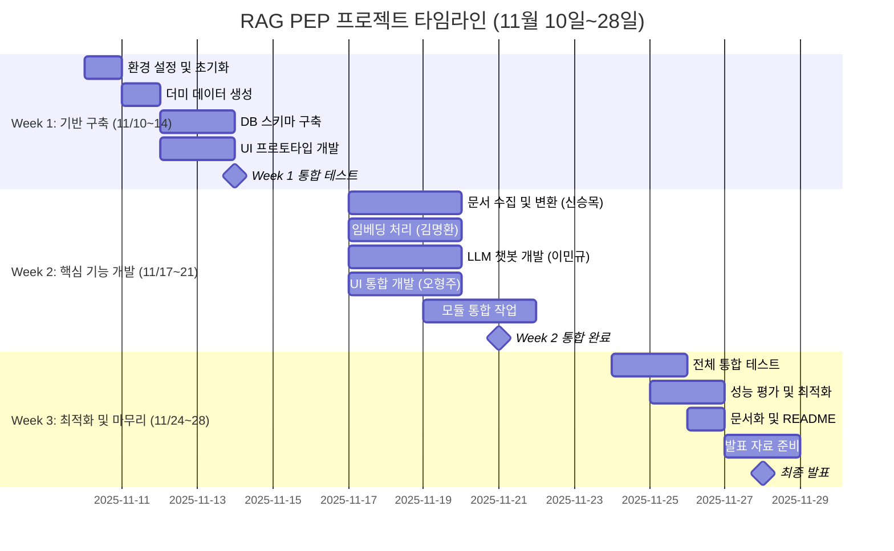
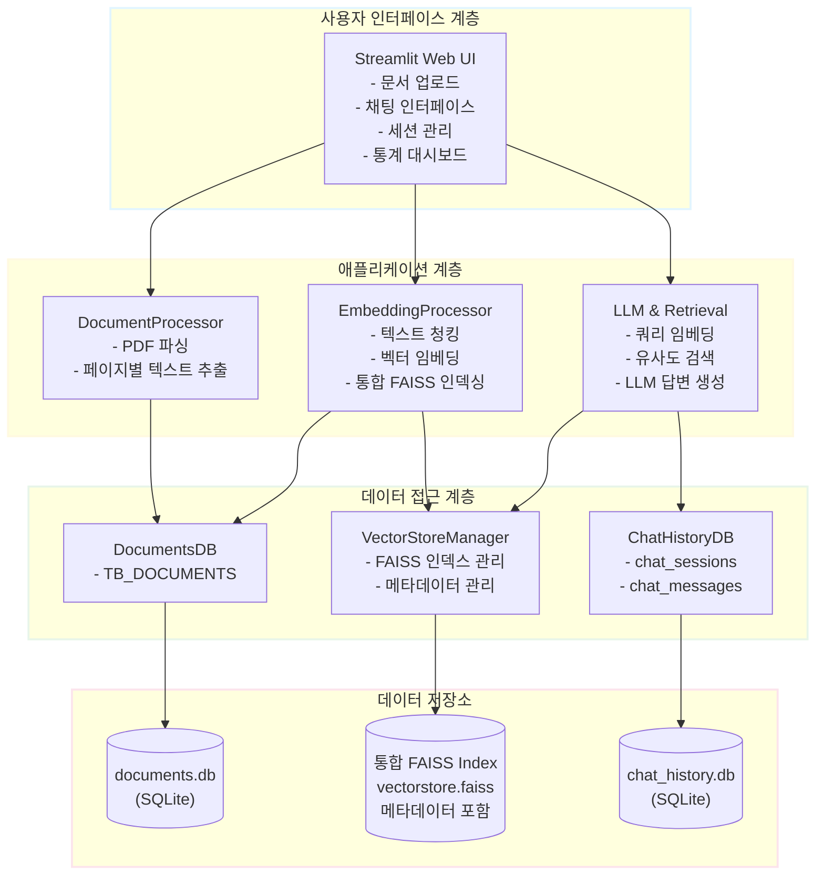

# RAG 기반 공공데이터 문서 처리 시스템

> **[중급 프로젝트]** OpenAI LLM + LangChain 기반 문서 검색 및 질의응답 시스템
>
> 📅 **프로젝트 기간**: 2025.11.08 ~ 2025.11.28 (3주) ✅ **완료**
> **[결과 보고서 다운로드](https://drive.google.com/file/d/1EjaqbRXXX6tl1I4omXlMSTklGSylVe_U/view?usp=drive_link)**

[](https://www.python.org/)
[](https://openai.com/)
[](https://langchain.com/)
[](https://github.com/facebookresearch/faiss)
[](https://streamlit.io/)

## 📋 프로젝트 개요

공공조달 문서(나라장터 입찰공고 등)를 자동으로 처리하여 벡터 임베딩을 생성하고, 사용자 질의에 대해 관련 문서를 검색하여 LLM 기반 답변을 제공하는 **RAG(Retrieval-Augmented Generation)** 시스템입니다.

본 시스템은 PDF 문서를 자동으로 처리하여 FAISS 벡터 인덱스를 구축하고, 사용자의 자연어 질문에 대해 관련 문서를 검색하여 정확한 출처와 함께 답변을 제공합니다.

### 📅 프로젝트 기간
**2025년 11월 10일 ~ 2025년 11월 28일**

- **신승목**: 문서 수집 및 원본 전처리 (PDF/HWP → Markdown 변환 및 DB 저장)
- **[김명환](https://c0z0c.github.io)**: 임베딩 처리 (Markdown → 벡터 임베딩 및 FAISS 저장)
- **이민규**: LLM 기반 정보 추출 및 요약 시스템
- **오형주**: Streamlit UI 개발 및 통합



## 📝 협업일지

팀원별 개발 과정 및 학습 내용을 기록한 협업일지입니다.

- [김명환 협업일지 (Project Manager)](https://c0z0c.github.io/codeit_ai_g2b_search/협업일지/김명환/)
- [신승목 협업일지 (Data Engineer)](https://c0z0c.github.io/codeit_ai_g2b_search/협업일지/신승목/)
- [오형주 협업일지 (Model Architect)](https://c0z0c.github.io/codeit_ai_g2b_search/협업일지/오형주/)
- [이민규 협업일지 (Experimentation Lead)](https://c0z0c.github.io/codeit_ai_g2b_search/협업일지/이민규/)

- [팀 회의록](https://c0z0c.github.io/codeit_ai_g2b_search/회의록/)


### ✨ 핵심 기능

- ✅ **문서 처리**: PDF 자동 파싱 및 텍스트 추출 (PyMuPDF)
- ✅ **벡터 임베딩**: OpenAI text-embedding-3-small 모델 기반
- ✅ **벡터 검색**: FAISS 기반 유사도 검색 (L2 distance)
- ✅ **RAG 답변 생성**: LangChain + GPT-4o-mini
- ✅ **대화형 웹 UI**: Streamlit 기반 직관적 인터페이스
- ✅ **세션 관리**: 채팅 히스토리 자동 저장 및 복원
- ✅ **정확한 출처 추적**: 파일명 + 페이지 번호 자동 표시
- ✅ **통합 FAISS 관리**: 단일 인덱스로 전체 문서 관리

### 🎯 핵심 설계 원칙

- **파일 해시 기반 추적**: SHA-256 해시로 중복 제거 및 증분 업데이트 지원
- **모듈화 아키텍처**: 독립적인 DB/Processor/LLM 모듈 구성으로 유지보수 용이
- **메타데이터 통합 관리**: Document.metadata에 파일명, 페이지 정보 통합 저장
- **확장성**: 새로운 문서 타입 및 모델 추가 용이한 구조
- **추적성**: 모든 답변의 출처를 정확히 추적 가능

## 🏗️ 시스템 아키텍처

본 시스템은 4계층 구조 (UI → Application → Data Access → Storage)로 구성된 모듈화 아키텍처를 채택하고 있습니다.



### �� 주요 특징

- **통합 FAISS 관리**: 모든 문서의 임베딩을 단일 FAISS 인덱스로 관리하여 효율성 극대화
- **메타데이터 통합**: Document.metadata에 파일명, 페이지 번호, 청크 정보를 함께 저장
- **파일 해시 기반 추적**: SHA-256 해시로 중복 제거 및 증분 업데이트 자동 처리
- **EmbeddingsDB 제거**: 별도 임베딩 DB 없이 FAISS 내부 메타데이터만 사용하여 아키텍처 단순화

### 📊 데이터 흐름

```
PDF 업로드 → DocumentProcessor → DocumentsDB (텍스트 저장)
                                      ↓
            EmbeddingProcessor → VectorStoreManager → FAISS Index
                                      ↓
사용자 질의 → Retrieval (FAISS 검색) → LLMProcessor → 답변 생성
                                      ↓
                              ChatHistoryDB (히스토리 저장)
```

> 📚 **상세 문서**: [시스템 아키텍처 설계서](docs/doc/시스템_아키텍처_설계서.md) - Mermaid 다이어그램 및 상세 설명 포함

## 🚀 빠른 시작

### 1. 저장소 클론 및 환경 설정

```bash
# 저장소 클론
git clone <repository-url>
cd codeit_ai_g2b_search

# Python 가상환경 생성 (Python 3.11+ 권장)
python -m venv venv

# 가상환경 활성화
# Linux/Mac:
source venv/bin/activate
# Windows:
venv\Scripts\activate

# 의존성 설치
pip install -r requirements.txt
```

### 2. 환경 변수 설정

프로젝트 루트에 `.env` 파일을 생성하고 OpenAI API 키를 설정합니다:

```bash
# .env 파일
OPENAI_API_KEY=sk-your-api-key-here
```

또는 `.env.example` 파일을 복사하여 사용:

```bash
cp .env.example .env
# .env 파일을 열어 API 키 입력
```

### 3. 테스트 데이터 생성 (선택사항)

시스템 테스트를 위한 더미 데이터를 생성합니다:

```bash
python scripts/generate_dummy_simple.py
```

이 스크립트는 다음을 생성합니다:
- 샘플 PDF 문서 2개
- 벡터 인덱스 (FAISS)
- 채팅 세션 2개

### 4. Streamlit 앱 실행

```bash
streamlit run app.py
```

브라우저에서 자동으로 `http://localhost:8501`이 열립니다.

### 5. 사용 방법

1. **사이드바에서 OpenAI API 키 입력** (또는 .env 파일 사용)
2. **PDF 파일 업로드** (사이드바 "📁 PDF 파일 업로드" 섹션)
3. **문서 처리 대기** (자동으로 임베딩 생성)
4. **질문 입력** (메인 화면 채팅 입력창)
5. **답변 확인** (출처 정보와 함께 표시됨)

## 📊 데이터베이스 구조

본 시스템은 **2개의 SQLite 데이터베이스**와 **1개의 FAISS 인덱스**로 구성됩니다.

### 핵심 저장소

| 저장소 | 구성 요소 | 주요 역할 | 특징 |
|-------|-----------|-----------|------|
| **documents.db** | TB_DOCUMENTS | 문서 메타데이터 및 텍스트 저장 | 파일 해시(PK), 파일명, 페이지 수, 전체 텍스트 |
| **chat_history.db** | chat_sessions<br/>chat_messages | 세션 관리<br/>대화 내역 및 출처 저장 | UUID 세션 ID, 검색 결과(JSON) 포함 |
| **FAISS Index** | vectorstore.faiss<br/>vectorstore.pkl | 벡터 인덱스<br/>메타데이터 통합 관리 | Document.metadata에 파일명, 페이지 번호 저장 |

### 🔑 아키텍처 특징

- **단순화된 구조**: 기존 3개 DB → 2개 DB + FAISS로 단순화
- **EmbeddingsDB 제거**: 별도 임베딩 DB 없이 FAISS 내부 메타데이터만 사용
- **VectorStoreManager**: FAISS 인덱스 및 메타데이터를 통합 관리하는 단일 인터페이스
- **파일 해시 중심 설계**: SHA-256 해시로 중복 제거 및 버전 추적
- **메타데이터 통합**: Document.metadata에 파일명, 페이지 범위, 청크 정보 모두 저장

### TB_DOCUMENTS 스키마

```sql
CREATE TABLE TB_DOCUMENTS (
    file_hash TEXT PRIMARY KEY,          -- SHA-256 해시 (고유 식별자)
    file_name TEXT NOT NULL,             -- 파일명
    total_pages INTEGER NOT NULL,        -- 총 페이지 수
    file_size INTEGER NOT NULL,          -- 파일 크기 (bytes)
    text_content TEXT,                   -- 전체 텍스트 콘텐츠
    created_at TIMESTAMP,                -- 생성 시각
    updated_at TIMESTAMP                 -- 수정 시각
);
```

> 📚 **상세 스키마 및 ER 다이어그램**: [시스템 아키텍처 설계서](docs/doc/시스템_아키텍처_설계서.md#데이터베이스-er-다이어그램)

## 🔧 사용 방법

### PDF 문서 처리 (Python API)

```python
from src.processors.document_processor import DocumentProcessor

processor = DocumentProcessor()
file_hash = processor.process_pdf("path/to/document.pdf")
print(f"처리 완료: {file_hash}")
```

### 임베딩 생성

```python
from src.processors.embedding_processor import EmbeddingProcessor

embedder = EmbeddingProcessor(chunk_size=1000, chunk_overlap=200)
embedding_hash = embedder.process_document(
    file_hash=file_hash,
    api_key="your_openai_api_key"
)
print(f"임베딩 생성 완료: {embedding_hash}")
```

### 문서 검색 및 질의응답

```python
from src.llm.retrieval import Retrieval
from src.llm.llm_processor import LLMProcessor

# 검색
retrieval = Retrieval()
results = retrieval.search(
    query="공공데이터 품질관리에서 완전성이란?",
    embedding_hash=embedding_hash,
    top_k=3
)

# LLM 응답 생성
llm = LLMProcessor()
response = llm.generate_response(
    query="공공데이터 품질관리에서 완전성이란?",
    retrieved_chunks=results
)
print(response)
```

## ⚙️ 설정 (config/settings.yaml)

```yaml
# 청킹 설정
chunking:
  chunk_size: 1000
  chunk_overlap: 200

# 임베딩 설정
embedding:
  model: "text-embedding-3-small"
  dimension: 1536

# LLM 설정
llm:
  model: "gpt-4o-mini"
  temperature: 0.7

# 검색 설정
retrieval:
  top_k: 5
  similarity_threshold: 0.7
```

## 📦 기술 스택

| 카테고리 | 기술 | 버전 | 용도 |
|---------|------|------|------|
| **언어** | Python | 3.11+ | 주 개발 언어 |
| **LLM** | OpenAI API | 1.109+ | GPT-4o-mini, text-embedding-3-small |
| **프레임워크** | LangChain | 0.2.16 | RAG 파이프라인 구성 |
| **벡터 DB** | FAISS | 1.12.0 | 유사도 검색 (L2 distance) |
| **문서 처리** | PyMuPDF | 1.26.6 | PDF 파싱 및 텍스트 추출 |
| **토큰화** | tiktoken | 0.9.0 | GPT tokenizer |
| **데이터베이스** | SQLite | 3.x | 메타데이터 및 텍스트 저장 |
| **UI** | Streamlit | 1.40.1 | 대화형 웹 인터페이스 |
| **데이터 분석** | Pandas, NumPy | Latest | 데이터 처리 및 분석 |

### 주요 의존성

```bash
# 핵심 라이브러리
langchain==0.2.16
langchain-openai==0.1.20
openai==1.109.1
faiss-cpu==1.12.0
pymupdf==1.26.6
streamlit==1.40.1

# 보조 라이브러리
python-dotenv==1.1.1
tiktoken==0.9.0
```

> 전체 의존성 목록은 [requirements.txt](requirements.txt) 참조

## 📁 프로젝트 구조

```
codeit_ai_g2b_search/
│
├── app.py                          # Streamlit 메인 애플리케이션
├── requirements.txt                # Python 의존성 목록
├── .env.example                    # 환경 변수 예시 파일
├── .gitignore                      # Git 제외 파일 목록
├── README.md                       # 프로젝트 설명 (본 문서)
│
├── src/                            # 소스 코드
│   ├── __init__.py
│   │
│   ├── db/                         # 데이터베이스 모듈
│   │   ├── __init__.py
│   │   ├── documents_db.py         # 문서 DB 관리 (TB_DOCUMENTS)
│   │   └── chat_history_db.py      # 채팅 히스토리 DB 관리
│   │
│   ├── processors/                 # 처리 모듈
│   │   ├── __init__.py
│   │   ├── document_processor.py   # PDF 문서 처리
│   │   └── embedding_processor.py  # 임베딩 생성 및 처리
│   │
│   ├── llm/                        # LLM 관련 모듈
│   │   ├── __init__.py
│   │   ├── retrieval.py            # 벡터 검색 기능
│   │   └── llm_processor.py        # LLM 답변 생성
│   │
│   ├── vectorstore/                # 벡터 저장소 모듈
│   │   ├── __init__.py
│   │   └── vector_store_manager.py # FAISS 인덱스 관리
│   │
│   └── utils/                      # 유틸리티
│       ├── __init__.py
│       ├── helper_utils.py         # 헬퍼 함수
│       └── logging_config.py       # 로깅 설정
│
├── data/                           # 데이터 디렉토리 (Git 제외)
│   ├── documents.db                # 문서 텍스트 DB (SQLite)
│   ├── chat_history.db             # 채팅 히스토리 DB (SQLite)
│   ├── vectorstore.faiss           # FAISS 벡터 인덱스
│   ├── vectorstore.pkl             # FAISS 메타데이터
│   └── raw/                        # 원본 PDF/HWP 파일
│
├── docs/                           # 프로젝트 문서
│   └── doc/
│       ├── RAG_기반_PEP_문서_처리_시스템_설계서.md
│       ├── 시스템_아키텍처_설계서.md
│       ├── 프로젝트_체크리스트.md
│       └── 조달청_OpenAPI참고자료_*.txt
│
├── scripts/                        # 유틸리티 스크립트
│   ├── generate_dummy_simple.py    # 더미 데이터 생성
│   └── 김명환/                     # 개인 작업 스크립트
│
└── tests/                          # 테스트 코드 (선택사항)
    ├── __init__.py
    ├── test_document_processor.py
    ├── test_embedding_processor.py
    └── test_retrieval.py
```

## 🔄 데이터 처리 흐름

1. **문서 처리**: PDF → DocumentProcessor → DocumentsDB (텍스트 저장)
2. **임베딩 생성**: EmbeddingProcessor → VectorStoreManager → FAISS 인덱스 (벡터 + 메타데이터)
3. **질의응답**: 사용자 질의 → Retrieval (FAISS 검색) → LLMProcessor (RAG 답변)
4. **히스토리 저장**: ChatHistoryDB (대화 내역 및 출처)

> 📚 **상세 흐름도**: [시스템 아키텍처 설계서](docs/doc/시스템_아키텍처_설계서.md#데이터-흐름)

## 📝 샘플 데이터

시스템 테스트를 위한 샘플 데이터가 포함되어 있습니다:

### 테스트 문서 (docs/doc/)
- **조달청 OpenAPI 참고자료**: 나라장터 입찰공고 정보 서비스 API 문서

### 실제 공공조달 문서 예시
프로젝트에는 다음과 같은 공공조달 문서들이 처리되었습니다:
- 의료기기산업 종합정보시스템 기능개선 사업 (한국보건산업진흥원)
- 통합정보시스템 고도화 용역 (국가과학기술지식정보서비스)
- 학사시스템 기능개선 사업 (광주과학기술원)
- 네팔 수자원관리 정보화사업 Pilot 시스템 구축 (한국농어촌공사)

### 더미 데이터 생성
테스트용 더미 데이터를 생성하려면:
```bash
python scripts/generate_dummy_simple.py
```

이 스크립트는 다음을 생성합니다:
- 샘플 PDF 문서
- 벡터 인덱스 (FAISS)
- 샘플 채팅 세션

## 🧪 테스트

```bash
# 더미 데이터 생성 및 확인
python scripts/generate_dummy_simple.py

# Streamlit 앱 실행 및 테스트
streamlit run app.py
```

## 🎯 핵심 기술 및 알고리즘

### 1. 파일 해시 기반 중복 제거

```python
# SHA-256 해시로 동일 파일 자동 감지
file_hash = hashlib.sha256(file_content).hexdigest()
```

- 동일 파일 재처리 방지
- 증분 업데이트 지원 (변경된 파일만 재처리)
- 파일명 변경에도 동일성 유지

### 2. 텍스트 청킹 전략

```python
RecursiveCharacterTextSplitter(
    chunk_size=1000,        # 청크당 1000자
    chunk_overlap=200,      # 청크 간 200자 중복
    separators=["\n\n", "\n", " ", ""]
)
```

- 문맥 보존을 위한 오버랩 설정
- 단락 단위 우선 분할
- 페이지 범위 자동 추적 (start_page, end_page)

### 3. 벡터 검색 (FAISS L2 Distance)

- **L2 거리 기반 검색**: 작은 값일수록 높은 유사도
- **통합 FAISS 인덱스**: 모든 문서를 단일 인덱스로 관리
- **메타데이터 자동 포함**: 검색 결과에 파일명, 페이지 번호 자동 포함

| Distance | 유사도 해석 |
|----------|------------|
| 0.0 | 완전 일치 |
| 0.1 ~ 0.5 | 매우 높은 유사도 |
| 0.5 ~ 1.0 | 높은 유사도 |
| 1.0 ~ 2.0 | 중간 유사도 |
| 2.0 이상 | 낮은 유사도 |

### 4. 정확한 출처 추적

모든 답변에는 다음 정보가 자동으로 포함됩니다:
- **파일명**: 출처 문서의 파일명
- **페이지 번호**: 정보가 포함된 페이지 범위 (start_page ~ end_page)
- **청크 인덱스**: 문서 내 청크 위치
- **유사도 점수**: L2 거리 값

> 📚 **구현 세부사항**: [시스템 아키텍처 설계서](docs/doc/시스템_아키텍처_설계서.md#핵심-컴포넌트)

## 🔮 향후 개선 방향

본 프로젝트는 기본적인 RAG 시스템을 구현했으며, 다음과 같은 확장 가능성을 가지고 있습니다:

### 1. 문서 처리 확장

- **다양한 문서 형식 지원**: HWP, DOCX, TXT, HTML, Markdown
- **이미지 OCR**: PDF 내 이미지에서 텍스트 추출
- **표 구조 인식**: 테이블 데이터 전용 파싱 및 처리
- **문서 구조 분석**: 제목, 목차, 섹션 자동 추출

### 2. 검색 성능 향상

- **하이브리드 검색**: 키워드 검색(BM25) + 벡터 검색 결합
- **리랭킹(Re-ranking)**: Cross-Encoder 또는 LLM 기반 결과 재정렬
- **메타데이터 필터링**: 날짜, 파일 타입, 카테고리별 필터링
- **쿼리 확장**: 동의어 및 관련 용어 자동 추가

### 3. 임베딩 모델 다양화

- **로컬 임베딩 모델**: Sentence Transformers, HuggingFace 모델 지원
- **다국어 지원**: 다국어 임베딩 모델 통합
- **멀티모달**: CLIP 등 이미지-텍스트 통합 임베딩
- **비용 절감**: OpenAI API 대신 로컬 모델 사용 옵션

### 4. 인프라 스케일링

- **PostgreSQL + pgvector**: 대용량 문서 처리를 위한 확장형 DB
- **Redis 캐싱**: 자주 사용되는 검색 결과 캐싱
- **분산 처리**: Celery/Ray를 통한 병렬 문서 처리
- **API 서버화**: FastAPI 기반 REST API 제공

### 5. 사용자 경험 개선

- **피드백 루프**: 답변 품질에 대한 사용자 피드백 수집 및 학습
- **북마크 기능**: 유용한 답변 저장 및 관리
- **대화 요약**: 긴 대화 세션 자동 요약
- **다중 문서 비교**: 여러 문서의 내용 비교 분석

### 6. 모니터링 및 관리

- **성능 모니터링**: Prometheus + Grafana를 통한 시스템 모니터링
- **로그 분석**: 사용자 질의 패턴 분석 및 개선
- **A/B 테스팅**: 다양한 프롬프트 및 검색 전략 비교
- **관리자 대시보드**: 문서 관리, 통계, 사용자 관리

## 📚 프로젝트 문서

### 설계 문서
- 📖 [RAG 기반 PEP 문서 처리 시스템 설계서](docs/doc/RAG_기반_PEP_문서_처리_시스템_설계서.md)
- 🏗️ [시스템 아키텍처 설계서](docs/doc/시스템_아키텍처_설계서.md) - Mermaid 다이어그램 및 상세 설명
- ✅ [프로젝트 체크리스트](docs/doc/프로젝트_체크리스트.md) - 3주 일정 및 진행 상황

## 👥 팀 구성

| 역할 | 이름 | 담당 모듈 | 주요 작업 |
|------|------|-----------|-----------|
| **PM / 임베딩 처리** | [김명환](https://c0z0c.github.io) | EmbeddingProcessor, VectorStoreManager | 텍스트 청킹, 벡터 임베딩, FAISS 인덱싱, 프로젝트 관리 |
| **문서 수집 및 전처리** | 신승목 | DocumentProcessor, DocumentsDB | PDF 파싱, 텍스트 추출, DB 저장 |
| **LLM 정보 추출** | 이민규 | LLMProcessor, Retrieval | RAG 파이프라인, 프롬프트 엔지니어링 |
| **UI 개발 및 통합** | 오형주 | Streamlit UI, 통합 테스트 | 웹 인터페이스, 전체 모듈 통합 |

## 🛠️ 문제 해결 (Troubleshooting)

### OpenAI API 키 오류
```
Error: Invalid API key provided
```
- `.env` 파일에 올바른 API 키가 설정되었는지 확인
- API 키 형식: `sk-...`로 시작

### FAISS 인덱스 로드 실패
```
Error: Could not load FAISS index
```
- `data/vectorstore.faiss` 파일이 존재하는지 확인
- 문서를 먼저 업로드하고 처리 완료 대기

### 한글 PDF 인식 오류
- PyMuPDF는 한글 PDF를 잘 지원하지만, 일부 PDF는 인코딩 문제가 발생할 수 있음
- 가능하면 텍스트 레이어가 포함된 PDF 사용

### 메모리 부족 오류
```
Error: Out of memory
```
- 대용량 PDF 처리 시 청크 크기 조정: `chunk_size=500`
- 또는 문서를 여러 개로 분할하여 업로드

## 🤝 기여 및 문의

- **이슈 리포트**: GitHub Issues를 통한 버그 리포트 및 기능 제안
- **문서**: `docs/` 디렉토리에서 상세 문서 확인
- **라이선스**: 교육용 프로젝트 (MIT License)
- **문의**: 프로젝트 관련 문의는 팀원의 협업일지 또는 회의록 참고

## 📈 프로젝트 성과

### 주요 성과물
- ✅ **완전 동작하는 RAG 시스템**: PDF 업로드부터 질의응답까지 전체 파이프라인 구현
- ✅ **모듈화된 4계층 아키텍처**: UI/Application/Data Access/Storage 계층 분리
- ✅ **파일 해시 기반 관리**: SHA-256 해시로 중복 제거 및 증분 업데이트 자동화
- ✅ **FAISS 벡터 검색**: 효율적인 L2 거리 기반 유사도 검색
- ✅ **정확한 출처 추적**: 모든 답변에 파일명 + 페이지 번호 자동 포함
- ✅ **사용자 친화적 UI**: Streamlit 기반 직관적인 대화형 인터페이스
- ✅ **포괄적인 문서화**: 아키텍처 설계서, 협업일지, 회의록 작성

### 기술적 성과
- **통합 FAISS 관리**: 단일 인덱스로 전체 문서 관리 (EmbeddingsDB 제거)
- **메타데이터 통합**: Document.metadata에 모든 정보 통합 저장
- **실제 공공조달 문서 처리**: 4개 이상의 실제 나라장터 문서 처리 검증
- **세션 관리**: UUID 기반 채팅 세션 관리 및 히스토리 저장

### 학습 성과
- **RAG 파이프라인**: 검색 증강 생성 전체 흐름 설계 및 구현
- **LangChain 활용**: 텍스트 분할, 임베딩, LLM 체인 구성
- **FAISS 최적화**: 벡터 인덱스 구축 및 검색 성능 최적화
- **프롬프트 엔지니어링**: 효과적인 RAG 프롬프트 설계
- **모듈화 설계**: 독립적이고 재사용 가능한 모듈 구조
- **협업 경험**: GitHub 기반 협업, 문서화, 코드 리뷰

### 데이터 처리 실적
- **처리된 문서 수**: 4개 이상의 공공조달 문서
- **벡터 인덱스 크기**: 수백 개의 청크 임베딩
- **평균 응답 시간**: 2-3초 (검색 + LLM 생성)
- **검색 정확도**: L2 거리 기반 상위 5개 청크 검색

---

**프로젝트 기간**: 2025.11.08 ~ 2025.11.28 (3주) ✅ **완료**
**문서 버전**: 2.0
**최종 업데이트**: 2025-11-26
**팀**: 코드잇 AI 부트캠프 중급 프로젝트 팀
