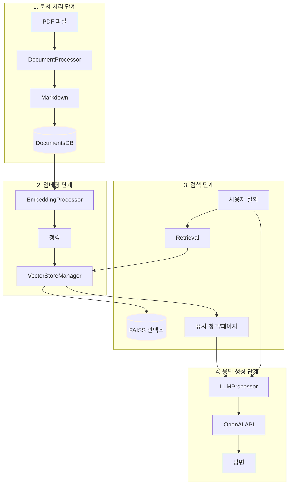

# RAG 시스템 인터페이스 문서

## 개요
이 프로젝트는 PDF 문서를 Markdown으로 변환하고, 벡터 임베딩을 생성하여 FAISS 인덱스에 저장한 후, 사용자 질의에 대해 유사 문서를 검색하고 LLM을 활용하여 답변을 생성하는 RAG (Retrieval-Augmented Generation) 시스템입니다.

## 시스템 아키텍처



## 디렉토리 구조

```
codeit_ai_g2b_search/
├── src/
│   ├── config.py                   # 중앙 집중식 설정 관리
│   ├── db/
│   │   ├── chat_history_db.py      # 채팅 이력 DB 관리
│   │   └── documents_db.py         # 문서 메타데이터 DB 관리
│   ├── processors/
│   │   ├── document_processor.py   # PDF → Markdown 변환
│   │   └── embedding_processor.py  # 청킹 및 임베딩 처리
│   ├── vectorstore/
│   │   └── vector_store_manager.py # FAISS 벡터 인덱스 관리
│   ├── llm/
│   │   ├── retrieval.py            # 유사 문서 검색
│   │   └── llm_processor.py        # LLM 응답 생성
│   └── utils/
│       ├── logging_config.py       # 로깅 설정
│       └── helper_utils.py         # 유틸리티 함수
├── data/
│   ├── documents.db                # 문서 메타데이터 SQLite DB
│   ├── chat_history.db             # 채팅 이력 SQLite DB
│   ├── vectorstore/                # FAISS 인덱스 파일
│   └── markers/                    # 마커 덤프 파일 (옵션)
├── config/
│   └── config.json                 # 설정 파일
└── doc/                            # 인터페이스 문서
    ├── 00_README.md                # 전체 시스템 개요 (본 문서)
    ├── 01_config_interface.md      # Config 클래스 문서
    ├── 02_database_interface.md    # DB 클래스 문서
    ├── 03_processor_interface.md   # Processor 클래스 문서
    ├── 04_vectorstore_interface.md # VectorStore 클래스 문서
    └── 05_llm_interface.md         # LLM 클래스 문서
```

## 문서 목록

| 문서 | 내용 | 주요 클래스 |
|------|------|-------------|
| [01_config_interface.md](01_config_interface.md) | 설정 관리 | Config |
| [02_database_interface.md](02_database_interface.md) | 데이터베이스 관리 | ChatHistoryDB, DocumentsDB |
| [03_processor_interface.md](03_processor_interface.md) | 문서 처리 및 임베딩 | DocumentProcessor, EmbeddingProcessor |
| [04_vectorstore_interface.md](04_vectorstore_interface.md) | 벡터 인덱스 관리 | VectorStoreManager |
| [05_llm_interface.md](05_llm_interface.md) | 검색 및 응답 생성 | Retrieval, LLMProcessor |

## 주요 클래스

### 1. Config ([문서](01_config_interface.md))
**역할**: 중앙 집중식 설정 관리
**주요 기능**:
- config.json 파일에서 설정 로드
- 환경 변수를 통한 오버라이드
- 설정 검증 및 저장

**사용 예**:
```python
from src.config import get_config

config = get_config()
print(config.CHUNK_SIZE)  # 1500
```

---

### 2. DocumentProcessor ([문서](03_processor_interface.md))
**역할**: PDF 파일을 Markdown으로 변환
**주요 기능**:
- PDF → Markdown 변환 (PyMuPDF 사용)
- 페이지별 처리 및 마커 추가
- 파일 해시 계산 및 중복 검사
- DocumentsDB에 저장

**사용 예**:
```python
from src.processors import DocumentProcessor

processor = DocumentProcessor()
file_hash = processor.process_pdf("example.pdf")
```

---

### 3. DocumentsDB ([문서](02_database_interface.md))
**역할**: 문서 메타데이터 관리
**주요 기능**:
- 문서 정보 저장 (file_hash, file_name, text_content)
- 문서 조회 및 검색
- 통계 정보 제공

**사용 예**:
```python
from src.db import DocumentsDB

db = DocumentsDB()
doc = db.get_document_by_hash("abc123...")
print(doc['file_name'])
```

---

### 4. EmbeddingProcessor ([문서](03_processor_interface.md))
**역할**: 문서 청킹 및 임베딩 생성
**주요 기능**:
- 마크다운 텍스트 전처리
- 페이지 단위 청킹
- 벡터 임베딩 생성 및 저장
- docs_db와 vector_manager 동기화

**사용 예**:
```python
from src.processors import EmbeddingProcessor

processor = EmbeddingProcessor()
success = processor.process_document("abc123...", api_key="sk-...")
```

---

### 5. VectorStoreManager ([문서](04_vectorstore_interface.md))
**역할**: FAISS 벡터 인덱스 관리
**주요 기능**:
- FAISS 인덱스 생성/로드/저장
- 벡터 추가/삭제 (중복 체크)
- 유사도 검색
- 메타데이터 기반 조회

**사용 예**:
```python
from src.vectorstore import VectorStoreManager

vm = VectorStoreManager()
vm.load()
results = vm.search("입찰 요건", top_k=5)
```

---

### 6. Retrieval ([문서](05_llm_interface.md))
**역할**: 쿼리에 대한 유사 문서 검색
**주요 기능**:
- 청크 기반 검색 (search)
- 페이지 기반 검색 (search_page)
- 메타데이터 필터링

**사용 예**:
```python
from src.llm import Retrieval

retrieval = Retrieval()
chunks = retrieval.search("입찰 요건", top_k=5)
```

---

### 7. LLMProcessor ([문서](05_llm_interface.md))
**역할**: LLM을 활용한 응답 생성
**주요 기능**:
- 검색 결과를 컨텍스트로 변환
- 프롬프트 템플릿 적용
- OpenAI API 호출

**사용 예**:
```python
from src.llm import LLMProcessor

llm = LLMProcessor()
response = llm.generate_response("입찰 요건은?", chunks)
print(response.choices[0].message.content)
```

---

### 8. ChatHistoryDB ([문서](02_database_interface.md))
**역할**: 채팅 세션 및 메시지 관리
**주요 기능**:
- 채팅 세션 생성 및 관리
- 메시지 저장 (user/assistant)
- 통계 정보 제공

**사용 예**:
```python
from src.db import ChatHistoryDB

db = ChatHistoryDB()
session_id = db.create_session("상담 세션")
db.add_message(session_id, 'user', '입찰 요건은?')
```

---

## 전체 워크플로우

### 1단계: 문서 처리
```python
from src.processors import DocumentProcessor

# PDF → Markdown 변환 및 DB 저장
processor = DocumentProcessor()
file_hash = processor.process_pdf("공고문.pdf", pdf_name="공고문_2024.pdf")
```

### 2단계: 임베딩 생성
```python
from src.processors import EmbeddingProcessor

# 청킹 및 벡터 임베딩 생성
embedding_proc = EmbeddingProcessor()
success = embedding_proc.process_document(file_hash, api_key="sk-...")
```

### 3단계: 동기화 (옵션)
```python
# docs_db와 vector_manager 동기화
result = embedding_proc.sync_with_docs_db(api_key="sk-...")
print(f"추가: {result['added']}, 삭제: {result['removed']}, 갱신: {result['updated']}")
```

### 4단계: 검색 및 응답 생성
```python
from src.llm import Retrieval, LLMProcessor

# 유사 문서 검색
retrieval = Retrieval()
chunks = retrieval.search("입찰 요건", top_k=5)

# 또는 페이지 기반 검색
result = retrieval.search_page("입찰 요건", top_k=3, page_window=1)

# LLM 응답 생성
llm = LLMProcessor()
response = llm.generate_response("입찰 요건이 무엇인가요?", chunks, api_key="sk-...")
print(response.choices[0].message.content)
```

### 5단계: 채팅 이력 저장 (옵션)
```python
from src.db import ChatHistoryDB

db = ChatHistoryDB()
session_id = db.create_session("사용자 상담")
db.add_message(session_id, 'user', '입찰 요건이 무엇인가요?')
db.add_message(session_id, 'assistant', response.choices[0].message.content, retrieved_chunks=chunks)
```

---

## 설정 파일

### config/config.json
```json
{
  "version": "1.0.0",
  "OPENAI_MODEL": "gpt-5-mini",
  "OPENAI_TEMPERATURE": 0.0,
  "OPENAI_EMBEDDING_MODEL": "text-embedding-3-small",
  "CHUNK_SIZE": 1500,
  "CHUNK_OVERLAP": 300,
  "SIMILARITY_THRESHOLD": 0.75,
  "TOP_K_SUMMARY": 5,
  "TOP_K_FINAL": 2,
  "MARKDOWN_PROTECT_BLOCKS": ["code", "math", "inline_math", "mermaid"],
  "MARKDOWN_REMOVE_ELEMENTS": ["html", "images", "links", "emphasis", "headers", "blockquotes", "lists"],
  "MARKER_DUMP_ENABLED": true,
  "LOG_LEVEL": "DEBUG"
}
```

---

## 환경 변수

| 변수명 | 설명 | 필수 여부 |
|--------|------|-----------|
| `OPENAI_API_KEY` | OpenAI API 키 | 필수 |

**설정 방법**:
```bash
# Windows
set OPENAI_API_KEY=sk-...

# Linux/Mac
export OPENAI_API_KEY=sk-...
```

---

## 의존성

### 필수 라이브러리
```bash
pip install openai
pip install langchain langchain-openai langchain-community
pip install faiss-cpu  # 또는 faiss-gpu
pip install pymupdf pymupdf4llm
pip install tiktoken
pip install tqdm
```

### Python 버전
- Python 3.9 이상 (zoneinfo 사용)

---

## 데이터베이스 스키마

### documents.db

#### TB_DOCUMENTS

| 컬럼명 | 타입 | 설명 |
|--------|------|------|
| file_hash | TEXT PRIMARY KEY | 파일 고유 해시값 |
| file_name | TEXT NOT NULL | 파일 이름 |
| total_pages | INTEGER NOT NULL | 총 페이지 수 |
| file_size | INTEGER NOT NULL | 파일 크기 (바이트) |
| text_content | TEXT | 변환된 텍스트 콘텐츠 |
| created_at | TIMESTAMP | 생성 시각 |
| updated_at | TIMESTAMP | 수정 시각 |

### chat_history.db

#### chat_sessions

| 컬럼명 | 타입 | 설명 |
|--------|------|------|
| session_id | TEXT PRIMARY KEY | 세션 고유 ID (UUID) |
| session_name | TEXT NOT NULL | 세션 이름 |
| created_at | TIMESTAMP | 생성 시각 |
| updated_at | TIMESTAMP | 수정 시각 |
| is_active | BOOLEAN | 활성 상태 |

#### chat_messages

| 컬럼명 | 타입 | 설명 |
|--------|------|------|
| message_id | INTEGER PRIMARY KEY | 메시지 고유 ID |
| session_id | TEXT NOT NULL | 세션 ID (외래 키) |
| role | TEXT NOT NULL | 역할 ('user' 또는 'assistant') |
| content | TEXT NOT NULL | 메시지 내용 |
| retrieved_chunks | TEXT | 검색된 청크 JSON |
| timestamp | TIMESTAMP | 메시지 시각 |

---

## FAISS 인덱스 구조

### 파일
- `data/vectorstore/vectorstore.faiss`: FAISS 벡터 인덱스
- `data/vectorstore/vectorstore.pkl`: LangChain 메타데이터 (docstore, index_to_docstore_id)

### 청크 메타데이터
각 벡터는 다음 메타데이터를 포함합니다:

```python
{
    'file_hash': str,                    # 파일 해시
    'file_name': str,                    # 파일명
    'start_page': int,                   # 시작 페이지
    'end_page': int,                     # 종료 페이지
    'chunk_type': str,                   # 'single', 'merged', 'split'
    'chunk_index': int,                  # 청크 인덱스
    'embedding_config_hash': str,        # 파일+config 통합 해시
    'chunk_hash': str,                   # 내용 기반 해시
    'config_chunk_size': int,            # 재현성 정보
    'config_chunk_overlap': int,         # 재현성 정보
    'embedding_version': str,            # 임베딩 모델명
    'created_at': str                    # 생성 시각 (ISO 8601)
}
```

---

## 주의사항 및 제약사항

### 1. 파일 처리
- **중복 방지**: 동일 file_hash는 자동 스킵됩니다.
- **고유 이름**: file_name은 고유해야 하며, 동일 이름이면 경로를 포함시키세요.
- **PyMuPDF 필수**: PDF 변환을 위해 pymupdf와 pymupdf4llm이 필요합니다.

### 2. 임베딩
- **API 키 필요**: OpenAI API 키가 환경 변수 또는 파라미터로 제공되어야 합니다.
- **설정 변경 감지**: 청킹/전처리 설정 변경 시 자동 재임베딩됩니다.
- **메모리 사용**: 대용량 문서 처리 시 메모리 사용량에 유의하세요.

### 3. 벡터 인덱스
- **저장 필수**: 벡터 추가/삭제 후에는 반드시 `save()`를 호출해야 합니다.
- **재구성 비용**: 벡터 삭제는 인덱스 재구성을 동반하므로 시간이 소요될 수 있습니다.
- **chunk_index 필수**: add_texts() 호출 시 메타데이터에 chunk_index가 필수입니다.

### 4. 검색
- **L2 거리**: FAISS는 L2 거리를 반환하므로 점수가 낮을수록 유사도가 높습니다.
- **토큰 한도**: 검색 결과가 많을 경우 max_chunks로 제한하여 토큰 한도를 초과하지 않도록 주의하세요.

---

## 로깅

로깅 설정은 `src/utils/logging_config.py`에서 관리됩니다.

- **로그 레벨**: DEBUG, INFO, WARNING, ERROR, CRITICAL (Config.LOG_LEVEL에서 설정)
- **로그 파일**: `logs/rag_system.log` (Config.LOG_DIR, LOG_FILE_NAME에서 설정)
- **로그 로테이션**: 10MB 초과 시 자동 로테이션 (최대 5개 백업)

각 모듈은 다음 태그를 사용합니다:
- `[DOCDB]`: DocumentsDB
- `[DOCP]`: DocumentProcessor
- `[EMBP]`: EmbeddingProcessor
- `[VC]`: VectorStoreManager
- `[RT]`: Retrieval

---

## 마커 덤프 (옵션)

`Config.MARKER_DUMP_ENABLED=True`일 때 다음 디렉토리에 디버깅용 파일이 생성됩니다:

```
data/markers/
├── 공고문_2024.md              # 변환된 전체 마크다운
├── clean/
│   └── 공고문_2024_clean.md    # 전처리된 마크다운
├── pages/
│   ├── 공고문_2024_clean_page_0001.md  # 페이지별 전처리 결과
│   └── ...
└── chunks/
    ├── 공고문_2024_chunk_0000.md      # 청크별 결과 (YAML 프론트매터 포함)
    └── ...
```

---

## 참고 문서

각 클래스의 상세한 인터페이스는 다음 문서를 참조하세요:

1. [Config 인터페이스 문서](01_config_interface.md)
2. [Database 인터페이스 문서](02_database_interface.md)
3. [Processor 인터페이스 문서](03_processor_interface.md)
4. [VectorStore 인터페이스 문서](04_vectorstore_interface.md)
5. [LLM 인터페이스 문서](05_llm_interface.md)

---

## 라이선스

(프로젝트 라이선스 정보를 여기에 추가하세요)

---

## 연락처

(프로젝트 관리자 연락처를 여기에 추가하세요)
