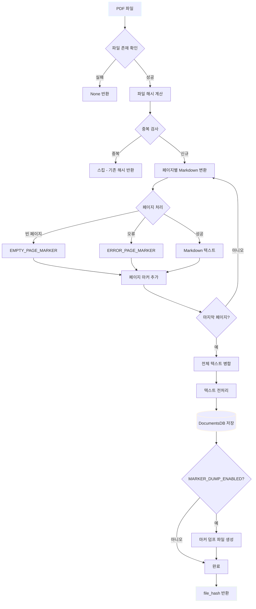
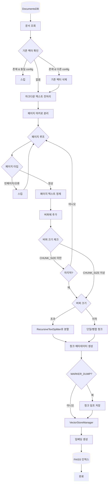

# Processor 인터페이스 문서

## 개요
Processor 클래스들은 문서 변환 및 임베딩 처리를 담당합니다.

---

## 1. DocumentProcessor

### 파일 정보
- **경로**: `src/processors/document_processor.py`
- **목적**: PDF 파일을 Markdown으로 변환하고 DB에 저장

### 처리 플로우



### 클래스: DocumentProcessor

#### 생성자
```python
DocumentProcessor(
    db_path: Optional[str] = None,
    config=None,
    progress_callback=None
)
```

**Parameters:**
- `db_path` (Optional[str]): 데이터베이스 파일 경로 (기본값: config에서 로드)
- `config`: 설정 객체 (기본값: get_config() 호출)
- `progress_callback`: 진행 상황 콜백 함수

**의존성:**
- PyMuPDF (pymupdf)
- pymupdf4llm

### 메서드

#### process_pdf(pdf_path: str, pdf_name: Optional[str] = None) -> Optional[str]
PDF 파일을 처리하여 Markdown으로 변환하고 DB에 저장합니다.

**Parameters:**
- `pdf_path` (str): 처리할 PDF 파일 경로
- `pdf_name` (Optional[str]): 처리할 PDF 파일 이름 (기본값: None)
  - 데이터베이스에 저장할 때 사용됩니다. 고유해야 합니다.
  - 동일한 이름이라면 경로를 추가하세요.

**Returns:**
- `Optional[str]`: 처리된 파일의 해시값 (실패 시 None 반환)

**처리 과정:**
1. PDF 파일 존재 확인
2. 파일 크기 및 해시 계산
3. 중복 검사 (file_hash 기준)
4. 페이지별 Markdown 변환
5. 빈 페이지/오류 페이지 처리
6. 페이지 마커 추가
7. 데이터베이스 저장
8. 마커 덤프 파일 생성 (옵션)

**사용 예:**
```python
processor = DocumentProcessor()
file_hash = processor.process_pdf("example.pdf")
if file_hash:
    print(f"처리 완료: {file_hash}")
```

#### calculate_file_hash(file_path: str) -> str
파일의 SHA-256 해시를 계산합니다.

**Parameters:**
- `file_path` (str): 해시를 계산할 파일 경로

**Returns:**
- `str`: 파일의 SHA-256 해시값 (64자 hex)

**사용 예:**
```python
hash_value = processor.calculate_file_hash("document.pdf")
```

#### clean_markdown_text(text: str) -> str
Markdown 텍스트 전처리를 수행합니다.

**Parameters:**
- `text` (str): 원본 텍스트

**Returns:**
- `str`: 전처리된 텍스트

**전처리 작업:**
- 공백 및 탭을 단일 공백으로 변환
- 연속된 세 줄 이상의 개행을 두 줄로 축소
- 각 줄의 앞뒤 공백 제거

#### markdown_with_progress(pdf_path: str) -> Tuple[List[Dict], int]
PDF를 페이지별로 Markdown 변환합니다. (진행 상황 표시)

**Parameters:**
- `pdf_path` (str): PDF 파일 경로

**Returns:**
- `Tuple[List[Dict], int]`: (페이지 데이터 리스트, 총 페이지 수)
  - 페이지 데이터: `[{'page_num': int, 'content': str}, ...]`

**사용 예:**
```python
pages_data, total_pages = processor.markdown_with_progress("doc.pdf")
for page in pages_data:
    print(f"페이지 {page['page_num']}: {len(page['content'])} 문자")
```

### Progress Callback

progress_callback이 제공되면 각 페이지 처리 시 다음 형식의 딕셔너리가 전달됩니다:

```python
{
    'file_name': str,           # 파일명
    'current_page': int,        # 현재 페이지 번호
    'total_pages': int,         # 총 페이지 수
    'page_content_length': int, # 페이지 내용 길이
    'status': str,              # 'processing', 'empty', 'failed'
    'error': str                # 오류 메시지 (실패 시)
}
```

---

## 2. EmbeddingProcessor

### 파일 정보
- **경로**: `src/processors/embedding_processor.py`
- **목적**: 문서 청킹 및 벡터 임베딩 생성

### 처리 플로우



### 클래스: EmbeddingProcessor

#### 생성자
```python
EmbeddingProcessor(config=None)
```

**Parameters:**
- `config`: 설정 객체 (기본값: get_config() 호출)

**의존성:**
- LangChain
- FAISS
- OpenAI

### 메서드

#### process_document(file_hash: str, api_key: Optional[str] = None) -> bool
문서를 페이지 단위로 청킹하고 통합 FAISS 인덱스에 임베딩을 추가합니다.

**Parameters:**
- `file_hash` (str): 처리할 문서의 해시값
- `api_key` (Optional[str]): OpenAI API 키 (선택)

**Returns:**
- `bool`: 처리 성공 여부

**처리 과정:**
1. 문서 정보 조회 (DocumentsDB)
2. 기존 벡터 확인 및 중복 검사
3. 설정 변경 감지 (embedding_config_hash 비교)
4. 마크다운 텍스트 전처리
5. 페이지 단위로 분리 및 청킹
6. 벡터 임베딩 생성 및 저장
7. 청크 덤프 파일 생성 (옵션)

**사용 예:**
```python
processor = EmbeddingProcessor()
success = processor.process_document("abc123...", api_key="sk-...")
if success:
    print("임베딩 처리 완료")
```

#### sync_with_docs_db(api_key: Optional[str] = None) -> Dict[str, Any]
docs_db와 vector_manager 간 데이터 동기화를 수행합니다.

**Parameters:**
- `api_key` (Optional[str]): OpenAI API 키 (선택)

**Returns:**
- `Dict[str, Any]`: 동기화 결과 통계
  - `total_docs`: 총 문서 수 (docs_db)
  - `total_vectors`: 총 벡터 파일 수 (vector_manager)
  - `added`: 추가된 파일 수
  - `removed`: 삭제된 파일 수
  - `updated`: 갱신된 파일 수
  - `skipped`: 스킵된 파일 수
  - `failed`: 실패한 파일 수
  - `details`: 상세 정보 딕셔너리

**동기화 로직:**
1. docs_db에만 존재하는 파일 → 임베딩 벡터 추가
2. vector_manager에만 존재하는 파일 → 임베딩 벡터 삭제
3. 양쪽 모두 존재하지만 config 변경 → 재임베딩

**사용 예:**
```python
processor = EmbeddingProcessor()
result = processor.sync_with_docs_db()
print(f"추가: {result['added']}, 삭제: {result['removed']}, 갱신: {result['updated']}")
```

#### clean_markdown_text(text: str) -> str
통합 마크다운 전처리를 수행합니다.

**Parameters:**
- `text` (str): 원본 마크다운 텍스트

**Returns:**
- `str`: 정제된 텍스트

**전처리 항목 (config 옵션에 따라):**
- 특수 블록 보호 (코드, 수식 등)
- 페이지 마커 보호
- 탈출문자 처리
- 요소 제거 (HTML, 이미지, 링크, 강조, 헤더, 인용구 등)
- 공백 정리

**Config 옵션:**
- `MARKDOWN_PROTECT_BLOCKS`: 보호할 블록 타입 ['code', 'math', 'inline_math', 'mermaid']
- `MARKDOWN_REMOVE_ELEMENTS`: 제거할 요소 ['html', 'images', 'links', 'emphasis', 'headers', 'blockquotes', 'lists']
- `MARKDOWN_MAX_LINES`: 블록 타입별 최대 라인 수 {'code': 100, 'math': 50}

#### clean_page_text(page_text: str) -> str
페이지별 텍스트 정제를 수행합니다. (페이지 마커 제거)

**Parameters:**
- `page_text` (str): 개별 페이지 텍스트

**Returns:**
- `str`: 정제된 페이지 텍스트 (마커 제거됨)

**제거 항목:**
- ERROR_PAGE_MARKER
- EMPTY_PAGE_MARKER
- 페이지 번호 마커 (--- 페이지 N ---)

### 청킹 전략

EmbeddingProcessor는 **페이지 단위 청킹** 전략을 사용합니다:

1. **버퍼 축적**: 페이지 텍스트를 버퍼에 누적
2. **크기 체크**: 버퍼 크기가 CHUNK_SIZE 이상이거나 마지막 페이지인 경우 처리
3. **분할 방식**:
   - CHUNK_SIZE 이하: 단일 청크로 추가 (chunk_type='merged' 또는 'single')
   - CHUNK_SIZE 초과: RecursiveCharacterTextSplitter로 분할 (chunk_type='split')

### 청크 메타데이터

각 청크는 다음 메타데이터를 포함합니다:

```python
{
    'file_hash': str,                    # 파일 해시
    'file_name': str,                    # 파일명
    'start_page': int,                   # 시작 페이지
    'end_page': int,                     # 종료 페이지
    'chunk_type': str,                   # 'single', 'merged', 'split'
    'chunk_index': int,                  # 청크 인덱스
    'embedding_config_hash': str,        # 파일+config 통합 해시
    'chunk_hash': str,                   # 내용 기반 해시
    'config_chunk_size': int,            # 재현성 정보
    'config_chunk_overlap': int,         # 재현성 정보
    'config_chunking_mode': str,         # 재현성 정보
    'config_chunk_separators': str,      # 재현성 정보 (JSON)
    'config_markdown_max_lines': str,    # 재현성 정보 (JSON)
    'embedding_version': str,            # 임베딩 모델명
    'created_at': str                    # 생성 시각 (ISO 8601)
}
```

## 주의사항

### DocumentProcessor
1. **PyMuPDF 필수**: pymupdf와 pymupdf4llm 라이브러리가 설치되어 있어야 합니다.
2. **중복 처리**: 동일 file_hash가 이미 존재하면 스킵됩니다.
3. **마커 덤프**: `MARKER_DUMP_ENABLED=True`일 때 `data/markers` 디렉토리에 마크다운 파일이 생성됩니다.

### EmbeddingProcessor
1. **LangChain 필수**: LangChain 및 FAISS 라이브러리가 필요합니다.
2. **API 키 필요**: OpenAI API 키가 환경 변수 또는 파라미터로 제공되어야 합니다.
3. **설정 변경 감지**: embedding_config_hash를 통해 청킹/전처리 설정 변경을 자동 감지하고 재임베딩합니다.
4. **청크 덤프**: `MARKER_DUMP_ENABLED=True`일 때 `data/markers/chunks`, `data/markers/clean`, `data/markers/pages` 디렉토리에 덤프 파일이 생성됩니다.
