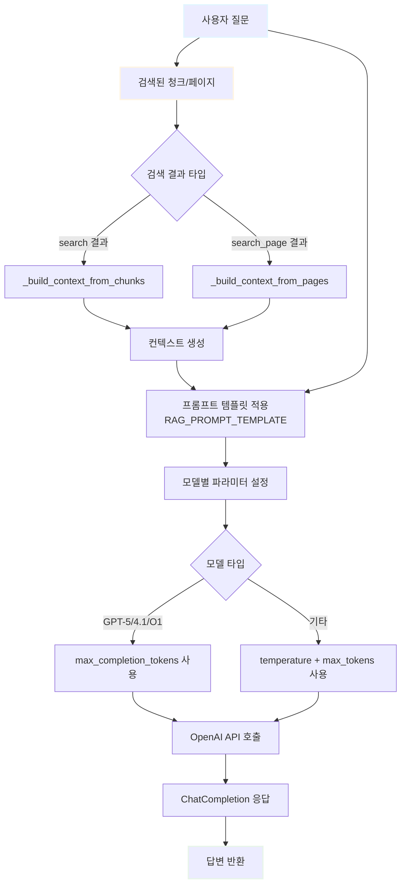

# LLM 인터페이스 문서

## 개요
LLM 관련 클래스들은 문서 검색 및 응답 생성을 담당합니다.

---

## 1. Retrieval

### 파일 정보
- **경로**: `src/llm/retrieval.py`
- **목적**: 쿼리에 대한 유사 청크 검색

### 검색 플로우

#### search() - 청크 기반 검색


#### search_page() - 페이지 기반 검색


### 클래스: Retrieval

#### 생성자
```python
Retrieval(embedding_model: Optional[str] = None, config=None)
```

**Parameters:**
- `embedding_model` (Optional[str]): 사용할 임베딩 모델 이름 (기본값: Config에서 로드)
- `config`: 설정 객체 (기본값: get_config() 호출)

**Attributes:**
- `config`: 설정 객체 (Config)
- `embedding_model` (str): 임베딩 모델명
- `vector_manager` (VectorStoreManager): VectorStoreManager 인스턴스
- `embeddings` (OpenAIEmbeddings): LangChain OpenAI 임베딩 객체

### 메서드

#### search(query: str, top_k: Optional[int] = None, filter_metadata: Optional[Dict[str, Any]] = None, api_key: Optional[str] = None) -> List[Dict[str, Any]]
쿼리에 대한 유사 청크를 검색합니다.

**Parameters:**
- `query` (str): 검색 쿼리 문자열
- `top_k` (Optional[int]): 상위 k개 검색 (기본값: Config의 TOP_K_SUMMARY)
- `filter_metadata` (Optional[Dict[str, Any]]): 메타데이터 필터 (예: {'file_hash': 'abc123'})
- `api_key` (Optional[str]): OpenAI API 키

**Returns:**
- `List[Dict[str, Any]]`: 검색된 청크와 유사도 정보 리스트

**반환 항목 구조:**
```python
{
    'text': str,              # 청크 텍스트
    'file_hash': str,         # 파일 해시
    'file_name': str,         # 파일명
    'start_page': int,        # 시작 페이지
    'end_page': int,          # 종료 페이지
    'chunk_index': int,       # 청크 인덱스
    'chunk_hash': str,        # 청크 해시
    'distance': float,        # L2 거리 (작을수록 유사)
    'created_at': str         # 생성 시각
}
```

**사용 예:**
```python
retrieval = Retrieval()
results = retrieval.search("입찰 요건", top_k=5)
for result in results:
    print(f"[{result['file_name']}] 페이지 {result['start_page']}")
    print(f"Distance: {result['distance']:.4f}")
    print(result['text'][:200])
```

#### search_page(query: str, top_k: Optional[int] = None, filter_metadata: Optional[Dict[str, Any]] = None, api_key: Optional[str] = None, page_window: int = 1, sort_by: str = "score") -> Dict[str, Any]
쿼리에 대한 페이지 단위 검색을 수행합니다. (±page_window 범위 포함)

**Parameters:**
- `query` (str): 검색 쿼리 문자열
- `top_k` (Optional[int]): 상위 k개 검색 (기본값: Config의 TOP_K_SUMMARY)
- `filter_metadata` (Optional[Dict[str, Any]]): 메타데이터 필터
- `api_key` (Optional[str]): OpenAI API 키
- `page_window` (int): 페이지 확장 범위 (기본값: 1)
- `sort_by` (str): 정렬 기준 ("score" 또는 "page", 기본값: "score")

**Returns:**
- `Dict[str, Any]`: 페이지 검색 결과

**반환 구조:**
```python
{
    'best_page': {
        'file_name': str,      # 최적 페이지의 파일명
        'file_hash': str,      # 최적 페이지의 파일 해시
        'page_number': int,    # 최적 페이지 번호
        'score': float         # 최적 페이지 점수 (낮을수록 좋음)
    },
    'page_scores': {
        (file_name, page_number): score,  # 페이지별 점수 딕셔너리
        ...
    },
    'file_names': [str, ...],  # 검색된 파일명 리스트
    'pages': [
        {
            'file_hash': str,
            'file_name': str,
            'page_number': int,
            'text': str,           # 페이지 전체 텍스트 (병합됨)
            'score': float,        # 페이지 점수
            'chunk_count': int     # 페이지에 포함된 청크 수
        },
        ...
    ]
}
```

**페이지 확장 로직:**
1. 초기 검색 수행 (search())
2. 각 검색 결과의 start_page를 기준으로 ±page_window 범위 추출
3. 페이지 번호별로 청크 병합
4. sort_by 옵션에 따라 정렬:
   - "score": 페이지 점수 기준 오름차순 (낮을수록 우선)
   - "page": (파일명, 페이지 번호) 기준 오름차순

**사용 예:**
```python
retrieval = Retrieval()

# 점수 기준 정렬
result = retrieval.search_page("입찰 요건", top_k=5, page_window=1, sort_by="score")
print(f"최적 페이지: {result['best_page']['file_name']}, 페이지 {result['best_page']['page_number']}")

for page in result['pages']:
    print(f"\n[{page['file_name']}] 페이지 {page['page_number']} (점수: {page['score']:.4f})")
    print(page['text'][:300])

# 페이지 번호 기준 정렬
result = retrieval.search_page("입찰 요건", sort_by="page")
```

### 페이지 점수 계산

`search_page()`는 청크 점수를 기반으로 페이지 점수를 계산합니다:

1. **직접 검색된 청크**: 원본 distance 사용
2. **확장된 청크** (±page_window 범위):
   - `score = base_distance + (0.1 × page_diff)`
   - `page_diff`: 원본 페이지와의 거리
3. **페이지 점수**: 해당 페이지의 모든 청크 중 최소 score

---

## 2. LLMProcessor

### 파일 정보
- **경로**: `src/llm/llm_processor.py`
- **목적**: LLM을 활용한 응답 생성

### 응답 생성 플로우



### 클래스: LLMProcessor

#### 생성자
```python
LLMProcessor(model: Optional[str] = None, temperature: Optional[float] = None, config=None)
```

**Parameters:**
- `model` (Optional[str]): LLM 모델명 (기본값: Config에서 로드)
- `temperature` (Optional[float]): 생성 온도 (기본값: Config에서 로드)
- `config`: 설정 객체 (기본값: get_config() 호출)

**Attributes:**
- `config`: 설정 객체 (Config)
- `model_name` (str): LLM 모델명
- `temperature` (float): 생성 온도

### 메서드

#### generate_response(question: str, retrieved_chunks: Any, api_key: Optional[str] = None, max_chunks: Optional[int] = None) -> ChatCompletion
검색된 청크를 컨텍스트로 활용하여 LLM 응답을 생성합니다.

**Parameters:**
- `question` (str): 사용자 질문
- `retrieved_chunks` (Any): search() 또는 search_page() 결과
- `api_key` (Optional[str]): OpenAI API 키
- `max_chunks` (Optional[int]): 최대 청크/페이지 수

**Returns:**
- `ChatCompletion`: OpenAI API 응답 객체

**처리 과정:**
1. API 키 확인
2. 컨텍스트 구성 (_build_context)
3. 프롬프트 템플릿 적용 (Config.RAG_PROMPT_TEMPLATE)
4. OpenAI API 호출
5. 응답 반환

**모델별 파라미터:**
- GPT-5, GPT-4.1, O1 시리즈: `max_completion_tokens=50000` (temperature 제외)
- 기타 모델: `temperature` 사용, `max_tokens=50000`

**사용 예:**
```python
from src.llm import Retrieval, LLMProcessor

# 1. 검색
retrieval = Retrieval()
chunks = retrieval.search("입찰 요건", top_k=5)

# 2. 응답 생성
llm = LLMProcessor()
response = llm.generate_response("입찰 요건이 무엇인가요?", chunks)
answer = response.choices[0].message.content
print(answer)
```

#### _build_context(retrieved_chunks: Any, max_chunks: Optional[int] = None) -> str
검색 결과 형태에 따라 컨텍스트를 자동 생성합니다.

**Parameters:**
- `retrieved_chunks` (Any): search() 또는 search_page() 결과
- `max_chunks` (Optional[int]): 최대 청크/페이지 수

**Returns:**
- `str`: 포맷된 컨텍스트 문자열

**자동 감지:**
- `isinstance(retrieved_chunks, dict) and 'pages' in retrieved_chunks`: search_page() 결과 → _build_context_from_pages() 호출
- `isinstance(retrieved_chunks, list)`: search() 결과 → _build_context_from_chunks() 호출

#### _build_context_from_chunks(chunks: List[Dict[str, Any]], max_chunks: Optional[int] = None) -> str
search() 결과에서 컨텍스트를 생성합니다.

**Parameters:**
- `chunks` (List[Dict[str, Any]]): 청크 리스트
- `max_chunks` (Optional[int]): 최대 포함 개수

**Returns:**
- `str`: 포맷된 컨텍스트 문자열

**포맷:**
```
[문서 1: 파일명.pdf]
청크 텍스트...

[문서 2: 파일명2.pdf]
청크 텍스트...
```

#### _build_context_from_pages(pages: List[Dict[str, Any]], max_chunks: Optional[int] = None) -> str
search_page() 결과에서 컨텍스트를 생성합니다.

**Parameters:**
- `pages` (List[Dict[str, Any]]): 페이지 리스트
- `max_chunks` (Optional[int]): 최대 포함 개수

**Returns:**
- `str`: 포맷된 컨텍스트 문자열

**포맷:**
```
[문서 1] 파일명.pdf (페이지 3, 유사도: 0.1234)
페이지 텍스트...

[문서 2] 파일명2.pdf (페이지 5, 유사도: 0.2345)
페이지 텍스트...
```

---

## 프롬프트 템플릿

LLMProcessor는 Config.RAG_PROMPT_TEMPLATE을 사용합니다:

```python
RAG_PROMPT_TEMPLATE = """다음 문서를 참고하여 질문에 답변해주세요.

참고 문서:
{context}

질문: {question}

답변:"""
```

- `{context}`: 검색된 청크/페이지 컨텍스트
- `{question}`: 사용자 질문

---

## 사용 예시

### 기본 워크플로우

```python
from src.llm import Retrieval, LLMProcessor

# 1. 초기화
retrieval = Retrieval()
llm = LLMProcessor()

# 2. 청크 기반 검색
question = "입찰 요건이 무엇인가요?"
chunks = retrieval.search(question, top_k=5)

# 3. 응답 생성
response = llm.generate_response(question, chunks)
print(response.choices[0].message.content)
```

### 페이지 기반 검색

```python
from src.llm import Retrieval, LLMProcessor

# 1. 초기화
retrieval = Retrieval()
llm = LLMProcessor()

# 2. 페이지 기반 검색 (±1 페이지 확장)
question = "계약 기간은 어떻게 되나요?"
result = retrieval.search_page(question, top_k=3, page_window=1, sort_by="score")

# 3. 최적 페이지 확인
best = result['best_page']
print(f"최적 페이지: {best['file_name']}, 페이지 {best['page_number']}")

# 4. 응답 생성
response = llm.generate_response(question, result)
print(response.choices[0].message.content)
```

### 특정 파일에서만 검색

```python
# 특정 파일 해시로 필터링
file_hash = "abc123..."
chunks = retrieval.search(
    query="입찰 요건",
    top_k=5,
    filter_metadata={'file_hash': file_hash}
)

response = llm.generate_response("입찰 요건은?", chunks)
print(response.choices[0].message.content)
```

---

## 주의사항

### Retrieval
1. **FAISS 로드**: 초기화 시 FAISS 인덱스를 자동 로드하며, 실패 시 경고가 출력됩니다.
2. **distance vs similarity**: FAISS는 L2 거리를 반환하므로 점수가 낮을수록 유사도가 높습니다.
3. **page_window**: 페이지 확장 범위는 메모리 사용량에 영향을 줄 수 있으므로 적절히 조정해야 합니다.

### LLMProcessor
1. **API 키 필수**: OpenAI API 키가 환경 변수 또는 파라미터로 제공되어야 합니다.
2. **컨텍스트 길이**: 검색 결과가 많을 경우 max_chunks로 제한하여 토큰 한도를 초과하지 않도록 주의해야 합니다.
3. **모델 의존성**: 모델별로 파라미터가 다르므로 (temperature, max_tokens vs max_completion_tokens) 적절한 모델을 선택해야 합니다.
4. **응답 형식**: generate_response()는 OpenAI ChatCompletion 객체를 반환하므로 `response.choices[0].message.content`로 텍스트를 추출해야 합니다.
