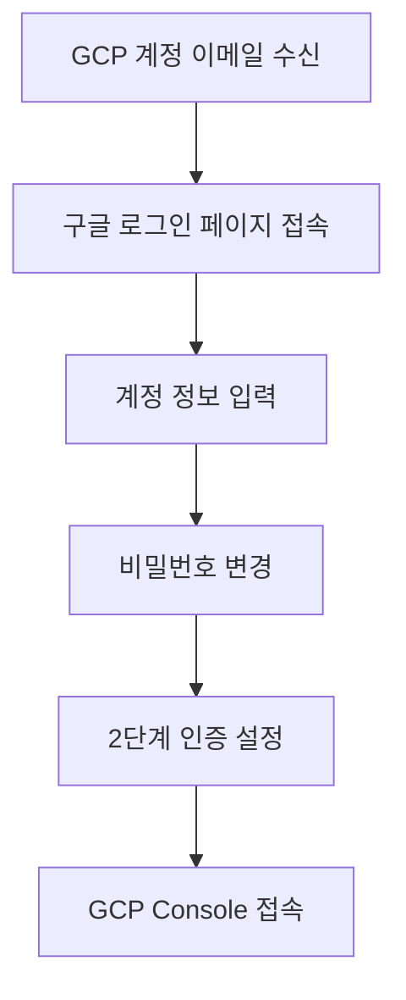

# [중급프로젝트] - GCP 환경 설정 가이드

## 목차

1. [GCP 계정 및 초기 설정](#1-gcp-계정-및-초기-설정)
   - [1.1. GCP 계정 정보](#11-gcp-계정-정보)
   - [1.2. 2단계 인증 설정](#12-2단계-인증-설정)
   - [1.3. 프로젝트 접근 방법](#13-프로젝트-접근-방법)
2. [VM 인스턴스 생성 및 설정](#2-vm-인스턴스-생성-및-설정)
   - [2.1. VM 인스턴스 생성](#21-vm-인스턴스-생성)
   - [2.2. 방화벽 규칙 설정](#22-방화벽-규칙-설정)
   - [2.3. 외부 IP 설정](#23-외부-ip-설정)
3. [SSH 접속 설정](#3-ssh-접속-설정)
   - [3.1. SSH 키 생성 및 등록](#31-ssh-키-생성-및-등록)
   - [3.2. VS Code를 통한 원격 접속](#32-vs-code를-통한-원격-접속)
   - [3.3. 로컬 터미널을 통한 접속](#33-로컬-터미널을-통한-접속)
4. [개발 환경 구축](#4-개발-환경-구축)
   - [4.1. Python 환경 설정](#41-python-환경-설정)
   - [4.2. CUDA 및 GPU 드라이버 확인](#42-cuda-및-gpu-드라이버-확인)
   - [4.3. 주요 패키지 설치](#43-주요-패키지-설치)
5. [협업 환경 설정](#5-협업-환경-설정)
   - [5.1. Git 설정 및 Repository 연결](#51-git-설정-및-repository-연결)
   - [5.2. 팀원 접근 권한 설정](#52-팀원-접근-권한-설정)
   - [5.3. 주피터 노트북 서버 설정](#53-주피터-노트북-서버-설정)
6. [보안 및 비용 관리](#6-보안-및-비용-관리)
   - [6.1. API Key 보안 관리](#61-api-key-보안-관리)
   - [6.2. VM 사용 가이드라인](#62-vm-사용-가이드라인)
   - [6.3. 비용 모니터링](#63-비용-모니터링)

---

## 1. GCP 계정 및 초기 설정

### 1.1. GCP 계정 정보

**계정 구조:**

프로젝트를 위해 전용 GCP 계정이 제공됩니다.

| 항목 | 설명 |
|------|------|
| 계정 도메인 | `@codeit-sprint.kr` |
| 계정 형식 | LMS 계정과 동일한 ID (예: `spai0001@codeit-sprint.kr`) |
| 초기 비밀번호 | 코드잇 LMS 최초 비밀번호와 동일 |
| 비밀번호 변경 | 최초 로그인 시 **필수** 변경 |

**계정 활성화 절차:**



**접속 URL:**
- GCP Console: https://console.cloud.google.com
- 초기 로그인: https://accounts.google.com

### 1.2. 2단계 인증 설정

**중요:** 2단계 인증은 계정 보안을 위해 **필수**입니다. 설정하지 않으면 일정 기간 후 접속이 차단될 수 있습니다.

**Google OTP 방식 설정 (권장):**

**1단계: Google Authenticator 앱 설치**
- iOS: App Store에서 "Google Authenticator" 검색
- Android: Play Store에서 "Google Authenticator" 검색

**2단계: 2단계 인증 활성화**

1. GCP Console 로그인
2. 우측 상단 프로필 아이콘 클릭
3. "Google 계정 관리" 선택
4. 좌측 메뉴에서 "보안" 선택
5. "2단계 인증" 섹션에서 "시작하기" 클릭
6. 화면 지시에 따라 진행

**3단계: 인증 앱 연결**

1. "인증 앱" 선택
2. QR 코드 스캔 또는 수동 입력 코드 사용
3. 앱에 표시된 6자리 코드 입력
4. 백업 코드 저장 (안전한 장소에 보관)

**백업 코드 관리:**

- 백업 코드는 휴대폰 분실 시 계정 복구에 필요
- 안전한 장소에 보관 (비밀번호 관리자, 암호화된 파일 등)
- 각 코드는 1회만 사용 가능

### 1.3. 프로젝트 접근 방법

**프로젝트 구조:**

각 팀별로 독립적인 프로젝트가 생성되어 있습니다.

**프로젝트 접근 절차:**

1. GCP Console 접속 (https://console.cloud.google.com)
2. 상단 프로젝트 선택 드롭다운 클릭
3. "조직 선택" → `codeit-sprint.kr` 토글 펼치기
4. 팀 프로젝트 선택

**프로젝트가 보이지 않는 경우:**

1. 디스코드 공지에서 팀 별 프로젝트 직접 링크 확인
2. 링크를 통해 직접 접근
3. 여전히 문제가 있다면 주강사/멘토에게 문의

**프로젝트 대시보드 확인 사항:**

- [ ] 프로젝트 이름 확인
- [ ] 팀원 권한 확인
- [ ] 할당된 리소스 확인 (VM, GPU)

---

## 2. VM 인스턴스 생성 및 설정

### 2.1. VM 인스턴스 생성

**제공 사양:**

| 항목 | 사양 |
|------|------|
| Region | us-central1 (Iowa) |
| Zone | us-central1-a (권장) |
| Machine Type | g2-standard-4 |
| vCPU | 4 |
| Memory | 16GB |
| GPU | NVIDIA L4 x 1 |
| Disk | 100GB 이하 (제한) |
| 사용 기간 | 24시간 무제한 (프로젝트 종료 시까지) |

**VM 인스턴스 생성 절차:**

**1단계: Compute Engine으로 이동**


1. GCP Console 좌측 상단 ≡ (햄버거 메뉴) 클릭
2. "Compute Engine" → "VM 인스턴스" 선택
3. "인스턴스 만들기" 버튼 클릭

**2단계: 기본 설정**

| 설정 항목 | 값 |
|----------|---|
| 이름 | `rag-project-vm` (또는 팀 이름) |
| 리전 | `us-central1 (Iowa)` |
| 영역 | `us-central1-a` |

**3단계: 머신 구성**

1. "머신 구성" 섹션에서 "GPU" 선택
2. GPU 유형: `NVIDIA L4`
3. GPU 개수: `1`
4. 머신 유형: `g2-standard-4` (자동 선택됨)

**4단계: 부팅 디스크 설정**

1. "부팅 디스크 변경" 클릭
2. 운영체제: `Deep Learning on Linux`
3. 버전: `Deep Learning VM with CUDA 11.8 M120` (권장)
   - 또는 `Ubuntu 22.04 LTS` + CUDA 수동 설치
4. 부팅 디스크 유형: `SSD 영구 디스크` (권장)
5. 크기: `100GB` (최대 제한)

**CUDA 사전 설치 이미지 권장:**

```
운영체제: Deep Learning on Linux
버전: Deep Learning VM with CUDA 11.8 M120
```

이 이미지는 다음을 포함합니다:
- Ubuntu 22.04 LTS
- NVIDIA Driver 550
- CUDA 11.8
- cuDNN 8.x
- Python 3.10
- PyTorch, TensorFlow 사전 설치

**5단계: 방화벽 설정**

- [x] HTTP 트래픽 허용
- [x] HTTPS 트래픽 허용

**6단계: 고급 옵션 (선택)**

"네트워킹, 디스크, 보안, 관리, 단독 테넌시" 펼치기:

**네트워킹 탭:**
- 네트워크 태그: `rag-project` (방화벽 규칙 적용용)

**관리 탭 - 시작 스크립트 (선택):**

```bash
#!/bin/bash
# 기본 패키지 업데이트
apt-get update
apt-get upgrade -y

# 필수 도구 설치
apt-get install -y git vim wget curl

# Python pip 업그레이드
pip3 install --upgrade pip
```

**7단계: VM 생성**

1. 설정 검토
2. "만들기" 버튼 클릭
3. VM 생성 완료까지 약 2-3분 대기

**생성 확인:**

- VM 인스턴스 목록에서 초록색 체크 표시 확인
- 외부 IP 주소 확인 및 기록

### 2.2. 방화벽 규칙 설정

**기본 방화벽 규칙:**

GCP는 기본적으로 SSH(22번 포트)를 허용합니다. 추가 포트가 필요한 경우 설정합니다.

**Jupyter Notebook 포트 개방 (8888):**

1. GCP Console에서 "VPC 네트워크" → "방화벽" 선택
2. "방화벽 규칙 만들기" 클릭
3. 설정:

| 항목 | 값 |
|------|---|
| 이름 | `allow-jupyter` |
| 대상 | 지정된 대상 태그 |
| 대상 태그 | `rag-project` |
| 소스 IPv4 범위 | `0.0.0.0/0` (모든 IP 허용) |
| 프로토콜 및 포트 | `tcp:8888` |

**보안 고려사항:**

- 가능하면 소스 IP 범위를 본인 IP로 제한
- Jupyter Notebook에 비밀번호 설정
- 불필요한 포트는 개방하지 않음

### 2.3. 외부 IP 설정

**고정 IP 설정 (선택):**

VM을 중지했다가 재시작하면 외부 IP가 변경될 수 있습니다. 고정 IP를 할당하면 이를 방지할 수 있습니다.

**고정 IP 할당 방법:**

1. "VPC 네트워크" → "IP 주소" 선택
2. 외부 IP 주소 탭에서 "고정 주소 예약" 클릭
3. 설정:
   - 이름: `rag-project-static-ip`
   - 리전: VM과 동일한 리전 선택
   - 연결 대상: 생성한 VM 선택
4. "예약" 클릭

**주의:** 고정 IP는 사용하지 않을 때도 비용이 발생할 수 있습니다. VM이 실행 중일 때는 비용이 없지만, VM을 중지한 상태에서 IP만 예약된 경우 소액의 비용이 발생합니다.

---

## 3. SSH 접속 설정

### 3.1. SSH 키 생성 및 등록

**SSH 키 생성 (로컬 컴퓨터):**

**Windows (PowerShell):**

```powershell
# SSH 키 생성
ssh-keygen -t rsa -b 4096 -C "your-email@codeit-sprint.kr"

# 저장 위치: C:\Users\YourUsername\.ssh\id_rsa
# 비밀번호: 입력 또는 Enter로 생략 가능
```

**macOS/Linux (Terminal):**

```bash
# SSH 키 생성
ssh-keygen -t rsa -b 4096 -C "your-email@codeit-sprint.kr"

# 저장 위치: ~/.ssh/id_rsa
# 비밀번호: 입력 또는 Enter로 생략 가능
```

**공개 키 확인:**

**Windows:**
```powershell
Get-Content C:\Users\YourUsername\.ssh\id_rsa.pub
```

**macOS/Linux:**
```bash
cat ~/.ssh/id_rsa.pub
```

공개 키 형식 예시:
```
ssh-rsa AAAAB3NzaC1yc2EAAAADAQABAAACAQC... your-email@codeit-sprint.kr
```

**GCP에 SSH 키 등록:**

**방법 1: 프로젝트 전체에 등록 (권장)**

1. GCP Console → "Compute Engine" → "메타데이터"
2. "SSH 키" 탭 선택
3. "수정" 클릭
4. "항목 추가" 클릭
5. 공개 키 전체 복사 후 붙여넣기
6. "저장" 클릭

**방법 2: 특정 VM에만 등록**

1. VM 인스턴스 목록에서 VM 이름 클릭
2. 상단 "수정" 버튼 클릭
3. "SSH 키" 섹션까지 스크롤
4. "항목 추가" 클릭
5. 공개 키 붙여넣기
6. "저장" 클릭

### 3.2. VS Code를 통한 원격 접속

**VS Code Remote-SSH 확장 설치:**

1. VS Code 실행
2. 좌측 Extensions 아이콘 클릭 (또는 `Ctrl+Shift+X`)
3. "Remote - SSH" 검색
4. Microsoft의 "Remote - SSH" 설치

**SSH Config 파일 설정:**

**Windows:** `C:\Users\YourUsername\.ssh\config`  
**macOS/Linux:** `~/.ssh/config`

```
Host rag-gcp
    HostName YOUR_VM_EXTERNAL_IP
    User YOUR_USERNAME
    IdentityFile ~/.ssh/id_rsa
    ServerAliveInterval 60
    ServerAliveCountMax 120
```

설정 값:
- `YOUR_VM_EXTERNAL_IP`: VM의 외부 IP 주소
- `YOUR_USERNAME`: GCP 사용자명 (일반적으로 이메일의 @ 앞부분)

예시:
```
Host rag-gcp
    HostName 34.123.45.67
    User spai0001
    IdentityFile ~/.ssh/id_rsa
    ServerAliveInterval 60
    ServerAliveCountMax 120
```

**VS Code에서 연결:**

1. VS Code에서 `F1` 또는 `Ctrl+Shift+P` (명령 팔레트)
2. "Remote-SSH: Connect to Host..." 입력
3. `rag-gcp` 선택
4. 새 VS Code 창이 열리며 연결 시작
5. 최초 연결 시 fingerprint 확인 창 → "Continue" 클릭

**연결 확인:**

```bash
# VS Code 터미널에서
pwd
# 출력: /home/spai0001

nvidia-smi
# GPU 정보 출력 확인
```

### 3.3. 로컬 터미널을 통한 접속

**직접 SSH 접속:**

**Windows (PowerShell/CMD):**
```powershell
ssh -i C:\Users\YourUsername\.ssh\id_rsa YOUR_USERNAME@YOUR_VM_EXTERNAL_IP
```

**macOS/Linux:**
```bash
ssh YOUR_USERNAME@YOUR_VM_EXTERNAL_IP
# 또는 config 설정 후
ssh rag-gcp
```

**파일 전송 (SCP):**

**로컬 → VM:**
```bash
scp -i ~/.ssh/id_rsa local_file.py YOUR_USERNAME@YOUR_VM_EXTERNAL_IP:~/
```

**VM → 로컬:**
```bash
scp -i ~/.ssh/id_rsa YOUR_USERNAME@YOUR_VM_EXTERNAL_IP:~/remote_file.py ./
```

**디렉토리 전송:**
```bash
scp -r -i ~/.ssh/id_rsa local_directory/ YOUR_USERNAME@YOUR_VM_EXTERNAL_IP:~/
```

---

## 4. 개발 환경 구축

### 4.1. Python 환경 설정

#### 4.1.1. Anaconda/Miniconda 설치

Deep Learning VM 이미지를 사용한 경우 conda가 사전 설치되어 있습니다. 그렇지 않은 경우:

**Miniconda 설치 (권장):**

```bash
# Miniconda 다운로드
wget https://repo.anaconda.com/miniconda/Miniconda3-latest-Linux-x86_64.sh

# 설치
bash Miniconda3-latest-Linux-x86_64.sh

# 설치 중 질문에 답변
# - License 동의: yes
# - 설치 위치: Enter (기본값)
# - conda init: yes

# 터미널 재시작 또는
source ~/.bashrc

# 설치 확인
conda --version
```

#### 4.1.2. 가상환경 생성

**RAG 프로젝트용 가상환경:**

```bash
# 가상환경 생성 (Python 3.10)
conda create -n rag-env python=3.10 -y

# 가상환경 활성화
conda activate rag-env

# 활성화 확인 (프롬프트 앞에 (rag-env) 표시됨)
```

**가상환경 자동 활성화 설정:**

```bash
# .bashrc에 추가
echo "conda activate rag-env" >> ~/.bashrc
source ~/.bashrc
```

### 4.2. CUDA 및 GPU 드라이버 확인

**GPU 상태 확인:**

```bash
nvidia-smi
```

예상 출력:
```
+-----------------------------------------------------------------------------+
| NVIDIA-SMI 550.xx.xx    Driver Version: 550.xx.xx    CUDA Version: 11.8   |
|-------------------------------+----------------------+----------------------+
| GPU  Name        Persistence-M| Bus-Id        Disp.A | Volatile Uncorr. ECC |
| Fan  Temp  Perf  Pwr:Usage/Cap|         Memory-Usage | GPU-Util  Compute M. |
|===============================+======================+======================|
|   0  NVIDIA L4           Off  | 00000000:00:04.0 Off |                    0 |
| N/A   45C    P0    25W / 72W  |      0MiB / 23034MiB |      0%      Default |
+-------------------------------+----------------------+----------------------+
```

**CUDA 버전 확인:**

```bash
nvcc --version
```

**PyTorch GPU 인식 확인:**

```bash
python -c "import torch; print(torch.cuda.is_available()); print(torch.cuda.get_device_name(0))"
```

예상 출력:
```
True
NVIDIA L4
```

### 4.3. 주요 패키지 설치

#### 4.3.1. PyTorch 설치

**CUDA 11.8용 PyTorch:**

```bash
# conda 사용
conda install pytorch torchvision torchaudio pytorch-cuda=11.8 -c pytorch -c nvidia -y

# 또는 pip 사용
pip install torch torchvision torchaudio --index-url https://download.pytorch.org/whl/cu118
```

**설치 확인:**

```bash
python -c "import torch; print(f'PyTorch: {torch.__version__}'); print(f'CUDA: {torch.cuda.is_available()}')"
```

#### 4.3.2. LangChain 설치

```bash
pip install langchain langchain-community langchain-openai
```

#### 4.3.3. 문서 처리 라이브러리

**기본 라이브러리:**

```bash
# PDF 처리
pip install PyPDF2 pypdf pdfplumber

# HWP 처리
pip install olefile

# 기타 문서 처리
pip install python-docx openpyxl
```

#### 4.3.4. 벡터 DB 라이브러리

```bash
# FAISS
pip install faiss-cpu  # CPU 버전
# 또는
conda install -c pytorch faiss-gpu  # GPU 버전 (권장)

# ChromaDB
pip install chromadb

# 기타 임베딩 관련
pip install sentence-transformers
```

#### 4.3.5. 데이터 분석 및 시각화

```bash
pip install pandas numpy matplotlib seaborn jupyter
```

#### 4.3.6. 유틸리티

```bash
pip install python-dotenv tqdm requests
```

**통합 requirements.txt:**

```bash
# requirements.txt 생성
cat > requirements.txt << EOF
# LLM & NLP
langchain==0.1.0
langchain-community==0.0.10
langchain-openai==0.0.5
openai==1.12.0
transformers==4.36.2
sentence-transformers==2.3.1

# Vector DB
faiss-gpu==1.7.2
chromadb==0.4.22

# Document Processing
PyPDF2==3.0.1
pypdf==4.0.0
pdfplumber==0.10.3
olefile==0.47
python-docx==1.1.0
openpyxl==3.1.2

# Deep Learning
torch==2.1.2
torchvision==0.16.2
torchaudio==2.1.2

# Data Science
pandas==2.2.0
numpy==1.26.3
scikit-learn==1.4.0

# Visualization
matplotlib==3.8.2
seaborn==0.13.2

# Jupyter
jupyter==1.0.0
ipykernel==6.29.0

# Utilities
python-dotenv==1.0.1
tqdm==4.66.1
requests==2.31.0
EOF

# 설치
pip install -r requirements.txt
```

---

## 5. 협업 환경 설정

### 5.1. Git 설정 및 Repository 연결

**Git 설치 확인:**

```bash
git --version
```

**Git 사용자 정보 설정:**

```bash
git config --global user.name "Your Name"
git config --global user.email "your-email@codeit-sprint.kr"

# 설정 확인
git config --list
```

**GitHub SSH 키 등록:**

```bash
# 새로운 SSH 키 생성 (GitHub용)
ssh-keygen -t ed25519 -C "your-email@codeit-sprint.kr" -f ~/.ssh/github_key

# 공개 키 출력
cat ~/.ssh/github_key.pub
```

**GitHub에 공개 키 등록:**

1. GitHub 로그인 → Settings
2. SSH and GPG keys → New SSH key
3. 공개 키 붙여넣기
4. Add SSH key

**SSH Config 설정:**

```bash
cat >> ~/.ssh/config << EOF

Host github.com
    HostName github.com
    User git
    IdentityFile ~/.ssh/github_key
EOF
```

**Repository 클론:**

```bash
# 작업 디렉토리 생성
mkdir -p ~/projects
cd ~/projects

# Repository 클론
git clone git@github.com:your-team/rag-project.git

cd rag-project
```

**기본 .gitignore 생성:**

```bash
cat > .gitignore << EOF
# Python
__pycache__/
*.py[cod]
*$py.class
*.so
.Python
venv/
env/
ENV/

# 환경 변수
.env
.env.local

# 데이터 파일
data/raw/
*.csv
*.hwp
*.pdf

# 모델 파일
*.bin
*.pt
*.pth
models/

# 벡터 DB
chroma_db/
faiss.index
*.pkl

# Jupyter
.ipynb_checkpoints/

# IDE
.vscode/
.idea/

# 로그
logs/
*.log

# 운영체제
.DS_Store
Thumbs.db
EOF
```

### 5.2. 팀원 접근 권한 설정

**GCP IAM 권한 설정:**

팀원이 VM에 접속하려면 SSH 키를 등록해야 합니다.

**방법 1: 메타데이터에 팀원 SSH 키 추가**

1. 팀원으로부터 공개 키 받기
2. GCP Console → Compute Engine → 메타데이터
3. SSH 키 탭에서 팀원의 공개 키 추가

**방법 2: VM에 직접 사용자 추가**

```bash
# VM에서 실행 (관리자)
sudo adduser teammate1
sudo usermod -aG sudo teammate1

# 팀원의 SSH 키 등록
sudo mkdir -p /home/teammate1/.ssh
sudo vim /home/teammate1/.ssh/authorized_keys
# 팀원의 공개 키 붙여넣기
sudo chown -R teammate1:teammate1 /home/teammate1/.ssh
sudo chmod 700 /home/teammate1/.ssh
sudo chmod 600 /home/teammate1/.ssh/authorized_keys
```

### 5.3. 주피터 노트북 서버 설정

**Jupyter Notebook 설정:**

```bash
# Jupyter 설정 파일 생성
jupyter notebook --generate-config

# 비밀번호 설정
python -c "from notebook.auth import passwd; print(passwd())"
# 출력된 해시값 복사 (sha1:... 형태)
```

**설정 파일 수정:**

```bash
vim ~/.jupyter/jupyter_notebook_config.py
```

다음 내용 추가:

```python
c.NotebookApp.ip = '0.0.0.0'
c.NotebookApp.port = 8888
c.NotebookApp.open_browser = False
c.NotebookApp.password = 'sha1:...'  # 위에서 생성한 해시값
c.NotebookApp.allow_root = True
```

**Jupyter 서버 시작:**

```bash
# 백그라운드 실행
nohup jupyter notebook > jupyter.log 2>&1 &

# 또는 tmux/screen 사용
tmux new -s jupyter
jupyter notebook
# Ctrl+B, D로 detach
```

**브라우저에서 접속:**

```
http://YOUR_VM_EXTERNAL_IP:8888
```

비밀번호 입력 후 사용

**JupyterLab 사용 (권장):**

```bash
pip install jupyterlab

# 실행
jupyter lab --ip=0.0.0.0 --port=8888 --no-browser
```

---

## 6. 보안 및 비용 관리

### 6.1. API Key 보안 관리

**환경 변수 파일 생성:**

```bash
# 프로젝트 루트에서
cat > .env << EOF
OPENAI_API_KEY=sk-your-api-key-here
ANTHROPIC_API_KEY=sk-ant-your-api-key-here
GCP_PROJECT_ID=your-project-id
EOF

# 권한 설정 (본인만 읽기 가능)
chmod 600 .env
```

**Python에서 환경 변수 사용:**

```python
import os
from dotenv import load_dotenv

load_dotenv()

OPENAI_API_KEY = os.getenv('OPENAI_API_KEY')
GCP_PROJECT_ID = os.getenv('GCP_PROJECT_ID')
```

**Git에서 .env 제외 확인:**

```bash
# .gitignore에 포함되어 있는지 확인
cat .gitignore | grep .env

# 실수로 커밋한 경우 제거
git rm --cached .env
git commit -m "Remove .env from git"
```

**보안 체크리스트:**

- [ ] .env 파일이 .gitignore에 포함되어 있음
- [ ] API 키가 코드에 하드코딩되지 않음
- [ ] SSH 비밀 키가 GitHub에 업로드되지 않음
- [ ] 민감한 데이터 파일이 Git에 포함되지 않음

### 6.2. VM 사용 가이드라인

**사용 제한 사항:**

| 항목 | 제한 |
|------|------|
| VM 개수 | 팀당 최대 1개 |
| 디스크 크기 | 100GB 이하 |
| GPU | L4 x 1 |
| 사용 기간 | 프로젝트 종료 시까지 |

**주의사항:**

1. **추가 VM 생성 금지**
   - 추가 VM 생성 시 별도 과금 발생
   - 필요 시 기존 VM 재설정

2. **디스크 공간 관리**
   ```bash
   # 디스크 사용량 확인
   df -h
   
   # 큰 파일 찾기
   du -h --max-depth=1 | sort -hr | head -10
   
   # 불필요한 파일 정리
   # - conda cache
   conda clean --all
   # - pip cache
   pip cache purge
   # - 로그 파일
   find ~/projects -name "*.log" -delete
   ```

3. **VM 중지 vs 삭제**
   - 중지: 비용 절감, 데이터 보존
   - 삭제: 완전 제거, 복구 불가

**VM 중지 방법:**

```bash
# GCP Console에서
# VM 인스턴스 목록 → 3점 메뉴 → 중지

# 또는 gcloud CLI
gcloud compute instances stop rag-project-vm --zone=us-central1-a
```

**VM 재시작:**

```bash
gcloud compute instances start rag-project-vm --zone=us-central1-a
```

### 6.3. 비용 모니터링

**예상 비용:**

프로젝트 기간 동안 제공되는 크레딧으로 충분하지만, 비용을 모니터링하는 것은 좋은 습관입니다.

**비용 확인 방법:**

1. GCP Console 좌측 메뉴
2. "결제" (Billing) 선택
3. "비용 분석" 확인

**주요 비용 발생 항목:**

| 항목 | 예상 비용 (시간당) |
|------|------------------|
| g2-standard-4 + L4 GPU | ~$1.00 |
| 디스크 (100GB SSD) | ~$0.01 |
| 네트워크 egress | 변동 |

**비용 절감 팁:**

1. **사용하지 않을 때 VM 중지**
   ```bash
   # 작업 종료 후
   sudo shutdown -h now
   ```

2. **불필요한 데이터 다운로드 최소화**
   - 대용량 모델은 필요한 것만 다운로드
   - Hugging Face 캐시 관리

3. **로그 및 임시 파일 정리**
   ```bash
   # 정기적으로 실행
   rm -rf ~/.cache/huggingface/hub/models--*
   conda clean --all
   ```

**비용 초과 방지:**

- 팀 내에서 VM 사용 스케줄 조율
- 장시간 미사용 시 VM 중지
- 주말/야간에는 VM 중지 권장

**예산 알림 설정:**

1. GCP Console → 결제 → 예산 및 알림
2. "예산 만들기" 클릭
3. 예산 금액 설정 (예: $100)
4. 알림 임계값 설정 (50%, 90%, 100%)
5. 이메일 알림 수신 설정

---

## Glossary (용어 목록)

| 영문 용어 | 한글 설명 |
|----------|---------|
| GCP (Google Cloud Platform) | 구글 클라우드 플랫폼. 구글이 제공하는 클라우드 컴퓨팅 서비스 |
| VM (Virtual Machine) | 가상 머신. 물리적 컴퓨터에서 독립적으로 실행되는 가상 컴퓨팅 환경 |
| GPU (Graphics Processing Unit) | 그래픽 처리 장치. 병렬 연산에 특화된 프로세서로 AI 모델 학습/추론에 사용 |
| SSH (Secure Shell) | 보안 셸. 네트워크를 통해 안전하게 원격 시스템에 접속하는 프로토콜 |
| CUDA | NVIDIA가 개발한 GPU 병렬 컴퓨팅 플랫폼 및 프로그래밍 모델 |
| IAM (Identity and Access Management) | 신원 및 액세스 관리. 클라우드 리소스에 대한 접근 권한 관리 시스템 |
| Compute Engine | GCP의 가상 머신 서비스 |
| Region | 지역. 데이터 센터가 위치한 지리적 영역 |
| Zone | 영역. Region 내의 독립된 데이터 센터 |
| vCPU (Virtual CPU) | 가상 CPU. 물리적 CPU의 하이퍼스레드 하나에 해당 |
| SSD (Solid State Drive) | 솔리드 스테이트 드라이브. 빠른 데이터 읽기/쓰기 속도를 가진 저장 장치 |
| Firewall | 방화벽. 네트워크 트래픽을 제어하는 보안 시스템 |
| External IP | 외부 IP. 인터넷에서 접근 가능한 공인 IP 주소 |
| Static IP | 고정 IP. 변경되지 않는 고정된 IP 주소 |
| SSH Key | SSH 키. 비밀번호 대신 사용하는 암호화된 인증 방식 |
| Public Key | 공개 키. SSH 키 쌍 중 서버에 등록하는 키 |
| Private Key | 개인 키. SSH 키 쌍 중 클라이언트가 보관하는 키 |
| VS Code Remote-SSH | Visual Studio Code의 원격 SSH 접속 확장 기능 |
| Conda | 파이썬 패키지 및 환경 관리 시스템 |
| Virtual Environment | 가상 환경. 독립된 파이썬 실행 환경 |
| NVIDIA Driver | NVIDIA GPU를 제어하는 소프트웨어 드라이버 |
| cuDNN (CUDA Deep Neural Network library) | CUDA 기반 딥러닝 라이브러리 |
| PyTorch | 페이스북이 개발한 오픈소스 딥러닝 프레임워크 |
| Jupyter Notebook | 웹 기반 대화형 개발 환경 |
| JupyterLab | Jupyter Notebook의 차세대 인터페이스 |
| .gitignore | Git에서 추적하지 않을 파일 목록을 지정하는 파일 |
| .env | 환경 변수를 저장하는 파일 |
| API Key | API 인증을 위한 비밀 키 |
| Egress | 송신. 클라우드에서 외부로 나가는 네트워크 트래픽 |
| Budget Alert | 예산 알림. 설정된 비용 임계값 도달 시 알림 |

---

**문서 버전**: 1.0  
**최종 수정일**: 2025-01-09  
**작성자**: 코드잇 AI 4기 김명환