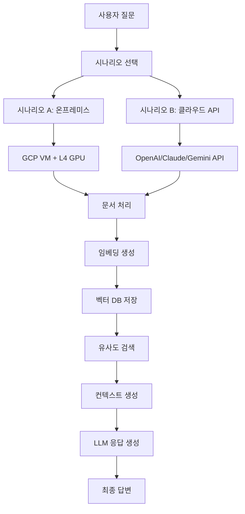
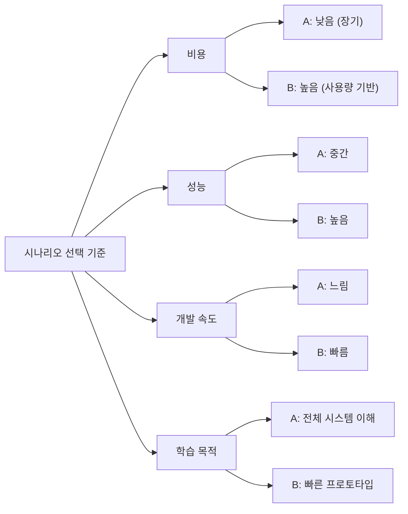
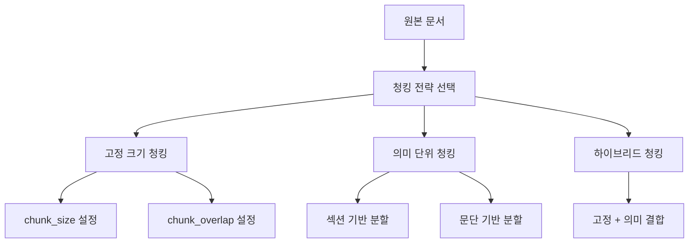
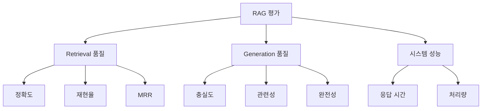
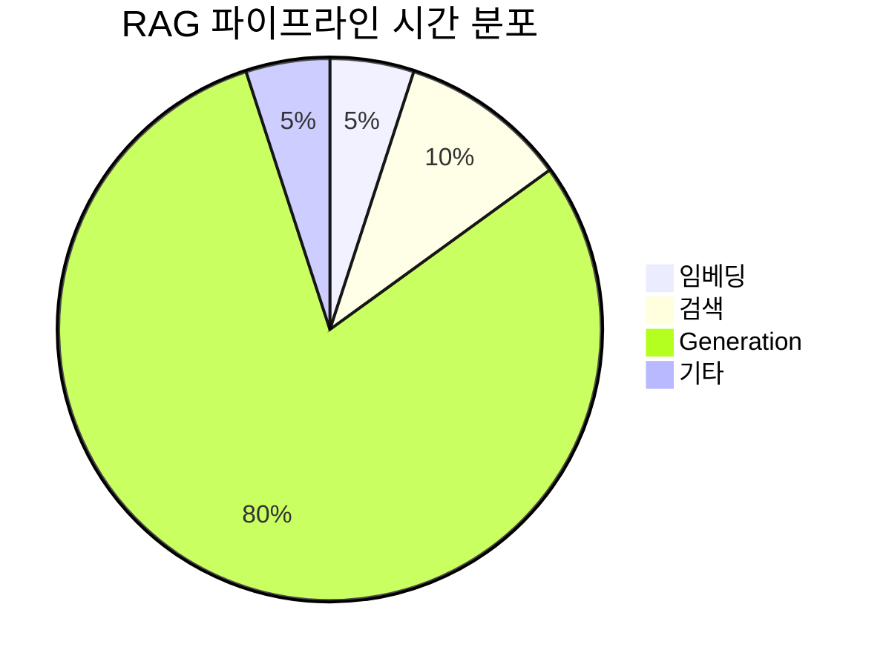
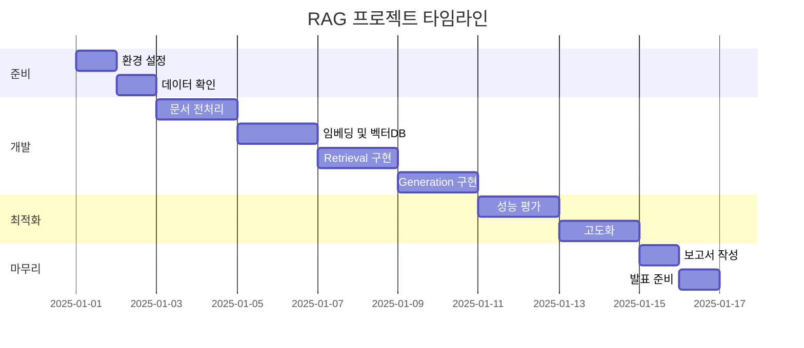

# [중급프로젝트] - RAG 시스템 기반 RFP 분석 프로젝트 가이드

## 목차

1. [프로젝트 개요](#1-프로젝트-개요)
   - [1.1. 프로젝트 목표](#11-프로젝트-목표)
   - [1.2. 비즈니스 시나리오](#12-비즈니스-시나리오)
   - [1.3. 프로젝트 기간 및 일정](#13-프로젝트-기간-및-일정)
2. [기술 스택 및 아키텍처](#2-기술-스택-및-아키텍처)
   - [2.1. 시나리오 A: GCP 온프레미스 기반](#21-시나리오-a-gcp-온프레미스-기반)
   - [2.2. 시나리오 B: 클라우드 API 기반](#22-시나리오-b-클라우드-api-기반)
   - [2.3. 기술 스택 비교 분석](#23-기술-스택-비교-분석)
3. [RAG 시스템 구현 가이드](#3-rag-시스템-구현-가이드)
   - [3.1. 데이터 수집 및 전처리](#31-데이터-수집-및-전처리)
   - [3.2. 문서 청킹 전략](#32-문서-청킹-전략)
   - [3.3. 임베딩 및 벡터 DB 구축](#33-임베딩-및-벡터-db-구축)
   - [3.4. Retrieval 시스템 구현](#34-retrieval-시스템-구현)
   - [3.5. Generation 시스템 구현](#35-generation-시스템-구현)
4. [성능 평가 및 최적화](#4-성능-평가-및-최적화)
   - [4.1. 평가 지표 설계](#41-평가-지표-설계)
   - [4.2. 테스트 질문 세트 구성](#42-테스트-질문-세트-구성)
   - [4.3. 응답 속도 최적화](#43-응답-속도-최적화)
5. [협업 및 프로젝트 관리](#5-협업-및-프로젝트-관리)
   - [5.1. 역할 분담 가이드](#51-역할-분담-가이드)
   - [5.2. 협업 일지 작성 방법](#52-협업-일지-작성-방법)
   - [5.3. 타임라인 관리](#53-타임라인-관리)
6. [평가 기준 및 제출 방법](#6-평가-기준-및-제출-방법)
   - [6.1. 과정 중 평가](#61-과정-중-평가)
   - [6.2. 결과 평가](#62-결과-평가)
   - [6.3. 결과물 제출 가이드](#63-결과물-제출-가이드)

---

## 1. 프로젝트 개요

### 1.1. 프로젝트 목표

본 프로젝트는 RAG(Retrieval-Augmented Generation) 시스템을 구축하여 복잡한 형태의 기업 및 정부 제안요청서(Request For Proposal, RFP) 내용을 효과적으로 추출하고 요약하여 필요한 정보를 제공하는 서비스를 개발하는 것을 목표로 합니다.

**핵심 목표:**
- 좋은 동료를 얻어가며 함께 성장하기
- 최선의 팀 프로젝트 결과물 완성하기
- 협업을 잘 하는 엔지니어로 성장하기

### 1.2. 비즈니스 시나리오

**입찰메이트 소개:**

입찰메이트는 B2G 입찰지원 전문 컨설팅 스타트업으로, 공공입찰 컨설팅 서비스를 제공합니다. 하루 수백 건의 RFP가 나라장터 등에서 공고되는데, 한 요청서당 수십 페이지가 넘는 문서를 기업 담당자들이 일일이 검토하는 것은 비효율적입니다.

**비즈니스 문제:**
- 대량의 RFP 문서 발생 (일 수백 건)
- 문서당 수십 페이지 분량
- 주요 요구 조건, 대상 기관, 예산, 제출 방식 등 핵심 정보 파악의 어려움

**솔루션 요구사항:**

입찰메이트의 컨설턴트가 RFP의 핵심 정보를 빠르게 파악하고 고객사에게 적합한 입찰 기회를 추천할 수 있도록, 사용자의 요청에 따라 RFP 문서의 내용을 효과적으로 추출하고 요약하여 필요한 정보를 제공할 수 있는 사내 RAG 시스템을 구현합니다.

### 1.3. 프로젝트 기간 및 일정

- **프로젝트 OT**: 프로젝트 기간 시작일
- **프로젝트 본 기간**: OT 직후부터 프로젝트 기간 종료일 전일까지
- **프로젝트 발표**: 프로젝트 기간 마감일
- **발표 자료 제출 마감**: 종료일 D-1 19:00
- **협업 일지 제출 마감**: 종료일 23:50

---

## 2. 기술 스택 및 아키텍처

본 프로젝트는 두 가지 기술 스택 시나리오를 모두 구현하고 비교 실험하는 것을 목표로 합니다.



### 2.1. 시나리오 A: GCP 온프레미스 기반

**장점:**
- 비용 절감 가능 (장기적 관점)
- 데이터 보안 및 프라이버시 강화
- 모델 커스터마이징 자유도 높음
- RAG 시스템 전체 구조 이해 가능

**단점:**
- 초기 설정 복잡도 높음
- 성능 최적화 어려움
- GPU 메모리 제약 고려 필요
- 추론 속도 상대적으로 느릴 수 있음

**기술 스택:**

| 구성 요소 | 기술 |
|---------|------|
| LLM 실행 | HuggingFace 모델 (LLaMa, Gemma, Mistral 등) |
| 임베딩 | HuggingFace Sentence-Transformers |
| 벡터 DB | FAISS, ChromaDB |
| 문서 처리 | PyPDF2, python-docx, olefile (HWP) |
| 프레임워크 | LangChain, LlamaIndex |

### 2.2. 시나리오 B: 클라우드 API 기반

**장점:**
- 빠른 프로토타이핑 가능
- 높은 성능 보장
- 인프라 관리 부담 없음
- 최신 모델 즉시 활용 가능

**단점:**
- API 호출 비용 발생
- 데이터 외부 전송 필요
- 모델 커스터마이징 제한
- API 속도 제한(Rate Limit) 고려 필요

**기술 스택:**

| 구성 요소 | 기술 |
|---------|------|
| LLM 실행 | OpenAI (GPT-4, GPT-3.5), Claude, Gemini |
| 임베딩 | OpenAI Embedding API, Cohere |
| 벡터 DB | FAISS, ChromaDB, Supabase (pgvector) |
| 문서 처리 | PyPDF2, python-docx, olefile (HWP) |
| 프레임워크 | LangChain, LlamaIndex |

**추천 모델 (OpenAI 기준):**
- 기본 사용: `gpt-4o-mini`, `gpt-4o-nano`
- 고성능 테스트: `gpt-4o` (제한적 사용)
- 임베딩: `text-embedding-3-small`

### 2.3. 기술 스택 비교 분석



**의사 결정 가이드:**

1. **시나리오 B를 먼저 시도** (추천)
   - 빠른 프로토타이핑으로 시스템 검증
   - 베이스라인 성능 확보
   - 이후 시나리오 A로 확장

2. **시나리오 A는 심화 단계에서 시도**
   - 시스템 전체 이해도 향상
   - 포트폴리오 차별화 포인트
   - 성능은 낮더라도 학습 가치 높음

---

## 3. RAG 시스템 구현 가이드

### 3.1. 데이터 수집 및 전처리

#### 3.1.1. 문서 포맷 처리

**제공 데이터:**
- 100개의 실제 RFP 문서
- `data_list.csv`: 메타데이터 파일
- 문서 포맷: HWP, PDF

**문서 로딩 구현:**

```python
import os
from pathlib import Path
import PyPDF2
import olefile

def load_pdf(file_path):
    """PDF 파일 텍스트 추출"""
    with open(file_path, 'rb') as file:
        reader = PyPDF2.PdfReader(file)
        text = ""
        for page in reader.pages:
            text += page.extract_text()
    return text

def load_hwp(file_path):
    """HWP 파일 텍스트 추출"""
    ole = olefile.OleFileIO(file_path)
    encoded_text = ole.openstream('PrvText').read()
    text = encoded_text.decode('utf-16')
    ole.close()
    return text

def load_document(file_path):
    """통합 문서 로더"""
    ext = Path(file_path).suffix.lower()
    if ext == '.pdf':
        return load_pdf(file_path)
    elif ext == '.hwp':
        return load_hwp(file_path)
    else:
        raise ValueError(f"지원하지 않는 파일 형식: {ext}")
```

#### 3.1.2. 메타데이터 활용 전략

**메타데이터 구조 예시:**

| 필드명 | 설명 | 활용 방법 |
|-------|------|---------|
| 사업명 | 입찰 사업 제목 | 문서 필터링, 검색 개선 |
| 발주기관 | 발주 기관명 | 기관별 필터링 |
| 예산 | 사업 예산 | 예산 범위 검색 |
| 공고일 | 공고 날짜 | 시간 범위 필터링 |
| 마감일 | 제출 마감일 | 긴급도 판단 |

**메타데이터 통합 전략:**

```python
import pandas as pd

def load_metadata(csv_path):
    """메타데이터 로딩"""
    df = pd.read_csv(csv_path, encoding='utf-8-sig')
    return df

def create_document_with_metadata(file_path, metadata_row):
    """메타데이터와 함께 문서 객체 생성"""
    text = load_document(file_path)
    
    document = {
        'content': text,
        'metadata': {
            '사업명': metadata_row['사업명'],
            '발주기관': metadata_row['발주기관'],
            '예산': metadata_row['예산'],
            '공고일': metadata_row['공고일'],
            '파일명': metadata_row['파일명']
        }
    }
    
    return document
```

### 3.2. 문서 청킹 전략

#### 3.2.1. 청크 크기 최적화

**청킹의 중요성:**

청킹은 RAG 시스템의 성능에 직접적인 영향을 미칩니다. 적절한 청크 크기는 검색 정확도와 컨텍스트 품질을 결정합니다.



**고정 크기 청킹 (기본):**

```python
from langchain.text_splitter import RecursiveCharacterTextSplitter

def create_chunks(text, chunk_size=1000, chunk_overlap=200):
    """고정 크기 청킹"""
    text_splitter = RecursiveCharacterTextSplitter(
        chunk_size=chunk_size,
        chunk_overlap=chunk_overlap,
        length_function=len,
        separators=["\n\n", "\n", " ", ""]
    )
    
    chunks = text_splitter.split_text(text)
    return chunks
```

**청크 크기 가이드라인:**

| 청크 크기 | 장점 | 단점 | 권장 사용 |
|---------|------|------|---------|
| 작음 (200-500자) | 정밀한 검색, 빠른 처리 | 컨텍스트 부족 | 짧은 질문, 특정 정보 검색 |
| 중간 (500-1000자) | 균형잡힌 성능 | - | 일반적 사용 (권장) |
| 큼 (1000-2000자) | 풍부한 컨텍스트 | 검색 정확도 하락 | 요약, 전체 이해 필요 시 |

**청크 오버랩 설정:**

$$
\text{Overlap Ratio} = \frac{\text{chunk\_overlap}}{\text{chunk\_size}} \approx 0.1 \sim 0.2
$$

권장 오버랩 비율은 10-20%입니다. 너무 높으면 저장 공간 낭비, 너무 낮으면 문맥 손실이 발생합니다.

#### 3.2.2. 의미 단위 기반 청킹 (심화)

**RFP 문서 구조 활용:**

RFP 문서는 일반적으로 다음과 같은 구조를 가집니다:

1. 사업 개요
2. 사업 목적 및 범위
3. 과업 내용
4. 기술 요구사항
5. 제안 요청사항
6. 평가 기준
7. 제출 방법 및 일정

```python
import re

def semantic_chunking(text):
    """의미 단위 기반 청킹"""
    # RFP 문서의 섹션 구분자 패턴
    section_patterns = [
        r'^\d+\.\s+[가-힣\s]+',  # 1. 사업 개요
        r'^[가-힣]\.\s+[가-힣\s]+',  # 가. 세부 항목
        r'^\([가-힣]\)\s+[가-힣\s]+'  # (가) 세부 항목
    ]
    
    chunks = []
    current_chunk = ""
    
    for line in text.split('\n'):
        is_section_start = any(re.match(pattern, line.strip()) 
                              for pattern in section_patterns)
        
        if is_section_start and len(current_chunk) > 100:
            chunks.append(current_chunk.strip())
            current_chunk = line
        else:
            current_chunk += "\n" + line
    
    if current_chunk:
        chunks.append(current_chunk.strip())
    
    return chunks
```

### 3.3. 임베딩 및 벡터 DB 구축

#### 3.3.1. 임베딩 모델 선정

**임베딩 모델 비교:**

| 모델 | 차원 | 성능 | 속도 | 비용 | 권장 시나리오 |
|------|-----|------|------|------|-------------|
| text-embedding-3-small | 1536 | 높음 | 빠름 | 낮음 | 시나리오 B |
| sentence-transformers/paraphrase-multilingual-mpnet-base-v2 | 768 | 중간 | 중간 | 무료 | 시나리오 A |
| intfloat/multilingual-e5-large | 1024 | 높음 | 느림 | 무료 | 시나리오 A (고성능) |

**시나리오 B 구현 (OpenAI):**

```python
from openai import OpenAI

client = OpenAI(api_key="YOUR_API_KEY")

def get_embedding(text, model="text-embedding-3-small"):
    """OpenAI 임베딩 생성"""
    text = text.replace("\n", " ")
    response = client.embeddings.create(
        input=[text],
        model=model
    )
    return response.data[0].embedding
```

**시나리오 A 구현 (HuggingFace):**

```python
from sentence_transformers import SentenceTransformer

model = SentenceTransformer('sentence-transformers/paraphrase-multilingual-mpnet-base-v2')

def get_embedding_local(text):
    """로컬 임베딩 생성"""
    embedding = model.encode(text, convert_to_tensor=False)
    return embedding.tolist()
```

#### 3.3.2. 벡터 DB 구현

**FAISS 구현 (권장):**

```python
import faiss
import numpy as np
import pickle

class VectorStore:
    def __init__(self, dimension=1536):
        """벡터 스토어 초기화"""
        self.dimension = dimension
        self.index = faiss.IndexFlatL2(dimension)
        self.documents = []
        self.metadatas = []
    
    def add_documents(self, texts, embeddings, metadatas):
        """문서 추가"""
        embeddings_np = np.array(embeddings).astype('float32')
        self.index.add(embeddings_np)
        self.documents.extend(texts)
        self.metadatas.extend(metadatas)
    
    def search(self, query_embedding, k=5):
        """유사도 검색"""
        query_np = np.array([query_embedding]).astype('float32')
        distances, indices = self.index.search(query_np, k)
        
        results = []
        for i, idx in enumerate(indices[0]):
            if idx < len(self.documents):
                results.append({
                    'text': self.documents[idx],
                    'metadata': self.metadatas[idx],
                    'distance': distances[0][i]
                })
        
        return results
    
    def save(self, path):
        """벡터 DB 저장"""
        faiss.write_index(self.index, f"{path}/faiss.index")
        with open(f"{path}/documents.pkl", 'wb') as f:
            pickle.dump({
                'documents': self.documents,
                'metadatas': self.metadatas
            }, f)
    
    def load(self, path):
        """벡터 DB 로드"""
        self.index = faiss.read_index(f"{path}/faiss.index")
        with open(f"{path}/documents.pkl", 'rb') as f:
            data = pickle.load(f)
            self.documents = data['documents']
            self.metadatas = data['metadatas']
```

**ChromaDB 구현 (대안):**

```python
import chromadb
from chromadb.config import Settings

def create_chroma_collection():
    """ChromaDB 컬렉션 생성"""
    client = chromadb.Client(Settings(
        chroma_db_impl="duckdb+parquet",
        persist_directory="./chroma_db"
    ))
    
    collection = client.create_collection(
        name="rfp_documents",
        metadata={"description": "RFP 문서 벡터 저장소"}
    )
    
    return collection

def add_to_chroma(collection, texts, embeddings, metadatas):
    """ChromaDB에 문서 추가"""
    ids = [f"doc_{i}" for i in range(len(texts))]
    
    collection.add(
        documents=texts,
        embeddings=embeddings,
        metadatas=metadatas,
        ids=ids
    )
```

### 3.4. Retrieval 시스템 구현

#### 3.4.1. 베이스라인 Retrieval

**기본 유사도 검색:**

```python
def naive_retrieval(query, vector_store, embedding_function, k=5):
    """베이스라인 검색"""
    # 1. 쿼리 임베딩
    query_embedding = embedding_function(query)
    
    # 2. 유사도 검색
    results = vector_store.search(query_embedding, k=k)
    
    # 3. 결과 반환
    return results
```

**유사도 계산 방식:**

$$
\text{Cosine Similarity} = \frac{\mathbf{A} \cdot \mathbf{B}}{||\mathbf{A}|| \cdot ||\mathbf{B}||}
$$

FAISS는 기본적으로 L2 거리를 사용하지만, 코사인 유사도로 변환 가능합니다.

#### 3.4.2. 메타데이터 필터링

**발주기관 필터링 구현:**

```python
from difflib import SequenceMatcher

def fuzzy_match(query_org, metadata_org, threshold=0.7):
    """유사도 기반 기관명 매칭"""
    similarity = SequenceMatcher(None, query_org, metadata_org).ratio()
    return similarity >= threshold

def metadata_filtered_retrieval(query, filters, vector_store, embedding_function, k=5):
    """메타데이터 필터링 검색"""
    # 1. 쿼리 임베딩 및 초기 검색
    query_embedding = embedding_function(query)
    initial_results = vector_store.search(query_embedding, k=k*3)  # 더 많이 검색
    
    # 2. 메타데이터 필터링
    filtered_results = []
    for result in initial_results:
        metadata = result['metadata']
        
        # 발주기관 필터
        if '발주기관' in filters:
            if not fuzzy_match(filters['발주기관'], metadata.get('발주기관', '')):
                continue
        
        # 예산 범위 필터
        if '최소예산' in filters and '최대예산' in filters:
            budget = metadata.get('예산', 0)
            if not (filters['최소예산'] <= budget <= filters['최대예산']):
                continue
        
        filtered_results.append(result)
        
        if len(filtered_results) >= k:
            break
    
    return filtered_results
```

#### 3.4.3. 고급 검색 기법 (심화)

**Multi-Query Retrieval:**

```python
def generate_multiple_queries(original_query, llm_function):
    """쿼리 확장"""
    prompt = f"""다음 질문을 3가지 다른 방식으로 다시 작성해주세요:
    
원본 질문: {original_query}

다시 작성된 질문들:
1."""
    
    response = llm_function(prompt)
    queries = [original_query] + response.strip().split('\n')
    return queries

def multi_query_retrieval(query, vector_store, embedding_function, llm_function, k=5):
    """다중 쿼리 검색"""
    # 1. 쿼리 확장
    queries = generate_multiple_queries(query, llm_function)
    
    # 2. 각 쿼리로 검색
    all_results = []
    for q in queries:
        results = naive_retrieval(q, vector_store, embedding_function, k=k)
        all_results.extend(results)
    
    # 3. 중복 제거 및 점수 합산
    unique_results = {}
    for result in all_results:
        doc_id = result['text'][:100]  # 간단한 ID
        if doc_id not in unique_results:
            unique_results[doc_id] = result
        else:
            # 거리(낮을수록 좋음)를 점수로 변환하여 합산
            unique_results[doc_id]['distance'] = min(
                unique_results[doc_id]['distance'],
                result['distance']
            )
    
    # 4. 점수 기준 정렬
    sorted_results = sorted(
        unique_results.values(),
        key=lambda x: x['distance']
    )[:k]
    
    return sorted_results
```

**MMR (Maximum Marginal Relevance):**

```python
import numpy as np

def calculate_similarity(emb1, emb2):
    """코사인 유사도 계산"""
    return np.dot(emb1, emb2) / (np.linalg.norm(emb1) * np.linalg.norm(emb2))

def mmr_retrieval(query, vector_store, embedding_function, k=5, lambda_param=0.5):
    """MMR 기반 다양성 검색"""
    # 1. 초기 후보 문서 검색
    query_embedding = embedding_function(query)
    candidates = vector_store.search(query_embedding, k=k*3)
    
    # 2. MMR 알고리즘
    selected = []
    candidate_embeddings = [embedding_function(c['text']) for c in candidates]
    
    while len(selected) < k and candidates:
        mmr_scores = []
        
        for i, candidate in enumerate(candidates):
            # 쿼리와의 유사도
            relevance = calculate_similarity(query_embedding, candidate_embeddings[i])
            
            # 이미 선택된 문서들과의 최대 유사도
            if selected:
                selected_embeddings = [embedding_function(s['text']) for s in selected]
                max_similarity = max(
                    calculate_similarity(candidate_embeddings[i], sel_emb)
                    for sel_emb in selected_embeddings
                )
            else:
                max_similarity = 0
            
            # MMR 점수 계산
            mmr_score = lambda_param * relevance - (1 - lambda_param) * max_similarity
            mmr_scores.append(mmr_score)
        
        # 최고 점수 문서 선택
        best_idx = np.argmax(mmr_scores)
        selected.append(candidates.pop(best_idx))
        candidate_embeddings.pop(best_idx)
    
    return selected
```

### 3.5. Generation 시스템 구현

#### 3.5.1. LLM 모델 선정

**시나리오 B (OpenAI API):**

```python
from openai import OpenAI

client = OpenAI(api_key="YOUR_API_KEY")

def generate_response(context, query, model="gpt-4o-mini", temperature=0.3, max_tokens=1000):
    """OpenAI 응답 생성"""
    prompt = f"""다음 문서 내용을 바탕으로 질문에 답변해주세요.

문서 내용:
{context}

질문: {query}

답변:"""
    
    response = client.chat.completions.create(
        model=model,
        messages=[
            {"role": "system", "content": "당신은 RFP 문서 분석 전문가입니다."},
            {"role": "user", "content": prompt}
        ],
        temperature=temperature,
        max_tokens=max_tokens
    )
    
    return response.choices[0].message.content
```

**시나리오 A (HuggingFace Transformers):**

```python
from transformers import AutoTokenizer, AutoModelForCausalLM
import torch

class LocalLLM:
    def __init__(self, model_name="beomi/Llama-3-Open-Ko-8B"):
        """로컬 LLM 초기화"""
        self.tokenizer = AutoTokenizer.from_pretrained(model_name)
        self.model = AutoModelForCausalLM.from_pretrained(
            model_name,
            torch_dtype=torch.float16,
            device_map="auto"
        )
    
    def generate(self, context, query, max_new_tokens=1000, temperature=0.3):
        """응답 생성"""
        prompt = f"""다음 문서 내용을 바탕으로 질문에 답변해주세요.

문서 내용:
{context}

질문: {query}

답변:"""
        
        inputs = self.tokenizer(prompt, return_tensors="pt").to(self.model.device)
        
        outputs = self.model.generate(
            **inputs,
            max_new_tokens=max_new_tokens,
            temperature=temperature,
            do_sample=True,
            top_p=0.9
        )
        
        response = self.tokenizer.decode(outputs[0], skip_special_tokens=True)
        
        # 프롬프트 제거 후 답변만 추출
        answer = response.split("답변:")[-1].strip()
        
        return answer
```

#### 3.5.2. 프롬프트 엔지니어링

**프롬프트 구조:**

```python
def create_rag_prompt(context, query, instruction=None):
    """RAG 프롬프트 생성"""
    
    base_instruction = """당신은 RFP(제안요청서) 문서 분석 전문가입니다.
주어진 문서 내용을 정확하게 분석하여 질문에 답변해주세요.

중요 지침:
1. 문서에 명시된 내용만을 기반으로 답변하세요.
2. 문서에 없는 내용은 "문서에서 해당 정보를 찾을 수 없습니다"라고 명확히 밝히세요.
3. 핵심 요구사항, 예산, 기한 등 중요 정보는 누락 없이 포함하세요.
4. 답변은 명확하고 간결하게 작성하세요."""
    
    if instruction:
        base_instruction += f"\n{instruction}"
    
    prompt = f"""{base_instruction}

===== 문서 내용 =====
{context}

===== 질문 =====
{query}

===== 답변 =====
"""
    
    return prompt
```

**스타일별 프롬프트 변형:**

```python
# 요약형 답변
summary_instruction = "답변은 3-5개의 핵심 포인트로 요약하여 제시하세요."

# 상세형 답변
detailed_instruction = "각 항목에 대해 문서의 구체적인 내용을 인용하여 상세히 설명하세요."

# 비교형 답변
comparison_instruction = "여러 문서의 내용을 비교하여 공통점과 차이점을 명확히 제시하세요."
```

**텍스트 생성 파라미터 조정:**

| 파라미터 | 권장 값 | 효과 |
|---------|--------|------|
| temperature | 0.1-0.3 | 낮을수록 일관성 높음 (정확한 정보 추출에 적합) |
| top_p | 0.9-0.95 | 다양성과 정확성의 균형 |
| max_tokens | 500-1500 | 답변 길이 제한 (비용 최적화) |

$$
P(w_i | w_1, ..., w_{i-1}) = \text{softmax}\left(\frac{z_i}{T}\right)
$$

여기서 $T$는 temperature입니다. 낮은 temperature는 확률 분포를 더 뾰족하게 만들어 높은 확률의 단어를 선택하게 합니다.

#### 3.5.3. 대화 컨텍스트 유지

**대화 히스토리 관리:**

```python
class ConversationManager:
    def __init__(self, max_history=5):
        """대화 관리자 초기화"""
        self.max_history = max_history
        self.history = []
        self.current_context = None
    
    def add_turn(self, query, response, context=None):
        """대화 턴 추가"""
        self.history.append({
            'query': query,
            'response': response,
            'context': context
        })
        
        # 히스토리 길이 제한
        if len(self.history) > self.max_history:
            self.history.pop(0)
    
    def get_context_with_history(self, current_query, current_context):
        """히스토리를 포함한 컨텍스트 생성"""
        # 이전 대화 요약
        history_summary = ""
        if self.history:
            history_summary = "\n\n===== 이전 대화 내용 =====\n"
            for turn in self.history[-3:]:  # 최근 3개만
                history_summary += f"Q: {turn['query']}\nA: {turn['response'][:200]}...\n\n"
        
        # 현재 컨텍스트와 결합
        full_context = history_summary + f"\n\n===== 현재 관련 문서 =====\n{current_context}"
        
        return full_context
    
    def detect_follow_up(self, query):
        """후속 질문 감지"""
        follow_up_keywords = ['더', '또', '그럼', '이어서', '추가로', '그리고']
        pronoun_keywords = ['이', '그', '저', '해당', '위']
        
        is_follow_up = any(keyword in query for keyword in follow_up_keywords + pronoun_keywords)
        
        return is_follow_up
```

**후속 질문 처리:**

```python
def handle_query(query, conversation_manager, vector_store, embedding_function, llm_function):
    """쿼리 처리 (후속 질문 고려)"""
    
    # 1. 후속 질문 감지
    is_follow_up = conversation_manager.detect_follow_up(query)
    
    # 2. 검색 전략 결정
    if is_follow_up and conversation_manager.history:
        # 이전 컨텍스트 재사용 또는 확장 검색
        last_context = conversation_manager.history[-1]['context']
        
        # 쿼리 확장 (이전 질문 참조)
        last_query = conversation_manager.history[-1]['query']
        expanded_query = f"{last_query} {query}"
        
        # 검색
        results = naive_retrieval(expanded_query, vector_store, embedding_function, k=3)
        
        # 이전 컨텍스트와 결합
        all_contexts = [last_context] + [r['text'] for r in results]
        context = "\n\n---\n\n".join(all_contexts)
    else:
        # 새로운 질문
        results = naive_retrieval(query, vector_store, embedding_function, k=5)
        context = "\n\n---\n\n".join([r['text'] for r in results])
    
    # 3. 히스토리 포함 컨텍스트 생성
    full_context = conversation_manager.get_context_with_history(query, context)
    
    # 4. 응답 생성
    response = llm_function(full_context, query)
    
    # 5. 대화 히스토리 업데이트
    conversation_manager.add_turn(query, response, context)
    
    return response
```

---

## 4. 성능 평가 및 최적화

### 4.1. 평가 지표 설계

**RAG 시스템 평가 차원:**



#### 4.1.1. Retrieval 평가 지표

**Precision@K (정밀도):**

$$
\text{Precision@K} = \frac{\text{관련 문서 수 in Top-K}}{\text{K}}
$$

```python
def calculate_precision_at_k(retrieved_docs, relevant_docs, k=5):
    """Precision@K 계산"""
    top_k = retrieved_docs[:k]
    relevant_count = sum(1 for doc in top_k if doc in relevant_docs)
    return relevant_count / k
```

**Recall@K (재현율):**

$$
\text{Recall@K} = \frac{\text{관련 문서 수 in Top-K}}{\text{전체 관련 문서 수}}
$$

**MRR (Mean Reciprocal Rank):**

$$
\text{MRR} = \frac{1}{|Q|} \sum_{i=1}^{|Q|} \frac{1}{\text{rank}_i}
$$

```python
def calculate_mrr(retrieved_docs_list, relevant_docs_list):
    """MRR 계산"""
    reciprocal_ranks = []
    
    for retrieved, relevant in zip(retrieved_docs_list, relevant_docs_list):
        for rank, doc in enumerate(retrieved, 1):
            if doc in relevant:
                reciprocal_ranks.append(1.0 / rank)
                break
        else:
            reciprocal_ranks.append(0.0)
    
    return sum(reciprocal_ranks) / len(reciprocal_ranks)
```

#### 4.1.2. Generation 평가 지표

**답변 품질 평가 기준:**

| 기준 | 설명 | 평가 방법 |
|------|------|---------|
| 충실도 (Faithfulness) | 문서 내용에 충실한가? | LLM 기반 평가 또는 인간 평가 |
| 관련성 (Relevance) | 질문에 적합한 답변인가? | 의미 유사도, 인간 평가 |
| 완전성 (Completeness) | 필요한 정보를 모두 포함하는가? | 체크리스트 기반 평가 |
| 정확성 (Accuracy) | 사실 오류가 없는가? | 인간 평가, 자동 검증 |

**LLM 기반 자동 평가:**

```python
def evaluate_faithfulness(context, response, llm_function):
    """충실도 평가"""
    prompt = f"""다음 문서와 답변을 평가해주세요.

문서:
{context}

답변:
{response}

위 답변이 문서 내용에 충실한지 1-5점으로 평가하고, 그 이유를 설명해주세요.
점수가 낮다면 어떤 부분이 문제인지 구체적으로 지적해주세요.

평가:
점수: 
이유:"""
    
    evaluation = llm_function(prompt)
    
    return evaluation

def evaluate_relevance(query, response, llm_function):
    """관련성 평가"""
    prompt = f"""다음 질문과 답변의 관련성을 평가해주세요.

질문: {query}

답변: {response}

위 답변이 질문에 얼마나 적합한지 1-5점으로 평가하고, 그 이유를 설명해주세요.

평가:
점수:
이유:"""
    
    evaluation = llm_function(prompt)
    
    return evaluation
```

#### 4.1.3. 통합 평가 파이프라인

```python
class RAGEvaluator:
    def __init__(self, vector_store, embedding_function, llm_function):
        """RAG 평가기 초기화"""
        self.vector_store = vector_store
        self.embedding_function = embedding_function
        self.llm_function = llm_function
    
    def evaluate_single_query(self, query, ground_truth_docs, ground_truth_answer):
        """단일 쿼리 평가"""
        # 1. Retrieval
        retrieved = naive_retrieval(query, self.vector_store, self.embedding_function, k=5)
        retrieved_texts = [r['text'] for r in retrieved]
        
        # 2. Generation
        context = "\n\n---\n\n".join(retrieved_texts)
        response = self.llm_function(context, query)
        
        # 3. 평가
        retrieval_precision = calculate_precision_at_k(retrieved_texts, ground_truth_docs, k=5)
        
        faithfulness = evaluate_faithfulness(context, response, self.llm_function)
        relevance = evaluate_relevance(query, response, self.llm_function)
        
        return {
            'query': query,
            'retrieved': retrieved_texts,
            'response': response,
            'retrieval_precision': retrieval_precision,
            'faithfulness': faithfulness,
            'relevance': relevance
        }
    
    def evaluate_test_set(self, test_queries):
        """테스트 세트 전체 평가"""
        results = []
        
        for test_case in test_queries:
            result = self.evaluate_single_query(
                test_case['query'],
                test_case.get('ground_truth_docs', []),
                test_case.get('ground_truth_answer', '')
            )
            results.append(result)
        
        return results
```

### 4.2. 테스트 질문 세트 구성

#### 4.2.1. 질문 유형 분류

**질문 유형별 예시:**

| 유형 | 설명 | 예시 질문 |
|------|------|---------|
| 단일 정보 추출 | 특정 정보 하나를 찾는 질문 | "국민연금공단의 이러닝시스템 사업 예산은?" |
| 복합 정보 추출 | 여러 정보를 종합하는 질문 | "국민연금공단 이러닝시스템 사업의 요구사항을 정리해 줘" |
| 후속 질문 | 이전 질문을 참조하는 질문 | "콘텐츠 개발 관리 요구사항에 대해 더 자세히 알려 줘" |
| 비교 질문 | 여러 문서를 비교하는 질문 | "고려대와 광주과기원의 시스템 사업을 비교해 줘" |
| 부정 질문 | 문서에 없는 내용을 묻는 질문 | "기초과학연구원 사업에 AI 예측 요구사항이 있나?" |

#### 4.2.2. 테스트 질문 세트 예시

```python
test_queries = [
    # 단일 정보 추출
    {
        'query': '국민연금공단이 발주한 이러닝시스템 사업의 예산은 얼마인가?',
        'type': 'single_info',
        'expected_info': ['예산'],
        'difficulty': 'easy'
    },
    
    # 복합 정보 추출
    {
        'query': '국민연금공단이 발주한 이러닝시스템 관련 사업 요구사항을 정리해 줘.',
        'type': 'complex_info',
        'expected_info': ['요구사항', '목적', '범위'],
        'difficulty': 'medium'
    },
    
    # 후속 질문
    {
        'query': '콘텐츠 개발 관리 요구 사항에 대해서 더 자세히 알려 줘.',
        'type': 'follow_up',
        'requires_context': True,
        'difficulty': 'medium'
    },
    
    # 비교 질문
    {
        'query': '고려대학교 차세대 포털 시스템 사업이랑 광주과학기술원의 학사 시스템 기능개선 사업을 비교해 줄래?',
        'type': 'comparison',
        'expected_info': ['공통점', '차이점'],
        'difficulty': 'hard'
    },
    
    # 부정 질문 (문서에 없는 내용)
    {
        'query': '기초과학연구원 극저온시스템 사업 요구에서 AI 기반 예측에 대한 요구사항이 있나?',
        'type': 'negative',
        'expected_response': '문서에서 찾을 수 없습니다',
        'difficulty': 'medium'
    },
    
    # 교차 문서 질문
    {
        'query': '교육이나 학습 관련해서 다른 기관이 발주한 사업은 없나?',
        'type': 'cross_document',
        'expected_info': ['여러 기관', '사업 목록'],
        'difficulty': 'hard'
    }
]
```

### 4.3. 응답 속도 최적화

#### 4.3.1. 병목 구간 분석

```python
import time

def profile_rag_pipeline(query, vector_store, embedding_function, llm_function):
    """RAG 파이프라인 프로파일링"""
    times = {}
    
    # 1. 임베딩 시간
    start = time.time()
    query_embedding = embedding_function(query)
    times['embedding'] = time.time() - start
    
    # 2. 검색 시간
    start = time.time()
    results = vector_store.search(query_embedding, k=5)
    times['retrieval'] = time.time() - start
    
    # 3. 컨텍스트 준비
    start = time.time()
    context = "\n\n---\n\n".join([r['text'] for r in results])
    times['context_preparation'] = time.time() - start
    
    # 4. Generation 시간
    start = time.time()
    response = llm_function(context, query)
    times['generation'] = time.time() - start
    
    times['total'] = sum(times.values())
    
    return times, response
```

**일반적인 시간 분포:**



#### 4.3.2. 최적화 전략

**1. 임베딩 캐싱:**

```python
from functools import lru_cache

@lru_cache(maxsize=1000)
def cached_embedding(text):
    """임베딩 캐싱"""
    return embedding_function(text)
```

**2. 배치 임베딩:**

```python
def batch_embed_documents(texts, embedding_function, batch_size=32):
    """배치 임베딩 생성"""
    embeddings = []
    
    for i in range(0, len(texts), batch_size):
        batch = texts[i:i+batch_size]
        batch_embeddings = embedding_function(batch)  # API에 따라 구현
        embeddings.extend(batch_embeddings)
    
    return embeddings
```

**3. 비동기 처리:**

```python
import asyncio
from concurrent.futures import ThreadPoolExecutor

async def async_rag_pipeline(queries, vector_store, embedding_function, llm_function):
    """비동기 RAG 파이프라인"""
    
    async def process_single_query(query):
        # 각 쿼리를 비동기로 처리
        loop = asyncio.get_event_loop()
        with ThreadPoolExecutor() as executor:
            # 임베딩
            embedding = await loop.run_in_executor(executor, embedding_function, query)
            
            # 검색
            results = await loop.run_in_executor(
                executor,
                vector_store.search,
                embedding,
                5
            )
            
            # Generation
            context = "\n\n---\n\n".join([r['text'] for r in results])
            response = await loop.run_in_executor(
                executor,
                llm_function,
                context,
                query
            )
            
            return response
    
    # 모든 쿼리 병렬 처리
    responses = await asyncio.gather(*[process_single_query(q) for q in queries])
    
    return responses
```

**4. 인덱스 최적화 (FAISS):**

```python
import faiss

def create_optimized_index(embeddings, use_gpu=True):
    """최적화된 FAISS 인덱스 생성"""
    dimension = len(embeddings[0])
    
    # IVF (Inverted File Index) 사용
    nlist = 100  # 클러스터 수
    quantizer = faiss.IndexFlatL2(dimension)
    index = faiss.IndexIVFFlat(quantizer, dimension, nlist)
    
    # 학습
    embeddings_np = np.array(embeddings).astype('float32')
    index.train(embeddings_np)
    index.add(embeddings_np)
    
    # GPU 사용 (선택)
    if use_gpu and faiss.get_num_gpus() > 0:
        index = faiss.index_cpu_to_gpu(faiss.StandardGpuResources(), 0, index)
    
    return index
```

**성능 목표:**

| 단계 | 목표 시간 | 최적화 방법 |
|------|----------|-----------|
| 임베딩 | < 100ms | 캐싱, 배치 처리 |
| 검색 | < 200ms | 인덱스 최적화, GPU 활용 |
| Generation | < 3s | 모델 선택, 토큰 제한 |
| **전체** | **< 3.5s** | 비동기 처리, 병렬화 |

---

## 5. 협업 및 프로젝트 관리

### 5.1. 역할 분담 가이드

**권장 역할 구조:**

| 역할 | 주요 책임 | 필요 스킬 |
|------|---------|---------|
| Project Manager | 일정 관리, 회의 주도, 성능 평가 담당 | 커뮤니케이션, 조율 능력 |
| 데이터 처리 담당 | 문서 로딩, 메타데이터 처리, 청킹 전략 | Python, 데이터 전처리 |
| Retrieval 담당 | 임베딩, 벡터 DB, 검색 알고리즘 | ML/DL, 벡터 DB 경험 |
| Generation 담당 | LLM 선정, 프롬프트 엔지니어링, 대화 관리 | NLP, LLM 프롬팅 |

**역할 할당 예시 (4인 팀):**

```python
team_roles = {
    '팀원A': ['Project Manager', '성능 평가'],
    '팀원B': ['데이터 처리', '문서 청킹'],
    '팀원C': ['Retrieval', '벡터 DB'],
    '팀원D': ['Generation', '프롬프트 엔지니어링']
}
```

**협업 원칙:**
1. 역할은 유연하게 조정 가능
2. 모든 팀원이 전체 파이프라인 이해 필요
3. 주 2-3회 코드 리뷰 세션
4. 일일 스탠드업 미팅 (15분)

### 5.2. 협업 일지 작성 방법

**협업 일지 구조:**

```markdown
# [날짜] 협업 일지

## 오늘의 목표
- [ ] 목표 1
- [ ] 목표 2
- [ ] 목표 3

## 진행 상황

### 완료한 작업
1. 작업 내용 1
   - 구체적인 설명
   - 관련 코드/파일
   - 결과/성과

2. 작업 내용 2
   ...

### 진행 중인 작업
- 작업 내용
- 현재 진행률
- 예상 완료 시점

### 블로커 (막힌 부분)
- 문제 상황
- 시도한 해결 방법
- 필요한 도움

## 팀 기여

### 내가 제안한 아이디어
- 아이디어 내용
- 팀의 반응
- 채택 여부 및 이유

### 팀원 지원
- 누구를 어떻게 도왔는지
- 코드 리뷰/피드백 제공

### 회의 참여
- 회의 주제
- 내가 제시한 의견
- 결정된 사항

## 학습 내용
- 새로 알게 된 기술/지식
- 발생한 이슈와 해결 방법
- 인사이트

## 내일 계획
- 진행할 작업
- 예상 소요 시간

## 회고
- 오늘의 성과
- 아쉬운 점
- 개선 방향
```

**작성 팁:**
1. **매일 작성**: 작업 시작 전 목표 설정, 종료 후 회고
2. **구체성**: "코드 작성함" (X) → "FAISS 인덱스 생성 함수 구현, 100개 문서 임베딩 완료" (O)
3. **정직성**: 완벽한 정리보다 진솔한 기록이 중요
4. **시각 자료**: 스크린샷, 성능 그래프 등 포함

### 5.3. 타임라인 관리

**프로젝트 일정 예시 (2주 기준):**



**주간 체크리스트:**

**Week 1:**
- [ ] GCP VM 설정 완료
- [ ] 문서 로딩 파이프라인 구현
- [ ] 청킹 전략 실험 (최소 3가지)
- [ ] 임베딩 및 벡터 DB 구축
- [ ] 베이스라인 RAG 시스템 동작 확인

**Week 2:**
- [ ] 메타데이터 필터링 구현
- [ ] Generation 품질 개선
- [ ] 고급 검색 기법 적용 (최소 1가지)
- [ ] 성능 평가 완료
- [ ] 시나리오 A/B 비교 분석

---

## 6. 평가 기준 및 제출 방법

### 6.1. 과정 중 평가

**평가자**: 멘토
**평가 단위**: 개인
**평가 시점**: 프로젝트 종료 전 마지막 일요일 23:59

| 평가 항목 | 배점 | 평가 기준 |
|---------|------|---------|
| 적극성 | 25점 | 질문, 제안, 실험 등 능동적 참여도 |
| 문제 해결 능력 | 25점 | 기술적 이슈 해결 과정 및 결과 |
| 의사소통 능력 | 25점 | 팀원과의 소통, 피드백 제공 |
| 성장 가능성 | 25점 | 학습 태도, 개선 의지 |

### 6.2. 결과 평가

#### 6.2.1. 팀 단위 평가

**평가자**: 주강사
**평가 시점**: 최종 발표 직후

| 평가 항목 | 세부 기준 |
|---------|---------|
| 프로젝트 기획 | 주제 적합성, 요구사항 이해도 |
| 데이터 전처리 | 문서 처리 완성도, 메타데이터 활용 |
| 모델 설계 | RAG 아키텍처 설계, 기술 스택 선정 근거 |
| 모델 평가 | 평가 지표 설계, 성능 분석 |
| 코드 품질 | 가독성, 문서화, 재현성 |
| 결과 해석 | 비즈니스 시사점, 개선 방향 제시 |
| 발표 | 논리적 흐름, 핵심 전달력 |

#### 6.2.2. 개인 단위 평가

**평가자**: 주강사
**평가 시점**: 최종 발표 직후

| 평가 항목 | 세부 기준 |
|---------|---------|
| 주제 선정 | 아이디어 제시, 의견 제시 |
| 전처리 및 탐색 | 담당 작업 품질 |
| 모델 훈련 및 평가 | 기여도 및 완성도 |
| 업무 수행 | 타임라인 준수, 책임감 |
| 발표 참여 | 발표 또는 질의응답 기여 |

**평가 기준**: 협업 일지, 발표 참여 내역

### 6.3. 결과물 제출 가이드

#### 6.3.1. 제출 항목

**1. GitHub Repository (팀 단위)**
- **제출 마감**: 종료일 D-1 19:00
- **필수 포함 사항**:
  - `README.md`: 프로젝트 개요, 설치 방법, 실행 방법
  - 소스 코드
  - `requirements.txt` 또는 `environment.yml`
  - 데이터 전처리 스크립트
  - 평가 스크립트
  - `.gitignore` (API 키 제외 확인)

**2. 보고서 (팀 단위)**
- **제출 마감**: 종료일 D-1 19:00
- **형식**: PDF
- **필수 포함 사항**:
  - 프로젝트 개요 및 목표
  - 기술 스택 및 아키텍처
  - 데이터 전처리 과정
  - RAG 시스템 구현 상세
  - 성능 평가 결과
  - 의사 결정 과정
  - 개선 방향 및 한계점

**3. 협업 일지 (개인 단위)**
- **제출 마감**: 종료일 23:50
- **형식**: PDF 또는 링크 (Notion, 블로그 등)
- **README.md에 링크 포함**

#### 6.3.2. GitHub Repository 구조 예시

```
project-root/
├── README.md                 # 프로젝트 설명
├── requirements.txt          # 패키지 목록
├── .gitignore               # Git 제외 파일
├── data/                    # 데이터 디렉토리 (원본 제외)
│   └── processed/           # 전처리된 데이터
├── src/                     # 소스 코드
│   ├── preprocessing.py     # 전처리
│   ├── embedding.py         # 임베딩
│   ├── retrieval.py         # 검색
│   ├── generation.py        # 생성
│   └── evaluation.py        # 평가
├── notebooks/               # Jupyter 노트북
│   ├── 01_data_exploration.ipynb
│   ├── 02_baseline_rag.ipynb
│   └── 03_evaluation.ipynb
├── configs/                 # 설정 파일
│   └── config.yaml
├── tests/                   # 테스트 코드
├── docs/                    # 문서
│   └── report.pdf          # 최종 보고서
└── logs/                   # 로그 파일
```

#### 6.3.3. README.md 작성 가이드

```markdown
# RFP 분석 RAG 시스템

## 프로젝트 개요
간단한 프로젝트 소개

## 팀원
- 팀원A (PM): 역할 설명
- 팀원B: 역할 설명
- 팀원C: 역할 설명
- 팀원D: 역할 설명

## 기술 스택
- Python 3.10
- LangChain
- FAISS
- OpenAI API
- ...

## 설치 방법
```bash
pip install -r requirements.txt
```

## 실행 방법
```bash
python src/main.py --config configs/config.yaml
```

## 프로젝트 구조
...

## 주요 결과
- Precision@5: 0.85
- 평균 응답 시간: 3.2초
- ...

## 협업 일지
- [팀원A 협업 일지](링크)
- [팀원B 협업 일지](링크)
- ...

## 참고 자료
...
```

#### 6.3.4. 보안 체크리스트

**제출 전 필수 확인:**

- [ ] API 키가 코드에 하드코딩되지 않았는지 확인
- [ ] `.env` 파일이 `.gitignore`에 포함되었는지 확인
- [ ] 원본 RFP 문서가 업로드되지 않았는지 확인 (NDA)
- [ ] SSH 키가 포함되지 않았는지 확인
- [ ] 민감한 메타데이터가 제거되었는지 확인

**환경 변수 관리 예시:**

```python
# config.py
import os
from dotenv import load_dotenv

load_dotenv()

OPENAI_API_KEY = os.getenv('OPENAI_API_KEY')
GCP_PROJECT_ID = os.getenv('GCP_PROJECT_ID')
```

```bash
# .env (절대 Git에 포함 금지)
OPENAI_API_KEY=sk-xxxxxxxxxxxxx
GCP_PROJECT_ID=your-project-id
```

---

## Glossary (용어 목록)

| 영문 용어 | 한글 설명 |
|----------|---------|
| RAG (Retrieval-Augmented Generation) | 검색 증강 생성. 외부 지식을 검색하여 언어 모델의 생성 품질을 향상시키는 기법 |
| RFP (Request For Proposal) | 제안요청서. 정부나 기업이 사업 수행자를 선정하기 위해 발행하는 공식 문서 |
| Embedding | 임베딩. 텍스트를 고차원 벡터로 변환하는 과정 또는 그 결과물 |
| Vector Database | 벡터 데이터베이스. 벡터 형태의 데이터를 효율적으로 저장하고 검색하기 위한 데이터베이스 |
| Chunking | 청킹. 긴 문서를 작은 단위로 분할하는 과정 |
| Retrieval | 검색. 쿼리와 관련된 문서나 정보를 찾아오는 과정 |
| Generation | 생성. 언어 모델을 사용하여 텍스트를 생성하는 과정 |
| LLM (Large Language Model) | 대규모 언어 모델. GPT, Claude 등 대량의 텍스트 데이터로 학습된 언어 모델 |
| Prompt Engineering | 프롬프트 엔지니어링. LLM으로부터 원하는 출력을 얻기 위해 입력을 설계하는 기법 |
| Top-K | 상위 K개. 유사도가 높은 상위 K개의 결과를 선택하는 방식 |
| Temperature | 온도. 텍스트 생성 시 랜덤성을 조절하는 파라미터 (낮을수록 일관적) |
| Token | 토큰. 텍스트를 모델이 처리할 수 있는 최소 단위로 분할한 것 |
| FAISS (Facebook AI Similarity Search) | 페이스북에서 개발한 효율적인 유사도 검색 라이브러리 |
| ChromaDB | 임베딩 저장 및 검색에 특화된 오픈소스 벡터 데이터베이스 |
| Metadata | 메타데이터. 데이터에 대한 부가 정보 (발주기관, 예산, 날짜 등) |
| MMR (Maximum Marginal Relevance) | 최대 한계 관련성. 관련성과 다양성을 동시에 고려하는 검색 기법 |
| Cosine Similarity | 코사인 유사도. 두 벡터 간 각도의 코사인 값으로 유사도를 측정하는 방법 |
| Precision | 정밀도. 검색된 항목 중 관련 있는 항목의 비율 |
| Recall | 재현율. 전체 관련 항목 중 검색된 항목의 비율 |
| MRR (Mean Reciprocal Rank) | 평균 역순위. 첫 번째 관련 결과의 순위 역수의 평균 |
| API (Application Programming Interface) | 애플리케이션 프로그래밍 인터페이스. 소프트웨어 간 상호작용을 위한 규약 |
| GPU (Graphics Processing Unit) | 그래픽 처리 장치. 병렬 연산에 특화된 프로세서로 AI 모델 학습/추론에 사용 |
| VM (Virtual Machine) | 가상 머신. 물리적 컴퓨터에서 독립적으로 실행되는 가상 컴퓨팅 환경 |
| SSH (Secure Shell) | 보안 셸. 네트워크를 통해 안전하게 원격 시스템에 접속하는 프로토콜 |
| HWP | 한글과컴퓨터의 워드프로세서 파일 형식 |
| PDF (Portable Document Format) | 문서 교환을 위한 범용 파일 형식 |

---

**문서 버전**: 1.0  
**최종 수정일**: 2025-01-09  
**작성자**: 코드잇 AI 4기 김명환