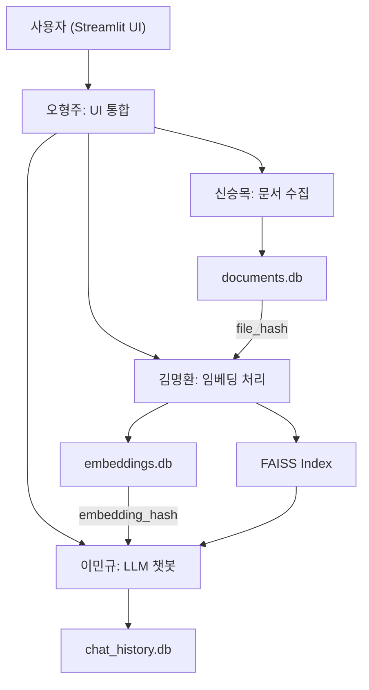
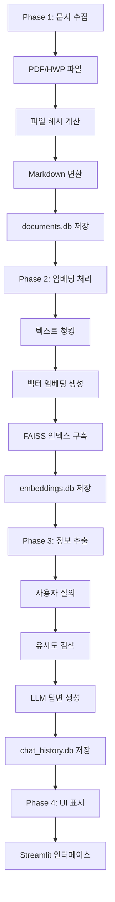
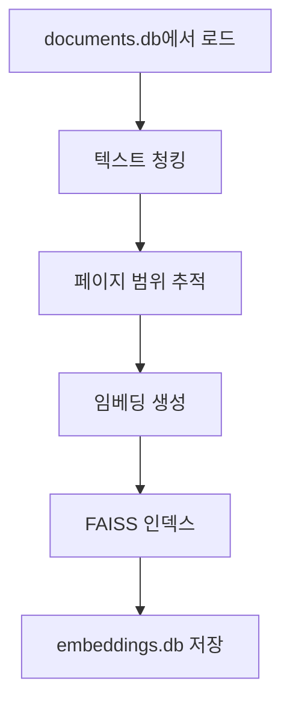
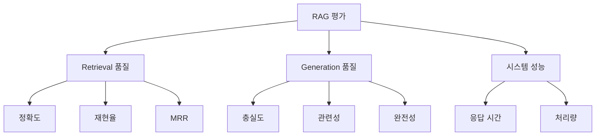
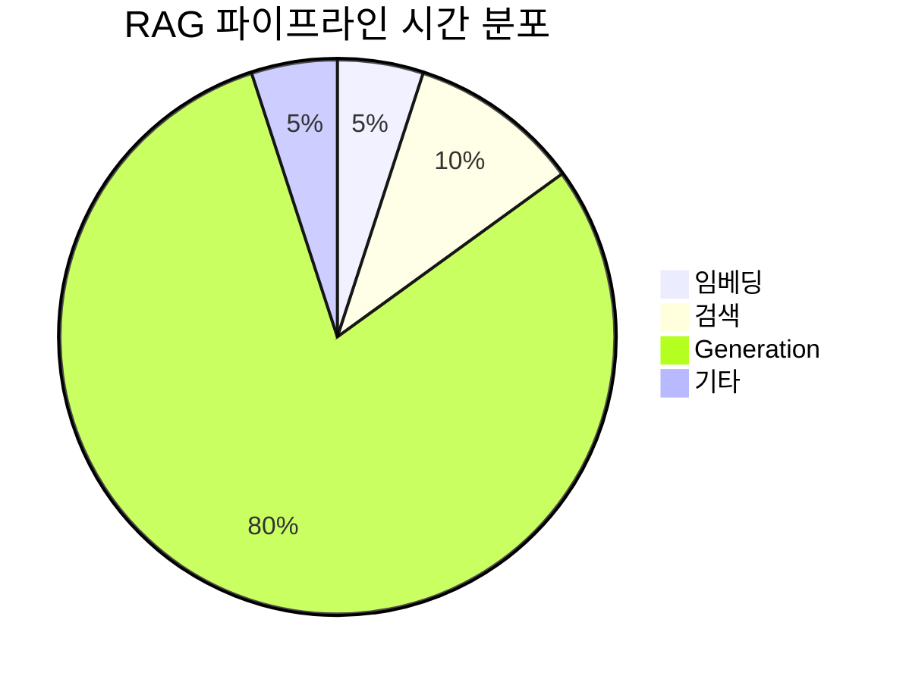
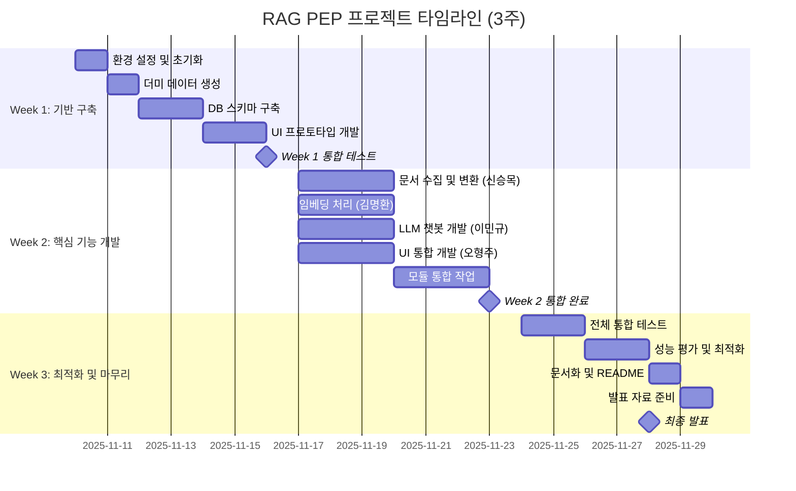

# [중급프로젝트] - RAG 시스템 기반 PEP 문서 처리 프로젝트 가이드

## 목차

1. [프로젝트 개요](#1-프로젝트-개요)
   - [1.1. 프로젝트 목표](#11-프로젝트-목표)
   - [1.2. 비즈니스 시나리오](#12-비즈니스-시나리오)
   - [1.3. 프로젝트 기간 및 일정](#13-프로젝트-기간-및-일정)
2. [기술 스택 및 아키텍처](#2-기술-스택-및-아키텍처)
   - [2.1. 시나리오 A: GCP 온프레미스 기반](#21-시나리오-a-gcp-온프레미스-기반)
   - [2.2. 시나리오 B: 클라우드 API 기반](#22-시나리오-b-클라우드-api-기반)
   - [2.3. 기술 스택 비교 분석](#23-기술-스택-비교-분석)
3. [RAG 시스템 구현 가이드](#3-rag-시스템-구현-가이드)
   - [3.1. 데이터 수집 및 전처리](#31-데이터-수집-및-전처리)
   - [3.2. 문서 청킹 전략](#32-문서-청킹-전략)
   - [3.3. 임베딩 및 벡터 DB 구축](#33-임베딩-및-벡터-db-구축)
   - [3.4. Retrieval 시스템 구현](#34-retrieval-시스템-구현)
   - [3.5. Generation 시스템 구현](#35-generation-시스템-구현)
4. [성능 평가 및 최적화](#4-성능-평가-및-최적화)
   - [4.1. 평가 지표 설계](#41-평가-지표-설계)
   - [4.2. 테스트 질문 세트 구성](#42-테스트-질문-세트-구성)
   - [4.3. 응답 속도 최적화](#43-응답-속도-최적화)
5. [협업 및 프로젝트 관리](#5-협업-및-프로젝트-관리)
   - [5.1. 역할 분담 가이드](#51-역할-분담-가이드)
   - [5.2. 협업일지 작성 방법](#52-협업-일지-작성-방법)
   - [5.3. 타임라인 관리](#53-타임라인-관리)
6. [평가 기준 및 제출 방법](#6-평가-기준-및-제출-방법)
   - [6.1. 과정 중 평가](#61-과정-중-평가)
   - [6.2. 결과 평가](#62-결과-평가)
   - [6.3. 결과물 제출 가이드](#63-결과물-제출-가이드)

---

## 1. 프로젝트 개요

### 1.1. 프로젝트 목표

본 프로젝트는 RAG(Retrieval-Augmented Generation) 시스템을 구축하여 Python Enhancement Proposals (PEP) 문서를 효과적으로 수집, 전처리, 임베딩하고, 사용자 질의에 대한 정확한 답변을 제공하는 서비스를 개발하는 것을 목표로 합니다.

**핵심 목표:**
- 4명의 팀원이 독립적인 모듈을 개발하며 협업 경험 쌓기
- 파일 해시 기반 증분 업데이트 시스템 구현
- 더미 데이터 우선 개발 전략으로 빠른 프로토타이핑
- 3개의 SQLite DB를 활용한 데이터 관리 시스템 구축
- Streamlit 기반 사용자 친화적 UI 제공

### 1.2. 비즈니스 시나리오

**Python 개발자 지원 도구:**

Python Enhancement Proposals (PEP)는 Python 언어의 새로운 기능, 개선 사항, 표준 라이브러리 변경 등을 제안하고 문서화하는 공식 문서입니다. 현재 수백 개의 PEP 문서가 존재하며, Python 개발자들이 특정 기능이나 표준을 이해하기 위해 관련 PEP를 찾고 읽는 것은 시간이 많이 소요됩니다.

**비즈니스 문제:**
- 500개 이상의 PEP 문서 존재
- 문서당 수십 페이지 분량
- 특정 기능이나 표준에 대한 정보를 찾기 위해 여러 문서를 읽어야 함
- 관련 PEP 간의 연관성 파악 어려움
- 최신 Python 버전의 변경 사항 추적 복잡

**솔루션 요구사항:**

Python 개발자가 특정 기능, 표준, 문법 등에 대한 질문을 자연어로 입력하면, 관련 PEP 문서를 검색하고 요약하여 필요한 정보를 제공하는 RAG 시스템을 구현합니다.

### 1.3. 프로젝트 기간 및 일정

- **프로젝트 기간**: 3주 (2025-11-10 ~ 2025-11-28)
- **Week 1 (11/10(월)-11/16(일))**: 프로젝트 기반 구축, DB 스키마, 더미 데이터, UI 프로토타입
- **Week 2 (11/17(월)-11/23(일))**: 핵심 기능 개발 (문서 처리, 임베딩, LLM 통합)
- **Week 3 (11/24(월)-11/28(금))**: 통합 테스트, 성능 최적화, 문서화, 발표 준비

**주요 마일스톤:**
- M1 (11/11): 프로젝트 초기 설정 완료
- M2 (11/13): DB 스키마 및 더미 데이터 완성
- M3 (11/16): UI 프로토타입 동작
- M6 (11/23): 전체 모듈 통합 완료
- M13 (11/28): 최종 발표 및 프로젝트 회고

---

## 2. 기술 스택 및 아키텍처

본 프로젝트는 4명의 팀원이 독립적으로 개발 가능한 모듈 구조를 가지며, 파일 해시값을 공통 키로 사용하여 데이터베이스 간 연결합니다.



### 2.0. 팀 역할 분담

| 역할 | 담당자 | 핵심 업무 |
|------|--------|-----------|
| 신승목 | [이름] | 문서 수집 및 원본 전처리 (PDF/HWP → Markdown 변환 및 DB 저장) |
| 김명환 | [이름] | 임베딩 처리 (Markdown → 벡터 임베딩 및 FAISS 저장) |
| 이민규 | [이름] | LLM 기반 정보 추출 및 요약 시스템 |
| 오형주 | [이름] | Streamlit UI 개발 및 통합 |

### 2.1. 데이터베이스 설계

본 프로젝트는 3개의 SQLite 데이터베이스를 사용하여 문서, 임베딩, 대화 히스토리를 관리합니다.

#### 2.1.1. 원본 문서 DB (`documents.db`)

**file_info 테이블:**
- `file_hash` (TEXT, PRIMARY KEY): 원본 파일 해시값 (SHA-256)
- `file_name` (TEXT): 파일명
- `total_pages` (INTEGER): 총 페이지 수
- `file_size` (INTEGER): 파일 크기 (bytes)
- `total_chars` (INTEGER): 총 글자 수
- `total_tokens` (INTEGER): 총 토큰 수 (GPT tokenizer 기준)
- `created_at` (TIMESTAMP): 생성 시간
- `updated_at` (TIMESTAMP): 수정 시간

**page_data 테이블:**
- `id` (INTEGER, PRIMARY KEY, AUTOINCREMENT)
- `file_hash` (TEXT, FOREIGN KEY): 파일 해시값
- `page_number` (INTEGER): 페이지 번호
- `markdown_content` (TEXT): 마크다운 변환 내용
- `token_count` (INTEGER): 페이지별 토큰 수
- `is_empty` (BOOLEAN): 빈 페이지 여부
- `created_at` (TIMESTAMP)

#### 2.1.2. 임베딩 DB (`embeddings.db`)

**embedding_meta 테이블:**
- `embedding_hash` (TEXT, PRIMARY KEY): 임베딩 설정 해시값
- `file_hash` (TEXT): 원본 파일 해시값
- `chunk_size` (INTEGER): 청킹 크기
- `chunk_overlap` (INTEGER): 청크 오버랩
- `preprocessing_option` (TEXT): 전처리 옵션 (JSON)
- `embedding_model` (TEXT): 임베딩 모델명
- `total_chunks` (INTEGER): 총 청크 수
- `vector_path` (TEXT): FAISS 인덱스 파일 경로
- `created_at` (TIMESTAMP)
- `updated_at` (TIMESTAMP)

**chunk_mapping 테이블:**
- `chunk_id` (INTEGER, PRIMARY KEY, AUTOINCREMENT)
- `embedding_hash` (TEXT, FOREIGN KEY): 임베딩 해시값
- `file_hash` (TEXT): 원본 파일 해시값
- `file_name` (TEXT): 파일명
- `start_page` (INTEGER): 시작 페이지 번호
- `end_page` (INTEGER): 종료 페이지 번호
- `chunk_text` (TEXT): 청크 텍스트
- `estimated_tokens` (INTEGER): 추정 토큰 수
- `vector_index` (INTEGER): FAISS 벡터 인덱스

#### 2.1.3. 채팅 히스토리 DB (`chat_history.db`)

**chat_sessions 테이블:**
- `session_id` (TEXT, PRIMARY KEY): 브라우저 세션 ID
- `session_name` (TEXT): 세션 이름
- `created_at` (TIMESTAMP)
- `updated_at` (TIMESTAMP)
- `is_active` (BOOLEAN): 활성 상태

**chat_messages 테이블:**
- `message_id` (INTEGER, PRIMARY KEY, AUTOINCREMENT)
- `session_id` (TEXT, FOREIGN KEY): 세션 ID
- `role` (TEXT): 역할 (user/assistant)
- `content` (TEXT): 메시지 내용
- `retrieved_chunks` (TEXT): 검색된 청크 정보 (JSON)
- `timestamp` (TIMESTAMP)

### 2.2. 기술 스택

본 프로젝트는 클라우드 API 기반으로 개발하며, 필요 시 로컬 모델로 전환 가능합니다.

| 구성 요소 | 기술 | 담당자 |
|---------|------|--------|
| 문서 처리 | PyPDF2, pdfplumber, olefile (HWP) | 신승목 |
| Markdown 변환 | Custom converter, BeautifulSoup | 신승목 |
| 토큰 계산 | tiktoken (GPT tokenizer) | 신승목 |
| 데이터베이스 | SQLite3 | 전체 팀 |
| 텍스트 청킹 | LangChain RecursiveCharacterTextSplitter | 김명환 |
| 임베딩 | OpenAI Embedding API (text-embedding-3-small) | 김명환 |
| 벡터 DB | FAISS | 김명환 |
| LLM | OpenAI API (gpt-4o-mini, gpt-4o) | 이민규 |
| 프레임워크 | LangChain | 이민규 |
| UI | Streamlit | 오형주 |
| 버전 관리 | Git/GitHub | 전체 팀 |

### 2.3. 핵심 처리 흐름



#### Phase 1: 문서 수집 및 변환 (신승목)
1. PDF/HWP 파일 수집
2. 파일 해시 (SHA-256) 계산 및 중복 확인
3. Markdown 변환 시 페이지 구분자 삽입
   - 빈 페이지: `\n--- [빈페이지] ---\n`
   - 일반 페이지: `\n\n--- 페이지 {page_num} ---\n\n`
4. 기본 전처리 (연속된 개행 정리: `\n\n\n` → `\n\n`)
5. GPT tokenizer로 토큰 수 계산
6. `documents.db`에 저장

#### Phase 2: 임베딩 처리 (김명환)
1. 마크다운 문서를 청킹 (chunk_size, chunk_overlap)
2. 임베딩 전처리 옵션 적용
   - Markdown 태그 제거 여부
   - HTML 태그 제거 여부
   - 표 구조 유지 여부
3. 파일 해시로 변경사항 감지 (증분 업데이트)
4. 벡터 임베딩 생성 및 FAISS 인덱스 구축
5. 청크별 페이지 범위 및 토큰 수 추정 저장
6. `embeddings.db` 및 FAISS 파일 저장

#### Phase 3: 정보 추출 및 요약 (이민규)
1. 사용자 질의 입력
2. 질의 임베딩 생성
3. FAISS에서 유사 청크 검색 (top-k)
4. 검색된 청크로 LLM 프롬프트 구성
5. LangChain 활용한 답변 생성
6. 대화 내역을 `chat_history.db`에 저장

#### Phase 4: UI 구현 (오형주)
**왼쪽 사이드바:**
- OpenAI API Key 입력
- 데이터 업데이트 버튼
- 임베딩 업데이트 버튼
- 채팅 세션 관리

**메인 영역:**
- 채팅 인터페이스
- 검색 결과 및 출처 표시
- 히스토리 뷰어

---

## 3. RAG 시스템 구현 가이드

### 3.0. 개발 우선순위

본 프로젝트는 **더미 데이터 우선 개발 전략**을 채택합니다.


#### Step 1: 더미 데이터 생성
- AI를 활용하여 각 DB 스키마에 맞는 더미 데이터 3세트 생성
- 실제 PEP 문서 구조를 반영한 샘플 markdown 생성

#### Step 2: DB 스키마 구축
- 3개 SQLite DB 생성 및 더미 데이터 삽입
- 각 테이블 간 관계 검증

#### Step 3: 모듈 구조 설계
- 각 기능별 클래스 및 함수 인터페이스 정의
- 모든 함수는 초기에 더미 데이터 반환

#### Step 4: UI 프로토타입
- 더미 데이터만으로 동작하는 Streamlit 앱 구현
- 실제 기능 연결 전 UI/UX 검증

#### Step 5: 기능 통합
- 각 모듈의 실제 구현체 개발
- 더미 함수를 실제 로직으로 대체
- 통합 테스트

### 3.1. 데이터 수집 및 전처리 (신승목)

#### 3.1.1. 문서 포맷 처리

**제공 데이터:**
- PEP 문서 (온라인 수집 또는 제공된 샘플)
- 문서 포맷: PDF, HTML

**핵심 요구사항:**
- 파일 해시 (SHA-256) 계산으로 중복 방지
- 페이지 단위 구분자 삽입
- 토큰 수 계산 (tiktoken 사용)

**문서 로딩 구현:**

```python
import hashlib
from pathlib import Path
import PyPDF2

def calculate_file_hash(file_path):
    """파일 SHA-256 해시 계산"""
    sha256 = hashlib.sha256()
    with open(file_path, 'rb') as f:
        while chunk := f.read(8192):
            sha256.update(chunk)
    return sha256.hexdigest()

def load_pdf(file_path):
    """PDF 파일 텍스트 추출 (페이지별)"""
    pages = []
    with open(file_path, 'rb') as file:
        reader = PyPDF2.PdfReader(file)
        for page_num, page in enumerate(reader.pages, 1):
            text = page.extract_text()
            if text.strip():
                pages.append(f"\n\n--- 페이지 {page_num} ---\n\n{text}")
            else:
                pages.append("\n--- [빈페이지] ---\n")
    return pages

def basic_preprocessing(text):
    """기본 전처리: 연속된 개행 정리"""
    import re
    text = re.sub(r'\n{3,}', '\n\n', text)
    return text.strip()
```

#### 3.1.2. 데이터베이스 저장

**documents.db 저장 구현:**

```python
import sqlite3
import tiktoken
from datetime import datetime

def save_document_to_db(file_path, db_path='data/documents.db'):
    """문서를 documents.db에 저장"""
    
    # 1. 파일 해시 계산
    file_hash = calculate_file_hash(file_path)
    
    # 2. PDF 로드 및 전처리
    pages = load_pdf(file_path)
    
    # 3. 토큰 수 계산
    encoding = tiktoken.encoding_for_model("gpt-4")
    total_tokens = 0
    page_data = []
    
    for page_num, page_text in enumerate(pages, 1):
        preprocessed = basic_preprocessing(page_text)
        token_count = len(encoding.encode(preprocessed))
        total_tokens += token_count
        
        page_data.append({
            'page_number': page_num,
            'markdown_content': preprocessed,
            'token_count': token_count,
            'is_empty': '[빈페이지]' in page_text
        })
    
    # 4. DB 저장
    conn = sqlite3.connect(db_path)
    cursor = conn.cursor()
    
    # file_info 저장
    cursor.execute("""
        INSERT OR REPLACE INTO file_info 
        (file_hash, file_name, total_pages, file_size, total_chars, total_tokens, created_at, updated_at)
        VALUES (?, ?, ?, ?, ?, ?, ?, ?)
    """, (
        file_hash,
        Path(file_path).name,
        len(pages),
        Path(file_path).stat().st_size,
        sum(len(p['markdown_content']) for p in page_data),
        total_tokens,
        datetime.now(),
        datetime.now()
    ))
    
    # page_data 저장
    for page in page_data:
        cursor.execute("""
            INSERT INTO page_data 
            (file_hash, page_number, markdown_content, token_count, is_empty, created_at)
            VALUES (?, ?, ?, ?, ?, ?)
        """, (
            file_hash,
            page['page_number'],
            page['markdown_content'],
            page['token_count'],
            page['is_empty'],
            datetime.now()
        ))
    
    conn.commit()
    conn.close()
    
    return file_hash
```

### 3.2. 문서 청킹 전략 (김명환)

#### 3.2.1. 청크 크기 최적화

**청킹의 중요성:**

청킹은 RAG 시스템의 성능에 직접적인 영향을 미칩니다. 적절한 청크 크기는 검색 정확도와 컨텍스트 품질을 결정합니다.



**고정 크기 청킹 구현:**

```python
from langchain.text_splitter import RecursiveCharacterTextSplitter
import sqlite3
import tiktoken

def load_markdown_from_db(file_hash, db_path='data/documents.db'):
    """documents.db에서 마크다운 로드"""
    conn = sqlite3.connect(db_path)
    cursor = conn.cursor()
    
    cursor.execute("""
        SELECT page_number, markdown_content 
        FROM page_data 
        WHERE file_hash = ? 
        ORDER BY page_number
    """, (file_hash,))
    
    pages = cursor.fetchall()
    conn.close()
    
    # 전체 텍스트 결합
    full_text = "\n\n".join([page[1] for page in pages])
    return full_text

def create_chunks_with_metadata(file_hash, chunk_size=1000, chunk_overlap=200):
    """청킹 with 페이지 범위 추적"""
    
    # 1. 마크다운 로드
    full_text = load_markdown_from_db(file_hash)
    
    # 2. 청킹
    text_splitter = RecursiveCharacterTextSplitter(
        chunk_size=chunk_size,
        chunk_overlap=chunk_overlap,
        length_function=len,
        separators=["\n\n", "\n", " ", ""]
    )
    
    chunks = text_splitter.split_text(full_text)
    
    # 3. 페이지 범위 추적 (페이지 구분자 기반)
    chunk_metadata = []
    encoding = tiktoken.encoding_for_model("gpt-4")
    
    for i, chunk in enumerate(chunks):
        # 페이지 번호 추출
        import re
        page_numbers = re.findall(r'--- 페이지 (\d+) ---', chunk)
        
        start_page = int(page_numbers[0]) if page_numbers else 1
        end_page = int(page_numbers[-1]) if page_numbers else start_page
        
        chunk_metadata.append({
            'chunk_id': i,
            'chunk_text': chunk,
            'start_page': start_page,
            'end_page': end_page,
            'estimated_tokens': len(encoding.encode(chunk))
        })
    
    return chunk_metadata
```

**청크 크기 가이드라인:**

| 청크 크기 | 장점 | 단점 | 권장 사용 |
|---------|------|------|---------|
| 작음 (200-500자) | 정밀한 검색, 빠른 처리 | 컨텍스트 부족 | 짧은 질문, 특정 정보 검색 |
| 중간 (500-1000자) | 균형잡힌 성능 | - | 일반적 사용 (권장) |
| 큼 (1000-2000자) | 풍부한 컨텍스트 | 검색 정확도 하락 | 요약, 전체 이해 필요 시 |

**청크 오버랩 설정:**

$$
\text{Overlap Ratio} = \frac{\text{chunk\ overlap}}{\text{chunk\ size}} \approx 10\% \sim 20\%
$$

권장 오버랩 비율은 10-20%입니다. 너무 높으면 저장 공간 낭비, 너무 낮으면 문맥 손실이 발생합니다.

#### 3.2.2. 전처리 옵션 (김명환)

**임베딩 전 전처리 전략:**

```python
import re
import json

def apply_preprocessing(text, options):
    """전처리 옵션 적용"""
    
    # Markdown 태그 제거
    if options.get('remove_markdown', False):
        text = re.sub(r'\*\*(.+?)\*\*', r'\1', text)  # Bold
        text = re.sub(r'\*(.+?)\*', r'\1', text)      # Italic
        text = re.sub(r'##?\s+(.+?)$', r'\1', text, flags=re.MULTILINE)  # Headers
    
    # HTML 태그 제거
    if options.get('remove_html', False):
        text = re.sub(r'<[^>]+>', '', text)
    
    # 페이지 구분자 제거 (임베딩 시)
    if options.get('remove_page_markers', True):
        text = re.sub(r'--- 페이지 \d+ ---', '', text)
        text = re.sub(r'--- \[빈페이지\] ---', '', text)
    
    return text.strip()

def calculate_embedding_hash(file_hash, chunk_size, chunk_overlap, preprocessing_option):
    """임베딩 설정 해시 계산"""
    import hashlib
    
    config_str = f"{file_hash}_{chunk_size}_{chunk_overlap}_{json.dumps(preprocessing_option, sort_keys=True)}"
    return hashlib.sha256(config_str.encode()).hexdigest()
```

### 3.3. 임베딩 및 벡터 DB 구축 (김명환)

#### 3.3.1. 임베딩 모델 선정

**OpenAI Embedding API 사용:**

```python
from openai import OpenAI
import numpy as np

client = OpenAI(api_key="YOUR_API_KEY")

def get_embedding(text, model="text-embedding-3-small"):
    """OpenAI 임베딩 생성"""
    text = text.replace("\n", " ")
    response = client.embeddings.create(
        input=[text],
        model=model
    )
    return response.data[0].embedding

def batch_get_embeddings(texts, model="text-embedding-3-small", batch_size=100):
    """배치 임베딩 생성"""
    embeddings = []
    
    for i in range(0, len(texts), batch_size):
        batch = texts[i:i+batch_size]
        batch_clean = [t.replace("\n", " ") for t in batch]
        
        response = client.embeddings.create(
            input=batch_clean,
            model=model
        )
        
        embeddings.extend([data.embedding for data in response.data])
    
    return embeddings
```

#### 3.3.2. FAISS 인덱스 및 embeddings.db 저장

**통합 임베딩 파이프라인:**

```python
import faiss
import numpy as np
import sqlite3
import json
from datetime import datetime

def create_and_save_embeddings(file_hash, chunk_size=1000, chunk_overlap=200, 
                                preprocessing_options=None, model="text-embedding-3-small"):
    """임베딩 생성 및 저장"""
    
    if preprocessing_options is None:
        preprocessing_options = {'remove_page_markers': True}
    
    # 1. 임베딩 해시 계산
    embedding_hash = calculate_embedding_hash(
        file_hash, chunk_size, chunk_overlap, preprocessing_options
    )
    
    # 2. 청킹
    chunk_metadata = create_chunks_with_metadata(file_hash, chunk_size, chunk_overlap)
    
    # 3. 전처리 및 임베딩 생성
    processed_texts = [
        apply_preprocessing(chunk['chunk_text'], preprocessing_options)
        for chunk in chunk_metadata
    ]
    
    embeddings = batch_get_embeddings(processed_texts, model=model)
    
    # 4. FAISS 인덱스 구축
    dimension = len(embeddings[0])
    index = faiss.IndexFlatL2(dimension)
    embeddings_np = np.array(embeddings).astype('float32')
    index.add(embeddings_np)
    
    # 5. FAISS 인덱스 저장
    faiss_path = f"data/vectorstore/faiss_{embedding_hash}.index"
    faiss.write_index(index, faiss_path)
    
    # 6. embeddings.db 저장
    conn = sqlite3.connect('data/embeddings.db')
    cursor = conn.cursor()
    
    # embedding_meta 저장
    cursor.execute("""
        INSERT OR REPLACE INTO embedding_meta
        (embedding_hash, file_hash, chunk_size, chunk_overlap, preprocessing_option,
         embedding_model, total_chunks, vector_path, created_at, updated_at)
        VALUES (?, ?, ?, ?, ?, ?, ?, ?, ?, ?)
    """, (
        embedding_hash, file_hash, chunk_size, chunk_overlap,
        json.dumps(preprocessing_options), model, len(chunk_metadata),
        faiss_path, datetime.now(), datetime.now()
    ))
    
    # chunk_mapping 저장
    # file_name은 documents.db에서 조회
    conn_doc = sqlite3.connect('data/documents.db')
    cursor_doc = conn_doc.cursor()
    cursor_doc.execute("SELECT file_name FROM file_info WHERE file_hash = ?", (file_hash,))
    file_name = cursor_doc.fetchone()[0]
    conn_doc.close()
    
    for i, chunk in enumerate(chunk_metadata):
        cursor.execute("""
            INSERT INTO chunk_mapping
            (embedding_hash, file_hash, file_name, start_page, end_page, 
             chunk_text, estimated_tokens, vector_index)
            VALUES (?, ?, ?, ?, ?, ?, ?, ?)
        """, (
            embedding_hash, file_hash, file_name,
            chunk['start_page'], chunk['end_page'],
            chunk['chunk_text'], chunk['estimated_tokens'], i
        ))
    
    conn.commit()
    conn.close()
    
    return embedding_hash
```

### 3.4. Retrieval 시스템 구현 (김명환 → 이민규)

#### 3.4.1. 기본 검색 함수

```python
import faiss
import sqlite3

def search_similar_chunks(query, embedding_hash, top_k=5):
    """유사 청크 검색"""
    
    # 1. 질의 임베딩 생성
    query_embedding = get_embedding(query)
    
    # 2. FAISS 인덱스 로드
    conn = sqlite3.connect('data/embeddings.db')
    cursor = conn.cursor()
    
    cursor.execute("""
        SELECT vector_path 
        FROM embedding_meta 
        WHERE embedding_hash = ?
    """, (embedding_hash,))
    
    faiss_path = cursor.fetchone()[0]
    index = faiss.read_index(faiss_path)
    
    # 3. 유사도 검색
    query_np = np.array([query_embedding]).astype('float32')
    distances, indices = index.search(query_np, top_k)
    
    # 4. 메타데이터 조회
    results = []
    for i, idx in enumerate(indices[0]):
        cursor.execute("""
            SELECT file_name, start_page, end_page, chunk_text
            FROM chunk_mapping
            WHERE embedding_hash = ? AND vector_index = ?
        """, (embedding_hash, int(idx)))
        
        row = cursor.fetchone()
        if row:
            results.append({
                'file_name': row[0],
                'start_page': row[1],
                'end_page': row[2],
                'chunk_text': row[3],
                'distance': float(distances[0][i])
            })
    
    conn.close()
    return results
```

#### 3.4.2. 메타데이터 필터링

**발주기관 필터링 구현:**

```python
from difflib import SequenceMatcher

def fuzzy_match(query_org, metadata_org, threshold=0.7):
    """유사도 기반 기관명 매칭"""
    similarity = SequenceMatcher(None, query_org, metadata_org).ratio()
    return similarity >= threshold

def metadata_filtered_retrieval(query, filters, vector_store, embedding_function, k=5):
    """메타데이터 필터링 검색"""
    # 1. 쿼리 임베딩 및 초기 검색
    query_embedding = embedding_function(query)
    initial_results = vector_store.search(query_embedding, k=k*3)  # 더 많이 검색
    
    # 2. 메타데이터 필터링
    filtered_results = []
    for result in initial_results:
        metadata = result['metadata']
        
        # 발주기관 필터
        if '발주기관' in filters:
            if not fuzzy_match(filters['발주기관'], metadata.get('발주기관', '')):
                continue
        
        # 예산 범위 필터
        if '최소예산' in filters and '최대예산' in filters:
            budget = metadata.get('예산', 0)
            if not (filters['최소예산'] <= budget <= filters['최대예산']):
                continue
        
        filtered_results.append(result)
        
        if len(filtered_results) >= k:
            break
    
    return filtered_results
```

#### 3.4.3. 고급 검색 기법 (심화)

**Multi-Query Retrieval:**

```python
def generate_multiple_queries(original_query, llm_function):
    """쿼리 확장"""
    prompt = f"""다음 질문을 3가지 다른 방식으로 다시 작성해주세요:
    
원본 질문: {original_query}

다시 작성된 질문들:
1."""
    
    response = llm_function(prompt)
    queries = [original_query] + response.strip().split('\n')
    return queries

def multi_query_retrieval(query, vector_store, embedding_function, llm_function, k=5):
    """다중 쿼리 검색"""
    # 1. 쿼리 확장
    queries = generate_multiple_queries(query, llm_function)
    
    # 2. 각 쿼리로 검색
    all_results = []
    for q in queries:
        results = naive_retrieval(q, vector_store, embedding_function, k=k)
        all_results.extend(results)
    
    # 3. 중복 제거 및 점수 합산
    unique_results = {}
    for result in all_results:
        doc_id = result['text'][:100]  # 간단한 ID
        if doc_id not in unique_results:
            unique_results[doc_id] = result
        else:
            # 거리(낮을수록 좋음)를 점수로 변환하여 합산
            unique_results[doc_id]['distance'] = min(
                unique_results[doc_id]['distance'],
                result['distance']
            )
    
    # 4. 점수 기준 정렬
    sorted_results = sorted(
        unique_results.values(),
        key=lambda x: x['distance']
    )[:k]
    
    return sorted_results
```

**MMR (Maximum Marginal Relevance):**

```python
import numpy as np

def calculate_similarity(emb1, emb2):
    """코사인 유사도 계산"""
    return np.dot(emb1, emb2) / (np.linalg.norm(emb1) * np.linalg.norm(emb2))

def mmr_retrieval(query, vector_store, embedding_function, k=5, lambda_param=0.5):
    """MMR 기반 다양성 검색"""
    # 1. 초기 후보 문서 검색
    query_embedding = embedding_function(query)
    candidates = vector_store.search(query_embedding, k=k*3)
    
    # 2. MMR 알고리즘
    selected = []
    candidate_embeddings = [embedding_function(c['text']) for c in candidates]
    
    while len(selected) < k and candidates:
        mmr_scores = []
        
        for i, candidate in enumerate(candidates):
            # 쿼리와의 유사도
            relevance = calculate_similarity(query_embedding, candidate_embeddings[i])
            
            # 이미 선택된 문서들과의 최대 유사도
            if selected:
                selected_embeddings = [embedding_function(s['text']) for s in selected]
                max_similarity = max(
                    calculate_similarity(candidate_embeddings[i], sel_emb)
                    for sel_emb in selected_embeddings
                )
            else:
                max_similarity = 0
            
            # MMR 점수 계산
            mmr_score = lambda_param * relevance - (1 - lambda_param) * max_similarity
            mmr_scores.append(mmr_score)
        
        # 최고 점수 문서 선택
        best_idx = np.argmax(mmr_scores)
        selected.append(candidates.pop(best_idx))
        candidate_embeddings.pop(best_idx)
    
    return selected
```

### 3.5. Generation 시스템 구현 (이민규)

#### 3.5.1. LLM 답변 생성

**OpenAI API 사용:**

```python
from openai import OpenAI
import sqlite3
from datetime import datetime

client = OpenAI(api_key="YOUR_API_KEY")

def generate_response(query, session_id, embedding_hash, model="gpt-4o-mini", top_k=5):
    """RAG 기반 답변 생성"""
    
    # 1. 유사 청크 검색
    retrieved_chunks = search_similar_chunks(query, embedding_hash, top_k=top_k)
    
    # 2. 컨텍스트 구성
    context = "\n\n---\n\n".join([
        f"[{chunk['file_name']} (페이지 {chunk['start_page']}-{chunk['end_page']})]\n{chunk['chunk_text']}"
        for chunk in retrieved_chunks
    ])
    
    # 3. 프롬프트 생성
    prompt = f"""다음 PEP 문서 내용을 바탕으로 질문에 답변해주세요.

문서 내용:
{context}

질문: {query}

답변:"""
    
    # 4. LLM 호출
    response = client.chat.completions.create(
        model=model,
        messages=[
            {"role": "system", "content": "당신은 Python PEP 문서 분석 전문가입니다."},
            {"role": "user", "content": prompt}
        ],
        temperature=0.3,
        max_tokens=1000
    )
    
    answer = response.choices[0].message.content
    
    # 5. chat_history.db 저장
    save_chat_message(session_id, query, answer, retrieved_chunks)
    
    return {
        'answer': answer,
        'sources': retrieved_chunks
    }

def save_chat_message(session_id, query, answer, retrieved_chunks):
    """대화 내역 저장"""
    import json
    
    conn = sqlite3.connect('data/chat_history.db')
    cursor = conn.cursor()
    
    # 사용자 메시지 저장
    cursor.execute("""
        INSERT INTO chat_messages (session_id, role, content, retrieved_chunks, timestamp)
        VALUES (?, ?, ?, ?, ?)
    """, (session_id, 'user', query, None, datetime.now()))
    
    # 어시스턴트 메시지 저장
    cursor.execute("""
        INSERT INTO chat_messages (session_id, role, content, retrieved_chunks, timestamp)
        VALUES (?, ?, ?, ?, ?)
    """, (session_id, 'assistant', answer, json.dumps(retrieved_chunks), datetime.now()))
    
    conn.commit()
    conn.close()
```

#### 3.5.2. 프롬프트 엔지니어링

**프롬프트 구조:**

```python
def create_rag_prompt(context, query, instruction=None):
    """RAG 프롬프트 생성"""
    
    base_instruction = """당신은 RFP(제안요청서) 문서 분석 전문가입니다.
주어진 문서 내용을 정확하게 분석하여 질문에 답변해주세요.

중요 지침:
1. 문서에 명시된 내용만을 기반으로 답변하세요.
2. 문서에 없는 내용은 "문서에서 해당 정보를 찾을 수 없습니다"라고 명확히 밝히세요.
3. 핵심 요구사항, 예산, 기한 등 중요 정보는 누락 없이 포함하세요.
4. 답변은 명확하고 간결하게 작성하세요."""
    
    if instruction:
        base_instruction += f"\n{instruction}"
    
    prompt = f"""{base_instruction}

===== 문서 내용 =====
{context}

===== 질문 =====
{query}

===== 답변 =====
"""
    
    return prompt
```

**스타일별 프롬프트 변형:**

```python
# 요약형 답변
summary_instruction = "답변은 3-5개의 핵심 포인트로 요약하여 제시하세요."

# 상세형 답변
detailed_instruction = "각 항목에 대해 문서의 구체적인 내용을 인용하여 상세히 설명하세요."

# 비교형 답변
comparison_instruction = "여러 문서의 내용을 비교하여 공통점과 차이점을 명확히 제시하세요."
```

**텍스트 생성 파라미터 조정:**

| 파라미터 | 권장 값 | 효과 |
|---------|--------|------|
| temperature | 0.1-0.3 | 낮을수록 일관성 높음 (정확한 정보 추출에 적합) |
| top_p | 0.9-0.95 | 다양성과 정확성의 균형 |
| max_tokens | 500-1500 | 답변 길이 제한 (비용 최적화) |

$$
P(w_i | w_1, ..., w_{i-1}) = \text{softmax}\left(\frac{z_i}{T}\right)
$$

여기서 $T$는 temperature입니다. 낮은 temperature는 확률 분포를 더 뾰족하게 만들어 높은 확률의 단어를 선택하게 합니다.

#### 3.5.3. 대화 컨텍스트 유지

**대화 히스토리 관리:**

```python
class ConversationManager:
    def __init__(self, max_history=5):
        """대화 관리자 초기화"""
        self.max_history = max_history
        self.history = []
        self.current_context = None
    
    def add_turn(self, query, response, context=None):
        """대화 턴 추가"""
        self.history.append({
            'query': query,
            'response': response,
            'context': context
        })
        
        # 히스토리 길이 제한
        if len(self.history) > self.max_history:
            self.history.pop(0)
    
    def get_context_with_history(self, current_query, current_context):
        """히스토리를 포함한 컨텍스트 생성"""
        # 이전 대화 요약
        history_summary = ""
        if self.history:
            history_summary = "\n\n===== 이전 대화 내용 =====\n"
            for turn in self.history[-3:]:  # 최근 3개만
                history_summary += f"Q: {turn['query']}\nA: {turn['response'][:200]}...\n\n"
        
        # 현재 컨텍스트와 결합
        full_context = history_summary + f"\n\n===== 현재 관련 문서 =====\n{current_context}"
        
        return full_context
    
    def detect_follow_up(self, query):
        """후속 질문 감지"""
        follow_up_keywords = ['더', '또', '그럼', '이어서', '추가로', '그리고']
        pronoun_keywords = ['이', '그', '저', '해당', '위']
        
        is_follow_up = any(keyword in query for keyword in follow_up_keywords + pronoun_keywords)
        
        return is_follow_up
```

**후속 질문 처리:**

```python
def handle_query(query, conversation_manager, vector_store, embedding_function, llm_function):
    """쿼리 처리 (후속 질문 고려)"""
    
    # 1. 후속 질문 감지
    is_follow_up = conversation_manager.detect_follow_up(query)
    
    # 2. 검색 전략 결정
    if is_follow_up and conversation_manager.history:
        # 이전 컨텍스트 재사용 또는 확장 검색
        last_context = conversation_manager.history[-1]['context']
        
        # 쿼리 확장 (이전 질문 참조)
        last_query = conversation_manager.history[-1]['query']
        expanded_query = f"{last_query} {query}"
        
        # 검색
        results = naive_retrieval(expanded_query, vector_store, embedding_function, k=3)
        
        # 이전 컨텍스트와 결합
        all_contexts = [last_context] + [r['text'] for r in results]
        context = "\n\n---\n\n".join(all_contexts)
    else:
        # 새로운 질문
        results = naive_retrieval(query, vector_store, embedding_function, k=5)
        context = "\n\n---\n\n".join([r['text'] for r in results])
    
    # 3. 히스토리 포함 컨텍스트 생성
    full_context = conversation_manager.get_context_with_history(query, context)
    
    # 4. 응답 생성
    response = llm_function(full_context, query)
    
    # 5. 대화 히스토리 업데이트
    conversation_manager.add_turn(query, response, context)
    
    return response
```

---

## 4. 성능 평가 및 최적화

### 4.1. 평가 지표 설계

**RAG 시스템 평가 차원:**



#### 4.1.1. Retrieval 평가 지표

**Precision@K (정밀도):**

$$
\text{Precision@K} = \frac{\text{관련 문서 수 in Top-K}}{\text{K}}
$$

```python
def calculate_precision_at_k(retrieved_docs, relevant_docs, k=5):
    """Precision@K 계산"""
    top_k = retrieved_docs[:k]
    relevant_count = sum(1 for doc in top_k if doc in relevant_docs)
    return relevant_count / k
```

**Recall@K (재현율):**

$$
\text{Recall@K} = \frac{\text{관련 문서 수 in Top-K}}{\text{전체 관련 문서 수}}
$$

**MRR (Mean Reciprocal Rank):**

$$
\text{MRR} = \frac{1}{|Q|} \sum_{i=1}^{|Q|} \frac{1}{\text{rank}_i}
$$

```python
def calculate_mrr(retrieved_docs_list, relevant_docs_list):
    """MRR 계산"""
    reciprocal_ranks = []
    
    for retrieved, relevant in zip(retrieved_docs_list, relevant_docs_list):
        for rank, doc in enumerate(retrieved, 1):
            if doc in relevant:
                reciprocal_ranks.append(1.0 / rank)
                break
        else:
            reciprocal_ranks.append(0.0)
    
    return sum(reciprocal_ranks) / len(reciprocal_ranks)
```

#### 4.1.2. Generation 평가 지표

**답변 품질 평가 기준:**

| 기준 | 설명 | 평가 방법 |
|------|------|---------|
| 충실도 (Faithfulness) | 문서 내용에 충실한가? | LLM 기반 평가 또는 인간 평가 |
| 관련성 (Relevance) | 질문에 적합한 답변인가? | 의미 유사도, 인간 평가 |
| 완전성 (Completeness) | 필요한 정보를 모두 포함하는가? | 체크리스트 기반 평가 |
| 정확성 (Accuracy) | 사실 오류가 없는가? | 인간 평가, 자동 검증 |

**LLM 기반 자동 평가:**

```python
def evaluate_faithfulness(context, response, llm_function):
    """충실도 평가"""
    prompt = f"""다음 문서와 답변을 평가해주세요.

문서:
{context}

답변:
{response}

위 답변이 문서 내용에 충실한지 1-5점으로 평가하고, 그 이유를 설명해주세요.
점수가 낮다면 어떤 부분이 문제인지 구체적으로 지적해주세요.

평가:
점수: 
이유:"""
    
    evaluation = llm_function(prompt)
    
    return evaluation

def evaluate_relevance(query, response, llm_function):
    """관련성 평가"""
    prompt = f"""다음 질문과 답변의 관련성을 평가해주세요.

질문: {query}

답변: {response}

위 답변이 질문에 얼마나 적합한지 1-5점으로 평가하고, 그 이유를 설명해주세요.

평가:
점수:
이유:"""
    
    evaluation = llm_function(prompt)
    
    return evaluation
```

#### 4.1.3. 통합 평가 파이프라인

```python
class RAGEvaluator:
    def __init__(self, vector_store, embedding_function, llm_function):
        """RAG 평가기 초기화"""
        self.vector_store = vector_store
        self.embedding_function = embedding_function
        self.llm_function = llm_function
    
    def evaluate_single_query(self, query, ground_truth_docs, ground_truth_answer):
        """단일 쿼리 평가"""
        # 1. Retrieval
        retrieved = naive_retrieval(query, self.vector_store, self.embedding_function, k=5)
        retrieved_texts = [r['text'] for r in retrieved]
        
        # 2. Generation
        context = "\n\n---\n\n".join(retrieved_texts)
        response = self.llm_function(context, query)
        
        # 3. 평가
        retrieval_precision = calculate_precision_at_k(retrieved_texts, ground_truth_docs, k=5)
        
        faithfulness = evaluate_faithfulness(context, response, self.llm_function)
        relevance = evaluate_relevance(query, response, self.llm_function)
        
        return {
            'query': query,
            'retrieved': retrieved_texts,
            'response': response,
            'retrieval_precision': retrieval_precision,
            'faithfulness': faithfulness,
            'relevance': relevance
        }
    
    def evaluate_test_set(self, test_queries):
        """테스트 세트 전체 평가"""
        results = []
        
        for test_case in test_queries:
            result = self.evaluate_single_query(
                test_case['query'],
                test_case.get('ground_truth_docs', []),
                test_case.get('ground_truth_answer', '')
            )
            results.append(result)
        
        return results
```

### 4.2. 테스트 질문 세트 구성

#### 4.2.1. 질문 유형 분류

**질문 유형별 예시:**

| 유형 | 설명 | 예시 질문 |
|------|------|---------|
| 단일 정보 추출 | 특정 정보 하나를 찾는 질문 | "국민연금공단의 이러닝시스템 사업 예산은?" |
| 복합 정보 추출 | 여러 정보를 종합하는 질문 | "국민연금공단 이러닝시스템 사업의 요구사항을 정리해 줘" |
| 후속 질문 | 이전 질문을 참조하는 질문 | "콘텐츠 개발 관리 요구사항에 대해 더 자세히 알려 줘" |
| 비교 질문 | 여러 문서를 비교하는 질문 | "고려대와 광주과기원의 시스템 사업을 비교해 줘" |
| 부정 질문 | 문서에 없는 내용을 묻는 질문 | "기초과학연구원 사업에 AI 예측 요구사항이 있나?" |

#### 4.2.2. 테스트 질문 세트 예시

```python
test_queries = [
    # 단일 정보 추출
    {
        'query': '국민연금공단이 발주한 이러닝시스템 사업의 예산은 얼마인가?',
        'type': 'single_info',
        'expected_info': ['예산'],
        'difficulty': 'easy'
    },
    
    # 복합 정보 추출
    {
        'query': '국민연금공단이 발주한 이러닝시스템 관련 사업 요구사항을 정리해 줘.',
        'type': 'complex_info',
        'expected_info': ['요구사항', '목적', '범위'],
        'difficulty': 'medium'
    },
    
    # 후속 질문
    {
        'query': '콘텐츠 개발 관리 요구 사항에 대해서 더 자세히 알려 줘.',
        'type': 'follow_up',
        'requires_context': True,
        'difficulty': 'medium'
    },
    
    # 비교 질문
    {
        'query': '고려대학교 차세대 포털 시스템 사업이랑 광주과학기술원의 학사 시스템 기능개선 사업을 비교해 줄래?',
        'type': 'comparison',
        'expected_info': ['공통점', '차이점'],
        'difficulty': 'hard'
    },
    
    # 부정 질문 (문서에 없는 내용)
    {
        'query': '기초과학연구원 극저온시스템 사업 요구에서 AI 기반 예측에 대한 요구사항이 있나?',
        'type': 'negative',
        'expected_response': '문서에서 찾을 수 없습니다',
        'difficulty': 'medium'
    },
    
    # 교차 문서 질문
    {
        'query': '교육이나 학습 관련해서 다른 기관이 발주한 사업은 없나?',
        'type': 'cross_document',
        'expected_info': ['여러 기관', '사업 목록'],
        'difficulty': 'hard'
    }
]
```

### 4.3. 응답 속도 최적화

#### 4.3.1. 병목 구간 분석

```python
import time

def profile_rag_pipeline(query, vector_store, embedding_function, llm_function):
    """RAG 파이프라인 프로파일링"""
    times = {}
    
    # 1. 임베딩 시간
    start = time.time()
    query_embedding = embedding_function(query)
    times['embedding'] = time.time() - start
    
    # 2. 검색 시간
    start = time.time()
    results = vector_store.search(query_embedding, k=5)
    times['retrieval'] = time.time() - start
    
    # 3. 컨텍스트 준비
    start = time.time()
    context = "\n\n---\n\n".join([r['text'] for r in results])
    times['context_preparation'] = time.time() - start
    
    # 4. Generation 시간
    start = time.time()
    response = llm_function(context, query)
    times['generation'] = time.time() - start
    
    times['total'] = sum(times.values())
    
    return times, response
```

**일반적인 시간 분포:**



#### 4.3.2. 최적화 전략

**1. 임베딩 캐싱:**

```python
from functools import lru_cache

@lru_cache(maxsize=1000)
def cached_embedding(text):
    """임베딩 캐싱"""
    return embedding_function(text)
```

**2. 배치 임베딩:**

```python
def batch_embed_documents(texts, embedding_function, batch_size=32):
    """배치 임베딩 생성"""
    embeddings = []
    
    for i in range(0, len(texts), batch_size):
        batch = texts[i:i+batch_size]
        batch_embeddings = embedding_function(batch)  # API에 따라 구현
        embeddings.extend(batch_embeddings)
    
    return embeddings
```

**3. 비동기 처리:**

```python
import asyncio
from concurrent.futures import ThreadPoolExecutor

async def async_rag_pipeline(queries, vector_store, embedding_function, llm_function):
    """비동기 RAG 파이프라인"""
    
    async def process_single_query(query):
        # 각 쿼리를 비동기로 처리
        loop = asyncio.get_event_loop()
        with ThreadPoolExecutor() as executor:
            # 임베딩
            embedding = await loop.run_in_executor(executor, embedding_function, query)
            
            # 검색
            results = await loop.run_in_executor(
                executor,
                vector_store.search,
                embedding,
                5
            )
            
            # Generation
            context = "\n\n---\n\n".join([r['text'] for r in results])
            response = await loop.run_in_executor(
                executor,
                llm_function,
                context,
                query
            )
            
            return response
    
    # 모든 쿼리 병렬 처리
    responses = await asyncio.gather(*[process_single_query(q) for q in queries])
    
    return responses
```

**4. 인덱스 최적화 (FAISS):**

```python
import faiss

def create_optimized_index(embeddings, use_gpu=True):
    """최적화된 FAISS 인덱스 생성"""
    dimension = len(embeddings[0])
    
    # IVF (Inverted File Index) 사용
    nlist = 100  # 클러스터 수
    quantizer = faiss.IndexFlatL2(dimension)
    index = faiss.IndexIVFFlat(quantizer, dimension, nlist)
    
    # 학습
    embeddings_np = np.array(embeddings).astype('float32')
    index.train(embeddings_np)
    index.add(embeddings_np)
    
    # GPU 사용 (선택)
    if use_gpu and faiss.get_num_gpus() > 0:
        index = faiss.index_cpu_to_gpu(faiss.StandardGpuResources(), 0, index)
    
    return index
```

**성능 목표:**

| 단계 | 목표 시간 | 최적화 방법 |
|------|----------|-----------|
| 임베딩 | < 100ms | 캐싱, 배치 처리 |
| 검색 | < 200ms | 인덱스 최적화, GPU 활용 |
| Generation | < 3s | 모델 선택, 토큰 제한 |
| **전체** | **< 3.5s** | 비동기 처리, 병렬화 |

---

## 5. 협업 및 프로젝트 관리

### 5.1. 역할 분담 가이드

**팀 역할 구조:**

| 역할 | 담당자 | 핵심 업무 | 주요 산출물 |
|------|--------|-----------|------------|
| 신승목 | [이름] | 문서 수집 및 원본 전처리 | documents.db, 변환 스크립트 |
| 김명환 | [이름] | 임베딩 처리 및 검색 | embeddings.db, FAISS 인덱스, 검색 API |
| 이민규 | [이름] | LLM 챗봇 및 대화 관리 | chat_history.db, RAG 파이프라인 |
| 오형주 | [이름] | UI 개발 및 통합 | Streamlit 앱, 통합 테스트 |

**모듈 간 인터페이스:**


**협업 원칙:**
1. **파일 해시 중심 설계**: 모든 모듈은 file_hash로 연결
2. **독립적 개발**: 각 개발자는 자신의 DB만 관리
3. **더미 우선 개발**: UI와 로직을 병렬 개발
4. **주간 통합 미팅**: 모듈 간 연동 확인
5. **코드 리뷰**: 주 2회 페어 프로그래밍

### 5.2. 협업일지 작성 방법

**협업일지 구조 (docs/협업일지/[이름]/Day_N.md):**

```markdown
# [날짜] 협업일지 - [이름]

## 오늘의 목표
- [ ] 목표 1
- [ ] 목표 2

## 진행 상황

### 완료한 작업
1. [구체적인 작업 내용]
   - 관련 파일: [파일 경로]
   - 결과: [성과 설명]

### 진행 중인 작업
- [작업 내용] (진행률: 50%)

### 블로커
- [문제 상황]
- [시도한 해결 방법]

## 팀 기여
- [팀원 지원 내역]
- [코드 리뷰 참여]

## 학습 내용
- [새로 배운 기술/지식]

## 내일 계획
- [진행할 작업]
```

### 5.3. 타임라인 관리

**프로젝트 일정 (3주, 2025-11-10 ~ 2025-11-28):**



**3주 일정 요약:**

| 주차 | 기간 | 주요 목표 | 마일스톤 |
|------|------|-----------|---------|
| Week 1 | 11/10(월)-11/16(일) | 프로젝트 기반 구축 | M1-M3: 초기 설정, DB, UI 프로토타입 |
| Week 2 | 11/17(월)-11/23(일) | 핵심 기능 개발 | M4-M6: 문서 처리, 임베딩, LLM 통합 |
| Week 3 | 11/24(월)-11/28(금) | 통합, 테스트, 배포 | M7-M13: 통합, 최적화, 문서화, 발표 |

**주간 체크리스트는 [프로젝트 체크리스트](./프로젝트_체크리스트.md) 참조**

---

## 6. 평가 기준 및 제출 방법

### 6.1. 과정 중 평가

**평가 항목:**

| 항목 | 평가 기준 |
|------|---------|
| 적극성 | 질문, 제안, 실험 등 능동적 참여도 |
| 문제 해결 능력 | 기술적 이슈 해결 과정 및 결과 |
| 의사소통 능력 | 팀원과의 소통, 피드백 제공 |
| 협업 태도 | 팀 기여도, 일정 준수 |

### 6.2. 결과 평가

#### 팀 단위 평가

| 평가 항목 | 세부 기준 |
|---------|---------|
| 프로젝트 기획 | 주제 적합성, 요구사항 이해도 |
| 시스템 설계 | DB 설계, 모듈 구조, 파일 해시 기반 연결 |
| 구현 완성도 | 4개 모듈 통합, 기능 동작 여부 |
| 코드 품질 | 가독성, 문서화, 재현성 |
| 성능 | 문서 처리 속도, 검색 정확도, 답변 품질 |
| 발표 | 논리적 흐름, 핵심 전달력, 데모 |

#### 개인 단위 평가

| 평가 항목 | 세부 기준 |
|---------|---------|
| 담당 모듈 완성도 | 개발자별 모듈 구현 품질 |
| 협업일지 | 작성 완성도, 구체성, 성찰 |
| 팀 기여도 | 타 모듈 지원, 코드 리뷰 참여 |
| 발표 참여 | 발표 또는 질의응답 기여 |

### 6.3. 결과물 제출 가이드

#### 제출 항목

**1. GitHub Repository (팀 단위)**
- `README.md`: 프로젝트 개요, 설치 및 실행 방법
- 소스 코드 (src/, scripts/)
- DB 스키마 (SQL 파일)
- `requirements.txt`
- `.gitignore` (API 키 제외 확인)

**2. 보고서 (팀 단위)**
- 프로젝트 개요 및 목표
- 시스템 아키텍처 (3개 DB, 4개 모듈)
- 구현 상세 (개발자별 담당 모듈)
- 성능 평가 결과
- 의사 결정 과정
- 개선 방향 및 한계점

**3. 협업일지 (개인 단위)**
- docs/협업일지/[이름]/ 폴더
- 매일 작성된 일지 파일

#### 보안 체크리스트

- [ ] API 키가 코드에 하드코딩되지 않음
- [ ] `.env` 파일이 `.gitignore`에 포함
- [ ] 민감한 데이터가 제거됨

---

## Glossary (용어 목록)

| 영문 용어 | 한글 설명 |
|----------|---------|
| RAG (Retrieval-Augmented Generation) | 검색 증강 생성. 외부 지식을 검색하여 언어 모델의 생성 품질을 향상시키는 기법 |
| PEP (Python Enhancement Proposal) | Python 개선 제안서. Python 언어의 새로운 기능, 개선 사항을 제안하고 문서화하는 공식 문서 |
| Embedding | 임베딩. 텍스트를 고차원 벡터로 변환하는 과정 또는 그 결과물 |
| Vector Database | 벡터 데이터베이스. 벡터 형태의 데이터를 효율적으로 저장하고 검색하기 위한 데이터베이스 |
| Chunking | 청킹. 긴 문서를 작은 단위로 분할하는 과정 |
| Retrieval | 검색. 쿼리와 관련된 문서나 정보를 찾아오는 과정 |
| Generation | 생성. 언어 모델을 사용하여 텍스트를 생성하는 과정 |
| LLM (Large Language Model) | 대규모 언어 모델. GPT, Claude 등 대량의 텍스트 데이터로 학습된 언어 모델 |
| File Hash | 파일 해시. 파일의 내용을 기반으로 계산된 고유 식별자 (SHA-256 등) |
| Embedding Hash | 임베딩 해시. 임베딩 설정(chunk_size, overlap 등)을 기반으로 계산된 고유 식별자 |
| SQLite | 경량 데이터베이스. 파일 기반 관계형 데이터베이스 |
| FAISS (Facebook AI Similarity Search) | 페이스북에서 개발한 효율적인 유사도 검색 라이브러리 |
| Token | 토큰. 텍스트를 모델이 처리할 수 있는 최소 단위로 분할한 것 |
| tiktoken | OpenAI의 토큰화 라이브러리. GPT 모델의 토큰 수를 계산 |
| Cosine Similarity | 코사인 유사도. 두 벡터 간 각도의 코사인 값으로 유사도를 측정하는 방법 |
| Top-K | 상위 K개. 유사도가 높은 상위 K개의 결과를 선택하는 방식 |
| Temperature | 온도. 텍스트 생성 시 랜덤성을 조절하는 파라미터 (낮을수록 일관적) |
| Streamlit | Python 기반 웹 애플리케이션 프레임워크 |
| LangChain | LLM 애플리케이션 개발을 위한 프레임워크 |

---

## 참고 문서

- [RAG 기반 PEP 문서 처리 시스템 설계서](./RAG_기반_PEP_문서_처리_시스템_설계서.md)
- [프로젝트 체크리스트](./프로젝트_체크리스트.md)
- [개발자별 체크리스트](./개발자별_체크리스트A.md)

---

**문서 버전**: 2.0  
**최종 수정일**: 2025-11-08  
**작성자**: 코드잇 AI 4기 김명환