# RAG 기반 PEP 문서 처리 시스템 아키텍처 설계서

> 본 문서는 **Mermaid 다이어그램**과 **LaTeX 수식**을 포함합니다.
> GitHub Pages에서 최적으로 렌더링되며, 시스템 구조를 시각적으로 이해하기 쉽게 작성되었습니다.

## 📋 목차
1. [시스템 개요](#시스템-개요)
2. [전체 아키텍처](#전체-아키텍처)
3. [모듈 구조](#모듈-구조)
4. [데이터 흐름](#데이터-흐름)
5. [핵심 컴포넌트](#핵심-컴포넌트)
6. [기술 스택](#기술-스택)
7. [디렉토리 구조](#디렉토리-구조)

---

## 시스템 개요

### 목적
PDF/HWP 형태의 PEP(공공데이터 포털) 문서를 수집하고, RAG(Retrieval-Augmented Generation) 기술을 활용하여 사용자 질의에 대한 정확한 답변을 제공하는 시스템

### 주요 기능
- PDF 문서 텍스트 추출 및 페이지별 관리
- 문서 청킹 및 벡터 임베딩 생성
- 통합 FAISS 인덱스 기반 유사도 검색 (파일명, 페이지 번호 포함)
- LangChain 기반 RAG 답변 생성
- Streamlit 기반 대화형 UI
- 채팅 히스토리 관리

### 핵심 설계 원칙
- **모듈화**: 각 기능별 독립적인 모듈 구성
- **확장성**: 새로운 문서 타입 및 모델 추가 용이
- **추적성**: 파일 해시 기반 데이터 추적
- **효율성**: 캐싱 및 증분 업데이트 지원

---

## 전체 아키텍처

### 시스템 아키텍처 다이어그램

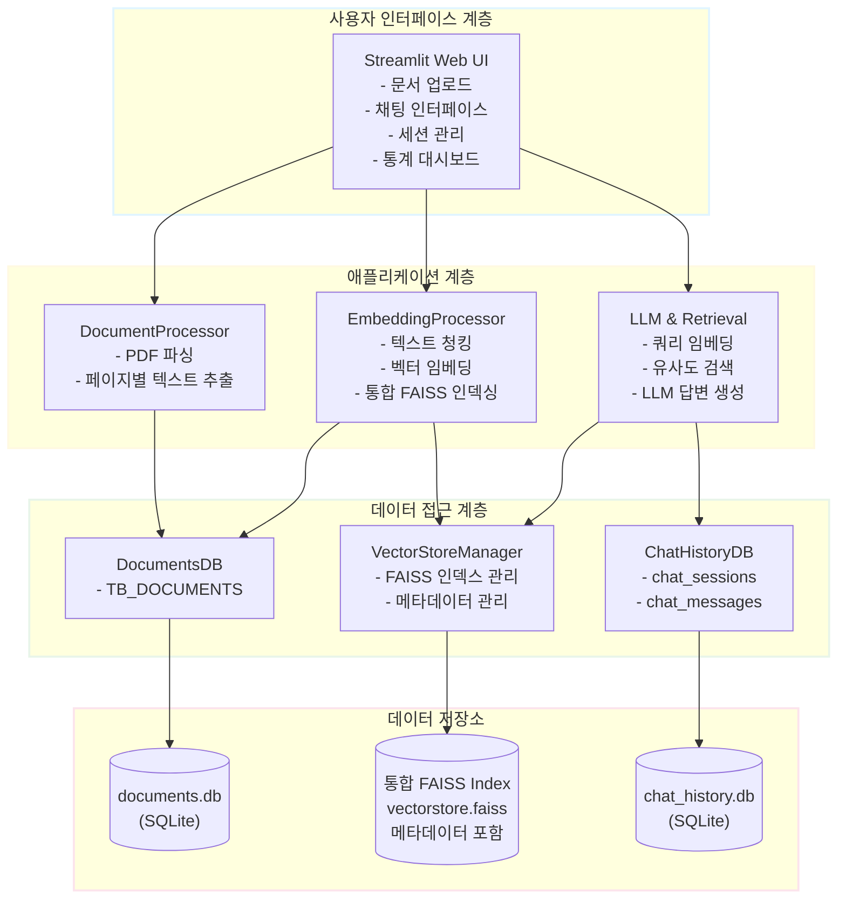

### 계층별 역할

#### 1. 사용자 인터페이스 계층 (UI Layer)
- **책임**: 사용자와의 상호작용
- **구성요소**: Streamlit 기반 웹 애플리케이션
- **주요 기능**:
  - 문서 업로드 및 처리 트리거
  - 채팅 인터페이스 제공
  - 세션 관리
  - 실시간 통계 표시

#### 2. 애플리케이션 계층 (Application Layer)
- **책임**: 비즈니스 로직 처리
- **구성요소**:
  - DocumentProcessor: 문서 변환 및 저장
  - EmbeddingProcessor: 임베딩 생성 및 인덱싱
  - Retrieval: 검색 기능
  - LLMProcessor: 답변 생성

#### 3. 데이터 접근 계층 (Data Access Layer)
- **책임**: 데이터베이스 CRUD 연산 및 벡터 인덱스 관리
- **구성요소**:
  - DocumentsDB: 문서 텍스트 콘텐츠 관리
  - VectorStoreManager: FAISS 인덱스 및 메타데이터 통합 관리
  - ChatHistoryDB: 채팅 세션 및 메시지 관리

#### 4. 데이터 저장소 계층 (Data Storage Layer)
- **책임**: 영구 데이터 저장
- **구성요소**:
  - SQLite 데이터베이스 (2개: documents.db, chat_history.db)
  - FAISS 벡터 인덱스 파일 (메타데이터 포함)

---

## 모듈 구조

### 1. 문서 처리 모듈 (Document Processing Module)

#### 위치
```
src/processors/document_processor.py
```

#### 클래스: DocumentProcessor

**주요 메서드**:
```python
class DocumentProcessor:
    def __init__(self, db_path: str = 'data/documents.db')
    def calculate_file_hash(self, file_path: Path) -> str
    def process_pdf(self, pdf_path: str) -> Optional[str]
```

**처리 흐름**:

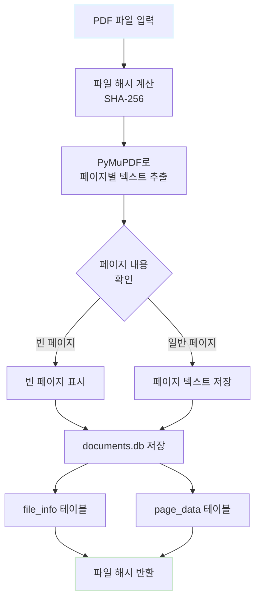

**의존성**:
- PyMuPDF (pymupdf): PDF 파싱
- DocumentsDB: 데이터 저장

---

### 2. 임베딩 처리 모듈 (Embedding Processing Module)

#### 위치
```
src/processors/embedding_processor.py
```

#### 클래스: EmbeddingProcessor

**주요 메서드**:
```python
class EmbeddingProcessor:
    def __init__(
        self,
        config=None
    )
    def process_document(self, file_hash: str, api_key: Optional[str] = None) -> bool
```

**주요 속성**:
- `vector_manager`: VectorStoreManager 인스턴스
- `docs_db`: DocumentsDB 인스턴스
- `text_splitter`: RecursiveCharacterTextSplitter 인스턴스

**처리 흐름**:

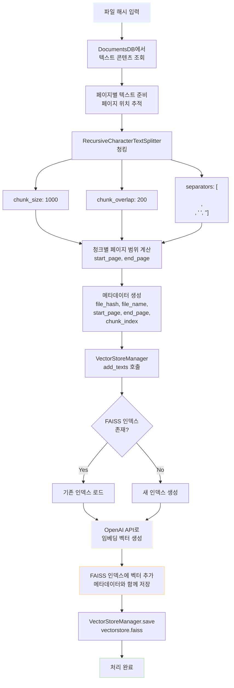

**통합 FAISS 관리 특징**:
- **단일 인덱스**: 모든 문서의 임베딩을 하나의 FAISS 인덱스에 저장
- **메타데이터 통합**: Document.metadata에 파일명, 페이지 번호, 청크 정보 모두 저장
- **증분 업데이트**: 새 문서 추가 시 기존 인덱스에 벡터 추가
- **통합 검색**: 전체 문서를 대상으로 한 번에 유사도 검색
- **별도 DB 불필요**: EmbeddingsDB 제거, FAISS 내부 메타데이터만 사용

**의존성**:
- LangChain: 텍스트 분할 및 임베딩
- FAISS: 벡터 인덱싱 및 메타데이터 저장
- OpenAI API: 임베딩 생성
- VectorStoreManager: FAISS 인덱스 관리
- DocumentsDB: 원본 문서 텍스트 관리

---

### 3. 검색 모듈 (Retrieval Module)

#### 위치
```
src/llm/retrieval.py
```

#### 클래스: Retrieval

**주요 메서드**:
```python
class Retrieval:
    def __init__(
        self,
        embedding_model: str = "text-embedding-3-small",
        vector_path: str = "data/vectorstore/vectorstore.faiss"
    )
    def search(
        self,
        query: str,
        top_k: int = 5,
        api_key: Optional[str] = None
    ) -> List[Dict[str, Any]]
```

**검색 흐름**:

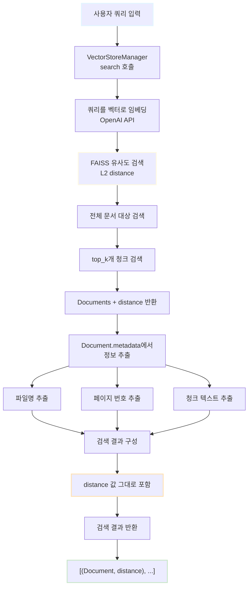

**검색 결과 구조**:
```python
# VectorStoreManager.search() 반환값
List[Tuple[Document, float]]

# Document 구조
Document(
    page_content=str,        # 청크 텍스트
    metadata={
        'file_name': str,    # 파일명
        'file_hash': str,    # 파일 해시
        'start_page': int,   # 시작 페이지 번호
        'end_page': int,     # 종료 페이지 번호
        'chunk_index': int,  # 청크 인덱스
        'chunk_type': str,   # 청크 타입
        'embedding_version': str,
        'created_at': str
    }
)

# float: L2 distance (작을수록 유사도 높음)
```

**통합 검색의 장점**:
- 전체 문서를 대상으로 한 번에 검색
- Document.metadata에 모든 정보 포함 (별도 DB 조회 불필요)
- 파일명과 페이지 번호를 통한 정확한 출처 추적
- 여러 문서에 걸친 관련 정보 통합 제공

**의존성**:
- VectorStoreManager: FAISS 인덱스 및 메타데이터 관리
- FAISS: 벡터 검색 (LangChain 통합)
- OpenAI API: 쿼리 임베딩

---

### 4. LLM 처리 모듈 (LLM Processing Module)

#### 위치
```
src/llm/llm_processor.py
```

#### 클래스: LLMProcessor

**주요 메서드**:
```python
class LLMProcessor:
    def __init__(self, model: str = "gpt-4o-mini", temperature: float = 0.7)
    def generate_response(
        self,
        query: str,
        retrieved_chunks: List[Dict[str, Any]],
        api_key: Optional[str] = None
    ) -> str
```

**답변 생성 흐름**:
```
사용자 질문 + 검색된 청크 입력
    ↓
컨텍스트 구성
    ├─ 검색 결과가 있는 경우:
    │   [문서 1: {file_name}]
    │   {chunk_text}
    │
    │   [문서 2: {file_name}]
    │   {chunk_text}
    │   ...
    └─ 검색 결과가 없는 경우:
        "관련 문서를 찾을 수 없습니다."
    ↓
프롬프트 템플릿 적용
    ├─ 시스템 역할: 문서 참조 답변자
    ├─ 컨텍스트: 검색된 청크들
    └─ 질문: 사용자 쿼리
    ↓
LangChain으로 LLM 호출
    ├─ 모델: gpt-4o-mini (기본값)
    ├─ Temperature: 0.7
    └─ 출력: 텍스트 응답
    ↓
응답 반환
```

**프롬프트 템플릿**:
```
다음 문서를 참고하여 질문에 답변해주세요.

참고 문서:
{context}

질문: {query}

답변:
```

**의존성**:
- LangChain: LLM 체인 구성
- OpenAI API: LLM 호출

---

### 5. 데이터베이스 모듈 (Database Module)

#### 위치
```
src/db/
├── documents_db.py
├── embeddings_db.py
└── chat_history_db.py
```

#### 5.1. DocumentsDB

**테이블 구조**:

**TB_DOCUMENTS**:
```sql
CREATE TABLE TB_DOCUMENTS (
    file_hash TEXT PRIMARY KEY,          -- SHA-256 해시
    file_name TEXT NOT NULL,             -- 파일명
    total_pages INTEGER NOT NULL,        -- 총 페이지 수
    file_size INTEGER NOT NULL,          -- 파일 크기 (bytes)
    text_content TEXT,                   -- 전체 텍스트 콘텐츠
    created_at TIMESTAMP DEFAULT (datetime('now', '+9 hours')),
    updated_at TIMESTAMP DEFAULT (datetime('now', '+9 hours'))
);
```

**특징**:
- 단일 테이블로 통합 (기존 file_info + page_data 통합)
- text_content에 전체 문서 텍스트 저장
- 페이지별 분리 없이 전체 내용을 하나의 컬럼에 저장

**주요 메서드**:
- `insert_text_content()`: 문서 정보 및 텍스트 콘텐츠 저장
- `get_document_stats()`: 문서 통계 조회
- `execute_query()`: 커스텀 쿼리 실행
- `summary()`: 데이터베이스 요약 정보 출력

---

#### 5.2. VectorStoreManager

**위치**: `src/vectorstore/vector_store_manager.py`

**역할**: FAISS 벡터 인덱스 및 메타데이터 통합 관리

**주요 기능**:
- FAISS 인덱스 생성/로드/저장
- 벡터 추가 (단일/배치)
- 유사도 검색
- Document.metadata를 통한 메타데이터 관리

**메타데이터 구조** (Document.metadata):
```python
{
    'file_hash': str,              # 파일 해시
    'file_name': str,              # 파일명
    'start_page': int,             # 시작 페이지 번호
    'end_page': int,               # 종료 페이지 번호
    'chunk_type': str,             # 청크 타입 (예: 'paragraph')
    'chunk_index': int,            # 청크 인덱스
    'embedding_version': str,      # 임베딩 모델 버전
    'created_at': str              # 생성 시각 (ISO format)
}
```

**주요 메서드**:
```python
class VectorStoreManager:
    def __init__(self, config=None)
    def load(self) -> bool
    def create_from_documents(self, texts, metadatas) -> bool
    def add_texts(self, texts, metadatas) -> Tuple[bool, int]
    def save(self) -> bool
    def search(self, query, top_k, filter_metadata) -> List[Tuple[Document, float]]
    def get_vector_count(self) -> int
    def remove_by_file_hash(self, file_hash) -> bool
    def summary(self) -> None
```

**특징**:
- **EmbeddingsDB 제거**: 별도 DB 없이 FAISS 내부 메타데이터만 사용
- **통합 관리**: 벡터와 메타데이터를 FAISS Document로 함께 관리
- **LangChain 통합**: LangChain FAISS 인터페이스 활용
- **자동 인덱스 관리**: 인덱스 없을 시 더미 인덱스 자동 생성

---

#### 5.3. ChatHistoryDB

**테이블 구조**:

**chat_sessions**:
```sql
CREATE TABLE chat_sessions (
    session_id TEXT PRIMARY KEY,         -- UUID
    session_name TEXT NOT NULL,          -- 세션 이름
    created_at TIMESTAMP DEFAULT CURRENT_TIMESTAMP,
    updated_at TIMESTAMP DEFAULT CURRENT_TIMESTAMP,
    is_active BOOLEAN DEFAULT 1          -- 활성 상태
);
```

**chat_messages**:
```sql
CREATE TABLE chat_messages (
    message_id INTEGER PRIMARY KEY AUTOINCREMENT,
    session_id TEXT NOT NULL,            -- 세션 ID (FK)
    role TEXT NOT NULL,                  -- 'user' or 'assistant'
    content TEXT NOT NULL,               -- 메시지 내용
    retrieved_chunks TEXT,               -- 검색된 청크 정보 (JSON)
    timestamp TIMESTAMP DEFAULT CURRENT_TIMESTAMP,
    FOREIGN KEY (session_id) REFERENCES chat_sessions(session_id) ON DELETE CASCADE
);
```

**주요 메서드**:
- `create_session()`: 새 세션 생성
- `add_message()`: 메시지 추가
- `get_session_messages()`: 세션 메시지 조회
- `get_recent_sessions()`: 최근 세션 목록 조회
- `get_chat_stats()`: 채팅 통계 조회

---

### 6. UI 모듈 (User Interface Module)

#### 위치
```
app.py
```

#### 구조

**세션 상태 관리**:
```python
st.session_state = {
    'session_id': str,          # 현재 채팅 세션 ID
    'messages': List[Dict],     # 현재 대화 내역
    'api_key': str              # OpenAI API 키
}
```

**주요 섹션**:

1. **사이드바**:
   - OpenAI API 키 입력
   - 데이터 통계 표시
   - 채팅 세션 관리
   - 새 채팅 시작 버튼
   - 최근 세션 목록

2. **메인 영역**:
   - 채팅 메시지 표시
   - 사용자 입력 텍스트박스
   - 검색 결과 및 출처 표시

3. **캐싱**:
   - `@st.cache_resource`: DB 인스턴스 캐싱
   - 성능 최적화

---

## 데이터 흐름

### 1. 문서 업로드 및 처리 흐름

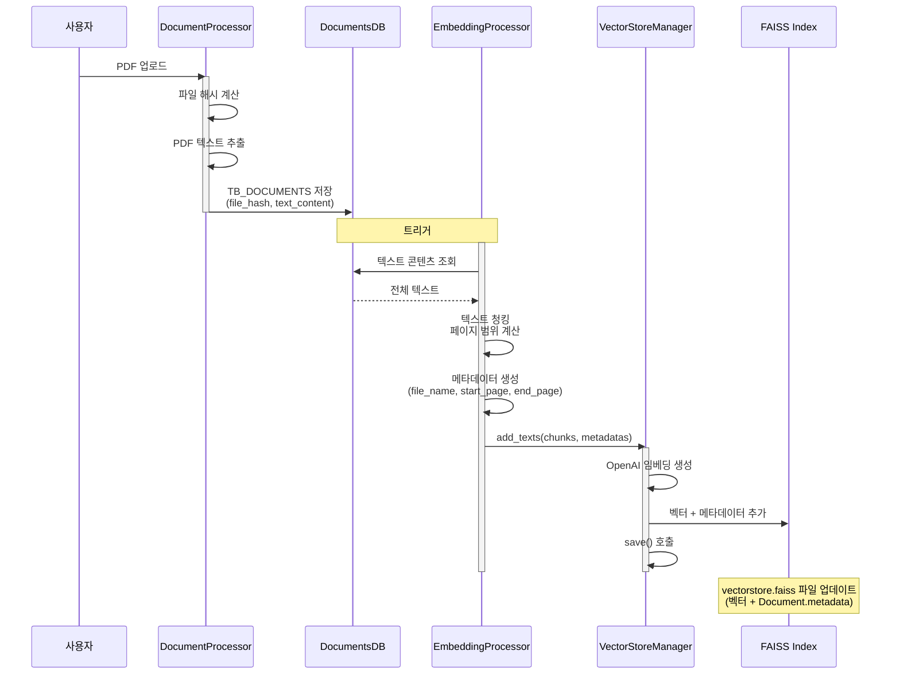

---

### 2. 질의 응답 흐름 (RAG Pipeline)

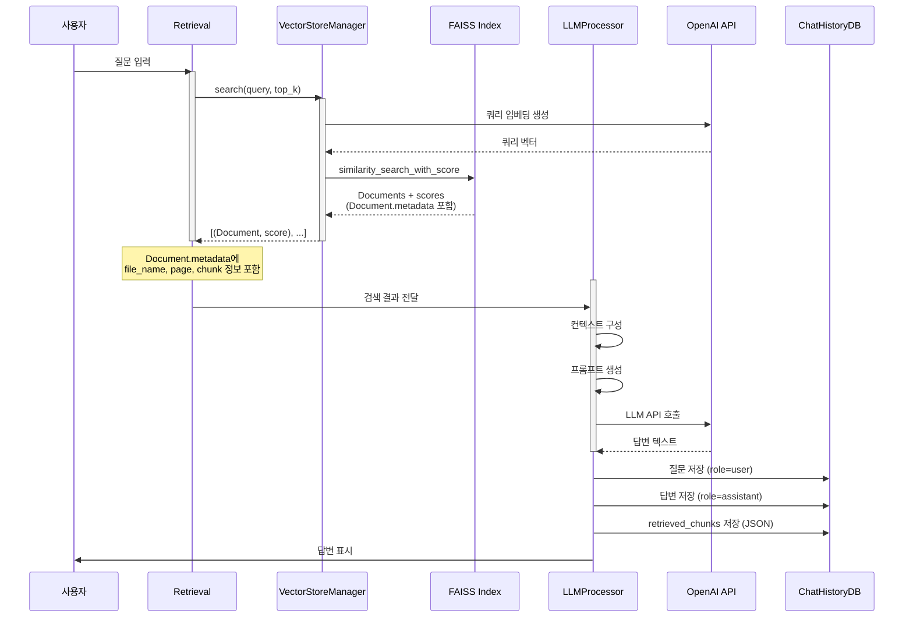

---

### 3. 세션 관리 흐름

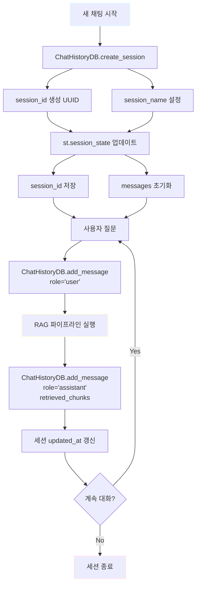

---

## 핵심 컴포넌트

### 1. 파일 해시 기반 중복 제거

**목적**: 동일 파일 재처리 방지

**메커니즘**:
```python
file_hash = hashlib.sha256(file_content).hexdigest()

# documents.db 조회
if file_hash in database:
    return "이미 처리된 파일입니다"
else:
    process_and_save(file_hash)
```

**장점**:
- 중복 작업 방지
- 저장 공간 절약
- 처리 속도 향상

---

### 2. 임베딩 설정 해시

**목적**: 동일 설정의 임베딩 재사용

**해시 계산**:
```python
config = {
    'chunk_size': 1000,
    'chunk_overlap': 200,
    'model': 'text-embedding-3-small'
}
embedding_hash = sha256(f"{file_hash}_{json.dumps(config)}".encode())
```

**활용**:
- 설정 변경 시에만 재임베딩
- 다양한 설정 조합 관리
- 증분 업데이트 지원

---

### 3. 통합 FAISS 인덱스 및 메타데이터 관리

**목적**: 모든 문서의 임베딩을 하나의 FAISS 인덱스로 통합 관리하고, 메타데이터를 FAISS 내부에 함께 저장

**구현** (VectorStoreManager):
```python
# 단일 FAISS 인덱스 경로
vector_path = "data/vectorstore/vectorstore.faiss"

# 새 문서 추가 시
success, start_index = self.vector_manager.add_texts(
    texts=chunks,
    metadatas=[
        {
            'file_hash': file_hash,
            'file_name': file_name,
            'start_page': start_page,
            'end_page': end_page,
            'chunk_index': i,
            'embedding_version': model_name,
            'created_at': timestamp
        }
        for i in range(len(chunks))
    ]
)
self.vector_manager.save()
```

**효과**:
- **전체 문서 통합 검색**: 모든 문서를 대상으로 한 번에 검색
- **메타데이터 통합 관리**: Document.metadata에 모든 정보 저장
- **별도 DB 불필요**: EmbeddingsDB 제거로 아키텍처 단순화
- **정확한 출처 추적**: 파일명, 페이지 번호 자동 포함
- **관리 용이성**: 단일 인터페이스(VectorStoreManager)로 모든 작업 처리

---

### 4. 유사도 점수 (거리 기반)

**FAISS L2 거리 값 직접 사용**:

VectorStoreManager의 `similarity_search_with_score` 메서드는 FAISS의 L2 거리 값을 그대로 반환합니다.

**반환 형식**:
```python
# VectorStoreManager.search() 반환값
results: List[Tuple[Document, float]]
# [(Document, distance), ...]
```

여기서:
- `distance`: FAISS L2 거리 (Euclidean distance)
- 거리가 **작을수록** 유사도가 **높음**
- 거리 범위: 0 ~ ∞ (거리 기반이므로 정규화하지 않음)

**특징**:
- **거리 = 0**: 완전 일치 (가장 유사)
- **거리가 작을수록**: 높은 유사도
- **거리가 클수록**: 낮은 유사도
- **정규화 없음**: 원본 L2 거리 값 그대로 사용

**거리 값 해석**:

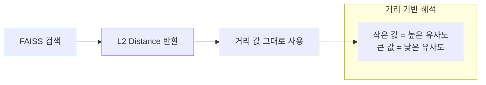

| Distance | 해석 |
|----------|------|
| 0.0 | 완전 일치 (가장 유사) |
| 0.1 ~ 0.5 | 매우 높은 유사도 |
| 0.5 ~ 1.0 | 높은 유사도 |
| 1.0 ~ 2.0 | 중간 유사도 |
| 2.0 이상 | 낮은 유사도 |

**장점**:
- 원본 거리 메트릭 보존
- 정규화로 인한 정보 손실 없음
- 벡터 공간에서의 실제 거리 반영

---

### 5. 검색된 청크 JSON 저장

**목적**: 답변 생성에 사용된 출처 추적

**구조**:
```json
[
    {
        "chunk_text": "...",
        "file_name": "document.pdf",
        "file_hash": "abc123...",
        "start_page": 5,
        "end_page": 5,
        "chunk_index": 0,
        "distance": 0.176,
        "metadata": {
            "chunk_type": "paragraph",
            "embedding_version": "text-embedding-3-small",
            "created_at": "2025-11-13T..."
        }
    },
    ...
]
```

**특징**:
- **distance**: FAISS L2 거리 값 (작을수록 유사도 높음)
- **메타데이터**: Document.metadata의 모든 정보 포함
- **출처 정보**: file_name, start_page, end_page 명시

**활용**:
- 답변 근거 제시 (파일명, 페이지 번호)
- 출처 표시 (정확한 위치 추적)
- 품질 모니터링 (거리 값 기반 검색 품질 평가)

---

## 기술 스택

### 백엔드

| 카테고리 | 기술 | 버전 | 용도 |
|---------|------|------|------|
| 언어 | Python | 3.8+ | 주 개발 언어 |
| 문서 처리 | PyMuPDF | latest | PDF 파싱 및 텍스트 추출 |
| 토큰 계산 | tiktoken | latest | GPT tokenizer |
| 텍스트 분할 | LangChain | latest | RecursiveCharacterTextSplitter |
| 임베딩 | OpenAI API | latest | text-embedding-3-small |
| 벡터 DB | FAISS | latest | 유사도 검색 |
| LLM | OpenAI API | latest | gpt-4o-mini |
| 데이터베이스 | SQLite | 3.x | 메타데이터 저장 |

### 프론트엔드

| 카테고리 | 기술 | 용도 |
|---------|------|------|
| UI 프레임워크 | Streamlit | 웹 인터페이스 |
| 상태 관리 | st.session_state | 세션 관리 |
| 캐싱 | @st.cache_resource | 성능 최적화 |

### 유틸리티

| 카테고리 | 기술 | 용도 |
|---------|------|------|
| 해싱 | hashlib | SHA-256 |
| JSON | json | 설정 직렬화 |
| 날짜/시간 | datetime | 타임스탬프 |
| 경로 관리 | pathlib | 파일 경로 처리 |
| 수치 연산 | numpy | 벡터 연산 |

---

## 디렉토리 구조

```
codeit_ai_g2b_search/
│
├── app.py                          # Streamlit 메인 앱
├── requirements.txt                # Python 의존성
├── .env.example                    # 환경 변수 예시
├── README.md                       # 프로젝트 설명
│
├── src/                            # 소스 코드
│   ├── __init__.py
│   │
│   ├── db/                         # 데이터베이스 모듈
│   │   ├── __init__.py
│   │   ├── documents_db.py         # 문서 DB 관리
│   │   └── chat_history_db.py      # 채팅 히스토리 DB 관리
│   │
│   ├── processors/                 # 처리 모듈
│   │   ├── __init__.py
│   │   ├── document_processor.py   # 문서 처리
│   │   └── embedding_processor.py  # 임베딩 처리
│   │
│   ├── llm/                        # LLM 관련 모듈
│   │   ├── __init__.py
│   │   ├── retrieval.py            # 검색 기능
│   │   └── llm_processor.py        # LLM 답변 생성
│   │
│   ├── ui/                         # UI 컴포넌트
│   │   └── __init__.py
│   │
│   └── utils/                      # 유틸리티
│       ├── __init__.py
│       ├── helper_utils.py         # 헬퍼 함수
│       └── logging_config.py       # 로깅 설정
│
├── data/                           # 데이터 디렉토리
│   ├── documents.db                # 문서 텍스트 콘텐츠 DB
│   ├── chat_history.db             # 채팅 히스토리 DB
│   │
│   ├── raw/                        # 원본 파일
│   │   ├── *.pdf
│   │   └── *.hwp
│   │
│   └── vectorstore/                # 통합 FAISS 인덱스
│       ├── vectorstore.faiss       # 벡터 인덱스 (메타데이터 포함)
│       └── vectorstore.pkl         # FAISS 인덱스 메타데이터
│
├── docs/                           # 문서
│   ├── doc/
│   │   ├── RAG_기반_PEP_문서_처리_시스템_설계서.md
│   │   ├── 시스템_아키텍처_설계서.md
│   │   ├── 프로젝트_체크리스트.md
│   │   └── 개발자별_체크리스트.md
│   └── api/
│       └── API_문서.md
│
├── tests/                          # 테스트 코드
│   ├── __init__.py
│   ├── test_document_processor.py
│   ├── test_embedding_processor.py
│   └── test_retrieval.py
│
└── scripts/                        # 유틸리티 스크립트
    ├── setup.sh                    # 초기 설정 스크립트
    └── bulk_process.py             # 대량 문서 처리
```

---

## 데이터베이스 ER 다이어그램

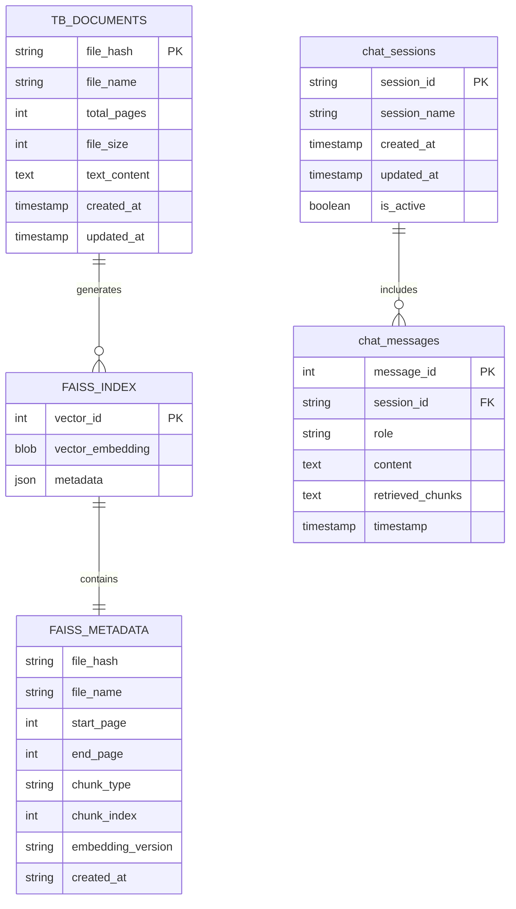

---

## 성능 고려사항

### 1. 캐싱 전략

**Streamlit 캐싱**:
```python
@st.cache_resource
def init_dbs():
    return {
        'docs': DocumentsDB(),
        'embeddings': EmbeddingsDB(),
        'chat': ChatHistoryDB()
    }
```

**효과**:
- DB 연결 재사용
- 초기화 시간 단축
- 메모리 효율성 향상

---

### 2. 배치 처리

**임베딩 배치 생성**:
```python
# 한 번에 여러 청크 임베딩
embeddings = self.embeddings.embed_documents(chunks)
```

**장점**:
- API 호출 횟수 감소
- 처리 속도 향상
- 비용 절감

---

### 3. 인덱스 최적화

**FAISS 인덱스 선택**:
- `IndexFlatL2`: 정확도 최우선 (현재 사용)
- `IndexIVFFlat`: 대용량 데이터 (향후 고려)
- `IndexHNSW`: 속도와 정확도 균형

---

### 4. DB 최적화

**인덱스 생성**:
```sql
CREATE INDEX idx_file_hash ON page_data(file_hash);
CREATE INDEX idx_embedding_hash ON chunk_mapping(embedding_hash);
CREATE INDEX idx_vector_index ON chunk_mapping(vector_index);
CREATE INDEX idx_session_id ON chat_messages(session_id);
```

---

## 확장 가능성

### 향후 개선 로드맵

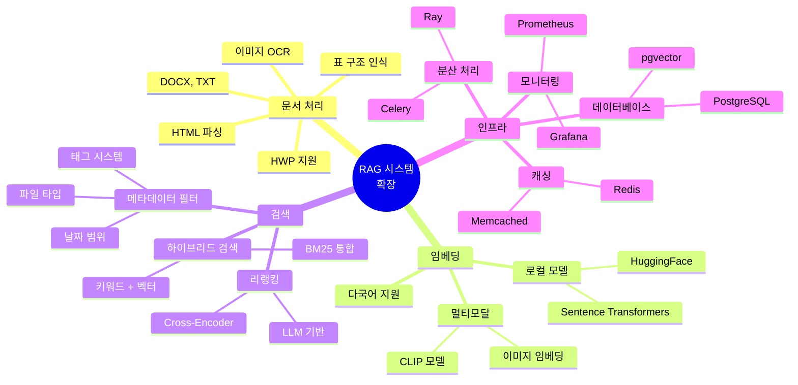

### 1. 다양한 문서 타입 지원

**확장 구조**:
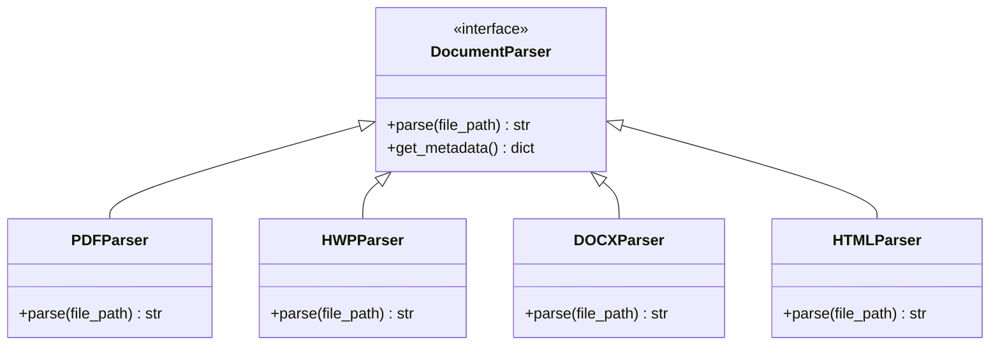

- HWP 처리기 추가
- DOCX, TXT, HTML 등 지원
- 문서 타입별 파서 인터페이스

### 2. 로컬 임베딩 모델
- **Sentence Transformers**: 오픈소스 임베딩 모델
- **HuggingFace 모델**: 다양한 사전학습 모델
- **비용 절감**: OpenAI API 비용 제거
- **프라이버시 강화**: 로컬 처리

### 3. 고급 검색 기능
- **메타데이터 필터링**: 날짜, 파일 타입, 태그 등
- **하이브리드 검색**: 키워드(BM25) + 벡터 검색
- **리랭킹**: Cross-Encoder 또는 LLM 기반 재정렬

### 4. 멀티모달 지원
- **이미지 임베딩**: CLIP 모델 활용
- **표 구조 인식**: 테이블 전용 파싱
- **OCR 통합**: 이미지 내 텍스트 추출

### 5. 스케일링
- **PostgreSQL + pgvector**: 대용량 벡터 DB
- **Redis 캐싱**: 자주 사용되는 검색 결과 캐싱
- **분산 처리**: Celery/Ray를 통한 병렬 처리

---

## 보안 고려사항

### 1. API 키 관리
```python
# 환경 변수로 관리
api_key = os.getenv('OPENAI_API_KEY')

# 세션 상태에 저장 (암호화된 입력)
api_key = st.text_input("API Key", type="password")
```

### 2. 파일 업로드 검증
- 파일 크기 제한
- MIME 타입 검증
- 악성 파일 스캔

### 3. SQL Injection 방지
```python
# 파라미터화된 쿼리 사용
cursor.execute("SELECT * FROM file_info WHERE file_hash = ?", (file_hash,))
```

### 4. 접근 제어
- 세션 기반 인증
- 사용자별 데이터 격리
- 감사 로그

---

## 모니터링 및 로깅

### 로깅 전략

**레벨**:
- DEBUG: 상세 처리 과정
- INFO: 주요 이벤트 (파일 처리 완료, 검색 요청 등)
- WARNING: 경고 (API 지연, 검색 결과 부족 등)
- ERROR: 오류 (API 실패, 파일 읽기 실패 등)

**로그 위치**:
```
logs/
├── app.log              # 애플리케이션 로그
├── document.log         # 문서 처리 로그
├── embedding.log        # 임베딩 로그
└── llm.log              # LLM 요청/응답 로그
```

---

## 결론

본 시스템은 **모듈화**, **확장성**, **추적성**을 핵심 설계 원칙으로 하여 RAG 기반의 문서 검색 및 질의응답 시스템을 구현했습니다.

### 핵심 강점
1. **파일 해시 기반 설계**: 중복 제거 및 증분 업데이트 지원
2. **계층화된 아키텍처**: 각 계층의 독립성 보장
3. **유연한 확장성**: 새로운 모델 및 기능 추가 용이
4. **완전한 추적성**: 모든 답변의 출처 추적 가능

### 향후 개선 방향
1. 분산 처리 및 스케일링
2. 고급 검색 기능 (하이브리드, 리랭킹)
3. 멀티모달 지원
4. 사용자 피드백 기반 학습

---

**문서 버전**: 3.0
**최종 업데이트**: 2025-11-13
**작성자**: 프로젝트 팀

**주요 변경사항 (v3.0)**:
- **EmbeddingsDB 완전 제거**: 별도 임베딩 DB 없이 FAISS 내부 메타데이터만 사용
- **VectorStoreManager 도입**: FAISS 인덱스 및 메타데이터 통합 관리
- **DocumentsDB 단순화**: TB_DOCUMENTS 테이블 하나로 통합 (text_content 저장)
- **메타데이터 통합**: Document.metadata에 파일명, 페이지 번호, 청크 정보 모두 저장
- **아키텍처 단순화**: 3개 DB → 2개 DB (documents.db, chat_history.db)
- **관리 효율성**: 단일 인터페이스(VectorStoreManager)로 모든 벡터 작업 처리
