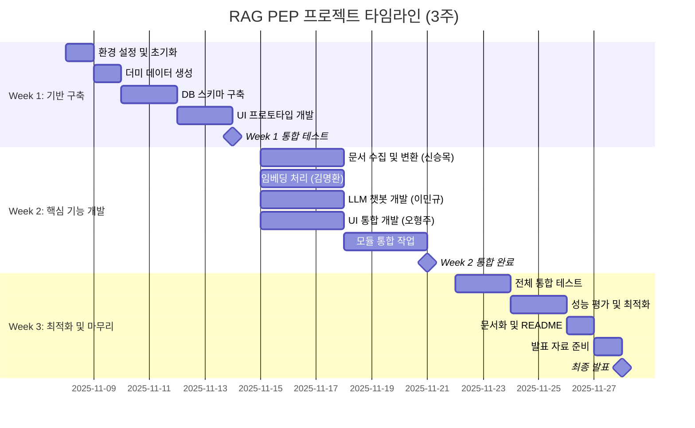

# 🏥 코드잇 AI 4기 3팀 중급 프로젝트

## 📱 프로젝트 개요
**목표**: RAG(Retrieval-Augmented Generation) 시스템을 구축하여 복잡한 형태의 기업 및 정부 제안요청서(Request For Proposal, RFP) 내용을 효과적으로 추출하고 요약하여 필요한 정보를 제공하는 서비스를 개발하는 것을 목표로 합니다.

## 👥 팀원

| 역할          | 담당자       | 핵심 업무                                      |
|---------------|--------------|-----------------------------------------------|
| 데이터 엔지니어 |        | 문서 수집 및 원본 전처리 (PDF/HWP → Markdown 변환 및 DB 저장) |
| 머신러닝 엔지니어 |        | 임베딩 처리 (Markdown → 벡터 임베딩 및 FAISS 저장)         |
| AI 리서처      |        | LLM 기반 정보 추출 및 요약 시스템                      |
| 프론트엔드 엔지니어 |        | Streamlit UI 개발 및 통합                           |

## 📝 협업일지

팀원별 개발 과정 및 학습 내용을 기록한 협업일지입니다.

- [김명환 협업일지 (Project Manager)](https://c0z0c.github.io/codeit_ai_g2b_search/협업일지/김명환/)
- [신승목 협업일지 (Data Engineer)](https://c0z0c.github.io/codeit_ai_g2b_search/협업일지/신승목/)
- [오형주 협업일지 (Model Architect)](https://c0z0c.github.io/codeit_ai_g2b_search/협업일지/오형주/)
- [이민규 협업일지 (Experimentation Lead)](https://c0z0c.github.io/codeit_ai_g2b_search/협업일지/이민규/)

- [팀 회의록](https://c0z0c.github.io/codeit_ai_g2b_search/회의록/)

## 📅 프로젝트 기간
**2025년 11월 10일 ~ 2025년 11월 28일**

**프로젝트 일정 (3주, 2025-11-08 ~ 2025-11-28):**

---

## 폴더목록

  <!-- 폴더 목록이 JavaScript로 동적 생성됩니다 -->

---

  <a href="{{- site.baseurl -}}/" class="nav-button home">
    🏠 홈으로
  </a>
  <a href="https://github.com/c0z0c/codeit_ai_g2b_search" target="_blank">
    📱 GitHub 저장소
  </a>

