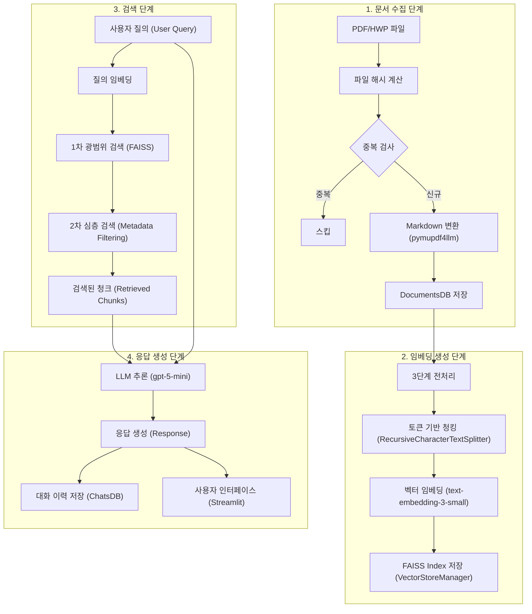

## 1\. 프로젝트 개요 (Project Overview)

### 1.1. 미션 배경 및 목표 (Mission Background and Goal)

#### 1.1.1. 정부나라장터 환경 분석 (Analysis of the G2B Environment)

정부나라장터는 대한민국 정부 및 공공기관의 조달 업무를 전자화한 통합 전자조달 시스템이다. 2024년 기준 연간 총 거래실적은 약 **156조 7,654억 원**에 달하며, 월평균 약 **6,600건**의 입찰공고가 게시되는 대규모 플랫폼이다. 각 공고는 평균 20페이지에서 100페이지에 이르는 방대한 분량의 제안요청서(RFP, Request for Proposal)를 포함하고 있다. 입찰 참여 기업들은 이처럼 하루에 수백 건씩 쏟아지는 공고와 수십 페이지 분량의 문서를 분석하는 데 막대한 시간과 인력을 투입해야 하는 어려움을 겪고 있다.

#### 1.1.2. 프로젝트 추진 배경 (Project Initiation Background)

본 프로젝트는 대량의 입찰 문서를 신속하고 정확하게 분석하여 핵심 정보를 추출하고, 사용자의 질문에 즉각적으로 답변하는 **지능형 시스템**을 구축하고자 시작되었다. 기존의 키워드 기반 검색 방식으로는 문서의 맥락을 이해하고 복잡한 요구사항을 정확히 파악하는 데 한계가 있었다. 이에 대한 해결책으로 벡터 임베딩(Vector Embedding)을 통해 문서의 의미를 수치화하고 대규모 언어모델(LLM, Large Language Model)을 활용하여 정확하고 맥락에 맞는 답변을 생성할 수 있는 **RAG(Retrieval-Augmented Generation) 기술**을 도입하였다.

#### 1.1.3. 핵심 해결 과제 (Core Challenges to Solve)

핵심 해결 과제는 세 가지이다. 첫째, PDF 및 HWP 형식의 입찰 문서를 자동으로 수집하고 처리 가능한 형태로 **문서 변환**을 수행해야 한다. 둘째, 변환된 문서를 효율적으로 검색하기 위한 **벡터 임베딩 기반 검색 시스템**을 구축해야 한다. 셋째, 복잡한 자연어 질의에 대해 문서에서 추출한 정보를 바탕으로 **정확하고 맥락에 맞는 답변**을 생성해야 한다.

### 1.2. 시스템 아키텍처 및 구성 (System Architecture and Composition)

#### 1.2.1. 시스템 구성도 (System Architecture Diagram)

시스템의 데이터 처리 파이프라인은 문서 수집, 임베딩 생성, 검색, 응답 생성의 네 단계로 구성된다.

-----

## 2\. 데이터 수집 및 전처리 (Data Collection and Preprocessing)

### 2.1. 문서 수집 전략 (Document Collection Strategy)

#### 2.1.1. PDF 및 HWP 파일 수집 프로세스 (PDF and HWP File Collection Process)

데이터 수집은 **공공데이터포털**의 입찰공고목록정보조회 API(Application Programming Interface)를 활용하여 최신 공고 목록을 조회하는 것에서 시작된다. API 응답에 포함된 첨부파일 URL을 통해 제안요청서 원본 파일(주로 PDF)을 다운로드한다. 파일 다운로드 과정에서는 **지수 백오프(Exponential Backoff) 전략**을 사용하여 네트워크 오류 발생 시 최대 3회까지 재시도하는 메커니즘을 구현하였다. 수집된 파일은 공고번호와 공고명을 결합한 표준화된 파일명으로 저장된다.

#### 2.1.2. 파일 해시 기반 중복 검사 (File Hash-based Duplication Check)

대량 문서 처리의 효율성을 위해 **SHA-256 해시 알고리즘**을 기반으로 중복 문서를 감지하고 제거하는 기능을 구현하였다. 새로운 PDF 파일이 입력되면 **DocumentProcessor**가 해시값을 계산하고, 이 해시값이 **DocumentsDB**에 이미 존재하는 경우 해당 파일은 중복으로 판단되어 Markdown 변환 및 저장 작업을 건너뛴다. 이 방식은 파일명이나 메타데이터가 다르더라도 내용이 동일한 문서를 정확히 식별할 수 있는 장점을 제공한다.

### 2.2. 문서 전처리 파이프라인 (Document Preprocessing Pipeline)

#### 2.2.1. PDF to Markdown 변환 (PDF to Markdown Conversion)

수집된 PDF 파일은 **pymupdf4llm** 라이브러리를 사용하여 구조화된 **Markdown** 형식의 텍스트로 변환된다. 변환된 텍스트에는 페이지 경계를 명시하기 위해 **페이지 마커(Page Marker)** 삽입 전략이 도입되었으며, 마커 형식은 "--- 페이지 N ---" 이다.

#### 2.2.2. DocumentProcessor 기반 최소 전처리 (Minimum Preprocessing based on DocumentProcessor)

Markdown 변환 직후, **DocumentProcessor**의 `clean_markdown_text` 메서드를 통해 최소 전처리(Minimum Preprocessing)가 수행된다. 이는 공백과 탭을 단일 공백으로 변환하고, 연속된 개행을 축소하며, 라인의 앞뒤 공백을 제거하는 등 형식적인 문제만을 해결하여 원본 텍스트의 내용과 구조를 최대한 보존하는 데 중점을 둔다. 이 결과는 **DocumentsDB**의 `text_content` 컬럼에 저장되어 원본 데이터로서 보존된다.

### 2.3. DocumentsDB 스키마 및 관리 (DocumentsDB Schema and Management)

#### 2.3.1. DocumentsDB 스키마 설계 (DocumentsDB Schema Design)

문서 메타데이터(Metadata)와 원본 텍스트를 저장하기 위해 SQLite 기반의 **DocumentsDB**가 사용된다. 핵심 컬럼으로는 문서의 고유성을 보장하는 PRIMARY KEY이자 SHA-256 해시값인 `file_hash`, 원본 파일명인 `file_name`, 총 페이지 수인 `total_pages`, 파일 크기인 `file_size`, 그리고 Markdown 텍스트인 `text_content` 등이 있다.

-----

## 3\. 임베딩 처리 및 벡터 저장 (Embedding Processing and Vector Storage)

### 3.1. 임베딩 전처리 전략 (Embedding Preprocessing Strategy)

#### 3.1.1. 3단계 전처리 파이프라인 (3-Step Preprocessing Pipeline)

RAG 시스템 성능 최적화를 위해 **3단계 전처리 파이프라인**이 설계되었다.

1.  **최소 전처리**: 원본 보존을 목표로 하며, `DocumentsDB`에 저장된다.
2.  **최대 전처리 (Maximum Preprocessing)**: 임베딩 품질 최적화를 목표로 청킹(Chunking) 직전에 수행되며, Markdown 요소(HTML 태그, 이미지, 헤더 등)를 제거하고 **보호 블록 마스킹 기법**을 적용한다.
3.  **페이지별 정제**: 페이지 마커를 제거하고 최종 공백 정리를 수행한다.

#### 3.1.2. 보호 블록 마스킹 기법 (Protected Block Masking Technique)

전처리 과정에서 중요한 정보가 손실되는 것을 방지하기 위해 **보호 블록 마스킹** 기법이 사용된다. 코드 블록, 수식 블록(`$$` 블록 수식 및 `$` 인라인 수식), Mermaid 다이어그램 등 보호할 요소들은 정규표현식으로 식별되어 `XPROTECTEDX...XnX` 형식의 **고유한 플레이스홀더**로 치환된다. 일반 전처리 작업이 완료된 후, 플레이스홀더는 다시 원본 내용으로 복원된다.

### 3.2. 문서 청킹 (Document Chunking)

#### 3.2.1. 재귀적 텍스트 분할 (Recursive Text Splitting)

**RecursiveCharacterTextSplitter**를 사용한 **토큰 기반 청킹**이 구현되었으며, 이는 OpenAI API의 토큰 한도를 효율적으로 관리한다. 청크 크기(`CHUNK_SIZE`)는 기본값 **1500 토큰**, 청크 오버랩(`CHUNK_OVERLAP`)은 기본값 **300 토큰**으로 설정되어 청크 경계에서 문맥 단절을 방지한다.

### 3.3. 벡터 임베딩 (Vector Embedding)

#### 3.3.1. OpenAI text-embedding-3-small 모델 (OpenAI text-embedding-3-small Model)

텍스트를 고차원 벡터 공간의 점으로 변환하는 벡터 임베딩에는 **OpenAI**의 **`text-embedding-3-small`** 모델이 사용되며, 1536차원의 질의 벡터를 생성한다.

### 3.4. FAISS 벡터 저장소 (FAISS Vector Store)

#### 3.4.1. 인덱스 구조 및 관리 (Index Structure and Management)

고성능 벡터 유사도 검색을 위해 **FAISS(Facebook AI Research Similarity Search)** 라이브러리의 **`IndexFlatL2`** 인덱스가 사용되어 L2 거리 기반의 정확한 최근접 이웃 검색을 수행한다. **VectorStoreManager**는 메모리 내에서 `file_hash`를 키로 하는 `chunk_map` 자료구조를 관리하여 효율적인 청크 업데이트 및 삭제를 지원한다.

### 3.5. 다단계 검색 시스템 (Multi-Stage Retrieval System)

#### 3.5.1. 광범위 검색 및 심층 검색 (Broad Search and Deep Search)

검색의 정밀도 극대화를 위해 **다단계 검색 시스템**이 도입되었다.

1.  **1차 광범위 검색 (Broad Retrieval)**: 전체 데이터베이스를 대상으로 유사도 기반 검색을 수행하여 관련 문서들을 식별한다.
2.  **2차 심층 검색 (Deep Retrieval)**: 1차 검색에서 식별된 문서들의 `file_hash`를 사용하여 \*\*메타데이터 필터링(Metadata Filtering)\*\*을 적용함으로써 특정 문서 내에서만 검색이 이루어지게 하여 노이즈 제거 효과를 달성한다.

-----

## 4\. LLM 기반 정보 추출 및 요약 (LLM-based Information Extraction and Summarization)

### 4.1. LLM 프로세서 설계 (LLM Processor Design)

#### 4.1.1. ChatOpenAI 모델 설정 (ChatOpenAI Model Configuration)

LLM 프로세서는 **LangChain**의 **`ChatOpenAI`** 클래스를 통해 구현되었다. 기본 모델은 추론 속도와 비용 효율성이 우수한 \*\*`gpt-5-mini`\*\*로 설정되었다. **Temperature** 파라미터(Parameter)는 **0.0**으로 설정되어 결정론적이고 일관된 답변 생성을 보장한다.

#### 4.1.2. Temperature 및 파라미터 최적화 (Temperature and Parameter Optimization)

RAG 시스템 특성상 낮은 **Temperature** 값(0.0)을 채택하여 문서 내용을 충실하게 반영한다. 최대 토큰 수(**Max\_tokens**)는 충분한 답변 생성을 위해 **50000 토큰**으로 설정되었으며, `gpt-5-mini`와 같은 최신 모델의 경우 **`max_completion_tokens`** 파라미터로 자동 전환하여 호환성을 확보한다.

### 4.2. 프롬프트 엔지니어링 및 한국어 최적화 (Prompt Engineering and Korean Optimization)

#### 4.2.1. 한국어 기반 프롬프트 전략 (Korean-based Prompt Strategy)

LLM이 자연스럽고 정확한 한국어 답변을 생성하도록 시스템 지시문, 섹션 라벨 등을 모두 **한국어**로 작성하는 전략을 채택하였다. 또한 입찰 공고의 공식적 성격에 맞추어 답변의 일관성을 위해 **격식 있는 경어** 사용을 유도한다.

### 4.3. 대화 이력 관리 (Conversation History Management)

#### 4.3.1. 대화 요약 메모리 (Conversation Summary Memory)

대화 컨텍스트(Context) 유지를 위해 \*\*`ConversationSummaryMemory`\*\*를 사용한다. 대화 토큰 수가 **1500 토큰**의 임계값을 초과하면 오래된 대화를 요약으로 대체하여 토큰 오버플로우를 방지한다.

#### 4.3.2. ChatsDB 스키마 및 메시지 저장 (ChatsDB Schema and Message Storage)

대화 이력은 SQLite 기반의 **ChatsDB**에 저장된다. `Messages` 테이블은 `session_id`, `role`, `content`, 검색된 청크 정보를 JSON 형식으로 저장하는 `retrieved_chunks`, KST 기준의 `timestamp` 등의 정보를 기록한다.

### 4.4. RAG 체인 및 워크플로우 (RAG Chain and Workflow)

#### 4.4.1. LangChain Expression Language (LCEL) 활용 (Using LangChain Expression Language (LCEL))

전체 RAG 워크플로우(Workflow)는 \*\*LCEL(LangChain Expression Language)\*\*을 사용하여 구성되어, 모듈화된 구성요소 조합을 통해 유연한 체인(Chain)을 정의하고 디버깅 및 테스트를 용이하게 한다.

-----

## 5\. 사용자 인터페이스 및 시스템 통합 (User Interface and System Integration)

### 5.1. Streamlit 기반 UI 설계 (Streamlit-based UI Design)

#### 5.1.1. 페이지 구조 및 레이아웃 (Page Structure and Layout)

UI(User Interface)는 **Streamlit** 프레임워크를 기반으로 구축되었다. 페이지는 단일 페이지 형태로 설계되었으며, \*\*사이드바(Sidebar)\*\*에는 세션 관리 및 검색 옵션 등의 제어 기능이 배치되고 메인 영역은 **채팅 인터페이스**로 구성된다.

#### 5.1.2. 채팅 인터페이스 구현 (Chat Interface Implementation)

`session_state`를 활용하여 대화 이력을 유지하고 `chat_message` 컴포넌트로 메시지를 표시한다. LLM 응답 시 **`write_stream`** 메서드를 사용하여 \*\*스트리밍 응답(Streaming Response)\*\*을 구현하여 사용자 경험을 향상시킨다. 시스템이 작업 중임을 알리기 위해 검색 및 응답 대기 중에는 \*\*로딩 인디케이터(Loading Indicator)\*\*로 `spinner` 컴포넌트를 표시한다.

### 5.2. 시스템 구성 및 설정 관리 (System Configuration and Settings Management)

#### 5.2.2. Config 기반 설정 관리 (Config-based Setting Management)

모든 시스템 설정은 싱글톤 패턴(Singleton Pattern)으로 구현된 **`Config` 클래스**를 통해 `config.json` 파일을 기반으로 중앙 집중식으로 관리된다.

### 5.3. 고급 검색 및 필터링 기능 (Advanced Search and Filtering Functionality)

#### 5.3.1. 검색 임계값 및 필터링 (Search Threshold and Filtering)

검색 결과에 포함할 최소 유사도를 정의하는 \*\*검색 임계값(Search Threshold)\*\*은 0.0에서 2.0 범위의 슬라이더 UI로 제공되며, 기본값은 **0.5**이다. 사용자가 특정 파일 해시(File Hash)를 선택하여 이후 검색을 해당 파일 내에서만 수행하도록 제한하는 **문서 필터링** 기능을 제공한다.

#### 5.3.2. 하이브리드 검색 모드 (Hybrid Search Mode)

하이브리드 검색 모드는 표준 검색으로 관련 문서를 식별한 후, 식별된 문서 내에서 필터링 검색을 수행하여 최종 결과를 도출하는 전략을 조합한다.

### 5.4. 기타 UI/UX 기능 (Other UI/UX Features)

#### 5.4.3. 응답 품질 피드백 (Response Quality Feedback)

시스템 응답에 대한 지속적인 품질 개선을 위해 사용자가 **좋아요(Thumbs Up)** 또는 **싫어요(Thumbs Down)** 버튼을 통해 피드백(Feedback)을 제공할 수 있도록 한다.

#### 5.4.4. 다크 모드 및 테마 커스터마이징 (Dark Mode and Theme Customization)

사용자 선호에 따른 시각적 경험을 위해 **다크 모드(Dark Mode)** 기능을 구현하였으며, `config.toml` 설정을 통해 테마를 지정하고 사이드바의 토글 스위치를 통해 런타임에 테마를 전환할 수 있다.

-----

## 6\. 결론 및 향후 계획 (Conclusion and Future Plans)

### 6.1. 프로젝트 성과 (Project Achievements)

#### 6.1.1. 기술적 성과 (Technical Achievements)

  * **아키텍처**: 데이터 저장, 데이터 접근, 비즈니스 로직, 애플리케이션, UI의 5계층 설계를 성공적으로 구현하였다.
  * **파이프라인**: 문서 수집부터 전처리, 임베딩, 저장까지의 파이프라인이 완전 자동화되었으며, 중복 문서 감지를 통해 저장 공간과 임베딩 비용을 절감하였다. 전처리 과정에서 **평균 21.5퍼센트의 토큰 절약**을 달성하였다.
  * **검색**: **FAISS `IndexFlatL2`** 인덱스를 활용하고 다단계 검색 시스템을 도입하여 높은 정밀도(Precision)와 재현율(Recall)을 확보하였다.
  * **LLM**: **`gpt-5-mini`** 모델을 채택하여 빠른 응답 속도와 낮은 비용으로 고품질 답변을 생성하며, 스트리밍 응답 활성화로 **첫 토큰 응답 시간**을 **0.5초 이내**로 단축하였다.

#### 6.1.2. 프로젝트 팀 및 기간 (Project Team and Duration)

본 프로젝트는 **코드잇 AI 4기 PEP 팀**의 4인 팀원(데이터 엔지니어, 머신러닝 엔지니어, AI 리서처, 프론트엔드 엔지니어)이 참여하여 **2025년 11월 10일부터 28일까지 3주간** 진행되었다.

### 6.2. 향후 개선 및 확장 계획 (Future Improvement and Expansion Plans)

#### 6.2.1. 기술적 개선 계획 (Technical Improvement Plans)

  * **HWP 문서 처리**: 현재 미반영된 HWP 문서 변환 기능을 추가하여 처리 문서 범위를 확장한다.
  * **FAISS 인덱스 최적화**: 대규모 벡터 처리를 위해 **`IndexIVFFlat`** 또는 \*\*`IndexHNSW`\*\*와 같은 근사 검색(Approximate Search) 알고리즘으로 전환하여 검색 속도를 향상시킨다.
  * **비용 최적화**: 캐싱(Caching)을 통한 중복 LLM 호출 방지 및 하이브리드 접근(저렴한 모델로 사전 필터링)을 구현하여 비용 절감 전략을 강화한다.
  * **멀티모달 RAG (Multimodal RAG)**: 이미지, 표 등 비텍스트 데이터를 포함하는 문서를 처리하기 위해 **GPT-4V**와 같은 멀티모달 LLM 도입을 고려한다.

#### 6.2.2. 기능 확장 계획 (Functional Expansion Plans)

  * **개인화된 공고 추천**: 협업 필터링(Collaborative Filtering) 또는 콘텐츠 기반 필터링(Content-based Filtering)을 적용하여 사용자 프로파일 기반의 맞춤형 공고 추천 기능을 구현한다.
  * **엔터프라이즈 기능**: 팀 단위 협업, 워크플로우 자동화, 대시보드(Dashboard)를 통한 팀 활동 현황 시각화 등의 엔터프라이즈 기능을 추가한다.
