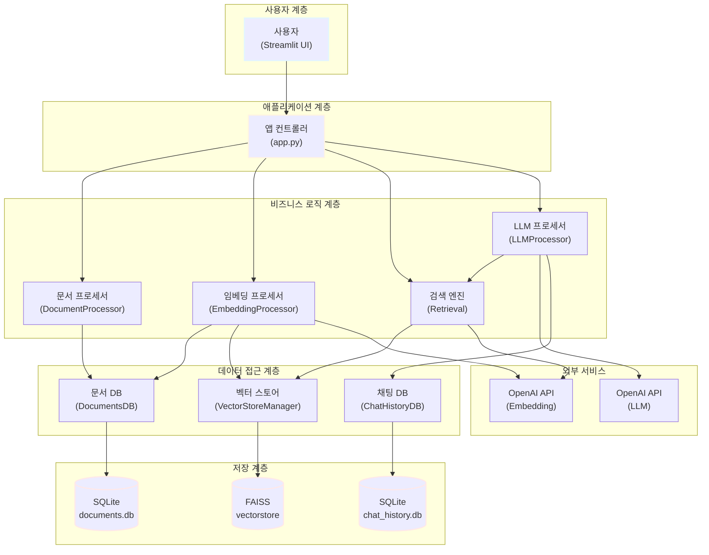
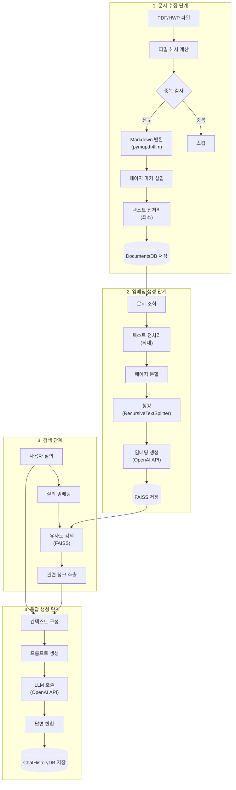

## 1. 프로젝트 개요

### 1.1. 미션 배경 및 목표

#### 1.1.1. 정부나라장터 환경 분석

정부나라장터는 대한민국 정부 및 공공기관의 조달 업무를 전자화한 통합 전자조달 시스템입니다. 2024년 기준 연간 총 거래실적은 약 156조 7,654억원에 달하며, 월평균 약 6,600건의 입찰공고가 게시됩니다. 각 공고는 평균 20페이지에서 100페이지에 이르는 방대한 분량의 제안요청서(RFP, Request for Proposal)를 포함하고 있습니다.

이러한 환경에서 입찰 참여를 희망하는 기업들은 하루에도 수백 건씩 쏟아지는 공고를 검토해야 하며, 한 건의 요청서당 수십 페이지 분량의 문서를 분석하는 데 막대한 시간과 인력을 투입해야 합니다. 특히 고객사별 맞춤 입찰 기회를 탐색하고 요구사항을 정확히 파악하는 과정에서 많은 어려움을 겪고 있습니다.

#### 1.1.2. 프로젝트 추진 배경

본 프로젝트는 이러한 문제를 해결하기 위해 시작되었습니다. 대량의 입찰 문서를 신속하고 정확하게 분석하여 핵심 정보를 추출하고, 사용자의 질문에 즉각적으로 답변할 수 있는 지능형 시스템의 필요성이 대두되었습니다. 전통적인 키워드 기반 검색 방식으로는 문서의 맥락을 이해하기 어렵고, 복잡한 요구사항을 정확히 파악하는 데 한계가 있었습니다.

RAG(Retrieval-Augmented Generation) 기술은 이러한 문제를 해결할 수 있는 효과적인 접근 방법입니다. 벡터 임베딩을 통해 문서의 의미를 수치화하고, 대규모 언어모델(LLM)을 활용하여 자연어 질의에 대해 정확하고 맥락에 맞는 답변을 생성할 수 있습니다.

#### 1.1.3. 핵심 해결 과제

본 프로젝트가 해결하고자 하는 핵심 과제는 다음과 같습니다.

첫째, PDF 및 HWP 형식의 입찰 문서를 자동으로 수집하고 처리 가능한 형태로 변환해야 합니다. 정부나라장터의 공고문은 대부분 PDF 형식으로 제공되며, 일부는 한글 문서(HWP) 형식으로 배포됩니다. 이러한 이질적인 문서 형식을 통합하여 처리할 수 있는 시스템이 필요합니다.

둘째, 변환된 문서를 효율적으로 검색할 수 있도록 벡터 임베딩 기반의 검색 시스템을 구축해야 합니다. 단순한 키워드 매칭이 아닌 의미 기반 검색을 통해 사용자의 질의 의도를 정확히 파악하고 관련성 높은 정보를 추출할 수 있어야 합니다.

셋째, 검색된 정보를 기반으로 자연스럽고 정확한 답변을 생성하는 LLM 기반 응답 시스템을 개발해야 합니다. 단순히 관련 문서를 나열하는 것이 아니라, 사용자의 질문에 대해 명확하고 구체적인 답변을 제공할 수 있어야 합니다.

넷째, 사용자 친화적인 인터페이스를 통해 복잡한 기술적 구조를 감추고, 누구나 쉽게 사용할 수 있는 시스템을 제공해야 합니다.

### 1.2. 프로젝트 정보

#### 1.2.1. 프로젝트명 및 팀 구성

본 프로젝트의 공식 명칭은 "RAG 기반 정부나라장터 입찰공고 분석 시스템"이며, 코드잇 AI 4기 과정의 중급 프로젝트로 진행되었습니다. 프로젝트 팀명은 'PEP(Public E-Procurement Partner)'로, 공공 전자조달의 동반자라는 의미를 담고 있습니다.

팀 구성은 각 분야의 전문성을 고려하여 역할을 분담하였습니다. 신승목 팀원은 데이터 엔지니어로서 문서 수집 및 원본 전처리를 담당하였으며, PDF 및 HWP 파일을 Markdown 형식으로 변환하고 데이터베이스에 저장하는 파이프라인을 구축하였습니다. 김명환 팀원은 머신러닝 엔지니어로서 임베딩 처리를 담당하였으며, Markdown 문서를 벡터 임베딩으로 변환하고 FAISS 인덱스에 저장하는 시스템을 개발하였습니다. 이민규 팀원은 AI 리서처로서 LLM 기반 정보 추출 및 요약 시스템을 개발하였으며, 프롬프트 엔지니어링과 RAG 평가 시스템을 구축하였습니다. 오형주 팀원은 프론트엔드 엔지니어로서 Streamlit 기반의 사용자 인터페이스를 개발하고 전체 시스템을 통합하는 역할을 수행하였습니다.

#### 1.2.2. 개발 기간 및 일정

프로젝트는 2025년 11월 10일부터 11월 28일까지 총 3주간 진행되었습니다. 개발 일정은 3개의 주요 단계로 구성되었습니다.

첫 번째 주(11월 10일~14일)는 기반 구축 단계로, 개발 환경 설정 및 초기화, 더미 데이터 생성, 데이터베이스 스키마 구축, UI 프로토타입 개발이 이루어졌습니다. 11월 14일에는 Week 1 통합 테스트를 완료하였습니다.

두 번째 주(11월 17일~21일)는 핵심 기능 개발 단계로, 각 팀원이 담당한 모듈을 병렬적으로 개발하였습니다. 신승목 팀원은 문서 수집 및 변환 모듈을, 김명환 팀원은 임베딩 처리 모듈을, 이민규 팀원은 LLM 챗봇 모듈을, 오형주 팀원은 UI 통합 모듈을 각각 개발하였습니다. 11월 19일부터는 모듈 통합 작업이 시작되었으며, 11월 21일에 Week 2 통합을 완료하였습니다.

세 번째 주(11월 24일~28일)는 최적화 및 마무리 단계로, 전체 통합 테스트, 성능 평가 및 최적화, 문서화 작업, 발표 자료 준비가 진행되었습니다. 11월 28일에 최종 발표를 통해 프로젝트를 완료하였습니다.

#### 1.2.3. 기술 스택 개요

본 프로젝트는 Python 기반의 최신 AI 및 데이터 처리 기술을 활용하여 구축되었습니다.

문서 처리 계층에서는 PyMuPDF와 pymupdf4llm을 사용하여 PDF 파일을 Markdown 형식으로 변환하였습니다. 데이터 저장을 위해서는 SQLite 데이터베이스를 사용하여 문서 메타데이터, 임베딩 정보, 채팅 이력을 관리하였습니다.

임베딩 및 검색 계층에서는 OpenAI의 text-embedding-3-small 모델을 사용하여 문서를 벡터로 변환하였으며, FAISS(Facebook AI Similarity Search) 라이브러리를 통해 고속 유사도 검색을 구현하였습니다. LangChain 프레임워크를 활용하여 문서 청킹, 임베딩 생성, 벡터스토어 관리를 통합적으로 처리하였습니다.

LLM 계층에서는 OpenAI의 GPT 시리즈 모델(gpt-5-mini, gpt-4o 등)을 사용하여 자연어 응답을 생성하였으며, LangChain의 ConversationChain 및 ConversationSummaryMemory를 통해 대화 컨텍스트를 관리하였습니다.

사용자 인터페이스는 Streamlit 프레임워크를 사용하여 구현하였으며, 직관적인 웹 기반 인터페이스를 통해 사용자가 시스템과 상호작용할 수 있도록 하였습니다.

시스템 설정 및 로깅을 위해서는 JSON 기반의 중앙 집중식 설정 관리 시스템과 Python logging 모듈 기반의 구조화된 로깅 시스템을 구축하였습니다.

### 1.3. 나라장터 사업 현황

#### 1.3.1. 거래 규모 및 입찰 건수

정부나라장터는 대한민국 공공조달 시장의 중심 플랫폼으로, 그 규모와 영향력이 매년 확대되고 있습니다. 2024년 기준 연간 총 거래실적은 약 156조 7,654억원에 달하며, 이는 국내 GDP의 약 7퍼센트에 해당하는 규모입니다.

월평균 입찰공고 건수는 약 6,600건으로, 하루 평균 약 220건의 새로운 공고가 게시됩니다. 이는 주말과 공휴일을 제외한 평일 기준으로는 하루 300건 이상의 공고가 올라오는 것을 의미합니다. 공고 유형은 물품 구매, 용역 발주, 공사 입찰 등 다양하며, 특히 정보시스템 구축 및 유지보수 용역이 전체 공고의 약 15퍼센트를 차지합니다.

공고당 평균 페이지 수는 20페이지에서 100페이지에 이르며, 복잡한 시스템 구축 프로젝트의 경우 200페이지를 초과하는 제안요청서도 흔히 발견됩니다. 각 문서에는 사업 개요, 과업 범위, 기술 요구사항, 제안 평가 기준, 계약 조건 등 입찰 참여에 필요한 모든 정보가 포함되어 있습니다.

#### 1.3.2. 문서 처리의 어려움

정부나라장터의 입찰 문서는 그 양과 복잡성으로 인해 효율적인 처리가 매우 어렵습니다.

첫째, 하루 수백 건의 RFP를 검토해야 하는 물리적 시간 부족 문제가 있습니다. 중소기업의 경우 입찰 담당 인력이 제한적이어서 모든 공고를 꼼꼼히 검토하는 것이 사실상 불가능합니다. 이로 인해 자사에 적합한 입찰 기회를 놓치는 경우가 빈번하게 발생합니다.

둘째, 한 요청서당 수십 페이지 분량의 문서를 분석하는 데 소요되는 시간이 막대합니다. 숙련된 입찰 담당자라 하더라도 한 건의 제안요청서를 완전히 이해하고 핵심 요구사항을 파악하는 데 평균 2시간에서 4시간이 소요됩니다. 복잡한 시스템 구축 프로젝트의 경우에는 하루 이상의 분석 시간이 필요하기도 합니다.

셋째, 고객사별 맞춤 입찰 기회 탐색에 막대한 시간이 소요됩니다. 각 기업은 자사의 강점과 역량에 맞는 입찰 건을 선별해야 하는데, 이를 위해서는 과거 수주 이력, 보유 기술, 인력 구성 등을 종합적으로 고려해야 합니다. 현재는 이러한 과정이 대부분 수작업으로 이루어지고 있어 비효율적입니다.

넷째, 문서 형식의 다양성과 비표준화 문제가 있습니다. 대부분의 공고는 PDF 형식으로 제공되지만, 일부 기관은 HWP 형식을 사용하며, 같은 형식이라도 작성 스타일과 구조가 발주 기관마다 다릅니다. 이로 인해 자동화된 처리가 어렵고, 정보 추출의 정확도가 낮아지는 문제가 발생합니다.

#### 1.3.3. RAG 시스템 도입 필요성

이러한 문제들을 해결하기 위해 RAG 시스템의 도입이 필수적입니다.

RAG 시스템은 벡터 임베딩 기반의 의미론적 검색을 통해 사용자의 질의 의도를 정확히 파악하고, 방대한 문서 집합에서 관련성 높은 정보를 신속하게 추출할 수 있습니다. 전통적인 키워드 기반 검색과 달리, 문장의 의미와 맥락을 이해하여 동의어나 유사 표현도 정확히 찾아낼 수 있습니다.

또한 LLM을 활용한 자연어 응답 생성을 통해 사용자가 복잡한 문서 구조를 직접 탐색하지 않아도 필요한 정보를 명확하게 제공받을 수 있습니다. 예를 들어 "이 사업의 예산 규모는 얼마인가요?"와 같은 직접적인 질문뿐만 아니라, "이 사업에 참여하려면 어떤 자격 요건이 필요한가요?"와 같은 복합적인 질문에도 정확한 답변을 생성할 수 있습니다.

RAG 시스템은 또한 검색 결과에 대한 출처 정보를 함께 제공하여 사용자가 답변의 신뢰성을 검증할 수 있도록 합니다. 각 답변에는 해당 정보가 추출된 문서명과 페이지 번호가 포함되어, 필요한 경우 원본 문서를 직접 확인할 수 있습니다.

마지막으로 대화형 인터페이스를 통해 연속적인 질의응답이 가능하며, 이전 대화 컨텍스트를 유지하여 보다 자연스러운 정보 탐색이 가능합니다. 사용자는 마치 전문가와 대화하는 것처럼 자연스럽게 필요한 정보를 얻을 수 있습니다.

### 1.4. 시스템 아키텍처

#### 1.4.1. 전체 구조도

본 시스템의 전체 아키텍처는 계층적 구조로 설계되었으며, 각 계층은 명확히 분리된 책임과 인터페이스를 가지고 있습니다.

사용자 계층은 Streamlit 기반의 웹 인터페이스로 구성되며, 사용자는 이를 통해 문서를 업로드하고 질문을 입력하며 답변을 확인합니다.

애플리케이션 계층은 사용자 요청을 받아 적절한 비즈니스 로직 모듈로 라우팅하는 역할을 수행합니다. app.py 파일이 이 계층의 중심에 위치하며, 전체 시스템의 워크플로우를 조율합니다.

비즈니스 로직 계층은 네 개의 주요 프로세서로 구성됩니다. DocumentProcessor는 PDF 및 HWP 파일을 Markdown으로 변환하고, EmbeddingProcessor는 변환된 문서를 청킹하여 벡터 임베딩을 생성합니다. Retrieval은 사용자 질의에 대해 유사도 기반 검색을 수행하고, LLMProcessor는 검색 결과를 바탕으로 자연어 답변을 생성합니다.

데이터 접근 계층은 각각의 데이터 저장소에 대한 추상화된 인터페이스를 제공합니다. DocumentsDB는 문서 메타데이터를 관리하고, VectorStoreManager는 FAISS 벡터 인덱스를 관리하며, ChatHistoryDB는 대화 이력을 관리합니다.

저장 계층은 실제 데이터가 저장되는 물리적 스토리지로, SQLite 데이터베이스 파일과 FAISS 인덱스 파일로 구성됩니다.

외부 서비스는 OpenAI API를 통해 임베딩 생성 및 LLM 응답 생성 기능을 제공받습니다.

#### 1.4.2. 데이터 파이프라인 흐름

시스템의 데이터 처리 파이프라인은 크게 문서 수집 단계, 임베딩 생성 단계, 검색 단계, 응답 생성 단계로 구성됩니다.

문서 수집 단계에서는 먼저 입력된 PDF 또는 HWP 파일의 해시값을 계산하여 중복 여부를 확인합니다. 중복되지 않은 신규 파일인 경우 pymupdf4llm 라이브러리를 사용하여 Markdown 형식으로 변환합니다. 변환된 텍스트에는 페이지 구분을 위한 마커가 삽입되며, 기본적인 전처리를 거쳐 DocumentsDB에 저장됩니다.

임베딩 생성 단계에서는 저장된 문서를 조회하여 보다 강력한 전처리를 수행합니다. 이 단계에서는 Markdown 요소 제거, 공백 정리, 보호 블록 마스킹 등의 작업이 이루어집니다. 전처리된 텍스트는 페이지 마커를 기준으로 분할되고, RecursiveCharacterTextSplitter를 사용하여 적절한 크기의 청크로 나뉩니다. 각 청크는 OpenAI API를 통해 벡터 임베딩으로 변환되어 FAISS 인덱스에 저장됩니다.

검색 단계에서는 사용자의 질의를 동일한 방식으로 임베딩으로 변환한 후, FAISS를 사용하여 코사인 유사도 기반의 최근접 이웃 검색을 수행합니다. 검색 결과로는 유사도가 높은 상위 k개의 청크가 반환됩니다.

응답 생성 단계에서는 검색된 청크들을 하나의 컨텍스트로 구성하고, 사용자의 원래 질의와 함께 프롬프트를 생성합니다. 이 프롬프트는 OpenAI의 LLM API로 전송되며, 생성된 답변은 사용자에게 반환됩니다. 질의와 답변은 모두 ChatHistoryDB에 저장되어 대화 이력으로 관리됩니다.

#### 1.4.3. 주요 기술 구성 요소

시스템의 주요 기술 구성 요소는 다음과 같습니다.

Config 모듈은 중앙 집중식 설정 관리를 담당합니다. config.json 파일을 통해 모든 설정값을 관리하며, 싱글톤 패턴을 사용하여 애플리케이션 전체에서 일관된 설정을 사용할 수 있도록 합니다. 주요 설정 항목으로는 OpenAI API 키, 모델명, 청킹 파라미터, 검색 임계값, 데이터베이스 경로 등이 있습니다.

DocumentProcessor 모듈은 PDF 및 HWP 파일을 Markdown으로 변환하는 역할을 수행합니다. PyMuPDF 라이브러리를 사용하여 PDF의 텍스트와 구조를 추출하고, pymupdf4llm을 통해 Markdown 형식으로 변환합니다. 각 페이지에는 고유한 마커가 삽입되어 이후 처리 단계에서 페이지 단위 분할이 가능하도록 합니다.

EmbeddingProcessor 모듈은 문서 청킹 및 임베딩 생성을 담당합니다. 3단계 전처리 파이프라인을 통해 문서를 정제하고, RecursiveCharacterTextSplitter를 사용하여 토큰 수 기반으로 청크를 생성합니다. 각 청크는 OpenAI의 text-embedding-3-small 모델을 통해 1536차원의 벡터로 변환됩니다.

VectorStoreManager 모듈은 FAISS 벡터 인덱스를 관리합니다. LangChain의 FAISS 래퍼를 사용하여 벡터 추가, 삭제, 검색 기능을 제공하며, chunk_map 자료구조를 통해 효율적인 중복 검사 및 업데이트를 지원합니다. FAISS의 IndexFlatL2를 사용하여 L2 거리 기반의 정확한 유사도 검색을 수행합니다.

Retrieval 모듈은 사용자 질의에 대한 검색을 수행합니다. 청크 기반 검색과 페이지 기반 검색 두 가지 모드를 지원하며, 메타데이터 필터링을 통해 특정 파일이나 페이지 범위로 검색을 제한할 수 있습니다. 페이지 기반 검색에서는 검색된 청크 주변의 페이지를 자동으로 확장하여 더 넓은 컨텍스트를 제공합니다.

LLMProcessor 모듈은 검색 결과를 바탕으로 자연어 응답을 생성합니다. OpenAI의 GPT 모델을 사용하며, 모델별로 최적화된 파라미터를 자동으로 적용합니다. ConversationChain과 ConversationSummaryMemory를 사용하여 대화 컨텍스트를 유지하고, 긴 대화의 경우 자동으로 요약하여 토큰 한도를 관리합니다.

ChatHistoryDB 모듈은 대화 이력을 SQLite 데이터베이스에 저장하고 관리합니다. 세션 기반으로 대화를 그룹화하며, 각 메시지에는 역할(user/assistant), 내용, 검색된 청크 정보, 타임스탬프 등이 포함됩니다.

Logging 모듈은 구조화된 로깅 시스템을 제공합니다. KST 타임존을 적용하고, 콘솔 및 파일 핸들러를 통해 로그를 출력하며, RotatingFileHandler를 사용하여 로그 파일을 자동으로 로테이션합니다.

이러한 모듈들은 명확한 인터페이스를 통해 상호작용하며, 각각 독립적으로 테스트 및 개선이 가능한 구조로 설계되었습니다. 이를 통해 시스템의 유지보수성과 확장성을 확보하였습니다.
