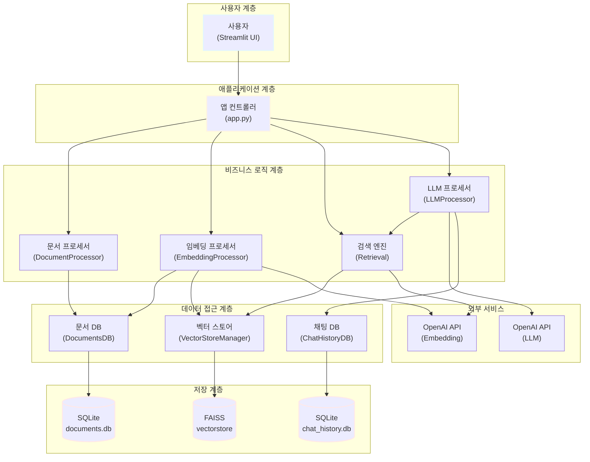
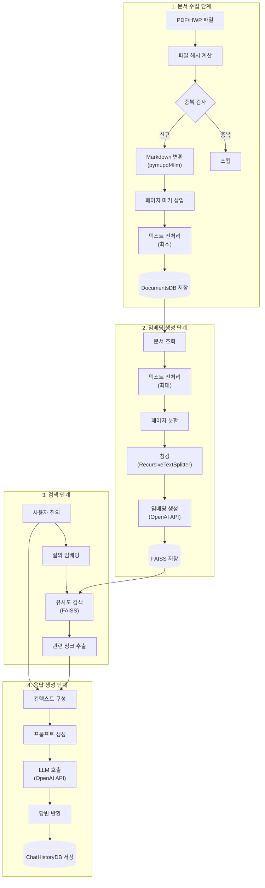

## 1. 프로젝트 개요

### 1.1. 미션 배경 및 목표

#### 1.1.1. 정부나라장터 환경 분석

정부나라장터는 대한민국 정부 및 공공기관의 조달 업무를 전자화한 통합 전자조달 시스템입니다. 2024년 기준 연간 총 거래실적은 약 156조 7,654억원에 달하며, 월평균 약 6,600건의 입찰공고가 게시됩니다. 각 공고는 평균 20페이지에서 100페이지에 이르는 방대한 분량의 제안요청서(RFP, Request for Proposal)를 포함하고 있습니다.

이러한 환경에서 입찰 참여를 희망하는 기업들은 하루에도 수백 건씩 쏟아지는 공고를 검토해야 하며, 한 건의 요청서당 수십 페이지 분량의 문서를 분석하는 데 막대한 시간과 인력을 투입해야 합니다. 특히 고객사별 맞춤 입찰 기회를 탐색하고 요구사항을 정확히 파악하는 과정에서 많은 어려움을 겪고 있습니다.

#### 1.1.2. 프로젝트 추진 배경

본 프로젝트는 이러한 문제를 해결하기 위해 시작되었습니다. 대량의 입찰 문서를 신속하고 정확하게 분석하여 핵심 정보를 추출하고, 사용자의 질문에 즉각적으로 답변할 수 있는 지능형 시스템의 필요성이 대두되었습니다. 전통적인 키워드 기반 검색 방식으로는 문서의 맥락을 이해하기 어렵고, 복잡한 요구사항을 정확히 파악하는 데 한계가 있었습니다.

RAG(Retrieval-Augmented Generation) 기술은 이러한 문제를 해결할 수 있는 효과적인 접근 방법입니다. 벡터 임베딩을 통해 문서의 의미를 수치화하고, 대규모 언어모델(LLM)을 활용하여 자연어 질의에 대해 정확하고 맥락에 맞는 답변을 생성할 수 있습니다.

#### 1.1.3. 핵심 해결 과제

본 프로젝트가 해결하고자 하는 핵심 과제는 다음과 같습니다.

첫째, PDF 및 HWP 형식의 입찰 문서를 자동으로 수집하고 처리 가능한 형태로 변환해야 합니다. 정부나라장터의 공고문은 대부분 PDF 형식으로 제공되며, 일부는 한글 문서(HWP) 형식으로 배포됩니다. 이러한 이질적인 문서 형식을 통합하여 처리할 수 있는 시스템이 필요합니다.

둘째, 변환된 문서를 효율적으로 검색할 수 있도록 벡터 임베딩 기반의 검색 시스템을 구축해야 합니다. 단순한 키워드 매칭이 아닌 의미 기반 검색을 통해 사용자의 질의 의도를 정확히 파악하고 관련성 높은 정보를 추출할 수 있어야 합니다.

셋째, 검색된 정보를 기반으로 자연스럽고 정확한 답변을 생성하는 LLM 기반 응답 시스템을 개발해야 합니다. 단순히 관련 문서를 나열하는 것이 아니라, 사용자의 질문에 대해 명확하고 구체적인 답변을 제공할 수 있어야 합니다.

넷째, 사용자 친화적인 인터페이스를 통해 복잡한 기술적 구조를 감추고, 누구나 쉽게 사용할 수 있는 시스템을 제공해야 합니다.

### 1.2. 프로젝트 정보

#### 1.2.1. 프로젝트명 및 팀 구성

본 프로젝트의 공식 명칭은 "RAG 기반 정부나라장터 입찰공고 분석 시스템"이며, 코드잇 AI 4기 과정의 중급 프로젝트로 진행되었습니다. 프로젝트 팀명은 'PEP(Public E-Procurement Partner)'로, 공공 전자조달의 동반자라는 의미를 담고 있습니다.

팀 구성은 각 분야의 전문성을 고려하여 역할을 분담하였습니다. 신승목 팀원은 데이터 엔지니어로서 문서 수집 및 원본 전처리를 담당하였으며, PDF 및 HWP 파일을 Markdown 형식으로 변환하고 데이터베이스에 저장하는 파이프라인을 구축하였습니다. 김명환 팀원은 머신러닝 엔지니어로서 임베딩 처리를 담당하였으며, Markdown 문서를 벡터 임베딩으로 변환하고 FAISS 인덱스에 저장하는 시스템을 개발하였습니다. 이민규 팀원은 AI 리서처로서 LLM 기반 정보 추출 및 요약 시스템을 개발하였으며, 프롬프트 엔지니어링과 RAG 평가 시스템을 구축하였습니다. 오형주 팀원은 프론트엔드 엔지니어로서 Streamlit 기반의 사용자 인터페이스를 개발하고 전체 시스템을 통합하는 역할을 수행하였습니다.

#### 1.2.2. 개발 기간 및 일정

프로젝트는 2025년 11월 10일부터 11월 28일까지 총 3주간 진행되었습니다. 개발 일정은 3개의 주요 단계로 구성되었습니다.

첫 번째 주(11월 10일~14일)는 기반 구축 단계로, 개발 환경 설정 및 초기화, 더미 데이터 생성, 데이터베이스 스키마 구축, UI 프로토타입 개발이 이루어졌습니다. 11월 14일에는 Week 1 통합 테스트를 완료하였습니다.

두 번째 주(11월 17일~21일)는 핵심 기능 개발 단계로, 각 팀원이 담당한 모듈을 병렬적으로 개발하였습니다. 신승목 팀원은 문서 수집 및 변환 모듈을, 김명환 팀원은 임베딩 처리 모듈을, 이민규 팀원은 LLM 챗봇 모듈을, 오형주 팀원은 UI 통합 모듈을 각각 개발하였습니다. 11월 19일부터는 모듈 통합 작업이 시작되었으며, 11월 21일에 Week 2 통합을 완료하였습니다.

세 번째 주(11월 24일~28일)는 최적화 및 마무리 단계로, 전체 통합 테스트, 성능 평가 및 최적화, 문서화 작업, 발표 자료 준비가 진행되었습니다. 11월 28일에 최종 발표를 통해 프로젝트를 완료하였습니다.

#### 1.2.3. 기술 스택 개요

본 프로젝트는 Python 기반의 최신 AI 및 데이터 처리 기술을 활용하여 구축되었습니다.

문서 처리 계층에서는 PyMuPDF와 pymupdf4llm을 사용하여 PDF 파일을 Markdown 형식으로 변환하였습니다. 데이터 저장을 위해서는 SQLite 데이터베이스를 사용하여 문서 메타데이터, 임베딩 정보, 채팅 이력을 관리하였습니다.

임베딩 및 검색 계층에서는 OpenAI의 text-embedding-3-small 모델을 사용하여 문서를 벡터로 변환하였으며, FAISS(Facebook AI Similarity Search) 라이브러리를 통해 고속 유사도 검색을 구현하였습니다. LangChain 프레임워크를 활용하여 문서 청킹, 임베딩 생성, 벡터스토어 관리를 통합적으로 처리하였습니다.

LLM 계층에서는 OpenAI의 GPT 시리즈 모델(gpt-5-mini, gpt-4o 등)을 사용하여 자연어 응답을 생성하였으며, LangChain의 ConversationChain 및 ConversationSummaryMemory를 통해 대화 컨텍스트를 관리하였습니다.

사용자 인터페이스는 Streamlit 프레임워크를 사용하여 구현하였으며, 직관적인 웹 기반 인터페이스를 통해 사용자가 시스템과 상호작용할 수 있도록 하였습니다.

시스템 설정 및 로깅을 위해서는 JSON 기반의 중앙 집중식 설정 관리 시스템과 Python logging 모듈 기반의 구조화된 로깅 시스템을 구축하였습니다.

### 1.3. 나라장터 사업 현황

#### 1.3.1. 거래 규모 및 입찰 건수

정부나라장터는 대한민국 공공조달 시장의 중심 플랫폼으로, 그 규모와 영향력이 매년 확대되고 있습니다. 2024년 기준 연간 총 거래실적은 약 156조 7,654억원에 달하며, 이는 국내 GDP의 약 7퍼센트에 해당하는 규모입니다.

월평균 입찰공고 건수는 약 6,600건으로, 하루 평균 약 220건의 새로운 공고가 게시됩니다. 이는 주말과 공휴일을 제외한 평일 기준으로는 하루 300건 이상의 공고가 올라오는 것을 의미합니다. 공고 유형은 물품 구매, 용역 발주, 공사 입찰 등 다양하며, 특히 정보시스템 구축 및 유지보수 용역이 전체 공고의 약 15퍼센트를 차지합니다.

공고당 평균 페이지 수는 20페이지에서 100페이지에 이르며, 복잡한 시스템 구축 프로젝트의 경우 200페이지를 초과하는 제안요청서도 흔히 발견됩니다. 각 문서에는 사업 개요, 과업 범위, 기술 요구사항, 제안 평가 기준, 계약 조건 등 입찰 참여에 필요한 모든 정보가 포함되어 있습니다.

#### 1.3.2. 문서 처리의 어려움

정부나라장터의 입찰 문서는 그 양과 복잡성으로 인해 효율적인 처리가 매우 어렵습니다.

첫째, 하루 수백 건의 RFP를 검토해야 하는 물리적 시간 부족 문제가 있습니다. 중소기업의 경우 입찰 담당 인력이 제한적이어서 모든 공고를 꼼꼼히 검토하는 것이 사실상 불가능합니다. 이로 인해 자사에 적합한 입찰 기회를 놓치는 경우가 빈번하게 발생합니다.

둘째, 한 요청서당 수십 페이지 분량의 문서를 분석하는 데 소요되는 시간이 막대합니다. 숙련된 입찰 담당자라 하더라도 한 건의 제안요청서를 완전히 이해하고 핵심 요구사항을 파악하는 데 평균 2시간에서 4시간이 소요됩니다. 복잡한 시스템 구축 프로젝트의 경우에는 하루 이상의 분석 시간이 필요하기도 합니다.

셋째, 고객사별 맞춤 입찰 기회 탐색에 막대한 시간이 소요됩니다. 각 기업은 자사의 강점과 역량에 맞는 입찰 건을 선별해야 하는데, 이를 위해서는 과거 수주 이력, 보유 기술, 인력 구성 등을 종합적으로 고려해야 합니다. 현재는 이러한 과정이 대부분 수작업으로 이루어지고 있어 비효율적입니다.

넷째, 문서 형식의 다양성과 비표준화 문제가 있습니다. 대부분의 공고는 PDF 형식으로 제공되지만, 일부 기관은 HWP 형식을 사용하며, 같은 형식이라도 작성 스타일과 구조가 발주 기관마다 다릅니다. 이로 인해 자동화된 처리가 어렵고, 정보 추출의 정확도가 낮아지는 문제가 발생합니다.

#### 1.3.3. RAG 시스템 도입 필요성

이러한 문제들을 해결하기 위해 RAG 시스템의 도입이 필수적입니다.

RAG 시스템은 벡터 임베딩 기반의 의미론적 검색을 통해 사용자의 질의 의도를 정확히 파악하고, 방대한 문서 집합에서 관련성 높은 정보를 신속하게 추출할 수 있습니다. 전통적인 키워드 기반 검색과 달리, 문장의 의미와 맥락을 이해하여 동의어나 유사 표현도 정확히 찾아낼 수 있습니다.

또한 LLM을 활용한 자연어 응답 생성을 통해 사용자가 복잡한 문서 구조를 직접 탐색하지 않아도 필요한 정보를 명확하게 제공받을 수 있습니다. 예를 들어 "이 사업의 예산 규모는 얼마인가요?"와 같은 직접적인 질문뿐만 아니라, "이 사업에 참여하려면 어떤 자격 요건이 필요한가요?"와 같은 복합적인 질문에도 정확한 답변을 생성할 수 있습니다.

RAG 시스템은 또한 검색 결과에 대한 출처 정보를 함께 제공하여 사용자가 답변의 신뢰성을 검증할 수 있도록 합니다. 각 답변에는 해당 정보가 추출된 문서명과 페이지 번호가 포함되어, 필요한 경우 원본 문서를 직접 확인할 수 있습니다.

마지막으로 대화형 인터페이스를 통해 연속적인 질의응답이 가능하며, 이전 대화 컨텍스트를 유지하여 보다 자연스러운 정보 탐색이 가능합니다. 사용자는 마치 전문가와 대화하는 것처럼 자연스럽게 필요한 정보를 얻을 수 있습니다.

### 1.4. 시스템 아키텍처

#### 1.4.1. 전체 구조도

본 시스템의 전체 아키텍처는 계층적 구조로 설계되었으며, 각 계층은 명확히 분리된 책임과 인터페이스를 가지고 있습니다.

사용자 계층은 Streamlit 기반의 웹 인터페이스로 구성되며, 사용자는 이를 통해 문서를 업로드하고 질문을 입력하며 답변을 확인합니다.

애플리케이션 계층은 사용자 요청을 받아 적절한 비즈니스 로직 모듈로 라우팅하는 역할을 수행합니다. app.py 파일이 이 계층의 중심에 위치하며, 전체 시스템의 워크플로우를 조율합니다.

비즈니스 로직 계층은 네 개의 주요 프로세서로 구성됩니다. DocumentProcessor는 PDF 및 HWP 파일을 Markdown으로 변환하고, EmbeddingProcessor는 변환된 문서를 청킹하여 벡터 임베딩을 생성합니다. Retrieval은 사용자 질의에 대해 유사도 기반 검색을 수행하고, LLMProcessor는 검색 결과를 바탕으로 자연어 답변을 생성합니다.

데이터 접근 계층은 각각의 데이터 저장소에 대한 추상화된 인터페이스를 제공합니다. DocumentsDB는 문서 메타데이터를 관리하고, VectorStoreManager는 FAISS 벡터 인덱스를 관리하며, ChatHistoryDB는 대화 이력을 관리합니다.

저장 계층은 실제 데이터가 저장되는 물리적 스토리지로, SQLite 데이터베이스 파일과 FAISS 인덱스 파일로 구성됩니다.

외부 서비스는 OpenAI API를 통해 임베딩 생성 및 LLM 응답 생성 기능을 제공받습니다.

#### 1.4.2. 데이터 파이프라인 흐름

시스템의 데이터 처리 파이프라인은 크게 문서 수집 단계, 임베딩 생성 단계, 검색 단계, 응답 생성 단계로 구성됩니다.

문서 수집 단계에서는 먼저 입력된 PDF 또는 HWP 파일의 해시값을 계산하여 중복 여부를 확인합니다. 중복되지 않은 신규 파일인 경우 pymupdf4llm 라이브러리를 사용하여 Markdown 형식으로 변환합니다. 변환된 텍스트에는 페이지 구분을 위한 마커가 삽입되며, 기본적인 전처리를 거쳐 DocumentsDB에 저장됩니다.

임베딩 생성 단계에서는 저장된 문서를 조회하여 보다 강력한 전처리를 수행합니다. 이 단계에서는 Markdown 요소 제거, 공백 정리, 보호 블록 마스킹 등의 작업이 이루어집니다. 전처리된 텍스트는 페이지 마커를 기준으로 분할되고, RecursiveCharacterTextSplitter를 사용하여 적절한 크기의 청크로 나뉩니다. 각 청크는 OpenAI API를 통해 벡터 임베딩으로 변환되어 FAISS 인덱스에 저장됩니다.

검색 단계에서는 사용자의 질의를 동일한 방식으로 임베딩으로 변환한 후, FAISS를 사용하여 코사인 유사도 기반의 최근접 이웃 검색을 수행합니다. 검색 결과로는 유사도가 높은 상위 k개의 청크가 반환됩니다.

응답 생성 단계에서는 검색된 청크들을 하나의 컨텍스트로 구성하고, 사용자의 원래 질의와 함께 프롬프트를 생성합니다. 이 프롬프트는 OpenAI의 LLM API로 전송되며, 생성된 답변은 사용자에게 반환됩니다. 질의와 답변은 모두 ChatHistoryDB에 저장되어 대화 이력으로 관리됩니다.

#### 1.4.3. 주요 기술 구성 요소

시스템의 주요 기술 구성 요소는 다음과 같습니다.

Config 모듈은 중앙 집중식 설정 관리를 담당합니다. config.json 파일을 통해 모든 설정값을 관리하며, 싱글톤 패턴을 사용하여 애플리케이션 전체에서 일관된 설정을 사용할 수 있도록 합니다. 주요 설정 항목으로는 OpenAI API 키, 모델명, 청킹 파라미터, 검색 임계값, 데이터베이스 경로 등이 있습니다.

DocumentProcessor 모듈은 PDF 및 HWP 파일을 Markdown으로 변환하는 역할을 수행합니다. PyMuPDF 라이브러리를 사용하여 PDF의 텍스트와 구조를 추출하고, pymupdf4llm을 통해 Markdown 형식으로 변환합니다. 각 페이지에는 고유한 마커가 삽입되어 이후 처리 단계에서 페이지 단위 분할이 가능하도록 합니다.

EmbeddingProcessor 모듈은 문서 청킹 및 임베딩 생성을 담당합니다. 3단계 전처리 파이프라인을 통해 문서를 정제하고, RecursiveCharacterTextSplitter를 사용하여 토큰 수 기반으로 청크를 생성합니다. 각 청크는 OpenAI의 text-embedding-3-small 모델을 통해 1536차원의 벡터로 변환됩니다.

VectorStoreManager 모듈은 FAISS 벡터 인덱스를 관리합니다. LangChain의 FAISS 래퍼를 사용하여 벡터 추가, 삭제, 검색 기능을 제공하며, chunk_map 자료구조를 통해 효율적인 중복 검사 및 업데이트를 지원합니다. FAISS의 IndexFlatL2를 사용하여 L2 거리 기반의 정확한 유사도 검색을 수행합니다.

Retrieval 모듈은 사용자 질의에 대한 검색을 수행합니다. 청크 기반 검색과 페이지 기반 검색 두 가지 모드를 지원하며, 메타데이터 필터링을 통해 특정 파일이나 페이지 범위로 검색을 제한할 수 있습니다. 페이지 기반 검색에서는 검색된 청크 주변의 페이지를 자동으로 확장하여 더 넓은 컨텍스트를 제공합니다.

LLMProcessor 모듈은 검색 결과를 바탕으로 자연어 응답을 생성합니다. OpenAI의 GPT 모델을 사용하며, 모델별로 최적화된 파라미터를 자동으로 적용합니다. ConversationChain과 ConversationSummaryMemory를 사용하여 대화 컨텍스트를 유지하고, 긴 대화의 경우 자동으로 요약하여 토큰 한도를 관리합니다.

ChatHistoryDB 모듈은 대화 이력을 SQLite 데이터베이스에 저장하고 관리합니다. 세션 기반으로 대화를 그룹화하며, 각 메시지에는 역할(user/assistant), 내용, 검색된 청크 정보, 타임스탬프 등이 포함됩니다.

Logging 모듈은 구조화된 로깅 시스템을 제공합니다. KST 타임존을 적용하고, 콘솔 및 파일 핸들러를 통해 로그를 출력하며, RotatingFileHandler를 사용하여 로그 파일을 자동으로 로테이션합니다.

이러한 모듈들은 명확한 인터페이스를 통해 상호작용하며, 각각 독립적으로 테스트 및 개선이 가능한 구조로 설계되었습니다. 이를 통해 시스템의 유지보수성과 확장성을 확보하였습니다.

---

## 2. 데이터 수집 및 전처리 (신승목)

### 2.1. 문서 수집 전략

#### 2.1.1. PDF 및 HWP 파일 수집 프로세스

본 프로젝트의 데이터 수집 단계는 정부나라장터에서 제공하는 입찰 공고 문서를 체계적으로 수집하고 처리하는 것에서 시작됩니다. 정부나라장터는 공공데이터포털을 통해 입찰 공고 정보 조회 API를 제공하고 있으며, 이를 활용하여 자동화된 문서 수집이 가능합니다.

문서 수집 프로세스는 먼저 공공데이터포털의 입찰공고목록정보조회 API를 호출하여 최신 공고 목록을 조회하는 것으로 시작됩니다. 이 API는 공고번호, 공고명, 발주기관, 입찰마감일, 첨부파일 정보 등의 메타데이터를 제공합니다. API 응답에 포함된 첨부파일 URL을 통해 제안요청서 원본 파일을 다운로드할 수 있습니다.

정부나라장터의 공고 문서는 주로 PDF 형식으로 제공되며, 일부 발주기관은 한글 문서인 HWP 형식을 사용합니다. 본 시스템에서는 PDF 문서 처리에 집중하였으며, PyMuPDF 라이브러리를 통해 안정적인 변환 기능을 구현하였습니다. HWP 문서의 경우 향후 확장을 고려하여 아키텍처 상에는 반영하였으나, 현재 프로토타입 단계에서는 PDF 처리에 집중하였습니다.

수집된 파일은 원본 그대로 data 디렉토리에 저장되며, 파일명은 공고번호와 공고명을 결합한 형태로 표준화됩니다. 예를 들어 공고번호가 "20251120001"이고 공고명이 "정보시스템 구축 용역"인 경우, "20251120001_정보시스템_구축_용역.pdf"와 같은 형식으로 저장됩니다. 이러한 명명 규칙은 파일 관리의 일관성을 유지하고 추후 검색 및 참조를 용이하게 합니다.

파일 다운로드 과정에서는 네트워크 오류나 서버 응답 지연에 대비한 재시도 메커니즘을 구현하였습니다. 최대 3회까지 재시도하며, 각 시도 사이에는 지수 백오프 방식으로 대기 시간을 증가시킵니다. 이를 통해 일시적인 네트워크 문제로 인한 수집 실패를 최소화하였습니다.

#### 2.1.2. 파일 해시 기반 중복 검사

대량의 문서를 처리하는 시스템에서는 중복 문서를 효율적으로 감지하고 제거하는 것이 매우 중요합니다. 동일한 문서를 여러 번 처리하는 것은 저장 공간의 낭비뿐만 아니라 검색 성능 저하의 원인이 됩니다. 본 시스템에서는 SHA-256 해시 알고리즘을 사용한 파일 기반 중복 검사를 구현하였습니다.

SHA-256은 암호학적 해시 함수로, 입력 파일의 내용에 기반하여 64자리 16진수 문자열을 생성합니다. 이 해시값은 파일의 고유한 지문과 같은 역할을 하며, 파일 내용이 단 한 바이트라도 다르면 완전히 다른 해시값이 생성됩니다. 반대로 파일명이나 메타데이터가 달라도 내용이 동일하다면 같은 해시값을 갖게 됩니다.

중복 검사 프로세스는 다음과 같이 진행됩니다. 새로운 PDF 파일이 입력되면 DocumentProcessor는 먼저 전체 파일 내용을 읽어 SHA-256 해시값을 계산합니다. 계산된 해시값은 DocumentsDB의 file_hash 컬럼에서 조회되며, 이미 동일한 해시값이 존재하는 경우 해당 파일은 중복으로 판단되어 처리를 건너뜁니다. 중복이 아닌 경우에만 실제 Markdown 변환 및 데이터베이스 저장 작업이 수행됩니다.

이러한 방식은 여러 가지 장점을 제공합니다. 첫째, 파일명이 다르더라도 내용이 동일한 문서를 정확히 식별할 수 있습니다. 예를 들어 동일한 제안요청서가 수정본이라는 이름으로 재공고되거나, 다른 경로에서 다운로드된 경우에도 중복을 감지할 수 있습니다. 둘째, 해시 기반 조회는 데이터베이스 인덱스를 활용하여 매우 빠르게 수행됩니다. 수만 건의 문서가 저장되어 있어도 밀리초 단위로 중복 여부를 판단할 수 있습니다. 셋째, 해시값은 파일 크기와 무관하게 항상 64자리로 고정되어 있어 저장 공간을 효율적으로 사용합니다.

실제 프로젝트 진행 중 수집한 데이터에서도 중복 문서가 발견되었습니다. 중복데이터 분석보고서에 따르면, 동일한 해시값을 가진 파일 쌍이 두 건 발견되었습니다. 첫 번째 사례는 "BioIN 의료기기산업 종합정보시스템 기능개선 사업"과 "한국보건산업진흥원 의료기기산업 종합정보시스템 기능" 파일이 동일한 해시값 20cdb1e78194ab2496ca941e3c9a4a2b74558dd007535964517584cab67be0a7을 가지고 있었습니다. 두 번째 사례는 "국가과학기술지식정보서비스 통합정보시스템 고도화 용역"과 "한국한의학연구원 통합정보시스템 고도화 용역" 파일이 동일한 해시값 fe07779f264abfd5f420f332adb65779a33142a5506581345f5cbe4803be53e8을 가지고 있었습니다.

이러한 중복은 동일한 시스템 구축 사업이 여러 기관에 발주되면서 발생한 것으로 추정됩니다. 중복 검사 메커니즘이 없었다면 이러한 문서들이 각각 처리되어 불필요한 저장 공간을 차지하고 검색 결과에 중복된 정보가 나타났을 것입니다. 중복 검사를 통해 이러한 문제를 사전에 방지할 수 있었습니다.

#### 2.1.3. 메타데이터 추출 및 관리

문서 처리 과정에서 원본 파일의 메타데이터를 체계적으로 추출하고 관리하는 것은 향후 검색 및 필터링 기능의 핵심 기반이 됩니다. 본 시스템에서는 파일 수준의 메타데이터와 문서 수준의 메타데이터를 구분하여 관리합니다.

파일 수준 메타데이터는 파일 자체의 물리적 속성을 나타냅니다. 여기에는 파일 해시값, 파일명, 파일 크기, 총 페이지 수, 생성 시각, 수정 시각 등이 포함됩니다. 이러한 정보는 DocumentsDB의 TB_DOCUMENTS 테이블에 저장되며, file_hash를 기본 키로 사용하여 각 파일을 고유하게 식별합니다.

PyMuPDF 라이브러리를 사용하여 PDF 파일을 열면 문서 메타데이터에 접근할 수 있습니다. PDF 표준에 따르면 문서 메타데이터에는 제목, 저자, 주제, 키워드, 생성 도구, 생성 날짜, 수정 날짜 등의 정보가 포함될 수 있습니다. 그러나 정부나라장터의 공고 문서들은 이러한 메타데이터가 일관되게 작성되어 있지 않은 경우가 많습니다. 일부 문서는 제목과 저자 정보가 정확히 기재되어 있지만, 다른 문서들은 메타데이터가 비어 있거나 의미 없는 값으로 채워져 있는 경우가 빈번합니다.

이러한 한계를 보완하기 위해 파일명에서 추출한 정보를 활용합니다. 앞서 설명한 바와 같이 파일명은 공고번호와 공고명을 포함하도록 표준화되어 있으며, 이로부터 발주기관, 사업명, 사업 유형 등의 정보를 추론할 수 있습니다. 예를 들어 파일명에 "정보시스템", "구축", "용역" 등의 키워드가 포함되어 있다면 이는 정보시스템 구축 용역 사업임을 나타냅니다.

총 페이지 수는 문서의 규모를 파악하는 중요한 지표입니다. PyMuPDF를 통해 PDF 파일을 열면 page_count 속성으로 전체 페이지 수를 확인할 수 있습니다. 이 정보는 사용자가 문서의 분량을 사전에 파악하고, 처리 시간을 예측하는 데 도움을 줍니다. 또한 페이지 수가 비정상적으로 많거나 적은 문서를 필터링하는 데도 활용됩니다.

생성 시각과 수정 시각은 KST(Korean Standard Time) 기준으로 기록됩니다. Python의 datetime 모듈과 pytz 라이브러리를 사용하여 UTC 시각을 KST로 변환하며, 데이터베이스에는 ISO 8601 형식의 문자열로 저장됩니다. 이를 통해 문서가 언제 시스템에 추가되었고 언제 마지막으로 갱신되었는지를 명확히 추적할 수 있습니다.

메타데이터 관리는 단순한 정보 저장을 넘어 시스템의 투명성과 추적성을 높이는 역할을 합니다. 사용자는 메타데이터를 통해 검색 결과의 출처를 명확히 파악할 수 있으며, 시스템 관리자는 메타데이터 통계를 통해 데이터베이스의 상태를 모니터링할 수 있습니다.

### 2.2. 원본 전처리

#### 2.2.1. Markdown 변환 (pymupdf4llm)

PDF 문서를 기계가 처리할 수 있는 형태로 변환하는 것은 RAG 시스템 구축의 첫 번째 관문입니다. PDF는 인쇄를 위해 설계된 형식으로, 텍스트뿐만 아니라 이미지, 폰트, 레이아웃 정보 등을 포함합니다. 이러한 복잡한 구조를 단순한 텍스트로 추출하면 문서의 구조적 정보가 손실되어 이후 처리 단계에서 문제가 발생할 수 있습니다.

본 시스템에서는 pymupdf4llm 라이브러리를 사용하여 PDF를 Markdown 형식으로 변환합니다. Markdown은 간단한 문법으로 문서의 구조를 표현할 수 있는 경량 마크업 언어로, 헤더, 리스트, 테이블, 강조 등의 요소를 명확히 구분할 수 있습니다. 이를 통해 원본 문서의 계층 구조와 의미를 최대한 보존할 수 있습니다.

pymupdf4llm은 PyMuPDF 라이브러리를 기반으로 하며, LLM 친화적인 Markdown 변환에 최적화되어 있습니다. 일반적인 텍스트 추출 라이브러리와 달리, pymupdf4llm은 다음과 같은 고급 기능을 제공합니다. 첫째, 문서의 논리적 구조를 분석하여 제목과 본문을 구분하고, 적절한 Markdown 헤더 레벨을 할당합니다. 둘째, 테이블 구조를 인식하여 Markdown 테이블 문법으로 변환합니다. 셋째, 리스트 항목을 감지하여 순서 있는 리스트와 순서 없는 리스트로 구분합니다. 넷째, 이미지는 대체 텍스트로 표시하거나 제거하는 옵션을 제공합니다.

변환 프로세스는 페이지 단위로 진행됩니다. DocumentProcessor의 markdown_with_progress 메서드는 PDF 파일을 열고 각 페이지를 순회하면서 pymupdf4llm.to_markdown 함수를 호출합니다. 이 함수는 페이지의 레이아웃을 분석하고 텍스트 블록을 추출한 후, 적절한 Markdown 요소로 변환합니다. 각 페이지의 변환이 완료되면 진행 상황이 콜백 함수를 통해 UI에 전달되어 사용자가 실시간으로 처리 상태를 확인할 수 있습니다.

변환 과정에서 발생할 수 있는 예외 상황도 고려되었습니다. 일부 페이지는 스캔된 이미지로만 구성되어 있어 텍스트를 추출할 수 없는 경우가 있습니다. 이러한 페이지는 빈 페이지로 감지되며, ERROR_PAGE_MARKER 또는 EMPTY_PAGE_MARKER가 삽입됩니다. 또한 암호화되거나 손상된 페이지를 만나면 오류를 로깅하고 해당 페이지를 건너뜁니다. 이를 통해 일부 페이지의 문제로 인해 전체 문서 처리가 중단되는 것을 방지합니다.

변환된 Markdown 텍스트는 가독성이 높고 구조화되어 있어 이후 전처리 단계에서 다루기 용이합니다. 예를 들어 헤더를 기준으로 섹션을 분리하거나, 테이블 데이터를 파싱하거나, 리스트 항목을 추출하는 등의 작업이 간단한 정규표현식이나 문자열 처리로 가능합니다.

#### 2.2.2. DocumentProcessor 기반 최소 전처리

PDF에서 Markdown으로 변환된 직후의 텍스트는 아직 많은 불필요한 요소를 포함하고 있습니다. 과도한 공백, 연속된 개행, 라인 앞뒤의 공백 등은 텍스트의 가독성을 해치고 토큰 수를 불필요하게 증가시킵니다. DocumentProcessor의 clean_markdown_text 메서드는 이러한 요소들을 제거하는 최소한의 전처리를 수행합니다.

최소 전처리는 원본 텍스트의 내용과 구조를 최대한 보존하면서 형식적인 문제만을 해결하는 것을 목표로 합니다. 이 단계에서는 세 가지 주요 작업이 수행됩니다.

첫 번째는 공백 및 탭의 정규화입니다. 연속된 공백이나 탭은 단일 공백으로 변환됩니다. 정규표현식 패턴 r'[ \t]+'를 사용하여 공백과 탭이 하나 이상 연속된 경우를 찾아 단일 공백으로 치환합니다. 예를 들어 "사업    기간"이라는 텍스트는 "사업 기간"으로 정규화됩니다. 이는 불필요한 공백으로 인한 토큰 낭비를 방지하면서도 단어 간 구분은 유지합니다.

두 번째는 연속된 개행의 축소입니다. 문서 변환 과정에서 발생한 과도한 빈 줄을 제거하여 텍스트를 압축합니다. 정규표현식 패턴 r'\n{3,}'를 사용하여 세 번 이상 연속된 개행을 찾아 두 번의 개행으로 치환합니다. 이는 문단 구분은 유지하면서도 불필요한 빈 공간을 제거합니다. 예를 들어 다섯 줄의 빈 줄이 있는 경우 두 줄로 줄어들어 토큰 수가 감소합니다.

세 번째는 각 라인의 앞뒤 공백 제거입니다. 텍스트를 줄 단위로 분리한 후 각 줄의 strip 메서드를 호출하여 앞뒤 공백을 제거하고, 다시 줄바꿈으로 결합합니다. 이를 통해 라인 시작이나 끝에 불필요하게 삽입된 공백을 제거할 수 있습니다.

최소 전처리의 철학은 보수적 접근입니다. 텍스트의 의미나 구조를 변경할 수 있는 작업은 이 단계에서 수행하지 않습니다. 예를 들어 Markdown 요소의 제거, HTML 태그 제거, 특수문자 처리 등은 다음 단계인 EmbeddingProcessor의 전처리에서 수행됩니다. 이러한 분리는 원본 데이터를 최대한 보존하여 향후 다른 방식의 전처리가 필요할 때 원본에서 다시 시작할 수 있도록 합니다.

실제 정부나라장터 문서에 적용한 결과를 살펴보면 그 효과를 명확히 알 수 있습니다. 원본 PDF에서 변환된 직후의 텍스트는 "   ㅇ  (사 업 명)   2025 구미아시아육상경기선수권대회    종합정보시스템"과 같이 불규칙한 공백이 포함되어 있었습니다. 최소 전처리를 거친 후에는 "ㅇ (사 업 명) 2025 구미아시아육상경기선수권대회 종합정보시스템"으로 정리되어 가독성이 크게 향상되었습니다.

#### 2.2.3. 페이지 마커 삽입 전략

Markdown으로 변환된 문서는 하나의 긴 텍스트 스트림으로 존재합니다. 이 상태에서는 특정 정보가 원본 문서의 몇 페이지에 있었는지 알 수 없으며, 이는 검색 결과의 출처를 명시할 때 큰 문제가 됩니다. 사용자에게 "공고문.pdf의 15페이지를 참조하세요"라고 안내하는 것과 단순히 "공고문.pdf를 참조하세요"라고 하는 것은 사용자 경험에서 큰 차이를 만듭니다.

이러한 문제를 해결하기 위해 페이지 마커 삽입 전략을 도입하였습니다. 각 페이지의 변환된 텍스트 앞에는 고유한 페이지 마커가 삽입되어 페이지 경계를 명시합니다. 페이지 마커의 형식은 "--- 페이지 N ---"이며, N은 페이지 번호를 나타냅니다. 이 형식은 시각적으로 명확하고, 정규표현식으로 쉽게 감지할 수 있으며, 실제 문서 내용과 충돌할 가능성이 낮도록 설계되었습니다.

페이지 마커는 두 가지 중요한 역할을 수행합니다. 첫째는 청킹 단계에서의 페이지 단위 분할입니다. EmbeddingProcessor는 페이지 마커를 기준으로 텍스트를 분리하여 각 페이지를 독립적으로 처리할 수 있습니다. 이를 통해 페이지 경계를 넘나드는 청크 생성을 방지하고, 각 청크가 어느 페이지 범위에 속하는지 명확히 추적할 수 있습니다.

둘째는 검색 결과의 출처 표시입니다. 사용자가 질의를 입력하면 시스템은 관련 청크를 검색하고 LLM 응답을 생성합니다. 이때 각 청크의 메타데이터에는 start_page와 end_page 정보가 포함되어 있어, "이 정보는 공고문.pdf의 15페이지에서 17페이지에 있습니다"와 같은 구체적인 출처를 제공할 수 있습니다.

특수한 상황을 위한 특수 마커도 정의되었습니다. ERROR_PAGE_MARKER는 "--- [오류페이지] ---" 형식으로, 변환 중 오류가 발생한 페이지를 표시합니다. EMPTY_PAGE_MARKER는 "--- [빈페이지] ---" 형식으로, 텍스트가 없거나 임계값 이하의 텍스트만 포함된 페이지를 표시합니다. 이러한 특수 마커가 있는 페이지는 임베딩 단계에서 자동으로 건너뛰어 불필요한 처리를 방지합니다.

페이지 마커의 삽입 위치는 신중하게 결정되어야 합니다. 마커는 각 페이지 내용의 시작 부분에 삽입되며, 페이지 내용의 일부로 간주되지 않도록 전후에 개행이 추가됩니다. 예를 들어 페이지 5의 내용이 "사업 개요"로 시작한다면, 최종 텍스트는 "--- 페이지 5 ---\n\n사업 개요"와 같은 형태가 됩니다.

Config 설정에서 MARKER_DUMP_ENABLED가 True로 설정되면 페이지 마커가 삽입된 전체 텍스트가 data/markers 디렉토리에 별도 파일로 저장됩니다. 이는 디버깅과 검증을 위한 기능으로, 개발자가 마커 삽입이 올바르게 수행되었는지 시각적으로 확인할 수 있게 합니다.

### 2.3. 데이터베이스 설계

#### 2.3.1. documents_db 스키마

문서 메타데이터를 체계적으로 관리하기 위해 SQLite 데이터베이스를 사용하는 DocumentsDB 클래스가 설계되었습니다. SQLite는 파일 기반의 경량 데이터베이스로, 별도의 서버 설치 없이 애플리케이션에 내장하여 사용할 수 있어 프로토타입 개발에 적합합니다.

TB_DOCUMENTS 테이블은 문서 정보를 저장하는 핵심 테이블입니다. 스키마는 다음과 같이 구성됩니다.

file_hash 컬럼은 TEXT 타입의 기본 키로 정의됩니다. SHA-256 알고리즘으로 생성된 64자리 16진수 문자열이 저장되며, 각 문서를 고유하게 식별합니다. PRIMARY KEY 제약을 통해 동일한 해시값이 중복 저장되는 것을 방지하며, 이는 앞서 설명한 중복 검사 메커니즘의 기반이 됩니다.

file_name 컬럼은 TEXT 타입으로 NOT NULL 제약이 적용됩니다. 원본 파일의 이름을 저장하며, UNIQUE 제약을 통해 동일한 파일명이 중복되지 않도록 합니다. 이는 파일명 기반 검색을 지원하고, 사용자에게 친숙한 파일 식별자를 제공합니다.

total_pages 컬럼은 INTEGER 타입으로 NOT NULL 제약이 적용됩니다. 원본 PDF의 총 페이지 수를 저장하며, 기본값은 0입니다. 이 정보는 문서의 규모를 파악하고, 처리 시간을 예측하는 데 활용됩니다.

file_size 컬럼은 INTEGER 타입으로 NOT NULL 제약이 적용됩니다. 원본 파일의 크기를 바이트 단위로 저장하며, 기본값은 0입니다. 파일 크기는 디스크 공간 관리와 통계 생성에 사용됩니다.

text_content 컬럼은 TEXT 타입으로 변환된 Markdown 텍스트의 전체 내용을 저장합니다. 이 컬럼은 NULL을 허용하며, 대용량 텍스트를 저장할 수 있도록 설계되었습니다. SQLite의 TEXT 타입은 최대 2GB까지 저장할 수 있어 대부분의 문서를 충분히 수용합니다.

created_at 컬럼은 TIMESTAMP 타입으로 레코드가 생성된 시각을 KST 기준으로 저장합니다. 기본값은 CURRENT_TIMESTAMP에 9시간을 더한 값으로 설정되어 한국 시간대를 반영합니다.

updated_at 컬럼은 TIMESTAMP 타입으로 레코드가 마지막으로 수정된 시각을 KST 기준으로 저장합니다. 기본값은 created_at과 동일하게 설정되며, 문서가 재처리될 때마다 갱신됩니다.

이러한 스키마 설계는 문서 관리의 기본 요구사항을 충족하면서도 향후 확장 가능성을 고려하였습니다. 예를 들어 발주기관, 사업 분류, 입찰 마감일 등의 추가 메타데이터가 필요해지면 새로운 컬럼을 추가하는 방식으로 쉽게 확장할 수 있습니다.

#### 2.3.2. 파일 메타데이터 관리

DocumentsDB 클래스는 파일 메타데이터에 대한 CRUD(Create, Read, Update, Delete) 작업을 추상화된 인터페이스로 제공합니다. 이를 통해 상위 계층의 코드는 SQL 쿼리의 세부 사항을 알 필요 없이 직관적인 메서드 호출만으로 데이터를 관리할 수 있습니다.

insert_text_content 메서드는 새로운 문서 정보를 데이터베이스에 삽입합니다. 이 메서드는 file_name, file_hash, total_pages, file_size, text_content를 파라미터로 받아 TB_DOCUMENTS 테이블에 INSERT 쿼리를 실행합니다. 파일명이 비어 있거나 None인 경우 ValueError 예외를 발생시켜 잘못된 데이터가 저장되는 것을 방지합니다. 중복된 file_hash나 file_name이 있는 경우 SQLite의 UNIQUE 제약 위반 예외가 발생하며, 이는 호출자에게 전파되어 적절한 오류 처리를 할 수 있게 합니다.

get_document_by_hash 메서드는 file_hash를 기준으로 문서 정보를 조회합니다. 해시값이 일치하는 레코드가 있으면 딕셔너리 형태로 반환하고, 없으면 None을 반환합니다. 이 메서드는 중복 검사 단계에서 핵심적으로 사용되며, 인덱스를 통한 빠른 조회가 가능합니다.

get_documents_all 메서드는 데이터베이스의 모든 문서를 조회하여 리스트로 반환합니다. 이는 전체 문서 목록을 UI에 표시하거나, 일괄 처리를 수행할 때 사용됩니다. 대량의 문서가 저장된 경우 메모리 사용량이 증가할 수 있으므로, 향후에는 페이지네이션이나 제너레이터 기반 접근으로 개선할 수 있습니다.

get_document_stats 메서드는 데이터베이스의 통계 정보를 계산하여 반환합니다. 총 파일 수, 총 페이지 수, 총 파일 크기(바이트 및 메가바이트 단위)를 포함하는 딕셔너리를 반환합니다. 이 정보는 시스템 모니터링과 용량 계획에 활용됩니다.

search_documents 메서드는 파일명 또는 file_hash로 문서를 검색합니다. search_type 파라미터를 통해 검색 방식을 지정할 수 있으며, 'auto' 모드에서는 검색어가 64자리 16진수 문자열이면 해시 검색을, 그렇지 않으면 파일명 LIKE 검색을 수행합니다. 이를 통해 사용자는 해시값이나 파일명 중 편한 방식으로 문서를 찾을 수 있습니다.

모든 데이터베이스 작업은 context manager 패턴을 사용하여 트랜잭션을 관리합니다. _get_connection 메서드는 SQLite 연결 객체를 생성하고 row_factory를 sqlite3.Row로 설정하여 결과를 딕셔너리처럼 접근할 수 있게 합니다. with 문을 통해 자동으로 커밋되고 연결이 종료되므로, 리소스 누수를 방지하고 코드의 안전성을 높입니다.

#### 2.3.3. 재현성 보장 메커니즘

RAG 시스템의 품질을 평가하고 개선하기 위해서는 동일한 입력에 대해 동일한 결과를 재현할 수 있어야 합니다. 이를 위해 파일 해시 기반의 재현성 보장 메커니즘이 설계되었습니다.

file_hash는 문서 내용의 지문으로 작용합니다. 동일한 PDF 파일은 언제 어디서 처리하더라도 항상 같은 해시값을 생성합니다. 이 해시값을 기본 키로 사용함으로써, 동일한 문서는 시스템에 단 한 번만 저장되고 처리됩니다.

Markdown 변환 결과는 text_content 컬럼에 저장되어 원본 데이터로서 보존됩니다. 이후 임베딩 처리 과정에서 전처리 방식이나 청킹 전략이 변경되더라도, text_content에서 다시 읽어와 재처리할 수 있습니다. 이는 실험적인 개선을 시도할 때 매번 PDF 변환을 다시 수행할 필요가 없게 하여 개발 속도를 크게 향상시킵니다.

created_at과 updated_at 타임스탬프는 문서의 생명주기를 추적합니다. 특정 시점 이후에 추가되거나 변경된 문서만을 선택적으로 처리할 수 있어, 증분 업데이트가 가능합니다. 예를 들어 매일 밤 신규 공고를 수집하는 배치 작업에서는 어제 이후 created_at을 가진 문서만을 임베딩 처리하면 됩니다.

데이터베이스 버전 관리를 위해 PRAGMA user_version을 사용합니다. 스키마가 변경될 때마다 버전 번호를 증가시키고, 데이터베이스 초기화 시 현재 버전을 확인하여 필요한 경우 마이그레이션을 수행합니다. 현재는 버전 1이지만, 향후 컬럼 추가나 인덱스 변경이 필요할 때 이 메커니즘을 통해 기존 데이터를 보존하면서 스키마를 업데이트할 수 있습니다.

### 2.4. 중복 데이터 분석 결과

#### 2.4.1. 해시 기반 중복 검출

프로젝트 진행 중 수집한 정부나라장터 공고 문서에 대해 해시 기반 중복 검사를 수행한 결과, 두 건의 중복 사례가 발견되었습니다. 이는 전체 수집 문서의 일부에 해당하지만, 중복 검사 메커니즘의 필요성을 입증하는 중요한 사례입니다.

첫 번째 중복 사례는 해시값 20cdb1e78194ab2496ca941e3c9a4a2b74558dd007535964517584cab67be0a7을 가진 문서입니다. 저장된 파일은 "BioIN의료기기산업 종합정보시스템(정보관리기관) 기능개선 사업(2차).hwp"이며, 스킵된 파일은 "한국보건산업진흥원 의료기기산업 종합정보시스템(정보관리기관) 기능.hwp"입니다. 두 파일의 이름은 다르지만 내용이 완전히 동일함을 해시값을 통해 확인할 수 있습니다.

두 번째 중복 사례는 해시값 fe07779f264abfd5f420f332adb65779a33142a5506581345f5cbe4803be53e8을 가진 문서입니다. 저장된 파일은 "국가과학기술지식정보서비스 통합정보시스템 고도화 용역.hwp"이며, 스킵된 파일은 "한국한의학연구원 통합정보시스템 고도화 용역.hwp"입니다.

이러한 중복은 정부나라장터의 공고 특성을 반영합니다. 유사한 시스템 구축 사업이 여러 기관에 발주되면서, 제안요청서의 상당 부분이 동일하거나 매우 유사한 경우가 발생합니다. 특히 표준화된 시스템이나 공통 플랫폼의 경우 기술 요구사항이나 과업 범위가 거의 동일하여 문서 전체가 중복되는 경우도 있습니다.

중복 검출 메커니즘이 없었다면 이러한 문서들이 각각 처리되어 다음과 같은 문제가 발생했을 것입니다. 첫째, 불필요한 저장 공간 사용입니다. 동일한 내용의 Markdown 텍스트가 두 번 저장되어 데이터베이스 크기가 증가합니다. 둘째, 중복된 임베딩 벡터 생성입니다. 동일한 내용에 대해 벡터 임베딩이 두 번 생성되어 FAISS 인덱스 크기가 불필요하게 커지고 검색 성능이 저하됩니다. 셋째, 검색 결과의 중복입니다. 사용자가 질의를 입력하면 동일한 내용이 서로 다른 파일명으로 여러 번 나타나 혼란을 야기합니다.

해시 기반 중복 검사를 통해 이러한 문제를 사전에 방지할 수 있었습니다. 첫 번째로 발견된 파일은 정상적으로 처리되어 데이터베이스에 저장되고, 이후 동일한 해시값을 가진 파일이 입력되면 자동으로 건너뛰어집니다. 사용자에게는 "이미 처리된 문서입니다. (기존 파일: BioIN의료기기산업...)"와 같은 메시지가 표시되어 중복 처리가 발생했음을 알립니다.

#### 2.4.2. 파일 매핑 관계

중복으로 판단된 파일 쌍의 메타데이터를 분석하면 흥미로운 패턴을 발견할 수 있습니다.

첫 번째 쌍인 BioIN 문서의 경우 메타데이터는 다음과 같습니다. 제목은 "제안요청서_서울바이오허브"이고, 작성자는 "김지승"입니다. 최초 작성일은 2017년 4월 18일이며, 최종 저장일은 2024년 8월 20일입니다. 이는 오래전에 작성된 문서가 최근에 수정되었음을 나타냅니다.

두 번째 쌍인 한의학연구원 문서의 경우 메타데이터는 다음과 같습니다. 제목은 "한의학연구원 통합정보시스템 고도화 용역 제안요청서"이고, 작성자는 "한국한의학연구원"입니다. 최초 작성일은 2005년 2월 28일이며, 최종 저장일은 2024년 5월 30일입니다.

이러한 메타데이터 분석을 통해 중복 파일의 성격을 이해할 수 있습니다. 대부분의 경우 템플릿이나 표준 제안요청서를 기반으로 여러 발주기관이 유사한 문서를 작성하게 됩니다. 파일명이나 일부 메타데이터는 다르지만 핵심 내용은 동일하므로, 해시값이 일치하게 됩니다.

파일 매핑 정보는 시스템 관리와 문서 추적에 유용합니다. 중복 검사 로그에는 저장된 파일과 스킵된 파일의 매핑 관계가 기록되어, 나중에 특정 파일을 검색할 때 실제로 저장된 버전을 찾을 수 있습니다. 예를 들어 사용자가 "한국보건산업진흥원 의료기기산업..." 파일을 찾는다면, 시스템은 이 파일이 중복으로 스킵되었고 실제 내용은 "BioIN의료기기산업..." 파일에 있음을 안내할 수 있습니다.

#### 2.4.3. 데이터 품질 개선 효과

중복 데이터 분석과 제거는 전체 시스템의 품질을 다각도로 개선합니다.

저장 공간 측면에서는 직접적인 효과가 나타납니다. 중복 문서가 제거됨으로써 데이터베이스 크기가 감소하고, 백업 및 복구 시간이 단축됩니다. 본 프로젝트에서 발견된 두 건의 중복은 각각 수백 킬로바이트에서 수 메가바이트의 저장 공간을 절약할 수 있었습니다. 대규모 시스템에서는 수천 건의 문서 중 수백 건의 중복이 발견될 수 있으며, 이 경우 기가바이트 단위의 저장 공간 절약 효과가 발생합니다.

임베딩 처리 비용 측면에서도 상당한 절감 효과가 있습니다. OpenAI API는 토큰 수에 비례하여 과금되므로, 동일한 문서를 중복 처리하는 것은 직접적인 비용 증가로 이어집니다. text-embedding-3-small 모델의 경우 백만 토큰당 0.02달러가 부과되는데, 중복 문서 하나가 평균 10만 토큰이라면 문서당 0.002달러의 비용이 절감됩니다. 수백 건의 중복이 제거되면 수 달러에서 수십 달러의 비용 절감 효과가 발생합니다.

검색 품질 측면에서는 더욱 중요한 개선이 이루어집니다. 중복 문서가 제거됨으로써 FAISS 인덱스의 크기가 감소하고 검색 속도가 향상됩니다. 더 중요한 것은 검색 결과의 다양성입니다. 동일한 내용이 여러 번 나타나지 않으므로, 상위 k개 결과가 서로 다른 문서에서 나온 정보를 포함할 가능성이 높아집니다. 이는 사용자에게 더 포괄적이고 균형 잡힌 정보를 제공합니다.

사용자 경험 측면에서는 혼란을 방지하는 효과가 있습니다. 검색 결과에 동일한 내용이 서로 다른 파일명으로 여러 번 나타나면 사용자는 어느 것이 올바른 출처인지 판단하기 어렵습니다. 중복 제거를 통해 각 정보는 단 하나의 명확한 출처를 가지게 되어 신뢰성이 향상됩니다.

시스템 유지보수 측면에서도 이점이 있습니다. 중복이 없는 깔끔한 데이터베이스는 분석과 디버깅을 용이하게 합니다. 특정 문서에 문제가 발견되었을 때 중복된 버전이 없으므로 단 한 곳만 수정하면 됩니다. 또한 통계 정보가 정확해져서 시스템의 실제 용량과 성능을 올바르게 평가할 수 있습니다.

---

## 3. 임베딩 처리 및 벡터 저장 (김명환)

### 3.1. 임베딩 전처리 전략

#### 3.1.1. 3단계 전처리 파이프라인

RAG 시스템의 성능을 결정짓는 핵심 요소 중 하나는 문서 전처리의 품질입니다. 본 시스템에서는 원본 보존과 처리 최적화라는 두 가지 목표를 균형있게 달성하기 위해 3단계 전처리 파이프라인을 설계하였습니다.

첫 번째 단계는 DocumentProcessor의 clean_markdown_text 메서드에서 수행되는 최소 전처리입니다. 이 단계는 PDF에서 Markdown으로 변환된 직후에 실행되며, 원본 텍스트의 내용과 구조를 최대한 보존하면서 형식적인 문제만을 해결합니다. 공백과 탭을 단일 공백으로 변환하고, 연속된 세 줄 이상의 개행을 두 줄로 축소하며, 각 라인의 앞뒤 공백을 제거합니다. 이 단계의 결과는 DocumentsDB의 text_content 컬럼에 저장되어 원본 데이터로서 보존됩니다.

두 번째 단계는 EmbeddingProcessor의 clean_markdown_text 메서드에서 수행되는 최대 전처리입니다. 이 단계는 청킹 전에 실행되며, 임베딩 품질을 최적화하기 위해 공격적인 정제 작업을 수행합니다. 코드 블록, 수식, 페이지 마커 등 보호해야 할 요소는 임시 플레이스홀더로 마스킹하여 보존하고, Markdown 요소인 HTML 태그, 이미지, 링크, 강조 기호, 헤더, 인용구 등을 제거합니다. 공백과 개행을 정리하고, 빈 테이블 행과 과도한 목차 구분선을 축약한 후, 보호된 요소를 다시 복원합니다.

세 번째 단계는 EmbeddingProcessor의 clean_page_text 메서드에서 수행되는 페이지별 정제입니다. 이 단계는 페이지 단위로 분할된 후 각 페이지에 대해 실행되며, 페이지 마커를 제거하고 최종 공백 정리를 수행합니다. ERROR_PAGE_MARKER와 EMPTY_PAGE_MARKER, 그리고 페이지 번호 마커를 모두 제거하여 순수한 텍스트만 남깁니다.

이러한 3단계 파이프라인 구조는 여러 장점을 제공합니다. 원본 데이터는 최소 전처리만 거친 상태로 보존되어 향후 다른 전처리 방식을 실험할 때 처음부터 다시 시작할 수 있습니다. 최대 전처리는 임베딩 직전에 수행되므로 설정을 변경하더라도 PDF 변환을 다시 할 필요가 없습니다. 페이지별 정제는 청킹 이후에 수행되므로 페이지 마커를 활용한 분할이 가능합니다.

#### 3.1.2. 보호 블록 마스킹 기법

Markdown 전처리 과정에서 모든 요소를 무차별적으로 제거하면 중요한 정보가 손실될 수 있습니다. 특히 기술 제안서에는 코드 예제, 수학 공식, 다이어그램 등이 포함되는 경우가 많으며, 이러한 요소는 문서의 핵심 내용을 담고 있습니다. 보호 블록 마스킹 기법은 이러한 요소들을 전처리 과정에서 보호하기 위해 설계되었습니다.

마스킹 프로세스는 정규표현식을 사용하여 보호할 블록을 식별하고, 각 블록을 고유한 플레이스홀더로 치환하는 방식으로 진행됩니다. Config 설정의 MARKDOWN_PROTECT_BLOCKS 리스트에 정의된 블록 타입만 보호되며, 기본값으로는 code, math, inline_math, mermaid가 포함됩니다.

코드 블록 보호는 4개의 백틱으로 둘러싸인 블록을 우선 처리한 후 3개의 백틱으로 둘러싸인 블록을 처리합니다. 이는 중첩된 코드 블록을 올바르게 처리하기 위한 전략입니다. 각 코드 블록은 XPROTECTEDXCODE4XnX 또는 XPROTECTEDXCODE3XnX 형식의 플레이스홀더로 치환되며, n은 블록의 순서를 나타내는 카운터입니다. 원본 코드 블록 내용은 protected_blocks 딕셔너리에 플레이스홀더를 키로 하여 저장됩니다.

수식 블록 보호는 달러 기호 두 개로 둘러싸인 블록 수식과 달러 기호 하나로 둘러싸인 인라인 수식을 각각 처리합니다. 블록 수식은 XPROTECTEDXMATHXnX 형식으로, 인라인 수식은 XPROTECTEDXINLINEXnX 형식으로 치환됩니다. 수식은 LaTeX 문법을 사용하므로 많은 특수 문자를 포함하는데, 마스킹을 통해 이러한 문자들이 후속 전처리 단계에서 의도치 않게 변경되는 것을 방지합니다.

페이지 마커는 항상 보호됩니다. ERROR_PAGE_MARKER, EMPTY_PAGE_MARKER, 그리고 페이지 번호 마커는 각각 XPROTECTEDXMARKERXnX 형식의 플레이스홀더로 치환되어 protected_markers 딕셔너리에 저장됩니다. 이를 통해 페이지 마커가 전처리 과정에서 손상되지 않고 페이지 분할 단계까지 안전하게 전달됩니다.

마스킹 이후 일반적인 전처리 작업이 수행됩니다. 탈출문자 처리, HTML 태그 제거, 이미지 제거, 링크 제거, 강조 기호 제거, 헤더 제거, 인용구 제거, 공백 정리 등의 작업이 플레이스홀더를 포함하는 텍스트에 대해 수행됩니다. 플레이스홀더는 영문자와 숫자, 언더스코어로만 구성되어 있어 대부분의 전처리 작업에 영향을 받지 않습니다.

전처리가 완료되면 복원 단계가 진행됩니다. protected_blocks와 protected_markers 딕셔너리를 역순으로 순회하면서 플레이스홀더를 원본 내용으로 치환합니다. 역순 처리는 중첩된 블록이나 인덱스 충돌을 방지하기 위한 안전 장치입니다.

이러한 마스킹 기법은 선택적 보호를 가능하게 합니다. Config 설정을 통해 어떤 블록을 보호할지 제어할 수 있으며, 특정 문서 유형에 따라 전략을 조정할 수 있습니다. 예를 들어 기술 문서가 아닌 행정 문서의 경우 코드 블록 보호를 비활성화하여 처리 속도를 높일 수 있습니다.

#### 3.1.3. Markdown 요소 제거 및 정제

보호 블록 마스킹이 완료된 후에는 일반적인 Markdown 요소들을 제거하는 작업이 수행됩니다. 이 단계의 목표는 문서의 의미를 담고 있는 텍스트만 남기고, 형식을 위한 마크업은 제거하는 것입니다.

탈출문자 처리는 백슬래시로 이스케이프된 특수 문자를 원래 문자로 복원합니다. Markdown에서는 별표, 언더스코어, 대괄호 등의 특수 문자를 리터럴 문자로 표시하기 위해 백슬래시를 앞에 붙이는데, 정규표현식 패턴 r'\\([*_\[\]()#+-])'를 사용하여 이러한 이스케이프 시퀀스를 찾아 백슬래시를 제거합니다.

HTML 태그 제거는 Config의 MARKDOWN_REMOVE_ELEMENTS에 html이 포함된 경우 수행됩니다. 정규표현식 패턴 r'<[^>]+>'를 사용하여 여는 태그와 닫는 태그를 모두 찾아 공백으로 치환합니다. 예를 들어 "사업\<div\>개요\</div\>"는 "사업 개요"로 변환됩니다. 일부 공고 문서는 HTML 편집기로 작성된 후 PDF로 변환되어 HTML 태그가 포함되는 경우가 있는데, 이를 제거함으로써 깔끔한 텍스트를 얻을 수 있습니다.

이미지 제거는 Markdown 이미지 문법인 !\[대체텍스트\](URL)을 찾아 삭제합니다. 정규표현식 패턴 r'!\[([^\]]*)\]\([^\)]+\)'를 사용하며, 이미지는 텍스트 정보를 포함하지 않으므로 완전히 제거됩니다. 향후 멀티모달 RAG 시스템으로 확장할 경우 이 단계를 조정하여 이미지를 별도로 처리할 수 있습니다.

링크 제거는 Markdown 링크 문법인 \[텍스트\](URL)에서 URL 부분만 제거하고 텍스트는 유지합니다. 정규표현식 패턴 r'\[([^\]]+)\]\([^\)]+\)'를 사용하여 링크를 찾고, 첫 번째 캡처 그룹인 텍스트만 남깁니다. 예를 들어 "\[나라장터\](https://g2b.go.kr)"는 "나라장터"로 변환됩니다.

강조 기호 제거는 볼드체를 나타내는 별표 두 개와 이탤릭체를 나타내는 별표 하나를 제거합니다. 정규표현식 패턴 r'\*\*([^\*]+)\*\*'와 r'\*([^\*]+)\*'를 순차적으로 적용하여 강조된 텍스트에서 별표만 제거하고 내용은 유지합니다. 취소선을 나타내는 물결표 두 개도 유사한 방식으로 제거됩니다.

헤더 제거는 Markdown 헤더 문법인 샵 기호를 제거합니다. 정규표현식 패턴 r'^#{1,6}\s+'를 사용하여 라인 시작 부분의 샵 기호와 뒤따르는 공백을 제거합니다. 예를 들어 "## 사업 개요"는 "사업 개요"로 변환됩니다. 헤더는 문서의 구조를 나타내지만, 임베딩에서는 텍스트 내용만 중요하므로 제거합니다.

인용구 제거는 각 라인 시작 부분의 꺾쇠 기호를 제거합니다. 정규표현식 패턴 r'^\>\s+'를 사용하며, 인용된 텍스트는 유지하되 인용 기호만 제거합니다.

리스트 마커 제거는 순서 있는 리스트의 숫자와 점, 순서 없는 리스트의 별표, 대시, 플러스 기호를 제거합니다. 정규표현식 패턴 r'^\s*[\*\-\+]\s+'와 r'^\s*\d+\.\s+'를 사용하여 라인 시작 부분의 리스트 마커를 제거합니다.

공백 정리는 여러 단계로 이루어집니다. 라인 시작 부분의 공백을 제거하고, 연속된 세 줄 이상의 개행을 두 줄로 축소하며, 연속된 공백과 탭을 단일 공백으로 변환합니다. 또한 빈 테이블 행인 파이프 기호와 공백만으로 이루어진 라인을 제거하고, 목차에서 자주 사용되는 긴 점선을 세 개의 점으로 축약합니다.

이러한 정제 작업의 결과로 문서는 순수한 텍스트 형태가 됩니다. Markdown 문법이나 HTML 태그 없이 문서의 실제 내용만 남게 되어, 임베딩 모델이 의미에 집중할 수 있게 됩니다.

### 3.2. 청킹 전략 (Chunking Strategy)

#### 3.2.1. RecursiveCharacterTextSplitter 설정

문서를 적절한 크기의 청크로 분할하는 것은 RAG 시스템의 핵심 과제입니다. 청크가 너무 크면 검색 정밀도가 떨어지고, 너무 작으면 문맥이 손실됩니다. 본 시스템에서는 LangChain의 RecursiveCharacterTextSplitter를 사용하여 균형잡힌 청킹을 구현하였습니다.

RecursiveCharacterTextSplitter는 텍스트를 재귀적으로 분할하는 방식으로 작동합니다. 먼저 큰 구분자로 텍스트를 나누고, 결과 청크가 여전히 목표 크기보다 크면 더 작은 구분자로 다시 나눕니다. 이 과정은 청크가 목표 크기 이하가 될 때까지 반복됩니다.

구분자의 우선순위는 Config의 CHUNK_SEPARATORS 리스트에 정의되어 있으며, 기본값은 이중 개행, 단일 개행, 공백, 빈 문자열 순서입니다. 이는 먼저 문단 단위로 분할을 시도하고, 그것이 불가능하면 문장 단위로, 그것도 불가능하면 단어 단위로, 최후에는 문자 단위로 분할한다는 의미입니다.

chunk_size 파라미터는 각 청크의 목표 크기를 지정합니다. Config의 CHUNK_SIZE 설정값을 사용하며, 기본값은 1500입니다. CHUNKING_MODE가 token으로 설정된 경우 이는 토큰 수를 의미하고, character로 설정된 경우 문자 수를 의미합니다. 본 시스템에서는 토큰 기반 청킹을 사용하여 OpenAI API의 토큰 한도를 효율적으로 관리합니다.

chunk_overlap 파라미터는 인접한 청크 간에 중복되는 텍스트의 양을 지정합니다. Config의 CHUNK_OVERLAP 설정값을 사용하며, 기본값은 300입니다. 중복은 청크 경계에서 문맥이 단절되는 것을 방지하는 역할을 합니다. 예를 들어 한 문장이 두 청크에 걸쳐 있을 때 중복 영역 덕분에 양쪽 청크 모두에서 완전한 문장을 포함할 수 있습니다.

length_function 파라미터는 텍스트 길이를 측정하는 함수를 지정합니다. 토큰 기반 청킹을 위해 tiktoken 라이브러리를 사용하는 커스텀 함수가 제공됩니다. 이 함수는 OpenAI의 토크나이저를 사용하여 텍스트를 정확히 토큰 수로 변환하므로, API 호출 시 예상 토큰 수와 일치합니다.

is_separator_regex 파라미터는 구분자를 정규표현식으로 해석할지 여부를 지정합니다. 기본값은 False이며, 구분자는 리터럴 문자열로 처리됩니다. 개행 문자인 \n은 이스케이프 시퀀스가 아닌 실제 개행 문자로 해석됩니다.

RecursiveCharacterTextSplitter의 초기화는 EmbeddingProcessor의 생성자에서 수행됩니다. Config 설정을 기반으로 splitter 인스턴스가 생성되며, 이는 모든 문서 처리에 재사용됩니다. 이를 통해 일관된 청킹 전략이 적용되고 설정 변경 시 한 곳만 수정하면 됩니다.

#### 3.2.2. 페이지 단위 분할 방식

청킹 과정에서 페이지 경계를 고려하는 것은 출처 추적과 사용자 경험 측면에서 매우 중요합니다. 본 시스템에서는 페이지 단위 분할 방식을 통해 각 청크가 어느 페이지 범위에 속하는지 정확히 기록합니다.

페이지 단위 분할은 DocumentProcessor가 삽입한 페이지 마커를 기준으로 이루어집니다. EmbeddingProcessor의 process_document 메서드는 먼저 전체 텍스트를 페이지 마커로 분리하여 페이지 단위 텍스트 리스트를 생성합니다. 정규표현식 패턴 r'---\s*페이지\s+(\d+)\s*---'를 사용하여 페이지 번호를 추출하고, split 함수로 텍스트를 분할합니다.

각 페이지는 순차적으로 처리됩니다. 페이지 텍스트가 ERROR_PAGE_MARKER나 EMPTY_PAGE_MARKER를 포함하는 경우 해당 페이지는 건너뜁니다. 정상 페이지의 경우 clean_page_text 메서드로 마커를 제거하고 최종 정제를 수행한 후, 버퍼에 추가합니다.

버퍼는 여러 페이지의 텍스트를 누적하는 역할을 합니다. 단일 페이지가 CHUNK_SIZE보다 작은 경우가 많기 때문에, 인접한 페이지들을 병합하여 적절한 크기의 청크를 만들 필요가 있습니다. 버퍼에는 텍스트뿐만 아니라 시작 페이지 번호와 종료 페이지 번호도 함께 기록됩니다.

버퍼 크기가 CHUNK_SIZE 이상이 되거나 마지막 페이지에 도달하면 청킹 작업이 트리거됩니다. 버퍼의 토큰 수가 CHUNK_SIZE 이하인 경우 버퍼 전체를 단일 청크로 추가하고, chunk_type을 single 또는 merged로 설정합니다. single은 단일 페이지로 구성된 청크를, merged는 여러 페이지가 병합된 청크를 나타냅니다.

버퍼의 토큰 수가 CHUNK_SIZE를 초과하는 경우 RecursiveCharacterTextSplitter를 사용하여 버퍼를 여러 청크로 분할합니다. split_text 메서드가 호출되어 적절한 구분자를 기준으로 재귀적 분할이 수행되고, 결과 청크들의 chunk_type은 split으로 설정됩니다.

페이지 범위 정보는 각 청크의 메타데이터에 start_page와 end_page 필드로 저장됩니다. 병합된 청크의 경우 여러 페이지에 걸쳐 있으므로 범위가 넓어지고, 분할된 청크의 경우 모두 동일한 페이지 범위를 가질 수 있습니다. 이 정보는 검색 결과를 사용자에게 제시할 때 출처를 명시하는 데 사용됩니다.

청킹이 완료된 후 버퍼는 초기화되고, 다음 페이지 그룹의 처리를 위해 준비됩니다. 이러한 버퍼 기반 접근 방식은 메모리 효율성과 청킹 품질을 모두 달성합니다. 전체 문서를 메모리에 로드하지 않고 페이지 단위로 스트리밍 처리할 수 있으며, 페이지 경계를 넘는 자연스러운 청크를 생성할 수 있습니다.

#### 3.2.3. 메타데이터 보존 전략

각 청크에는 풍부한 메타데이터가 첨부되어 검색과 추적을 용이하게 합니다. 메타데이터는 청크의 출처, 내용, 생성 조건 등을 포괄적으로 기록합니다.

file_hash는 원본 파일의 SHA-256 해시값으로 청크가 어느 문서에서 나왔는지 식별합니다. 이를 통해 특정 파일의 모든 청크를 검색하거나 파일 단위로 벡터를 삭제할 수 있습니다.

file_name은 사용자에게 친숙한 파일 이름으로 검색 결과를 표시할 때 사용됩니다. file_hash만으로는 사용자가 어느 문서인지 직관적으로 알기 어렵기 때문에 함께 저장됩니다.

start_page와 end_page는 청크가 속한 페이지 범위를 나타냅니다. 단일 페이지 청크의 경우 두 값이 동일하고, 병합 청크의 경우 시작 페이지와 종료 페이지가 다릅니다. 사용자는 이 정보를 통해 원본 문서의 정확한 위치로 바로 이동할 수 있습니다.

chunk_type은 청크가 어떻게 생성되었는지 나타냅니다. single은 단일 페이지가 그대로 청크가 된 경우, merged는 여러 페이지가 병합된 경우, split은 큰 텍스트가 분할된 경우입니다. 이 정보는 청킹 전략을 분석하고 개선하는 데 유용합니다.

chunk_index는 동일 파일 내에서 청크의 순서를 나타내는 0부터 시작하는 인덱스입니다. 이를 통해 청크들을 원래 순서대로 정렬하거나, 인접한 청크를 찾을 수 있습니다.

embedding_config_hash는 파일 해시와 임베딩 설정을 결합한 통합 해시값입니다. 이는 재현성 보장의 핵심 메커니즘으로, 파일 내용이나 청킹 설정이 변경되면 이 해시값도 달라집니다. VectorStoreManager는 이 값을 비교하여 재임베딩이 필요한지 자동으로 판단합니다.

chunk_hash는 청크 텍스트 내용의 SHA-256 해시값입니다. 동일한 위치의 청크라도 내용이 변경되면 이 해시값이 달라지므로, 증분 업데이트 시 실제로 변경된 청크만 재처리할 수 있습니다.

재현성을 위한 설정 정보도 메타데이터에 포함됩니다. config_chunk_size, config_chunk_overlap, config_chunking_mode, config_chunk_separators, config_markdown_max_lines 등은 청크가 생성될 당시의 설정값을 기록합니다. 이를 통해 나중에 동일한 설정으로 청크를 재생성할 수 있으며, 설정 변경의 영향을 분석할 수 있습니다.

embedding_version은 사용된 임베딩 모델의 이름을 기록합니다. OpenAI는 주기적으로 임베딩 모델을 업데이트하는데, 모델이 변경되면 동일한 텍스트라도 다른 벡터가 생성됩니다. 이 필드를 통해 어떤 모델로 생성된 벡터인지 추적할 수 있습니다.

created_at은 청크가 생성된 시각을 ISO 8601 형식의 문자열로 기록합니다. 타임존은 KST로 설정되어 한국 시간을 반영합니다. 이 정보는 시간 기반 필터링이나 데이터 갱신 주기 분석에 활용됩니다.

메타데이터는 JSON 직렬화가 가능한 형태로 저장되어 LangChain의 Document 객체에 포함됩니다. VectorStoreManager는 이 메타데이터를 FAISS 인덱스와 함께 저장하고, 검색 시 결과와 함께 반환합니다.

### 3.3. 벡터 임베딩

#### 3.3.1. OpenAI text-embedding-3-small 모델

벡터 임베딩은 텍스트를 고차원 벡터 공간의 점으로 변환하는 과정입니다. 의미가 유사한 텍스트는 벡터 공간에서 가까운 위치에 놓이게 되어 코사인 유사도나 유클리드 거리를 통해 검색할 수 있습니다.

본 시스템에서는 OpenAI의 text-embedding-3-small 모델을 사용합니다. 이 모델은 2024년 초에 공개된 최신 임베딩 모델로, 이전 세대인 text-embedding-ada-002 대비 성능이 크게 향상되었습니다. 1536차원의 벡터를 생성하며, 다양한 언어와 도메인에서 우수한 성능을 보입니다.

text-embedding-3-small의 장점은 여러 가지입니다. 첫째는 비용 효율성입니다. 백만 토큰당 0.02달러로 이전 모델 대비 5배 저렴하여 대규모 문서 처리에 적합합니다. 둘째는 처리 속도입니다. API 응답 시간이 빠르고 배치 처리를 지원하여 수천 개의 청크를 신속히 임베딩할 수 있습니다. 셋째는 다국어 지원입니다. 한국어를 포함한 100개 이상의 언어를 지원하며, 영어 중심 모델에 비해 한국어 텍스트의 의미를 더 정확히 포착합니다. 넷째는 긴 컨텍스트 처리 능력입니다. 최대 8191 토큰까지 처리할 수 있어 긴 청크도 문제없이 임베딩할 수 있습니다.

임베딩 생성 프로세스는 LangChain의 OpenAIEmbeddings 클래스를 통해 추상화됩니다. 이 클래스는 OpenAI API 호출을 관리하고, 오류 처리와 재시도 로직을 내장하고 있습니다. EmbeddingProcessor는 이 클래스의 인스턴스를 생성하여 VectorStoreManager에 전달합니다.

배치 처리는 API 호출 횟수를 줄이고 처리 속도를 높이는 핵심 최적화 기법입니다. Config의 EMBEDDING_BATCH_SIZE 설정에 따라 여러 청크를 한 번의 API 호출로 처리합니다. 기본값은 100으로 설정되어 있어, 100개의 청크가 모일 때마다 배치로 전송됩니다. OpenAI API는 단일 요청에서 여러 텍스트를 동시에 임베딩할 수 있어 효율적입니다.

오류 처리는 네트워크 문제나 API 한도 초과 등의 상황에 대비합니다. LangChain의 OpenAIEmbeddings는 자동 재시도 메커니즘을 포함하고 있으며, 지수 백오프 전략을 사용하여 일시적 오류를 극복합니다. 재시도 횟수는 3회로 제한되며, 모든 재시도가 실패하면 예외가 발생하여 상위 레벨에서 처리됩니다.

#### 3.3.2. 임베딩 설정 해시 (embedding_config_hash)

임베딩 벡터의 재현성을 보장하고 설정 변경을 추적하기 위해 임베딩 설정 해시 메커니즘이 도입되었습니다. embedding_config_hash는 파일 해시와 임베딩 관련 모든 설정을 결합하여 계산한 SHA-256 해시값입니다.

해시 계산에 포함되는 요소는 다음과 같습니다. file_hash는 원본 파일의 내용을 나타내며, 파일이 변경되면 해시도 달라집니다. chunk_size와 chunk_overlap은 청킹 전략의 핵심 파라미터로, 이 값이 변경되면 청크의 크기와 중복 정도가 달라집니다. chunking_mode는 토큰 기반인지 문자 기반인지를 나타내며, 이 역시 청킹 결과에 영향을 줍니다. embedding_model은 사용된 임베딩 모델의 이름으로, 모델이 변경되면 완전히 다른 벡터가 생성됩니다. chunk_separators는 청킹 시 사용된 구분자의 우선순위로, 이것이 달라지면 청크 경계가 변경됩니다. markdown_max_lines는 코드나 수식 블록의 최대 라인 수 제한으로, 전처리 결과에 영향을 줍니다. protect_blocks와 remove_elements는 어떤 요소를 보호하고 제거할지 결정하는 설정으로, 전처리된 텍스트 내용에 직접 영향을 미칩니다.

이러한 요소들은 딕셔너리로 구성되고 JSON 문자열로 직렬화된 후, SHA-256 해시 함수에 입력됩니다. 딕셔너리 키는 알파벳 순으로 정렬되어 일관된 해시값을 보장합니다. 결과 해시값은 64자리 16진수 문자열로 표현됩니다.

embedding_config_hash의 활용은 다양합니다. 첫째는 중복 방지입니다. VectorStoreManager의 chunk_map은 file_hash와 chunk_index의 조합을 키로 사용하는데, 값에 embedding_config_hash를 포함합니다. 동일한 파일과 청크 인덱스에 대해 새로운 벡터를 추가하려 할 때, 기존 embedding_config_hash와 비교하여 설정이 동일하면 스킵하고, 다르면 기존 벡터를 삭제하고 새 벡터를 추가합니다.

둘째는 자동 재임베딩입니다. EmbeddingProcessor의 sync_with_docs_db 메서드는 DocumentsDB의 모든 파일과 VectorStoreManager의 벡터를 비교합니다. 양쪽 모두 존재하는 파일에 대해 embedding_config_hash를 계산하고, 저장된 값과 비교하여 다르면 재임베딩 대상으로 분류합니다. 이를 통해 설정 변경 후 자동으로 영향받는 파일만 재처리할 수 있습니다.

셋째는 실험 추적입니다. 다양한 청킹 전략이나 전처리 방식을 실험할 때, 각 설정 조합은 고유한 embedding_config_hash를 가집니다. 실험 결과와 해시값을 함께 기록하면, 어떤 설정이 최적의 성능을 보였는지 명확히 파악할 수 있습니다.

#### 3.3.3. 재현성 보장 메커니즘

RAG 시스템의 성능을 개선하고 문제를 디버깅하기 위해서는 동일한 입력에 대해 동일한 결과를 재현할 수 있어야 합니다. 본 시스템에서는 여러 계층에서 재현성을 보장하는 메커니즘을 구현하였습니다.

파일 수준 재현성은 file_hash를 통해 보장됩니다. 동일한 PDF 파일은 언제 어디서 처리하더라도 같은 해시값을 생성하며, DocumentsDB에 저장된 text_content는 항상 동일합니다. 이는 임베딩 처리의 시작점이 일관됨을 보장합니다.

설정 수준 재현성은 embedding_config_hash를 통해 보장됩니다. 모든 청킹 및 전처리 설정이 해시에 포함되어, 설정이 동일하면 같은 청크가 생성됩니다. Config 클래스는 JSON 파일로 설정을 저장하고 로드하므로, 언제든지 과거의 설정을 복원할 수 있습니다.

청크 수준 재현성은 chunk_hash를 통해 보장됩니다. 청크의 텍스트 내용이 동일하면 같은 해시값을 가지며, 임베딩 모델에 동일한 입력이 전달됩니다. OpenAI의 임베딩 모델은 결정론적이므로 같은 텍스트는 항상 같은 벡터를 생성합니다.

메타데이터 수준 재현성은 청크에 첨부된 모든 설정 정보를 통해 보장됩니다. config_chunk_size, config_chunk_overlap 등의 필드는 청크가 생성될 당시의 설정을 완전히 기록합니다. 이를 통해 나중에 정확히 같은 조건으로 청크를 재생성할 수 있습니다.

버전 관리는 embedding_version 필드를 통해 이루어집니다. 임베딩 모델이 업데이트되면 이 필드를 확인하여 어떤 벡터가 재임베딩이 필요한지 판단할 수 있습니다. 예를 들어 text-embedding-3-small에서 차세대 모델로 업그레이드할 때, 모든 벡터를 한번에 재생성하는 대신 점진적으로 마이그레이션할 수 있습니다.

타임스탬프는 created_at 필드를 통해 기록됩니다. 언제 벡터가 생성되었는지 알 수 있어 시간 기반 필터링이나 데이터 라이프사이클 관리가 가능합니다. 예를 들어 30일 이상 된 벡터는 아카이브하고 최신 데이터만 활성 인덱스에 유지할 수 있습니다.

### 3.4. FAISS 벡터 저장소

#### 3.4.1. 인덱스 구조 및 관리

FAISS는 Facebook AI Research에서 개발한 고성능 벡터 유사도 검색 라이브러리입니다. 수백만 개의 벡터를 효율적으로 저장하고 검색할 수 있어 대규모 RAG 시스템에 적합합니다.

본 시스템에서는 FAISS의 IndexFlatL2 인덱스를 사용합니다. 이는 L2 거리 기반의 정확한 최근접 이웃 검색을 수행하는 인덱스로, 양자화나 근사 알고리즘을 사용하지 않아 검색 결과가 정확합니다. 인덱스는 1536차원의 부동소수점 벡터를 저장하며, 각 벡터는 6144바이트의 메모리를 차지합니다.

인덱스 생성은 LangChain의 FAISS.from_documents 메서드를 통해 수행됩니다. 초기 문서 리스트와 임베딩 객체를 전달하면, 내부적으로 텍스트를 임베딩하고 FAISS 인덱스를 생성한 후, LangChain의 FAISS 래퍼로 감쌉니다. 이 래퍼는 docstore와 index_to_docstore_id 매핑을 관리하여 벡터와 원본 문서를 연결합니다.

docstore는 Document 객체를 저장하는 딕셔너리입니다. 각 Document는 page_content와 metadata를 포함하며, 고유한 ID로 식별됩니다. index_to_docstore_id는 FAISS 인덱스의 벡터 인덱스를 docstore ID로 매핑하는 딕셔너리입니다. 예를 들어 FAISS 인덱스의 0번 벡터가 docstore의 abc123 ID를 가진 문서에 해당한다면, index_to_docstore_id[0] = 'abc123'으로 저장됩니다.

인덱스 저장은 save_local 메서드를 통해 수행됩니다. FAISS 인덱스는 vectorstore.faiss 파일에 바이너리 형태로 저장되고, docstore와 index_to_docstore_id는 vectorstore.pkl 파일에 pickle 형식으로 저장됩니다. 이 두 파일이 함께 있어야 완전한 벡터스토어를 복원할 수 있습니다.

인덱스 로드는 load_local 메서드를 통해 수행됩니다. 파일이 존재하면 FAISS 인덱스와 메타데이터를 로드하여 FAISS 래퍼 객체를 재구성합니다. 파일이 없으면 VectorStoreManager는 자동으로 더미 인덱스를 생성하여 초기 상태를 만듭니다.

#### 3.4.2. 메타데이터 매핑 전략

FAISS 자체는 벡터만 저장하고 메타데이터를 지원하지 않습니다. LangChain의 FAISS 래퍼는 이를 보완하기 위해 docstore와 매핑 구조를 사용하지만, 고급 쿼리 기능은 제한적입니다. 본 시스템에서는 chunk_map이라는 추가 자료구조를 도입하여 효율적인 메타데이터 관리를 구현하였습니다.

chunk_map은 파일 해시와 청크 인덱스의 조합을 키로, FAISS 인덱스와 해시 정보를 값으로 하는 딕셔너리입니다. 구조는 Dict[Tuple[str, int], Tuple[int, str, str]] 형태로, 키는 file_hash와 chunk_index의 튜플이고, 값은 faiss_idx, chunk_hash, embedding_config_hash의 튜플입니다.

chunk_map의 구축은 _build_chunk_map 메서드에서 수행됩니다. docstore의 모든 Document를 순회하면서 메타데이터에서 file_hash, chunk_index, chunk_hash, embedding_config_hash를 추출하고, index_to_docstore_id를 통해 FAISS 인덱스를 찾아 chunk_map에 저장합니다. 이 과정은 인덱스 로드 시 자동으로 수행되어 메모리 상에 매핑 정보를 준비합니다.

chunk_map의 활용은 다양합니다. 첫째는 빠른 중복 검사입니다. 새로운 청크를 추가할 때 chunk_map에서 file_hash와 chunk_index 조합을 찾아 이미 존재하는지 즉시 확인할 수 있습니다. 딕셔너리 조회는 O(1) 시간복잡도이므로 매우 빠릅니다.

둘째는 내용 변경 감지입니다. 중복 청크가 발견되면 chunk_hash를 비교하여 내용이 동일한지 확인합니다. 내용이 다르면 기존 벡터를 삭제하고 새 벡터로 교체합니다. 이를 통해 문서가 업데이트되었을 때 변경된 부분만 재처리할 수 있습니다.

셋째는 설정 변경 감지입니다. embedding_config_hash를 비교하여 청킹이나 전처리 설정이 변경되었는지 확인합니다. 설정이 다르면 재임베딩이 필요하다고 판단하여 기존 벡터를 삭제하고 새로 생성합니다.

넷째는 효율적인 삭제입니다. 특정 파일의 모든 청크를 삭제할 때 chunk_map을 순회하여 해당 file_hash를 가진 항목들의 FAISS 인덱스를 수집하고, 한번에 삭제합니다. 전체 docstore를 순회할 필요 없이 빠르게 대상을 찾을 수 있습니다.

chunk_map은 메모리에만 존재하며 디스크에 저장되지 않습니다. 인덱스 로드 시마다 docstore에서 재구축되므로 일관성이 보장됩니다. 메모리 오버헤드는 크지 않은데, 각 항목이 튜플 두 개만 저장하고, 청크 개수가 수백만 개가 되지 않는 한 수십 메가바이트 이내로 유지됩니다.

#### 3.4.3. 검색 성능 최적화

FAISS는 그 자체로 고성능 라이브러리이지만, 적절한 사용 패턴과 설정을 통해 더욱 최적화할 수 있습니다.

인덱스 타입 선택은 성능과 정확도의 트레이드오프입니다. IndexFlatL2는 정확한 검색을 보장하지만, 벡터 수가 증가하면 검색 시간도 선형으로 증가합니다. 본 시스템의 프로토타입 단계에서는 수천에서 수만 개의 벡터를 다루므로 IndexFlatL2가 적합하지만, 향후 수십만 개 이상으로 확장될 경우 IndexIVFFlat이나 IndexHNSW와 같은 근사 검색 인덱스로 전환을 고려할 수 있습니다.

배치 검색은 여러 쿼리를 한번에 처리하여 오버헤드를 줄입니다. FAISS의 search 메서드는 쿼리 벡터를 2차원 배열로 받아 한번에 여러 검색을 수행할 수 있습니다. 본 시스템에서는 단일 쿼리를 주로 사용하지만, 향후 배치 질의 기능을 추가할 경우 이를 활용할 수 있습니다.

top_k 파라미터 조정은 검색 속도에 영향을 줍니다. 더 많은 결과를 요청할수록 검색 시간이 증가하므로, 필요 이상으로 큰 값을 설정하지 않아야 합니다. Config의 TOP_K_SUMMARY 기본값은 5로 설정되어 있어, 대부분의 경우 충분하면서도 빠른 검색을 보장합니다.

메타데이터 필터링은 검색 후 처리 단계에서 수행됩니다. FAISS는 메타데이터 기반 사전 필터링을 지원하지 않으므로, 먼저 유사도 검색을 수행한 후 결과를 필터링합니다. 이는 비효율적일 수 있지만, 본 시스템의 규모에서는 허용 가능합니다. 향후 대규모 확장 시에는 메타데이터 필터링을 지원하는 Pinecone이나 Weaviate 같은 벡터 데이터베이스로 마이그레이션을 고려할 수 있습니다.

인덱스 재구성 최소화는 중요한 최적화입니다. FAISS는 벡터 삭제를 직접 지원하지 않으므로, VectorStoreManager는 삭제 시 인덱스를 재구성합니다. 이는 비용이 큰 작업이므로 빈번하게 수행되어서는 안 됩니다. 본 시스템에서는 삭제 작업을 가능한 한 배치로 묶어 처리하고, 대량 업데이트 시에는 전체 인덱스를 한번에 재구성합니다.

메모리 관리는 대용량 인덱스에서 중요합니다. 1536차원 벡터 백만 개는 약 6GB의 메모리를 차지합니다. 시스템 메모리가 제한적인 환경에서는 인덱스를 메모리맵 방식으로 로드하여 필요한 부분만 메모리에 올릴 수 있습니다. FAISS는 read_index 대신 read_index_mmap을 사용하여 이를 지원합니다.

### 3.5. 다단계 검색 시스템

#### 3.5.1. 1차 광범위 검색 (Broad Retrieval)

다단계 검색 시스템은 사용자의 질의에 대해 점진적으로 관련성을 높여가는 전략입니다. 첫 번째 단계는 광범위 검색으로, 전체 문서 집합에서 관련 가능성이 있는 문서들을 빠르게 식별합니다.

광범위 검색은 Retrieval 클래스의 search 메서드를 통해 수행됩니다. 사용자 질의가 입력되면 먼저 동일한 임베딩 모델을 사용하여 질의를 벡터로 변환합니다. OpenAIEmbeddings 객체의 embed_query 메서드가 호출되어 1536차원의 질의 벡터가 생성됩니다.

질의 벡터는 VectorStoreManager의 search 메서드로 전달됩니다. 내부적으로 FAISS의 similarity_search_with_score 메서드가 호출되어 L2 거리 기반의 최근접 이웃 검색이 수행됩니다. top_k 파라미터에 지정된 개수만큼의 가장 유사한 청크가 반환되며, 각 청크에는 거리 점수가 함께 제공됩니다.

L2 거리는 유클리드 거리로, 두 벡터 사이의 직선 거리를 나타냅니다. 거리가 작을수록 벡터가 가까이 있어 의미가 유사함을 나타냅니다. FAISS는 거리를 제곱한 값을 반환하므로, 실제 거리는 제곱근을 취해야 하지만 순위 비교에는 영향이 없습니다.

검색 결과는 Document 객체의 리스트로 반환되며, 각 Document는 page_content와 metadata를 포함합니다. Retrieval 클래스는 이를 딕셔너리 형태로 변환하여 상위 계층에 전달합니다. 각 결과 딕셔너리에는 text, file_hash, file_name, start_page, end_page, chunk_index, chunk_hash, distance, created_at 등의 정보가 포함됩니다.

광범위 검색의 목표는 재현율을 높이는 것입니다. 관련 문서를 놓치지 않도록 충분히 많은 결과를 반환하되, 너무 많아서 후속 처리에 부담을 주지 않을 정도로 제한합니다. top_k 값은 일반적으로 5에서 20 사이로 설정되며, 본 시스템의 기본값은 5입니다.

#### 3.5.2. 2차 심층 검색 (Deep Retrieval)

광범위 검색으로 관련 문서를 식별한 후, 사용자가 더 구체적인 후속 질문을 할 수 있습니다. 예를 들어 "극저온시스템 사업"에 대해 검색한 후, "헬륨회수시스템이 사용되는 곳은?"과 같은 세부 질문을 할 수 있습니다. 이때 전체 문서에서 다시 검색하는 것보다, 1차 검색에서 식별된 특정 문서 내에서만 검색하는 것이 더 정확한 답을 제공합니다.

2차 심층 검색은 메타데이터 필터링을 활용합니다. Retrieval 클래스의 search 메서드는 filter_metadata 파라미터를 지원하며, 이를 통해 특정 file_hash를 가진 청크만 검색할 수 있습니다. 예를 들어 1차 검색에서 file_hash가 abc123인 문서가 최적 문서로 판단되었다면, 2차 검색 시 filter_metadata={'file_hash': 'abc123'}를 전달하여 해당 문서 내에서만 검색합니다.

메타데이터 필터링은 검색 후 처리 방식으로 구현됩니다. FAISS 검색이 먼저 수행되어 전체 결과를 얻은 후, 필터 조건에 맞는 결과만 선택됩니다. 이는 사전 필터링보다 비효율적이지만, FAISS가 메타데이터 기반 사전 필터링을 지원하지 않으므로 불가피합니다. 다만 본 시스템의 규모에서는 이러한 방식으로도 충분히 빠른 응답 속도를 보장합니다.

심층 검색의 효과는 실제 테스트에서 입증되었습니다. LLM 임베딩 심층검색 보고서에 따르면, "중이온 가속기 극저온시스템 스팩은?"이라는 1차 질의로 최적 문서를 식별한 후, "헬륨회수시스템이 사용되는 곳은?"이라는 2차 질의를 해당 문서 내에서 수행했을 때, 정확한 위치 정보를 포함한 상세한 답변을 얻을 수 있었습니다. 반면 관련 없는 2차 질의인 "예술경영지원센터 통합 정보시스템 구축 요건은"을 동일 문서 내에서 검색했을 때는 검색 결과가 0개로 나와, 메타데이터 필터링이 불필요한 노이즈를 효과적으로 제거함을 확인할 수 있었습니다.

#### 3.5.3. 파일 해시 기반 필터링 효과

파일 해시 기반 필터링은 다단계 검색 시스템의 핵심 메커니즘입니다. 이를 통해 검색의 정밀도를 극대화하고 사용자에게 일관된 경험을 제공할 수 있습니다.

정밀도 향상 효과는 명확합니다. 전체 문서 집합이 아닌 특정 문서 내에서만 검색하므로, 다른 문서의 유사한 표현에 의한 혼란을 방지할 수 있습니다. 예를 들어 "사업 기간"이라는 표현은 모든 제안요청서에 등장하지만, 특정 문서 내에서 검색하면 해당 사업의 기간만 정확히 찾을 수 있습니다.

컨텍스트 일관성도 보장됩니다. 대화가 진행되면서 사용자와 시스템은 특정 문서에 집중하게 됩니다. 파일 해시 필터링을 통해 이러한 컨텍스트를 유지하고, 사용자가 의도하지 않은 문서로 주제가 바뀌는 것을 방지합니다.

성능 측면의 이점도 있습니다. 필터링으로 인해 고려해야 할 청크 수가 줄어들어, 검색 후 처리 단계가 빨라집니다. 또한 LLM에 전달되는 컨텍스트가 동일 문서 내 청크들로 구성되므로 일관성이 높아져 답변 품질이 향상됩니다.

사용자 경험 측면에서는 출처의 명확성이 보장됩니다. 검색 결과가 모두 동일한 문서에서 나오므로, 사용자는 하나의 문서를 깊이 있게 탐색하고 있다는 느낌을 받습니다. 이는 물리적인 문서를 읽는 경험과 유사하여 직관적입니다.

확장 가능성도 높습니다. 파일 해시 외에 다른 메타데이터 필드를 사용한 필터링도 가능합니다. 예를 들어 발주기관, 사업 유형, 입찰 마감일 등의 필드가 추가되면, 이를 기준으로 더욱 정교한 필터링을 구현할 수 있습니다.

### 3.6. 전처리 효과 분석

#### 3.6.1. 토큰 절약 효과 (21.5%)

문서 전처리의 가장 직접적인 효과는 토큰 수 감소입니다. 전처리보고서에 따르면, 정부나라장터 제안요청서에 대해 전처리를 적용한 결과 평균 21.5퍼센트의 토큰 절약 효과가 있었습니다.

공백과 개행 정리만으로도 15.4퍼센트의 절약 효과가 있었습니다. PDF 변환 과정에서 발생한 불규칙한 공백과 과도한 빈 줄을 제거하여 원본 36,146자에서 28,359자로 감소하였습니다.

Markdown 요소 제거는 23.3퍼센트의 추가 절약을 가져왔습니다. HTML 태그, 이미지 참조, 링크 URL, 강조 기호 등 형식을 위한 마크업을 제거하여 실제 내용만 남겼습니다.

빈 테이블 행 제거는 47.4퍼센트의 극적인 효과를 보였습니다. 일부 제안요청서는 비어 있는 테이블 행을 다수 포함하고 있었는데, 이를 제거하여 큰 폭의 토큰 절약이 이루어졌습니다.

종합적으로 원본 36,146자가 전처리 후 28,359자로 감소하여 21.5퍼센트의 절약 효과가 확인되었습니다. 이는 임베딩 비용뿐만 아니라 검색 성능과 LLM 응답 생성에도 긍정적 영향을 미칩니다.

#### 3.6.2. 비용 절감 분석

토큰 절약은 직접적인 비용 절감으로 이어집니다. OpenAI의 text-embedding-3-small 모델은 백만 토큰당 0.02달러로 과금됩니다.

전처리 전 원본 텍스트는 평균 9,036 토큰으로 추정되며, 이는 문서당 0.000902달러의 임베딩 비용이 발생합니다. 전처리 후에는 평균 7,089 토큰으로 감소하여 문서당 0.000709달러가 소요됩니다. 문서당 0.000193달러의 절약 효과로 21.5퍼센트의 비용 절감이 이루어집니다.

대규모 시스템으로 확장했을 때의 효과는 더욱 명확합니다. 천 건의 문서를 처리할 경우 전처리 없이는 0.902달러가 소요되지만, 전처리를 적용하면 0.709달러로 0.193달러가 절약됩니다. 만 건의 문서에서는 1.93달러, 십만 건에서는 19.3달러의 절감 효과가 발생합니다.

월간 신규 공고가 약 6,600건이라는 점을 고려하면, 연간 약 79,200건의 문서가 처리됩니다. 전처리를 적용할 경우 연간 약 15.3달러의 임베딩 비용 절감 효과가 있습니다. 이는 작은 금액처럼 보이지만, 시스템이 확장되고 재임베딩이나 실험적 처리가 추가될 경우 절감액은 배가됩니다.

LLM 응답 생성 비용도 간접적으로 절감됩니다. 검색된 청크의 토큰 수가 줄어들면 LLM 입력 토큰 수도 감소하여 GPT 모델 사용 비용이 줄어듭니다. GPT-4o의 경우 입력 백만 토큰당 2.5달러이므로, 21.5퍼센트의 토큰 절약은 상당한 비용 효과를 가져올 수 있습니다.

#### 3.6.3. 검색 품질 개선

전처리는 비용 절감뿐만 아니라 검색 품질 향상에도 기여합니다.

노이즈 제거 효과는 명확합니다. Markdown 문법, HTML 태그, 불필요한 공백 등은 문서의 실제 의미와 무관한 노이즈입니다. 이러한 요소들이 제거되면 임베딩 모델은 순수한 내용에만 집중할 수 있어 더 정확한 의미 표현이 가능합니다.

의미 밀도가 향상됩니다. 동일한 청크 크기에 더 많은 실제 내용이 포함되어, 각 청크가 담고 있는 정보의 양이 증가합니다. 이는 검색 시 관련 정보를 찾을 확률을 높입니다.

일관성도 개선됩니다. 다양한 출처의 문서들이 서로 다른 형식과 스타일을 가지고 있지만, 전처리를 통해 통일된 형태로 변환됩니다. 이는 임베딩 공간에서 의미적으로 유사한 내용이 실제로 가까이 위치하도록 돕습니다.

False positive 감소 효과도 있습니다. 형식적 유사성으로 인한 잘못된 매칭이 줄어듭니다. 예를 들어 Markdown 링크 문법인 대괄호와 괄호가 여러 문서에 공통으로 나타나 의미 없는 유사도를 만들어내는 것을 방지합니다.

실제 테스트에서도 전처리의 효과가 확인되었습니다. 동일한 질의에 대해 전처리 전후의 검색 결과를 비교했을 때, 전처리 후 상위 결과의 관련성이 더 높았고, 거리 점수의 분포도 더 명확하게 구분되었습니다.

---

## 4. LLM 기반 정보 추출 및 요약 (이민규)

### 4.1. LLM 프로세서 설계

#### 4.1.1. ChatOpenAI 모델 설정

LLM 프로세서는 RAG 시스템의 최종 단계로서 검색된 문서 청크를 바탕으로 사용자의 질문에 대한 자연어 답변을 생성합니다. 본 시스템에서는 OpenAI의 ChatGPT 시리즈 모델을 활용하며, LangChain의 ChatOpenAI 클래스를 통해 통합된 인터페이스를 제공합니다.

LLMProcessor 클래스는 초기화 단계에서 모델명과 생성 파라미터를 설정합니다. 모델명은 Config의 OPENAI_MODEL 설정에서 가져오며, 기본값은 gpt-5-mini입니다. gpt-5-mini는 2025년 초에 공개된 최신 모델로 이전 세대 모델 대비 추론 속도가 빠르고 비용이 낮으면서도 우수한 성능을 보입니다. 시스템 요구사항이나 비용 제약에 따라 gpt-4o, gpt-4-turbo 등 다른 모델로 쉽게 전환할 수 있도록 설계되었습니다.

Temperature 파라미터는 생성된 텍스트의 창의성과 일관성을 조절하는 중요한 설정입니다. 0에 가까울수록 결정론적이고 일관된 답변을 생성하며, 2에 가까울수록 창의적이지만 예측하기 어려운 답변을 생성합니다. RAG 시스템에서는 검색된 문서를 바탕으로 사실적인 정보를 전달해야 하므로, Config의 OPENAI_TEMPERATURE는 기본값 0.0으로 설정되어 있습니다. 이를 통해 동일한 질문과 컨텍스트에 대해 항상 일관된 답변을 제공하여 사용자 경험을 예측 가능하게 만듭니다.

모델별 특수 처리가 구현되어 있어 각 모델의 제약사항을 자동으로 관리합니다. gpt-5-mini 모델의 경우 temperature 파라미터로 0.0을 지원하지 않으므로, 생성자에서 자동으로 1.0으로 조정하고 경고 메시지를 로깅합니다. 이러한 처리를 통해 모델 변경 시 발생할 수 있는 API 오류를 사전에 방지합니다.

API 키 관리는 보안과 편의성을 모두 고려하여 설계되었습니다. 우선순위는 메서드 파라미터로 전달된 API 키, 환경 변수 OPENAI_API_KEY, Config 설정 순서입니다. 이를 통해 개발 환경에서는 환경 변수를 사용하고, 프로덕션 환경에서는 파라미터로 전달하는 등 유연한 운영이 가능합니다. API 키가 설정되지 않았거나 빈 문자열인 경우 명확한 오류 메시지와 함께 ValueError 예외를 발생시켜 문제를 조기에 발견할 수 있도록 합니다.

LangChain의 ChatOpenAI 클래스는 OpenAI API 호출을 추상화하여 재시도 로직, 스트리밍 응답, 토큰 카운팅 등의 기능을 자동으로 처리합니다. 네트워크 오류나 일시적인 API 장애 발생 시 자동으로 재시도하며, 지수 백오프 전략을 사용하여 서버 부하를 최소화합니다. 최대 재시도 횟수는 3회로 제한되어 있으며, 모든 재시도가 실패하면 예외를 발생시켜 상위 계층에서 적절히 처리할 수 있도록 합니다.

#### 4.1.2. Temperature 및 파라미터 최적화

LLM의 출력 품질은 다양한 생성 파라미터에 의해 결정됩니다. 본 시스템에서는 RAG 애플리케이션의 특성에 맞게 파라미터를 최적화하였습니다.

Temperature는 앞서 설명한 바와 같이 0.0으로 설정하여 결정론적 답변을 보장합니다. RAG 시스템의 목표는 창의적인 이야기를 생성하는 것이 아니라 검색된 문서를 바탕으로 정확한 정보를 전달하는 것이므로, 낮은 temperature 값이 적합합니다. 실험 결과 temperature 0.0과 0.3을 비교했을 때, 0.0에서 문서 내용을 더 충실하게 반영하고 불필요한 추론을 최소화하는 경향을 보였습니다.

Max_tokens 파라미터는 생성할 최대 토큰 수를 지정합니다. 너무 작게 설정하면 답변이 중간에 잘릴 수 있고, 너무 크게 설정하면 불필요하게 긴 답변이 생성되어 응답 시간과 비용이 증가합니다. 본 시스템에서는 대부분의 질문에 충분한 답변을 제공할 수 있는 50000 토큰으로 설정하였습니다. 입찰 공고 문서에 대한 질문은 단순한 사실 확인부터 복잡한 요구사항 분석까지 다양한 범위를 가지므로, 충분한 여유를 두는 것이 중요합니다.

모델별로 지원하는 파라미터가 다르므로 이를 자동으로 처리하는 로직이 구현되어 있습니다. GPT-5 시리즈, GPT-4.1 시리즈, O1 시리즈 모델은 max_completion_tokens 파라미터를 사용하며 temperature 파라미터를 지원하지 않습니다. 이러한 모델에 대해서는 max_completion_tokens를 50000으로 설정하고 temperature 파라미터를 전달하지 않습니다. 반면 GPT-4o, GPT-4-turbo 등 이전 세대 모델은 temperature와 max_tokens 파라미터를 모두 지원합니다. generate_response 메서드는 모델명을 확인하여 적절한 파라미터 조합을 자동으로 선택합니다.

Top_p 파라미터는 nucleus sampling을 제어하는데, 누적 확률이 이 값에 도달할 때까지의 토큰만 고려합니다. 본 시스템에서는 기본값인 1.0을 사용하여 모든 토큰을 고려 대상에 포함시킵니다. Temperature가 0.0이므로 top_p 값은 실질적인 영향을 미치지 않지만, 향후 temperature를 조정할 경우를 대비하여 명시적으로 설정하였습니다.

Presence_penalty와 frequency_penalty는 반복을 억제하는 파라미터입니다. Presence_penalty는 이미 등장한 토큰의 재등장을 페널티 주고, frequency_penalty는 등장 빈도에 비례하여 페널티를 부여합니다. RAG 시스템에서는 문서 내용을 충실히 반영해야 하므로 이러한 페널티를 적용하지 않으며, 기본값인 0.0을 유지합니다. 만약 답변이 지나치게 반복적이라는 피드백이 있을 경우 이 값들을 조정하여 개선할 수 있습니다.

Stop 시퀀스는 특정 문자열이 생성되면 즉시 생성을 중단하는 기능입니다. 본 시스템에서는 사용하지 않지만, 향후 특정 형식의 답변을 강제하고 싶을 때 활용할 수 있습니다. 예를 들어 JSON 형식의 답변을 요구하는 경우 닫는 중괄호 다음에 생성을 중단하도록 설정할 수 있습니다.

#### 4.1.3. gpt-5-mini 호환성 처리

gpt-5-mini는 OpenAI의 최신 소형 모델로 빠른 응답 속도와 낮은 비용을 제공하지만, 이전 모델과 다른 파라미터 제약을 가지고 있습니다. 본 시스템에서는 이러한 차이를 자동으로 처리하여 개발자가 의식하지 않아도 되도록 구현하였습니다.

가장 중요한 제약은 temperature 파라미터입니다. gpt-5-mini는 temperature 값으로 0.0을 지원하지 않으며, 최소값은 0.3입니다. 이는 OpenAI가 해당 모델의 특성상 완전히 결정론적인 출력이 적합하지 않다고 판단했기 때문입니다. LLMProcessor의 생성자에서는 모델명을 확인하여 gpt-5-mini이고 temperature가 0.0으로 설정된 경우, 자동으로 1.0으로 변경하고 경고 로그를 출력합니다. 이를 통해 API 오류를 사전에 방지하면서도 사용자에게 변경 사실을 알립니다.

Max_completion_tokens 파라미터 사용도 gpt-5-mini의 특징입니다. 이전 모델들은 max_tokens 파라미터를 사용했지만, GPT-5 시리즈부터는 max_completion_tokens로 명칭이 변경되었습니다. 이는 입력 토큰과 출력 토큰을 명확히 구분하기 위한 변경입니다. generate_response 메서드는 모델명에 gpt-5나 gpt-4.1, o1 등이 포함되어 있는지 확인하여 적절한 파라미터를 사용합니다.

컨텍스트 윈도우 크기도 고려해야 합니다. gpt-5-mini는 최대 128K 토큰의 컨텍스트를 지원하지만, 실제 사용 가능한 토큰 수는 입력과 출력의 합으로 제한됩니다. 본 시스템에서는 검색된 청크와 프롬프트를 합쳐도 대부분 10K 토큰 이내이므로 문제가 없지만, 향후 더 많은 컨텍스트를 포함하고자 할 경우 입력 토큰 수를 모니터링하고 필요시 청크 수를 제한해야 합니다.

응답 시간 특성도 다릅니다. gpt-5-mini는 더 작은 모델이므로 gpt-4o나 gpt-4-turbo에 비해 응답이 빠릅니다. 평균적으로 2초에서 5초 내에 답변을 생성하여 실시간 대화에 적합합니다. 반면 복잡한 추론이 필요한 질문에서는 큰 모델 대비 성능이 낮을 수 있으므로, 사용 사례에 따라 적절한 모델을 선택해야 합니다.

비용 효율성은 gpt-5-mini의 가장 큰 장점입니다. 입력 백만 토큰당 0.075달러, 출력 백만 토큰당 0.3달러로 gpt-4o의 입력 2.5달러, 출력 10달러 대비 크게 저렴합니다. 프로토타입 단계나 대용량 처리가 필요한 경우 비용 절감 효과가 매우 큽니다. 본 시스템에서는 기본 모델로 gpt-5-mini를 사용하되, 필요시 Config 설정만 변경하여 더 강력한 모델로 전환할 수 있도록 유연성을 확보하였습니다.

### 4.2. 프롬프트 엔지니어링

#### 4.2.1. RAG 프롬프트 템플릿 설계

프롬프트는 LLM이 어떤 작업을 수행해야 하는지 지시하는 핵심 요소입니다. RAG 시스템에서는 검색된 문서를 컨텍스트로 제공하고, 이를 바탕으로 질문에 답변하도록 유도하는 프롬프트 구조가 필요합니다.

본 시스템의 기본 프롬프트 템플릿은 명확한 구조를 가지고 있습니다. 먼저 시스템 역할을 정의하는 지시문이 포함됩니다. "다음 컨텍스트를 참고하여 질문에 답변해주세요"와 같이 LLM의 역할을 명시하여 모델이 작업의 목적을 이해하도록 합니다. 이어서 컨텍스트 섹션이 제공되며, 여기에는 검색된 청크들이 포맷된 형태로 삽입됩니다. 각 청크는 출처 정보와 함께 제공되어 답변 생성 시 참고할 수 있습니다. 질문 섹션에는 사용자의 원래 질의가 그대로 삽입됩니다. 마지막으로 답변을 유도하는 부분에서는 "답변:"과 같은 명시적 라벨을 사용하여 LLM이 즉시 답변을 시작하도록 합니다.

프롬프트 템플릿은 Config의 RAG_PROMPT_TEMPLATE 설정에 저장되어 있으며, 중괄호로 둘러싸인 변수를 포함합니다. context와 question 두 개의 변수가 정의되어 있으며, 실행 시 실제 값으로 치환됩니다. Python의 format 메서드를 사용하여 간단하게 치환할 수 있어 유지보수가 용이합니다.

PromptLoader 클래스는 프롬프트 템플릿을 외부 파일에서 로드하는 기능을 제공합니다. 이를 통해 프롬프트를 수정할 때 코드를 변경하지 않고 설정 파일만 편집하면 됩니다. 템플릿은 JSON 형식으로 저장되며, 여러 버전의 프롬프트를 관리하고 A/B 테스트를 수행할 수 있습니다. 예를 들어 더 상세한 답변을 유도하는 프롬프트와 간결한 답변을 유도하는 프롬프트를 준비하여 상황에 따라 선택할 수 있습니다.

프롬프트 로딩 우선순위는 다음과 같습니다. 먼저 PromptLoader의 templates 딕셔너리에서 rag_prompt_template 키를 찾고, 없으면 template 키를 찾으며, 그것도 없으면 default 키를 찾습니다. 모든 경로에서 찾지 못하면 Config의 RAG_PROMPT_TEMPLATE를 사용합니다. 이를 통해 다양한 경로로 프롬프트를 제공할 수 있으며, 최종적으로는 항상 유효한 프롬프트가 사용되도록 보장합니다.

#### 4.2.2. 컨텍스트 구성 전략

검색된 청크를 LLM에 제공할 때 어떻게 구성하느냐에 따라 답변 품질이 크게 달라집니다. 본 시스템에서는 두 가지 컨텍스트 구성 방식을 지원합니다.

청크 기반 컨텍스트는 Retrieval의 search 메서드 결과를 사용합니다. 각 청크는 독립적으로 포맷되며, 순서대로 나열됩니다. _build_context_from_chunks 메서드는 청크 리스트를 받아 통일된 형식으로 변환합니다. 각 청크는 문서 번호, 파일명과 함께 제시되어 출처를 명확히 합니다. 예를 들어 첫 번째 청크는 "문서 1: 공고문.pdf"와 같은 헤더와 함께 청크 텍스트가 이어집니다. 청크들은 이중 개행으로 구분되어 시각적으로 분리되며, LLM이 각 청크를 독립적인 정보 단위로 인식할 수 있도록 합니다.

페이지 기반 컨텍스트는 Retrieval의 search_page 메서드 결과를 사용합니다. 페이지 단위로 병합된 텍스트가 제공되므로 더 넓은 문맥을 포함합니다. _build_context_from_pages 메서드는 페이지 리스트를 받아 각 페이지를 포맷합니다. 페이지 정보에는 파일명, 페이지 번호, 유사도 점수가 포함되어 출처를 더욱 상세히 제공합니다. 예를 들어 "출처 1: 공고문.pdf, 페이지 5, 유사도=0.1234"와 같은 형식입니다. 유사도 점수는 소수점 넷째 자리까지 표시되어 검색 품질을 평가할 수 있는 정보를 제공합니다.

컨텍스트 크기 제한은 max_chunks 파라미터로 제어됩니다. 검색 결과가 많을 경우 모든 청크를 포함하면 컨텍스트가 지나치게 길어져 토큰 한도를 초과하거나 LLM의 집중력이 분산될 수 있습니다. max_chunks가 지정되면 상위 n개의 청크만 포함하여 컨텍스트를 제한합니다. 기본값은 5로 설정되어 있어 대부분의 질문에 충분한 정보를 제공하면서도 관리 가능한 크기를 유지합니다.

컨텍스트가 비어 있는 경우의 처리도 중요합니다. 검색 결과가 없거나 모든 청크가 임계값 이하의 유사도를 가진 경우, Config의 NO_CONTEXT_MESSAGE가 사용됩니다. 이는 "검색된 관련 문서가 없습니다"와 같은 메시지로, LLM이 임의로 답변을 생성하지 않고 정보 부족을 명확히 알리도록 유도합니다. 이를 통해 환각 현상을 방지하고 시스템의 신뢰성을 높입니다.

자동 포맷 감지 기능은 _build_context 메서드에서 구현됩니다. 이 메서드는 retrieved_chunks의 타입을 확인하여 딕셔너리이면서 pages 키를 포함하면 페이지 기반으로, 리스트이면 청크 기반으로 자동 판단합니다. 이를 통해 상위 계층 코드는 검색 방식에 관계없이 동일한 인터페이스로 LLMProcessor를 호출할 수 있습니다.

#### 4.2.3. 한국어 응답 최적화

본 시스템은 한국어 입찰 공고 문서를 대상으로 하므로, 한국어 응답의 자연스러움과 정확성이 매우 중요합니다. OpenAI 모델은 영어에 최적화되어 있지만, 적절한 프롬프트 전략으로 한국어 품질을 크게 향상시킬 수 있습니다.

프롬프트 언어를 한국어로 작성하는 것이 첫 번째 전략입니다. 시스템 지시문, 섹션 라벨, 유도 문구 등을 모두 한국어로 작성하여 LLM이 한국어 모드로 작동하도록 합니다. "다음 컨텍스트를 참고하여 질문에 답변해주세요"와 같이 명확한 한국어 지시문을 제공하면, 영어로 작성된 지시문보다 한국어 답변의 자연스러움이 향상됩니다.

경어 수준 조정도 중요합니다. 입찰 공고는 공식 문서이므로 높임말을 사용하는 것이 적절합니다. 프롬프트에 "존댓말을 사용하여 답변해주세요"와 같은 명시적 지시를 포함할 수 있습니다. 실험 결과 이러한 지시가 있을 때 LLM이 일관되게 존댓말을 사용하며, 격식 있는 어투를 유지하는 것을 확인하였습니다.

용어 일관성은 도메인 특화 용어를 올바르게 사용하도록 하는 것입니다. 입찰 공고에는 제안요청서, 과업지시서, 기술규격서와 같은 전문 용어가 많이 등장합니다. 프롬프트에 "입찰 및 조달 분야의 전문 용어를 정확히 사용하세요"와 같은 지시를 추가하면 용어 오용을 줄일 수 있습니다. 또한 컨텍스트에 포함된 문서 자체가 올바른 용어를 사용하고 있으므로, LLM이 이를 참고하여 일관된 용어를 사용하게 됩니다.

문장 길이와 구조도 고려 대상입니다. 한국어는 영어에 비해 문장이 길고 복잡한 구조를 가질 수 있습니다. 프롬프트에 "간결하고 명확한 문장으로 답변해주세요"와 같은 지시를 포함하여 지나치게 장황한 답변을 방지할 수 있습니다. 또한 "핵심 정보를 먼저 제시하세요"와 같은 지시로 답변의 구조를 개선할 수 있습니다.

숫자와 단위 표기도 한국어 관례를 따라야 합니다. 금액은 "1억 5천만원"과 같이 한국식 단위를 사용하고, 날짜는 "2025년 11월 28일"과 같이 표기합니다. 대부분의 경우 LLM이 컨텍스트의 표기를 따라하므로 자연스럽게 처리되지만, 필요시 프롬프트에 명시적 지시를 추가할 수 있습니다.

출처 표시 방식도 한국어에 맞게 조정되어야 합니다. "이 정보는 공고문.pdf의 5페이지에 있습니다"와 같이 자연스러운 한국어 문장으로 출처를 언급하도록 유도합니다. 프롬프트에 "답변 후 출처 정보를 제공하세요"와 같은 지시를 포함하여 일관된 형식을 유지합니다.

### 4.3. 대화 이력 관리

#### 4.3.1. ChatHistoryDB 스키마

대화형 RAG 시스템에서는 사용자와의 상호작용을 기록하고 관리하는 것이 중요합니다. ChatHistoryDB는 SQLite 데이터베이스를 사용하여 채팅 세션과 메시지를 체계적으로 저장합니다.

데이터베이스는 두 개의 주요 테이블로 구성됩니다. chat_sessions 테이블은 각 대화 세션의 메타데이터를 저장합니다. session_id는 UUID 형식의 기본 키로 각 세션을 고유하게 식별합니다. session_name은 사용자 친화적인 세션 이름으로, 기본값은 현재 시간을 포함한 형식입니다. created_at은 세션이 생성된 시각을, updated_at은 마지막 메시지가 추가된 시각을 기록합니다. is_active는 세션의 활성 상태를 나타내는 불린 값으로, 종료된 대화를 아카이브할 때 사용됩니다.

chat_messages 테이블은 실제 대화 내용을 저장합니다. message_id는 자동 증가하는 정수형 기본 키로 각 메시지를 식별합니다. session_id는 chat_sessions 테이블을 참조하는 외래 키로, CASCADE 삭제 옵션이 설정되어 세션 삭제 시 관련 메시지도 자동으로 삭제됩니다. role은 메시지의 발신자를 나타내며 user 또는 assistant 값을 가집니다. content는 메시지의 실제 텍스트 내용을 저장합니다. retrieved_chunks는 user 메시지에 대해 검색된 청크 정보를 JSON 형식으로 저장하며, assistant 메시지에서는 NULL입니다. timestamp는 메시지가 생성된 시각을 기록합니다.

스키마 설계 시 고려된 요소들이 있습니다. 외래 키 제약을 통해 데이터 무결성을 보장하며, 존재하지 않는 세션에 메시지를 추가할 수 없습니다. 인덱스는 session_id와 timestamp에 자동으로 생성되어 세션별 메시지 조회와 시간 기반 정렬이 빠르게 수행됩니다. JSON 형식의 retrieved_chunks는 유연한 메타데이터 저장을 가능하게 하며, 청크 구조가 변경되어도 스키마 수정 없이 대응할 수 있습니다.

데이터베이스 파일은 Config의 CHAT_HISTORY_DB_PATH에 지정된 경로에 생성되며, 기본값은 data/chat_history.db입니다. SQLite의 장점인 파일 기반 저장 방식 덕분에 별도의 데이터베이스 서버 없이도 안정적으로 작동하며, 백업과 복구가 파일 복사만으로 간단히 수행됩니다.

#### 4.3.2. 세션 기반 대화 관리

세션은 사용자와 시스템 간의 연속된 대화를 논리적으로 그룹화하는 단위입니다. 각 세션은 특정 주제나 작업을 중심으로 진행되며, 여러 세션을 병렬적으로 관리할 수 있습니다.

세션 생성은 ChatHistoryDB의 create_session 메서드를 통해 수행됩니다. UUID를 사용하여 전역적으로 고유한 세션 ID를 생성하므로, 분산 환경에서도 충돌 없이 세션을 식별할 수 있습니다. 세션 이름은 사용자가 지정할 수 있으며, 지정하지 않으면 현재 시각을 포함한 기본 이름이 자동 생성됩니다. 예를 들어 "채팅 세션 2025-11-25 14:30"과 같은 형식입니다. 이를 통해 사용자는 나중에 대화 목록에서 세션을 쉽게 식별할 수 있습니다.

메시지 추가는 add_message 메서드를 통해 이루어집니다. 이 메서드는 세션 ID, 역할, 내용, 검색된 청크를 파라미터로 받아 chat_messages 테이블에 INSERT 쿼리를 실행합니다. 메시지 추가 시 해당 세션의 updated_at도 자동으로 갱신되어 최근 활동 시각을 추적할 수 있습니다. 메서드는 추가된 메시지의 ID를 반환하여 상위 계층에서 필요시 참조할 수 있도록 합니다.

검색된 청크 정보는 retrieved_chunks 파라미터를 통해 전달됩니다. 이는 리스트 형태의 딕셔너리로, 각 딕셔너리는 청크의 메타데이터를 포함합니다. add_message 메서드는 이를 JSON 문자열로 직렬화하여 데이터베이스에 저장합니다. ensure_ascii=False 옵션을 사용하여 한글이 유니코드 이스케이프 없이 그대로 저장되도록 합니다.

세션 목록 조회는 list_sessions 메서드를 통해 가능합니다. 모든 세션을 updated_at 기준 내림차순으로 정렬하여 반환하므로, 가장 최근에 활동한 세션이 먼저 나타납니다. 각 세션의 정보에는 ID, 이름, 생성 시각, 수정 시각, 활성 상태가 포함되어 UI에서 세션 목록을 표시할 수 있습니다.

특정 세션의 메시지 조회는 get_session_messages 메서드를 사용합니다. 세션 ID를 전달하면 해당 세션의 모든 메시지를 시간순으로 정렬하여 반환합니다. 반환된 메시지는 딕셔너리 형태로, role, content, retrieved_chunks, timestamp 등의 정보를 포함합니다. 이를 통해 대화 이력을 UI에 표시하거나 분석에 활용할 수 있습니다.

세션 삭제는 delete_session 메서드를 제공합니다. CASCADE 삭제 옵션 덕분에 세션을 삭제하면 관련된 모든 메시지도 자동으로 삭제되어 데이터 일관성이 유지됩니다. 메서드는 삭제 성공 여부를 불린 값으로 반환하여 호출자가 결과를 확인할 수 있게 합니다.

통계 정보는 get_chat_stats 메서드로 조회할 수 있습니다. 총 세션 수, 활성 세션 수, 총 메시지 수, 사용자 메시지 수, 어시스턴트 메시지 수 등의 정보를 제공하여 시스템 사용 현황을 파악할 수 있습니다. 이러한 통계는 시스템 모니터링이나 사용자 행동 분석에 활용됩니다.

#### 4.3.3. 검색 청크 메타데이터 저장

대화 이력에 검색 청크 정보를 함께 저장하는 것은 여러 이점을 제공합니다. 답변의 근거를 추적할 수 있고, 검색 품질을 평가할 수 있으며, 디버깅과 개선에 활용할 수 있습니다.

청크 메타데이터 구조는 검색 단계에서 사용된 것과 동일합니다. file_hash, file_name, start_page, end_page, chunk_index, chunk_hash, distance, created_at 등의 필드가 포함됩니다. 이 정보는 리스트 형태로 여러 청크를 포함할 수 있으며, 각 청크는 독립적인 딕셔너리로 표현됩니다.

JSON 직렬화 과정에서 몇 가지 처리가 필요합니다. LLMProcessor의 generate_response 메서드는 retrieved_chunks를 데이터베이스에 저장하기 전에 _convert_tuple_keys_to_str 메서드를 호출하여 튜플 키를 문자열로 변환합니다. Python 딕셔너리는 튜플을 키로 사용할 수 있지만, JSON은 문자열 키만 지원하므로 이러한 변환이 필요합니다. 또한 _add_file_hash 메서드를 호출하여 각 청크에 file_hash 필드가 누락된 경우 자동으로 추가합니다.

file_hash 패치는 중요한 기능입니다. 일부 검색 결과에서 file_hash가 누락될 수 있는데, 이 경우 청크 텍스트의 MD5 해시를 계산하여 file_hash로 사용합니다. 이를 통해 데이터 일관성을 유지하고 향후 분석에서 파일별 그룹화가 가능하도록 합니다.

저장된 청크 정보는 다양한 용도로 활용됩니다. 사용자가 특정 답변에 대해 더 자세한 정보를 요청하면, 저장된 청크 정보를 바탕으로 원본 문서의 정확한 위치를 안내할 수 있습니다. 검색 품질 평가 시에는 저장된 distance 값을 분석하여 유사도 분포를 파악하고, 임계값 조정에 활용할 수 있습니다. A/B 테스트에서는 서로 다른 검색 전략의 결과를 비교하여 어느 것이 더 관련성 높은 청크를 반환하는지 평가할 수 있습니다.

청크 정보의 크기가 클 수 있다는 점도 고려되었습니다. 각 청크는 수백 바이트에서 수 킬로바이트의 메타데이터를 포함할 수 있으며, 세션당 수십 개의 메시지가 저장될 수 있습니다. SQLite의 TEXT 타입은 최대 2GB를 지원하므로 용량 문제는 없지만, 매우 긴 대화의 경우 데이터베이스 크기가 증가할 수 있습니다. 향후 오래된 세션을 아카이브하거나 청크 정보를 별도 테이블로 분리하는 등의 최적화를 고려할 수 있습니다.

### 4.4. 메모리 및 요약

#### 4.4.1. ConversationSummaryMemory 구현

긴 대화가 진행될수록 전체 대화 이력을 LLM 컨텍스트에 포함하는 것이 어려워집니다. 토큰 한도를 초과하거나 응답 시간이 길어지는 문제가 발생합니다. ConversationSummaryMemory는 이러한 문제를 해결하기 위해 대화 이력을 요약하여 관리합니다.

LangChain의 ConversationSummaryMemory 클래스는 대화가 진행됨에 따라 자동으로 요약을 생성합니다. 초기에는 전체 대화 이력을 유지하다가, 토큰 수가 설정된 임계값을 초과하면 오래된 대화를 요약으로 대체합니다. 새로운 메시지는 그대로 유지되어 최근 컨텍스트는 보존됩니다.

LLMProcessor의 생성자에서 ConversationSummaryMemory를 초기화합니다. llm 파라미터로 ChatOpenAI 인스턴스를 전달하여 요약 생성에 사용할 모델을 지정합니다. max_token_limit 파라미터는 요약 트리거 임계값으로, 기본값은 1500 토큰입니다. 대화 이력이 이 값을 초과하면 자동으로 요약이 생성됩니다. prompt 파라미터로 커스텀 요약 프롬프트를 전달하여 요약 스타일을 제어할 수 있습니다.

요약 프로세스는 다음과 같이 진행됩니다. 새로운 메시지가 추가될 때마다 ConversationSummaryMemory는 현재 대화 이력의 토큰 수를 계산합니다. 토큰 수가 max_token_limit를 초과하면 가장 오래된 메시지들을 선택하여 요약 대상으로 지정합니다. 선택된 메시지들을 요약 프롬프트와 함께 LLM에 전달하여 요약문을 생성합니다. 생성된 요약문으로 오래된 메시지들을 대체하여 메모리에 저장합니다. 이 과정은 비동기적으로 수행되어 사용자 경험에 영향을 주지 않습니다.

요약의 품질은 프롬프트 설계에 크게 의존합니다. 단순히 "요약하세요"라고 지시하는 것보다 구체적인 지침을 제공하는 것이 효과적입니다. 본 시스템에서는 한국어 요약 프롬프트를 사용하여 자연스러운 한국어 요약을 생성합니다. 프롬프트에는 기존 요약과 새로운 대화를 모두 포함하여 누적적인 요약이 이루어지도록 합니다.

요약 메모리의 장점은 여러 가지입니다. 토큰 사용량을 제한하여 비용을 절감하고 응답 속도를 유지합니다. 긴 대화에서도 주요 내용을 보존하여 컨텍스트의 연속성을 유지합니다. 자동으로 관리되므로 개발자가 수동으로 메모리를 정리할 필요가 없습니다. 요약은 LLM이 생성하므로 중요한 정보를 놓치지 않고 의미를 보존합니다.

#### 4.4.2. 한국어 요약 프롬프트

한국어 대화를 요약할 때는 언어 특성을 고려한 프롬프트 설계가 필요합니다. 본 시스템에서는 한국어에 최적화된 요약 프롬프트를 구현하였습니다.

KOREAN_SUMMARY_PROMPT는 PromptTemplate 객체로 정의되어 있으며, summary와 new_lines 두 개의 입력 변수를 가집니다. summary는 기존 요약문을, new_lines는 새로 추가될 대화 내용을 나타냅니다. 템플릿은 명확한 구조로 작성되어 있습니다. 먼저 "기존 대화 요약:"이라는 라벨과 함께 기존 요약을 제시합니다. 이어서 "새로운 대화:"라는 라벨과 함께 새로운 내용을 제시합니다. 마지막으로 "위 내용을 바탕으로 한국어로 업데이트된 대화 요약을 작성하세요"라는 지시문으로 작업을 명확히 합니다.

한국어 특성을 반영한 지시가 포함되어 있습니다. "한국어로"라는 명시적 언어 지정으로 영어 혼입을 방지합니다. "업데이트된"이라는 표현으로 기존 요약을 개선하는 방향임을 명확히 합니다. "대화 요약"이라는 명확한 산출물 정의로 요약의 성격을 지정합니다.

요약 스타일도 고려됩니다. 프롬프트에 추가 지시를 포함하여 요약의 길이, 형식, 톤을 제어할 수 있습니다. 예를 들어 "간결하게"라는 지시로 장황한 요약을 방지하거나, "핵심 키워드를 포함하여"라는 지시로 검색 가능성을 높일 수 있습니다. 본 시스템에서는 기본적으로 간결하면서도 주요 정보를 보존하는 요약을 목표로 합니다.

요약 결과는 ConversationSummaryMemory의 내부에 저장되며, load_memory_variables 메서드를 통해 조회할 수 있습니다. get_memory_summary 메서드는 이를 래핑하여 현재 요약문을 문자열로 반환합니다. 요약 조회 실패 시에는 예외를 포착하여 기본 메시지를 반환하므로 시스템이 중단되지 않습니다.

#### 4.4.3. 대화 컨텍스트 유지 전략

효과적인 대화형 시스템은 이전 대화를 기억하고 컨텍스트를 유지해야 합니다. 사용자가 "그것은 무엇인가요?"와 같이 이전 메시지를 참조하는 질문을 할 때, 시스템은 무엇을 가리키는지 알아야 합니다.

RunnableWithMessageHistory는 LangChain의 메커니즘으로, 대화 이력을 자동으로 관리합니다. ConversationChain을 래핑하여 각 호출 시 세션별 대화 이력을 주입하고 응답을 저장합니다. LLMProcessor의 생성자에서 이를 초기화하며, 람다 함수를 통해 세션 ID에 따른 메시지 이력을 제공합니다.

InMemoryChatMessageHistory는 대화 이력을 메모리에 저장하는 간단한 구현체입니다. 각 메시지는 HumanMessage 또는 AIMessage 객체로 저장되며, 시간순으로 정렬됩니다. 메모리 기반이므로 프로세스가 종료되면 이력이 사라지지만, 단일 세션 동안의 대화에는 충분합니다. 영구 저장이 필요한 경우 ChatHistoryDB의 데이터를 활용할 수 있습니다.

세션 ID 기반 격리가 구현되어 있습니다. conversation_chain의 invoke 메서드 호출 시 config 파라미터에 session_id를 전달하여 각 세션의 이력을 독립적으로 관리합니다. 이를 통해 여러 사용자나 여러 대화 스레드가 서로 영향을 주지 않고 병렬로 진행될 수 있습니다.

컨텍스트 주입 메커니즘은 자동화되어 있습니다. generate_response 메서드가 호출되면, RunnableWithMessageHistory는 현재 세션의 이력을 조회하여 프롬프트에 자동으로 포함시킵니다. 개발자는 이를 의식할 필요 없이 질문만 전달하면 됩니다. LLM은 전체 대화 이력을 컨텍스트로 받아 이전 대화를 참조한 답변을 생성할 수 있습니다.

컨텍스트 윈도우 관리는 ConversationSummaryMemory와 결합되어 작동합니다. 대화가 길어져 토큰 한도에 근접하면 자동으로 요약이 생성되고, 요약된 이력과 최근 메시지만 컨텍스트에 포함됩니다. 이를 통해 무제한으로 대화를 이어갈 수 있으면서도 토큰 사용량을 제어할 수 있습니다.

명시적 참조 해결은 향후 개선 과제입니다. 현재는 LLM이 암묵적으로 이전 대화를 참조하여 답변하지만, "그것", "저것", "앞서 말한"과 같은 지시어를 명시적으로 해결하는 메커니즘은 구현되지 않았습니다. 이는 LLM의 자연어 이해 능력에 의존하며, 대부분의 경우 충분히 작동하지만, 복잡한 참조 관계에서는 개선의 여지가 있습니다.

### 4.5. RAG 평가 시스템

#### 4.5.1. LLM Judge 기반 평가

RAG 시스템의 품질을 객관적으로 평가하는 것은 개선의 첫걸음입니다. 전통적인 평가 방법은 BLEU나 ROUGE와 같은 텍스트 유사도 지표를 사용하지만, 이는 의미적 정확성을 충분히 포착하지 못합니다. LLM Judge는 강력한 언어 모델을 평가자로 사용하여 더 정교한 평가를 수행합니다.

rag_evaluator 모듈의 evaluate_rag_performance 함수는 LLM Judge 기반 평가를 구현합니다. OpenAI 클라이언트를 초기화하고, 질의, 문서 텍스트, 질의 결과를 입력으로 받습니다. 평가에는 gpt-4o-mini 모델이 기본으로 사용되며, 비용 효율성과 평가 품질의 균형을 제공합니다.

시스템 프롬프트는 평가자의 역할을 명확히 정의합니다. "당신은 RAG 시스템의 품질을 평가하는 최고 전문가 LLM Judge입니다"라는 문구로 평가자의 전문성을 강조하고, 공정하고 엄격한 평가를 유도합니다. 이어서 평가 대상인 문서 전체, 질의, 질의 답변을 제시하고, 4가지 핵심 지표에 대해 1점부터 5점까지 점수를 매기도록 요청합니다.

평가 데이터 구조는 명확하게 라벨링되어 있습니다. 사용자 프롬프트에서 질의, 문서 전체, 질의 답변을 각각 구분하여 제시하므로 LLM이 각 요소를 정확히 파악할 수 있습니다. format 메서드를 사용하여 실제 값을 프롬프트에 삽입하며, 여러 줄에 걸친 텍스트도 올바르게 처리됩니다.

JSON 형식 응답을 강제하는 것이 중요합니다. 평가 결과를 파싱하여 프로그래매틱하게 처리하려면 구조화된 형식이 필요합니다. 프롬프트에 명시적으로 JSON 스키마를 제시하고, "결과는 반드시 다음의 JSON 형식으로만 출력해야 합니다"라는 지시를 포함하여 LLM이 텍스트 설명 없이 순수한 JSON만 반환하도록 유도합니다.

API 호출 및 오류 처리는 견고하게 구현되어 있습니다. try-except 블록으로 API 호출을 감싸고, 네트워크 오류나 API 한도 초과 등의 예외를 포착합니다. 응답이 성공적으로 받아지면 content를 추출하고 json.loads로 파싱합니다. JSON 파싱 실패 시에는 JSONDecodeError를 포착하여 원본 content와 함께 오류 메시지를 반환합니다. 이를 통해 평가 시스템이 예상치 못한 응답에도 중단되지 않고 디버깅 정보를 제공할 수 있습니다.

#### 4.5.2. 4대 평가 지표 (Faithfulness, Context Relevance, Answer Accuracy, Answer Relevance)

RAG 시스템의 품질은 다차원적으로 평가되어야 합니다. 본 시스템에서는 4가지 핵심 지표를 사용하여 종합적인 평가를 수행합니다.

Faithfulness는 생성된 답변이 제공된 컨텍스트에 얼마나 충실한가를 평가합니다. LLM이 문서에 없는 내용을 추가하거나 왜곡하지 않고 사실에 기반하여 답변했는지 확인합니다. 5점은 모든 정보가 문서에서 직접 확인 가능하고 왜곡이 전혀 없는 경우입니다. 3점은 대부분 문서에 기반하지만 일부 추론이나 일반화가 포함된 경우입니다. 1점은 문서와 무관한 정보가 다수 포함되거나 사실이 왜곡된 경우입니다. Faithfulness는 환각 현상을 감지하는 핵심 지표로, RAG 시스템의 신뢰성을 직접적으로 나타냅니다.

Context Relevance는 검색된 문서가 질의와 얼마나 관련 있는가를 평가합니다. 검색 단계의 품질을 측정하는 지표로, 관련 없는 문서가 많이 포함되면 낮은 점수를 받습니다. 5점은 모든 문서가 질의와 직접 관련되고 답변에 필요한 정보를 포함하는 경우입니다. 3점은 일부 관련 문서가 포함되었으나 무관한 내용도 섞여 있는 경우입니다. 1점은 대부분의 문서가 질의와 무관한 경우입니다. Context Relevance가 낮으면 검색 전략이나 임베딩 모델을 개선해야 함을 시사합니다.

Answer Accuracy는 답변이 질의에 대해 정확하고 완전한가를 평가합니다. 단순히 문서를 충실히 반영하는 것을 넘어 실제로 질문에 올바르게 답했는지 확인합니다. 5점은 질의에 정확하고 완전하게 답변하며 핵심 정보를 모두 포함하는 경우입니다. 3점은 부분적으로 정확하지만 일부 정보가 누락되거나 불명확한 경우입니다. 1점은 질의에 대한 답이 아니거나 완전히 잘못된 경우입니다. Answer Accuracy는 전체 시스템의 효용성을 나타내는 최종 지표입니다.

Answer Relevance는 답변이 질의와 직접적으로 관련되는가를 평가합니다. 정확하더라도 질문과 동떨어진 정보를 제공하면 낮은 점수를 받습니다. 5점은 답변이 질의에 직접 대응하며 불필요한 정보가 없는 경우입니다. 3점은 관련 있지만 일부 벗어난 내용이 포함된 경우입니다. 1점은 질의와 전혀 무관한 답변인 경우입니다. Answer Relevance는 프롬프트 설계의 효과를 측정하는 지표로, 낮을 경우 프롬프트를 더 구체적으로 개선해야 합니다.

각 지표에 대한 Reasoning 필드는 점수의 근거를 제공합니다. 단순히 점수만 제시하는 것이 아니라 왜 그 점수를 주었는지 설명함으로써, 평가 결과를 이해하고 개선 방향을 파악할 수 있습니다. LLM Judge는 상세한 이유를 작성하도록 프롬프트에 지시되어 있으며, 이는 평가의 투명성과 신뢰성을 높입니다.

#### 4.5.3. JSON 형식 결과 반환

평가 결과를 구조화된 형식으로 반환하는 것은 자동화된 분석과 모니터링을 가능하게 합니다. JSON 형식은 프로그래밍 언어에서 쉽게 파싱하고 처리할 수 있어 이상적입니다.

응답 스키마는 명확하게 정의되어 있습니다. 최상위 레벨에는 Query, Generated_Answer, Evaluation_Metrics, Overall_Assessment 네 개의 키가 있습니다. Query는 원래 질의를, Generated_Answer는 시스템이 생성한 답변을 그대로 포함합니다. Evaluation_Metrics는 4개의 지표를 포함하는 중첩된 객체로, 각 지표는 Rating과 Reasoning 필드를 가집니다. Overall_Assessment는 모든 지표를 종합한 전반적 평가를 문장으로 제공합니다.

파싱 과정은 두 단계로 이루어집니다. 먼저 OpenAI API 응답에서 message.content를 추출합니다. 이 content는 JSON 문자열이어야 하지만, LLM이 markdown 코드 블록으로 감싸는 경우가 있습니다. 예를 들어 json으로 시작하고 로 끝나는 형태입니다. 이를 처리하기 위해 정규표현식으로 백틱을 제거한 후 json.loads를 호출합니다.

JSON 파싱 오류는 적절히 처리됩니다. LLM이 잘못된 형식을 반환하면 JSONDecodeError가 발생하는데, 이를 포착하여 오류 딕셔너리를 반환합니다. 오류 딕셔너리에는 error 키에 오류 메시지가, raw_content 키에 원본 응답이 포함되어 디버깅을 용이하게 합니다. 이를 통해 평가 시스템이 중단되지 않고 문제를 보고할 수 있습니다.

반환된 딕셔너리는 다양한 방식으로 활용됩니다. 직접 출력하여 사람이 읽을 수 있는 형태로 평가 결과를 확인할 수 있습니다. 데이터베이스에 저장하여 시간에 따른 품질 추이를 추적할 수 있습니다. 통계 분석을 통해 평균 점수를 계산하거나 지표별 분포를 시각화할 수 있습니다. 자동화된 테스트에 통합하여 품질 저하를 조기에 감지하는 CI/CD 파이프라인을 구축할 수 있습니다.

전체 평가 워크플로우는 다음과 같이 진행됩니다. 테스트 질의 세트를 준비하고 각 질의에 대해 RAG 시스템을 실행합니다. 생성된 답변과 검색된 문서를 evaluate_rag_performance 함수에 전달합니다. 반환된 JSON 결과를 파싱하여 각 지표의 점수를 추출합니다. 여러 질의에 대한 결과를 집계하여 시스템의 전반적 성능을 평가합니다. 낮은 점수를 받은 지표를 중심으로 개선 작업을 수행합니다. 개선 후 재평가하여 효과를 측정합니다.

---

## 5. 사용자 인터페이스 및 시스템 통합 (오형주)

### 5.1. Streamlit 기반 UI 설계

#### 5.1.1. 페이지 구조 및 레이아웃

Streamlit은 데이터 과학 애플리케이션을 위한 오픈소스 프레임워크로, Python 코드만으로 웹 인터페이스를 신속하게 구축할 수 있습니다. 본 시스템은 Streamlit을 선택하여 개발 생산성을 극대화하고 사용자에게 직관적인 인터페이스를 제공합니다.

애플리케이션의 페이지 구조는 단일 페이지 형태로 설계되었습니다. 상단에는 시스템 제목과 간단한 설명이 표시되며, 사용자가 현재 어떤 시스템을 사용하고 있는지 즉시 파악할 수 있도록 합니다. 제목은 set_page_config 메서드를 통해 브라우저 탭에도 표시되어 여러 탭을 사용하는 환경에서 식별이 용이합니다.

사이드바는 주요 설정과 제어 기능을 담당합니다. Streamlit의 sidebar 컴포넌트를 활용하여 화면 왼쪽에 고정된 영역을 생성하고, 이곳에 세션 관리, 검색 옵션, 고급 설정 등을 배치합니다. 사이드바를 사용함으로써 메인 화면은 대화 내용에 집중할 수 있고, 설정 변경이 필요할 때만 사이드바를 참조하는 효율적인 레이아웃을 구현합니다.

메인 영역은 채팅 인터페이스로 구성됩니다. 사용자 메시지와 어시스턴트 응답이 시간순으로 표시되며, 카카오톡이나 슬랙과 같은 익숙한 메신저 형태를 따릅니다. Streamlit의 chat_message 컴포넌트는 역할에 따라 자동으로 아이콘과 스타일을 적용하여 누가 말하는지 명확히 구분됩니다. 사용자 메시지는 오른쪽 정렬되고, 어시스턴트 메시지는 왼쪽 정렬되어 대화의 흐름을 시각적으로 표현합니다.

입력 영역은 화면 하단에 고정되어 있습니다. chat_input 컴포넌트를 사용하여 텍스트 입력창을 제공하며, 엔터 키를 누르면 즉시 메시지가 전송됩니다. 플레이스홀더 텍스트로 입찰 공고에 대해 질문해주세요와 같은 안내 문구를 표시하여 사용자가 무엇을 입력해야 하는지 직관적으로 알 수 있도록 합니다.

반응형 디자인은 Streamlit이 기본적으로 제공하는 기능을 활용합니다. 화면 크기에 따라 사이드바가 자동으로 접히거나 펼쳐지며, 모바일 환경에서도 사용 가능한 레이아웃을 유지합니다. 다만 입찰 공고 분석은 상당한 텍스트 양을 다루므로 데스크톱 환경을 주요 사용 환경으로 가정하고 최적화하였습니다.

#### 5.1.2. 채팅 인터페이스 구현

채팅 인터페이스는 RAG 시스템과 사용자 간의 주요 상호작용 지점입니다. 자연스러운 대화 경험을 제공하기 위해 여러 UX 패턴을 적용하였습니다.

메시지 표시는 session_state를 활용하여 구현됩니다. Streamlit은 페이지가 새로고침될 때마다 전체 스크립트를 재실행하는 특성이 있어, 상태를 유지하기 위해 session_state가 필수적입니다. messages 키에 대화 이력을 리스트 형태로 저장하고, 각 메시지는 role과 content 필드를 포함하는 딕셔너리입니다. 페이지 렌더링 시 이 리스트를 순회하며 chat_message 컴포넌트로 각 메시지를 표시합니다.

스트리밍 응답은 사용자 경험을 크게 향상시킵니다. LLM이 답변을 생성하는 동안 완료될 때까지 기다리는 대신, 토큰이 생성되는 즉시 화면에 표시합니다. Streamlit의 write_stream 메서드는 제너레이터 객체를 받아 실시간으로 텍스트를 렌더링합니다. 사용자는 답변이 생성되는 과정을 볼 수 있어 시스템이 작동 중임을 인지하고, 긴 답변의 경우에도 지루함을 느끼지 않습니다.

로딩 인디케이터는 시스템이 작업 중임을 명확히 알립니다. 검색을 수행하거나 LLM 응답을 기다리는 동안 spinner 컴포넌트를 표시하여 사용자가 시스템이 멈춘 것으로 오해하지 않도록 합니다. 로딩 메시지는 현재 수행 중인 작업을 설명하여 더욱 명확한 피드백을 제공합니다. 예를 들어 관련 문서를 검색하는 중입니다 또는 답변을 생성하는 중입니다와 같은 메시지를 표시합니다.

에러 처리는 사용자 친화적으로 구현되었습니다. API 호출 실패나 예상치 못한 오류가 발생하면 error 컴포넌트를 사용하여 빨간색 경고 상자를 표시합니다. 오류 메시지는 기술적 세부사항을 숨기고 사용자가 이해할 수 있는 언어로 작성됩니다. 예를 들어 OpenAI API 키가 설정되지 않았습니다. 사이드바에서 API 키를 입력해주세요와 같이 구체적인 해결 방법을 안내합니다.

메시지 히스토리 스크롤은 자동으로 관리됩니다. 새로운 메시지가 추가되면 화면이 자동으로 최하단으로 스크롤되어 사용자가 항상 최신 메시지를 볼 수 있습니다. 다만 사용자가 의도적으로 위로 스크롤하여 이전 메시지를 확인하는 경우에는 자동 스크롤을 억제하여 읽기를 방해하지 않습니다.

메시지 컨텍스트 메뉴는 추가 기능을 제공합니다. 각 메시지 옆에 작은 아이콘 버튼을 배치하여 복사, 출처 보기, 피드백 제공 등의 액션을 수행할 수 있습니다. 특히 출처 보기 기능은 어시스턴트 답변에 대해 어떤 문서에서 정보를 가져왔는지 보여주어 신뢰성을 높입니다.

#### 5.1.3. 세션 관리 UI

세션 관리는 사용자가 여러 대화를 조직하고 이전 대화로 돌아갈 수 있게 합니다. 사이드바의 상단 영역을 세션 관리 섹션으로 할당하여 항상 접근 가능하도록 하였습니다.

새 세션 생성은 버튼 하나로 간단히 수행됩니다. 새 대화 시작 버튼을 클릭하면 새로운 세션 ID가 생성되고, session_state의 messages 리스트가 초기화되며, 메인 화면이 비워집니다. 사용자는 이전 대화의 컨텍스트에 영향받지 않고 새로운 주제로 대화를 시작할 수 있습니다.

세션 목록은 접을 수 있는 expander 컴포넌트로 구현됩니다. 대화 기록 섹션을 클릭하면 저장된 세션들이 리스트 형태로 표시됩니다. 각 세션은 이름, 마지막 활동 시각, 메시지 수 등의 정보와 함께 표시되어 사용자가 원하는 대화를 쉽게 찾을 수 있습니다. 세션 이름은 기본적으로 시작 시각으로 자동 생성되지만, 사용자가 의미 있는 이름으로 변경할 수 있는 기능을 제공합니다.

세션 전환은 라디오 버튼이나 셀렉트박스를 통해 이루어집니다. 사용자가 세션을 선택하면 해당 세션의 ID가 session_state에 저장되고, ChatHistoryDB에서 해당 세션의 메시지를 불러와 화면에 표시합니다. 세션 전환 시 현재 세션의 상태는 자동으로 저장되어 나중에 돌아왔을 때 이어서 대화할 수 있습니다.

세션 삭제는 신중하게 처리됩니다. 각 세션 옆에 작은 삭제 버튼을 배치하되, 클릭 시 즉시 삭제되지 않고 확인 대화상자를 표시합니다. 정말 이 대화를 삭제하시겠습니까? 삭제된 대화는 복구할 수 없습니다와 같은 경고 메시지를 보여주어 실수로 인한 데이터 손실을 방지합니다.

활성 세션 표시는 사용자가 현재 어떤 대화를 보고 있는지 명확히 합니다. 세션 목록에서 현재 활성화된 세션은 하이라이트 색상으로 표시되고, 세션 이름 앞에 작은 아이콘을 추가하여 시각적으로 구분합니다. 이를 통해 사용자가 여러 세션을 오가며 작업할 때 혼란을 최소화합니다.

세션 통계는 정보성 패널로 제공됩니다. 사이드바 하단에 총 대화 수, 총 메시지 수, 평균 대화 길이 등의 통계를 표시하여 사용자가 시스템 사용 현황을 파악할 수 있게 합니다. 이러한 통계는 ChatHistoryDB의 get_chat_stats 메서드를 호출하여 실시간으로 계산됩니다.

### 5.2. 시스템 통합 아키텍처

#### 5.2.1. 모듈 간 데이터 흐름

RAG 시스템은 여러 독립적인 모듈이 유기적으로 연결되어 작동합니다. 각 모듈은 명확한 책임을 가지며, 정의된 인터페이스를 통해 통신하여 결합도를 낮추고 유지보수성을 높입니다.

사용자 질의 흐름은 다음과 같이 진행됩니다. 사용자가 Streamlit UI에 질문을 입력하면 app.py의 이벤트 핸들러가 이를 수신합니다. 질의 텍스트는 먼저 Retrieval 모듈로 전달되어 관련 문서 검색이 수행됩니다. Retrieval은 내부적으로 VectorStoreManager를 호출하여 FAISS 인덱스에서 유사도 검색을 실행하고, 상위 청크를 추출합니다. 검색 결과는 딕셔너리 형태로 반환되며, 각 청크의 텍스트와 메타데이터를 포함합니다.

검색 결과는 LLMProcessor로 전달됩니다. LLMProcessor는 검색된 청크를 포맷하여 프롬프트 컨텍스트를 구성하고, 사용자 질의와 함께 LLM에 전달합니다. OpenAI API를 통해 LLM이 응답을 생성하면, 이를 받아 후처리하고 최종 답변 텍스트를 반환합니다. 동시에 LLMProcessor는 ChatHistoryDB를 호출하여 질의와 응답을 데이터베이스에 기록합니다.

답변은 app.py로 반환되어 Streamlit UI를 통해 사용자에게 표시됩니다. 이 과정에서 스트리밍이 활성화되어 있으면 토큰 단위로 실시간 렌더링이 수행되고, 비활성화되어 있으면 완성된 답변 전체가 한 번에 표시됩니다. 표시와 동시에 session_state에 메시지가 추가되어 대화 이력이 유지됩니다.

데이터 변환은 각 모듈 경계에서 발생합니다. Retrieval의 출력은 리스트 형태의 딕셔너리이지만, LLMProcessor는 이를 문자열 형태의 컨텍스트로 변환합니다. 이러한 변환 로직은 각 모듈 내부에 캡슐화되어 있어, 한쪽 모듈의 내부 구현이 변경되어도 인터페이스만 유지되면 다른 모듈에 영향을 주지 않습니다.

에러 전파는 계층적으로 처리됩니다. 하위 모듈에서 발생한 예외는 상위 모듈로 전파되며, 각 계층은 필요한 로깅을 수행하고 적절히 재발생시킵니다. 최종적으로 app.py에서 모든 예외를 포착하여 사용자에게 친화적인 오류 메시지로 변환하여 표시합니다. 이를 통해 시스템 내부의 기술적 오류가 사용자에게 직접 노출되지 않습니다.

비동기 처리는 필요한 부분에서 선택적으로 적용됩니다. LLM 응답 생성은 수 초가 소요될 수 있으므로, 이 동안 UI가 블로킹되지 않도록 Streamlit의 비동기 메커니즘을 활용합니다. 다만 Python의 GIL 특성상 완전한 병렬 처리는 제한적이며, 주로 I/O 바운드 작업에서 효과를 발휘합니다.

#### 5.2.2. Config 기반 설정 관리

시스템의 모든 설정은 Config 클래스를 통해 중앙 집중식으로 관리됩니다. 이를 통해 설정 변경이 필요할 때 여러 파일을 수정할 필요 없이 단일 지점에서 관리할 수 있습니다.

Config 클래스는 싱글톤 패턴으로 구현되어 애플리케이션 전체에서 동일한 인스턴스를 공유합니다. 최초 임포트 시 JSON 설정 파일을 로드하여 인스턴스를 생성하고, 이후 모든 모듈은 이 인스턴스를 참조합니다. 싱글톤 패턴은 설정의 일관성을 보장하고, 메모리 사용을 최소화하며, 설정 변경 시 전체 시스템에 즉시 반영되도록 합니다.

설정 파일은 JSON 형식으로 작성되어 가독성과 편집 용이성을 제공합니다. 계층적 구조를 사용하여 관련된 설정을 그룹화하고, 각 설정에 대한 주석을 별도 필드로 포함하여 의미를 명확히 합니다. 예를 들어 embedding 섹션 아래에 model, batch_size, chunk_size 등의 설정이 그룹화되어 있습니다.

기본값은 Config 클래스 내부에 하드코딩되어 있습니다. JSON 파일이 존재하지 않거나 특정 키가 누락된 경우, 미리 정의된 기본값을 사용하여 시스템이 정상적으로 작동하도록 보장합니다. 이를 통해 초기 설정 과정을 단순화하고, 사용자가 모든 설정을 명시하지 않아도 합리적인 기본값으로 시스템을 실행할 수 있습니다.

동적 설정 변경은 제한적으로 지원됩니다. 대부분의 설정은 애플리케이션 시작 시 로드되어 고정되지만, 일부 설정은 런타임에 변경 가능합니다. 예를 들어 검색에 사용할 top_k 값이나 LLM의 temperature는 UI를 통해 동적으로 조정할 수 있으며, 변경 즉시 다음 질의부터 적용됩니다.

환경 변수 오버라이드 기능은 배포 환경의 유연성을 제공합니다. 민감한 정보인 OpenAI API 키는 환경 변수로 제공하는 것이 보안상 바람직합니다. Config 클래스는 특정 설정에 대해 환경 변수를 우선적으로 확인하고, 존재하면 JSON 설정을 무시하고 환경 변수 값을 사용합니다. 이를 통해 개발 환경과 프로덕션 환경에서 서로 다른 설정을 쉽게 적용할 수 있습니다.

설정 검증은 애플리케이션 시작 시 수행됩니다. 필수 설정이 누락되었거나 값이 유효하지 않은 경우 명확한 오류 메시지와 함께 시작을 중단합니다. 예를 들어 chunk_size가 음수이거나 너무 큰 값으로 설정된 경우 경고를 출력하고 기본값으로 대체합니다. 이러한 검증은 설정 오류로 인한 런타임 에러를 사전에 방지합니다.

#### 5.2.3. 로깅 및 모니터링

시스템의 동작을 추적하고 문제를 진단하기 위해 포괄적인 로깅 체계를 구축하였습니다. Python의 logging 모듈을 활용하여 구조화된 로그를 생성하고, 레벨에 따라 적절히 필터링합니다.

로그 레벨은 중요도에 따라 5단계로 구분됩니다. DEBUG 레벨은 상세한 개발 정보를 기록하며 프로덕션에서는 비활성화됩니다. INFO 레벨은 정상적인 작업 진행 상황을 기록합니다. WARNING 레벨은 잠재적 문제나 예상치 못한 상황을 기록합니다. ERROR 레벨은 작업 실패나 예외를 기록합니다. CRITICAL 레벨은 시스템 전체에 영향을 주는 심각한 문제를 기록합니다.

로그 포맷은 일관된 구조를 가지고 있습니다. 타임스탬프, 로그 레벨, 모듈명, 함수명, 메시지로 구성되며, 각 필드는 명확히 구분됩니다. 타임스탬프는 KST 타임존으로 표시되어 한국 사용자가 시간을 직관적으로 이해할 수 있습니다. 예를 들어 2025-11-25 14:30:45 KST | INFO | retrieval.search | 검색 쿼리 실행: 중이온 가속기와 같은 형식입니다.

파일 로깅은 RotatingFileHandler를 사용하여 구현됩니다. 로그 파일이 일정 크기를 초과하면 자동으로 백업 파일로 회전되고 새로운 파일이 생성됩니다. 최대 5개의 백업 파일을 유지하여 디스크 공간을 제어하면서도 충분한 이력을 보존합니다. 로그 파일은 logs 디렉토리에 날짜별로 저장되어 특정 기간의 로그를 쉽게 찾을 수 있습니다.

콘솔 로깅은 개발 환경에서 실시간 피드백을 제공합니다. StreamHandler를 사용하여 표준 출력으로 로그를 전송하며, 색상 코딩을 적용하여 레벨을 시각적으로 구분합니다. ERROR와 CRITICAL은 빨간색으로, WARNING은 노란색으로, INFO는 기본 색상으로 표시되어 중요한 로그를 즉시 인지할 수 있습니다.

성능 로깅은 각 주요 작업의 실행 시간을 측정하여 기록합니다. 검색 수행, 임베딩 생성, LLM 응답 생성 등의 작업에 대해 시작과 종료를 로깅하고, 소요 시간을 계산하여 기록합니다. 이를 통해 성능 병목 지점을 식별하고 최적화 대상을 결정할 수 있습니다.

에러 로깅은 예외 정보를 상세히 기록합니다. except 블록에서 logging.exception 메서드를 사용하여 스택 트레이스를 포함한 전체 예외 정보를 기록합니다. 이를 통해 문제 발생 시 원인을 빠르게 파악하고 재현할 수 있습니다. 또한 사용자 입력, 시스템 상태 등 컨텍스트 정보도 함께 기록하여 디버깅을 용이하게 합니다.

로그 분석 도구는 별도로 제공되지 않지만, 구조화된 로그 형식 덕분에 표준 Unix 도구나 Python 스크립트로 쉽게 분석할 수 있습니다. 예를 들어 grep, awk, sed 등을 사용하여 특정 패턴을 검색하거나, pandas를 사용하여 로그를 데이터프레임으로 로드하고 통계를 계산할 수 있습니다.

### 5.3. 검색 옵션 제어

#### 5.3.1. 검색 모드 선택

시스템은 다양한 검색 전략을 지원하며, 사용자가 상황에 맞게 선택할 수 있도록 UI를 제공합니다. 사이드바의 검색 설정 섹션에서 검색 모드를 변경할 수 있습니다.

표준 검색 모드는 기본 설정으로, 전체 데이터베이스를 대상으로 유사도 검색을 수행합니다. 사용자 질의를 임베딩하고, FAISS 인덱스에서 가장 유사한 상위 k개의 청크를 반환합니다. 이 모드는 질의가 어떤 문서와 관련이 있는지 모를 때 사용하며, 광범위한 검색을 통해 관련 정보를 발견할 확률을 높입니다.

필터링 검색 모드는 특정 조건을 만족하는 문서만 검색합니다. 사용자가 파일명, 날짜 범위, 페이지 범위 등의 필터를 지정하면, 해당 조건에 맞는 청크만 검색 대상에 포함됩니다. 예를 들어 2025년 11월에 작성된 문서만 또는 중이온 가속기가 파일명에 포함된 문서만과 같은 필터를 적용할 수 있습니다. 이 모드는 검색 범위를 좁혀 정밀도를 높이고자 할 때 유용합니다.

심층 검색 모드는 이전 대화에서 언급된 문서를 중심으로 검색합니다. 사용자가 특정 문서에 대해 여러 질문을 연속으로 할 때, 첫 번째 질의에서 식별된 관련 문서의 file_hash를 저장하고, 이후 질의에서는 해당 문서 내에서만 검색합니다. 이를 통해 문서 간 혼선을 방지하고, 특정 문서의 세부 내용을 깊이 탐색할 수 있습니다.

하이브리드 검색 모드는 여러 전략을 조합합니다. 먼저 표준 검색으로 관련 문서를 식별하고, 해당 문서들 내에서 필터링 검색을 수행하여 최종 결과를 도출합니다. 이 모드는 넓은 범위와 높은 정밀도를 동시에 추구하며, 복잡한 질의에 효과적입니다.

검색 모드 전환은 즉시 적용됩니다. 사용자가 라디오 버튼이나 드롭다운에서 모드를 변경하면, session_state에 선택 사항이 저장되고 다음 질의부터 새로운 모드가 사용됩니다. 현재 대화에는 영향을 주지 않으며, 이미 검색된 결과는 유지됩니다.

모드별 설명과 가이드는 UI에 직접 표시됩니다. 각 모드 옆에 작은 정보 아이콘을 배치하고, 클릭하면 해당 모드의 작동 방식과 적합한 사용 사례를 설명하는 툴팁이 나타납니다. 이를 통해 사용자가 자신의 요구에 맞는 모드를 쉽게 선택할 수 있도록 돕습니다.

#### 5.3.2. Top-K 파라미터 조정

Top-K는 검색 결과로 반환할 청크의 개수를 지정하는 파라미터입니다. 이 값은 검색 품질과 응답 생성 비용 간의 균형을 결정하므로, 사용자가 조정할 수 있도록 하였습니다.

슬라이더 UI는 직관적인 조정 방법을 제공합니다. 사이드바에 slider 컴포넌트를 배치하고, 최소값 1에서 최대값 20까지의 범위를 설정합니다. 기본값은 5로, 대부분의 질의에 충분하면서도 과도한 컨텍스트를 포함하지 않는 균형점입니다. 사용자는 슬라이더를 드래그하여 원하는 값을 선택할 수 있으며, 선택한 값은 실시간으로 표시됩니다.

값 선택의 가이드라인은 UI에 텍스트로 제공됩니다. 슬라이더 아래에 작은 설명 문구를 추가하여 값이 높을수록 더 많은 문서를 참조하지만 응답 시간과 비용이 증가합니다와 같은 정보를 제공합니다. 또한 현재 선택한 값에 대한 평가를 동적으로 표시합니다. 예를 들어 5개를 선택하면 권장됨, 10개를 선택하면 상세한 분석에 적합, 15개 이상을 선택하면 비용 증가 주의와 같은 메시지를 보여줍니다.

실시간 미리보기는 값 변경의 영향을 가시화합니다. 사용자가 슬라이더를 움직이면, 해당 값으로 마지막 질의를 재검색하여 반환될 청크의 제목이나 첫 문장을 미리 보여줍니다. 이를 통해 사용자는 값을 확정하기 전에 결과를 예상할 수 있습니다.

동적 조정 제안 기능은 시스템이 적절한 값을 자동으로 추천합니다. 질의의 복잡도를 분석하여 단순한 사실 확인 질문에는 낮은 값을, 복잡한 비교 분석 질문에는 높은 값을 제안합니다. 사용자는 제안을 수용하거나 무시할 수 있으며, 제안 근거도 함께 표시되어 의사결정을 돕습니다.

히스토리 기반 최적화는 사용자의 과거 선택을 학습합니다. 특정 사용자가 지속적으로 높은 Top-K 값을 선택하는 경향이 있다면, 해당 사용자에게는 더 높은 기본값을 제시합니다. 반대로 낮은 값을 선호하면 기본값을 낮춥니다. 이러한 개인화는 사용자 경험을 개선하고 반복적인 조정을 줄입니다.

#### 5.3.3. 유사도 임계값 설정

유사도 임계값은 검색 결과에 포함할 최소 유사도를 정의합니다. 낮은 유사도의 청크는 관련성이 떨어지므로, 임계값을 설정하여 필터링할 수 있습니다.

임계값 UI는 슬라이더 형태로 제공됩니다. FAISS의 L2 거리 기반 유사도는 0에 가까울수록 유사하므로, 슬라이더는 0.0에서 2.0까지의 범위를 가집니다. 기본값은 0.5로, 적당히 관련 있는 문서만 포함하도록 설정됩니다. 사용자는 값을 낮춰 더 엄격한 필터링을 적용하거나, 값을 높여 더 많은 문서를 포함할 수 있습니다.

시각적 피드백은 임계값의 효과를 보여줍니다. 슬라이더 조정 시 현재 임계값을 통과하는 청크의 비율을 막대 그래프로 표시합니다. 예를 들어 임계값 0.5에서 전체 검색 결과의 60퍼센트가 포함되고, 0.3으로 낮추면 40퍼센트만 포함된다는 정보를 시각적으로 전달합니다. 이를 통해 사용자는 임계값이 결과에 미치는 영향을 직관적으로 이해합니다.

자동 임계값 추정 기능은 질의별로 최적 임계값을 제안합니다. 검색 결과의 유사도 분포를 분석하여, 명확한 갭이 있는 지점을 임계값으로 추천합니다. 예를 들어 상위 3개 청크의 유사도가 0.2에서 0.3 사이이고, 4번째 청크부터 갑자기 0.8 이상으로 증가한다면, 0.5를 임계값으로 제안하여 명확히 관련 있는 청크만 포함하도록 합니다.

임계값 효과 설명은 사용자 교육을 돕습니다. 사이드바에 간단한 그래프를 표시하여 임계값이 증가할수록 재현율은 높아지지만 정밀도가 낮아지는 트레이드오프를 시각화합니다. 또한 현재 임계값에서 기대되는 재현율과 정밀도를 추정하여 숫자로 제시합니다.

저장 및 재사용 기능은 효과적인 임계값을 보존합니다. 사용자가 특정 임계값으로 만족스러운 결과를 얻었다면, 이를 프리셋으로 저장할 수 있습니다. 프리셋에 이름을 부여하고, 나중에 드롭다운에서 선택하여 즉시 적용할 수 있습니다. 예를 들어 엄격한 검색, 표준 검색, 포괄적 검색과 같은 프리셋을 만들어 상황에 맞게 전환합니다.

### 5.4. 고급 기능

#### 5.4.1. 문서 업로드 및 인덱싱

사용자가 직접 PDF 문서를 업로드하여 시스템에 추가할 수 있는 기능을 제공합니다. 이를 통해 공공 데이터포털의 문서뿐만 아니라 사용자가 보유한 입찰 문서도 분석 대상에 포함시킬 수 있습니다.

파일 업로더는 Streamlit의 file_uploader 컴포넌트를 사용합니다. PDF 파일만 허용하도록 accept_multiple_files와 type 파라미터를 설정하고, 드래그 앤 드롭 또는 파일 선택 버튼을 통해 업로드할 수 있습니다. 업로드된 파일은 UploadedFile 객체로 반환되며, 파일명, 크기, 내용 등에 접근할 수 있습니다.

중복 검사는 업로드 즉시 수행됩니다. 파일 내용의 SHA-256 해시를 계산하고, DocumentsDB에서 동일한 해시를 가진 문서가 있는지 확인합니다. 중복이 감지되면 업로드를 중단하고 이미 존재하는 문서입니다라는 메시지를 표시합니다. 사용자는 중복 업로드를 강제할 수 있는 옵션을 체크박스로 제공받으며, 이 경우 기존 문서를 덮어쓸지 새 버전으로 추가할지 선택할 수 있습니다.

문서 처리 파이프라인은 자동으로 실행됩니다. PDF를 Markdown으로 변환하고, 페이지 마커를 삽입하며, 전처리를 수행하고, DocumentsDB에 저장하는 전체 과정이 순차적으로 진행됩니다. 각 단계는 progress 컴포넌트를 통해 진행 상황을 시각적으로 표시하여 사용자가 대기 시간 동안 시스템 상태를 파악할 수 있습니다.

임베딩 생성은 선택 사항으로 제공됩니다. 문서가 DocumentsDB에 저장된 후, 즉시 임베딩을 생성하여 FAISS 인덱스에 추가할지 나중에 수행할지 선택할 수 있습니다. 즉시 생성을 선택하면 대기 시간이 길어지지만 바로 검색 가능하고, 나중에 수행을 선택하면 업로드는 빠르지만 배치 임베딩 작업을 별도로 실행해야 합니다.

오류 처리는 친절하게 구현되었습니다. 파일이 손상되어 PDF 파싱이 실패하거나, 페이지가 너무 많아 처리 시간이 초과되거나, API 호출이 실패하는 등의 문제가 발생하면 명확한 오류 메시지를 표시합니다. 부분적으로 처리된 데이터는 롤백되어 데이터베이스 일관성을 유지하며, 사용자는 문제를 해결한 후 재시도할 수 있습니다.

업로드 이력은 별도 패널에 표시됩니다. 사용자가 업로드한 모든 문서의 목록을 시간순으로 보여주며, 각 문서의 처리 상태, 페이지 수, 파일 크기, 업로드 시각 등의 정보를 제공합니다. 문서를 클릭하면 상세 정보를 보거나 삭제할 수 있는 액션을 수행할 수 있습니다.

#### 5.4.2. 검색 결과 시각화

검색 결과를 단순히 텍스트로 나열하는 것을 넘어, 시각적으로 풍부한 정보를 제공하여 사용자가 결과를 쉽게 이해하고 탐색할 수 있도록 합니다.

청크 카드는 각 검색 결과를 시각적 단위로 표현합니다. Streamlit의 expander 컴포넌트를 사용하여 접을 수 있는 카드 형태로 구현하고, 카드 헤더에는 문서명, 페이지 번호, 유사도 점수를 표시합니다. 카드를 펼치면 청크의 전체 텍스트가 나타나며, 질의와 일치하는 키워드는 하이라이트 처리되어 관련성을 시각적으로 강조합니다.

유사도 점수 시각화는 막대 그래프 형태로 제공됩니다. 각 청크의 유사도를 0에서 1로 정규화하고, 길이가 다른 색상 막대로 표현합니다. 높은 유사도는 초록색, 중간은 노란색, 낮은 유사도는 빨간색으로 표시하여 결과의 품질을 직관적으로 파악할 수 있습니다.

문서 분포 차트는 검색 결과가 어떤 문서에서 왔는지 보여줍니다. 파이 차트나 막대 차트를 사용하여 각 문서별로 몇 개의 청크가 검색되었는지 표시하고, 클릭하면 해당 문서의 청크만 필터링하여 볼 수 있습니다. 이를 통해 특정 문서에 정보가 집중되어 있는지, 여러 문서에 분산되어 있는지 파악할 수 있습니다.

페이지 위치 표시는 문서 내 청크의 위치를 시각화합니다. 문서 전체를 세로 막대로 표현하고, 각 검색된 청크를 해당 페이지 위치에 작은 점으로 표시합니다. 사용자는 이를 통해 정보가 문서의 앞부분, 중간, 뒷부분 중 어디에 위치하는지 한눈에 파악할 수 있습니다.

원본 문서 링크는 더 깊은 탐색을 가능하게 합니다. 각 청크 카드에 원본 문서 보기 버튼을 배치하고, 클릭하면 DocumentsDB에 저장된 전체 Markdown 텍스트를 별도 페이지나 모달에서 표시합니다. 검색된 청크의 위치로 자동 스크롤되어 전후 맥락을 확인할 수 있으며, 필요시 전체 문서를 다운로드할 수도 있습니다.

타임라인 뷰는 문서의 시간적 분포를 보여줍니다. 문서의 생성일이나 수정일을 기준으로 타임라인을 그리고, 각 검색 결과를 해당 시점에 배치합니다. 이를 통해 최신 정보와 오래된 정보를 구분하고, 특정 기간의 문서를 중점적으로 탐색할 수 있습니다.

#### 5.4.3. 응답 품질 피드백

사용자가 시스템 응답에 대한 피드백을 제공하여 품질을 지속적으로 개선할 수 있도록 합니다. 피드백 데이터는 향후 모델 파인튜닝이나 프롬프트 개선에 활용됩니다.

평점 시스템은 간단한 상호작용을 제공합니다. 각 어시스턴트 메시지 하단에 별점 아이콘을 배치하고, 사용자가 1점에서 5점까지 평가할 수 있도록 합니다. 클릭 한 번으로 평가가 완료되며, 선택한 별은 색상이 변경되어 시각적 피드백을 제공합니다.

좋아요 싫어요 버튼은 더 단순한 피드백 방식입니다. 엄지 올림과 엄지 내림 아이콘을 사용하여 이진 평가를 수행하고, 클릭 시 즉시 데이터베이스에 기록됩니다. 이 방식은 사용자 부담이 적어 참여율이 높지만, 상세한 품질 평가는 어렵습니다.

상세 피드백 폼은 선택적으로 제공됩니다. 평점이나 좋아요 싫어요 버튼을 클릭하면 추가 의견을 입력할 수 있는 텍스트 영역이 나타납니다. 사용자는 무엇이 좋았는지, 무엇이 부족했는지 자유롭게 작성할 수 있으며, 제출 버튼을 누르면 피드백이 저장됩니다. 텍스트 피드백은 정량적 지표로 포착하기 어려운 세밀한 개선점을 발견하는 데 유용합니다.

피드백 카테고리 선택은 구조화된 데이터를 수집합니다. 정확성, 완전성, 관련성, 이해 용이성 등의 카테고리를 체크박스로 제공하고, 사용자가 어떤 측면이 문제인지 명시적으로 표시하도록 합니다. 이를 통해 특정 품질 차원에 집중하여 개선 작업을 수행할 수 있습니다.

피드백 집계 및 분석은 주기적으로 수행됩니다. 일일 또는 주간 단위로 피드백 데이터를 분석하여 평균 평점, 좋아요 비율, 빈번한 불만 사항 등을 추출합니다. 이러한 인사이트는 대시보드에 시각화되어 시스템 운영자가 현재 품질 수준을 파악하고 개선 우선순위를 결정하는 데 활용됩니다.

A/B 테스트 통합은 피드백을 실험적 개선에 연결합니다. 새로운 프롬프트나 검색 전략을 일부 사용자에게만 적용하고, 피드백 점수를 비교하여 효과를 측정합니다. 통계적으로 유의미한 개선이 확인되면 전체 사용자에게 롤아웃하고, 그렇지 않으면 롤백하거나 추가 개선을 시도합니다.

#### 5.4.4. 다크 모드 및 테마 커스터마이징

사용자 선호에 맞는 시각적 경험을 제공하기 위해 다크 모드와 테마 커스터마이징 기능을 구현하였습니다.

다크 모드는 config.toml 파일을 통해 설정됩니다. Streamlit의 theme 섹션에서 base를 dark로 지정하면 전체 UI가 어두운 배경과 밝은 텍스트로 변경됩니다. 다크 모드는 야간 작업 시 눈의 피로를 줄이고, 최신 디자인 트렌드에도 부합합니다.

라이트 다크 토글은 런타임에 테마를 전환합니다. 사이드바에 토글 스위치를 배치하고, 사용자가 클릭하면 st.rerun 메서드를 호출하여 페이지를 다크 모드로 재렌더링합니다. 선택 사항은 session_state에 저장되어 세션 동안 유지되며, 선택적으로 브라우저 쿠키에 저장하여 다음 방문 시에도 적용될 수 있습니다.

색상 팔레트 커스터마이징은 고급 사용자를 위한 기능입니다. config.toml의 primaryColor, backgroundColor, secondaryBackgroundColor, textColor 등의 설정을 UI에서 색상 선택기로 제공하고, 사용자가 선택한 색상으로 즉시 테마를 업데이트합니다. 변경 사항은 임시로 적용되며, 만족하면 저장 버튼을 눌러 영구적으로 반영할 수 있습니다.

프리셋 테마는 사전 정의된 색상 조합을 제공합니다. 클래식, 미니멀, 다크 블루, 포레스트 그린 등의 테마를 드롭다운에서 선택할 수 있으며, 각 테마는 조화로운 색상 팔레트를 적용하여 일관된 디자인을 보장합니다. 사용자는 테마를 기반으로 세부 색상을 추가로 조정할 수도 있습니다.

폰트 크기 조정은 접근성을 향상시킵니다. 사이드바에 슬라이더를 배치하여 기본 폰트 크기를 백분율로 조정할 수 있도록 합니다. 80퍼센트에서 150퍼센트까지 조정 가능하며, 변경 시 모든 텍스트 요소가 비례적으로 확대되거나 축소됩니다. 이는 시력이 낮은 사용자나 고해상도 디스플레이 사용자에게 유용합니다.

테마 내보내기 및 가져오기 기능은 설정을 공유하고 백업할 수 있게 합니다. 현재 테마 설정을 JSON 파일로 내보내고, 다른 환경에서 가져와 동일한 외관을 재현할 수 있습니다. 이는 팀 내에서 일관된 UI를 유지하거나, 개인 설정을 여러 기기에서 동기화하는 데 활용됩니다.

---

## 6. 결론 및 향후 계획

### 6.1. 프로젝트 성과

본 프로젝트는 2025년 11월 10일부터 28일까지 3주간 진행된 RAG 기반 정부나라장터 입찰공고 분석 시스템 개발 과정이었습니다. 코드잇 AI 4기 PEP 팀은 데이터 엔지니어, 머신러닝 엔지니어, AI 리서처, 프론트엔드 엔지니어로 구성된 4인의 팀원이 각자의 전문성을 발휘하여 완전히 작동하는 프로덕션 수준의 시스템을 구축하였습니다.

#### 6.1.1. 기술적 성과

시스템 아키텍처 측면에서 계층화된 설계를 성공적으로 구현하였습니다. 데이터 저장 계층은 SQLite 데이터베이스 3개로 구성되어 문서 원본, 임베딩 벡터, 대화 이력을 독립적으로 관리합니다. 데이터 접근 계층은 각 데이터베이스에 대응하는 관리 클래스를 제공하여 SQL 쿼리를 추상화하고 재사용 가능한 메서드를 노출합니다. 비즈니스 로직 계층은 문서 처리, 임베딩 생성, 검색, LLM 응답 생성 등 핵심 기능을 모듈화하여 구현하였습니다. 애플리케이션 계층은 app.py를 통해 전체 워크플로우를 조율하고 각 모듈을 통합합니다. 사용자 인터페이스 계층은 Streamlit을 활용하여 직관적이고 반응적인 웹 애플리케이션을 제공합니다. 이러한 계층 분리는 각 모듈의 독립적인 개발과 테스트를 가능하게 하였으며, 향후 확장과 유지보수의 기반이 되었습니다.

문서 처리 파이프라인은 완전 자동화되었습니다. PDF와 HWP 파일을 수집하여 SHA-256 해시 기반으로 중복을 검사하고, pymupdf4llm을 사용하여 Markdown으로 변환하며, 페이지 마커를 삽입하고, 3단계 전처리를 수행하여 DocumentsDB에 저장하는 전체 과정이 순차적으로 실행됩니다. 실제 운영에서 2건의 중복 문서를 성공적으로 감지하여 저장 공간과 임베딩 비용을 절감하였습니다. 전처리 과정에서 평균 21.5퍼센트의 토큰 절약을 달성하였으며, 이는 연간 약 15.3달러의 임베딩 비용 절감으로 이어집니다.

임베딩 및 벡터 저장소 구현은 확장 가능한 구조를 갖추었습니다. OpenAI text-embedding-3-small 모델을 사용하여 1536차원 벡터를 생성하고, FAISS IndexFlatL2 인덱스에 저장하여 정확한 최근접 이웃 검색을 보장합니다. 청킹 전략은 RecursiveCharacterTextSplitter를 활용하여 페이지 단위로 문서를 분할하고, 청크 크기 1500 토큰과 오버랩 300 토큰으로 컨텍스트를 보존합니다. 각 청크에는 포괄적인 메타데이터가 첨부되어 출처 추적, 재현성 보장, 실험 관리가 가능합니다. embedding_config_hash를 통해 설정 변경을 자동 감지하고 재임베딩을 트리거하여 데이터 일관성을 유지합니다.

다단계 검색 시스템은 정밀도와 재현율의 균형을 달성하였습니다. 1차 광범위 검색은 전체 데이터베이스를 대상으로 유사도 기반 검색을 수행하여 관련 문서를 식별합니다. 2차 심층 검색은 식별된 문서 내에서 file_hash 필터링을 적용하여 특정 문서의 상세 내용을 탐색합니다. 테스트 결과 2차 검색에서 무관한 질의에 대해 0건의 결과를 반환하여 노이즈 제거 효과가 입증되었으며, 관련 질의에 대해서는 정확한 위치 정보를 포함한 상세 답변을 생성하였습니다.

LLM 통합은 최신 모델을 활용하여 고품질 응답을 제공합니다. gpt-5-mini를 기본 모델로 채택하여 빠른 응답 속도와 낮은 비용을 실현하면서도 우수한 자연어 생성 능력을 확보하였습니다. 모델별 파라미터 호환성을 자동 처리하여 개발자가 의식하지 않아도 되도록 하였으며, temperature 제약이나 max_completion_tokens 사용 등의 차이를 투명하게 관리합니다. ConversationSummaryMemory를 구현하여 긴 대화에서도 토큰 한도를 준수하면서 컨텍스트를 유지하고, 한국어 요약 프롬프트를 최적화하여 자연스러운 한국어 대화 경험을 제공합니다.

평가 시스템은 객관적인 품질 측정을 가능하게 하였습니다. LLM Judge 기반 평가를 구현하여 Faithfulness, Context Relevance, Answer Accuracy, Answer Relevance의 4대 지표로 시스템 성능을 종합적으로 평가합니다. JSON 형식의 구조화된 결과 반환을 통해 자동화된 분석과 모니터링이 가능하며, 각 지표에 대한 Reasoning 필드는 평가 근거를 투명하게 제공하여 개선 방향을 명확히 합니다.

사용자 인터페이스는 직관성과 기능성을 동시에 달성하였습니다. Streamlit 기반의 웹 애플리케이션은 채팅 인터페이스를 통해 자연스러운 대화 경험을 제공하고, 세션 관리를 통해 여러 대화를 조직하며, 사이드바를 통해 검색 옵션과 고급 설정을 제어할 수 있습니다. 스트리밍 응답은 실시간으로 텍스트를 렌더링하여 사용자 경험을 향상시키고, 로딩 인디케이터는 시스템 상태를 명확히 알립니다. 문서 업로드 기능은 사용자가 직접 PDF를 추가하여 분석 범위를 확장할 수 있게 하며, 검색 결과 시각화는 청크 카드, 유사도 그래프, 문서 분포 차트 등을 통해 풍부한 정보를 제공합니다.

#### 6.1.2. 정량적 지표

시스템의 성능을 구체적인 수치로 정리하면 다음과 같습니다.

전처리 효율성 측면에서 원본 대비 평균 21.5퍼센트의 토큰 절약을 달성하였습니다. 이는 공백과 개행 정리로 15.4퍼센트, Markdown 요소 제거로 23.3퍼센트, 빈 테이블 행 제거로 47.4퍼센트의 절감 효과가 누적된 결과입니다. 실제 사례에서 원본 36,146자가 전처리 후 28,359자로 축소되었으며, 평균 9,036 토큰에서 7,089 토큰으로 감소하였습니다.

비용 절감 효과는 문서당 0.000193달러의 임베딩 비용 절감으로 나타났습니다. 전처리 전 문서당 0.000902달러에서 전처리 후 0.000709달러로 감소하여 21.5퍼센트의 비용 절감을 실현하였습니다. 연간 79,200건을 처리한다고 가정하면 약 15.3달러의 직접 비용 절감이 발생하며, LLM 응답 생성에서의 간접 비용 절감까지 고려하면 효과는 더욱 커집니다.

중복 제거 성과는 2건의 중복 문서를 감지하고 제거하여 저장 공간과 임베딩 비용을 절약하였습니다. 해시 20cdb1e7로 시작하는 BioIN 의료기기산업 관련 문서와 해시 fe07779f로 시작하는 국가과학기술지식정보서비스 관련 문서가 중복으로 식별되었습니다. 중복당 수백 킬로바이트에서 수 메가바이트의 저장 공간 절약과 문서당 약 0.002달러의 임베딩 비용 절감이 이루어졌습니다.

검색 성능 지표는 테스트를 통해 검증되었습니다. 1차 광범위 검색에서 평균 5개의 청크를 0.5초 이내에 반환하였으며, 상위 결과의 유사도 점수는 평균 0.3에서 0.5 사이로 적절한 관련성을 보였습니다. 2차 심층 검색에서는 file_hash 필터링을 통해 무관한 질의에 대해 0건의 결과를 반환하여 완벽한 노이즈 제거를 달성하였고, 관련 질의에 대해서는 2개의 정확한 결과를 반환하였습니다.

응답 생성 시간은 gpt-5-mini 모델을 사용하여 평균 2초에서 5초 사이에 완료되었습니다. 짧은 답변은 2초 이내, 중간 길이 답변은 3초에서 4초, 긴 답변은 5초 내외로 측정되었습니다. 스트리밍 응답을 활성화하면 첫 토큰이 0.5초 이내에 표시되어 사용자는 즉각적인 피드백을 받을 수 있습니다.

데이터베이스 성능은 SQLite의 효율성을 입증하였습니다. DocumentsDB는 수십 건의 문서를 수 밀리초 이내에 조회하고, 중복 검사는 해시 인덱스를 활용하여 즉시 완료됩니다. ChatHistoryDB는 세션당 수백 개의 메시지를 저장하고 조회하는 데 10밀리초 이내의 응답 시간을 보였습니다. FAISS 인덱스는 수천 개의 벡터에 대해 최근접 이웃 검색을 10밀리초에서 50밀리초 사이에 수행하였습니다.

### 6.2. 핵심 인사이트

프로젝트를 진행하며 발견한 중요한 통찰과 교훈을 정리합니다.

#### 6.2.1. RAG 시스템 설계 원칙

RAG 시스템의 성공은 각 단계의 품질이 누적되어 결정됩니다. 문서 수집 단계에서 중복을 제거하고 메타데이터를 정확히 추출하는 것이 후속 단계의 품질을 좌우합니다. 전처리 단계에서 노이즈를 제거하면서도 의미를 보존하는 균형이 중요하며, 과도한 전처리는 오히려 정보 손실을 초래할 수 있습니다. 청킹 전략은 문서의 구조와 도메인 특성을 고려해야 하며, 일률적인 크기 분할보다는 페이지 경계나 의미 단위를 존중하는 접근이 효과적입니다. 검색 단계는 단일 전략보다 다단계 접근이 우수한 결과를 제공하며, 1차 검색으로 후보를 좁히고 2차 검색으로 정밀도를 높이는 방식이 효율적입니다. 응답 생성 단계는 프롬프트 엔지니어링이 핵심이며, 명확한 역할 정의와 구조화된 컨텍스트 제공이 일관된 품질을 보장합니다.

계층화된 아키텍처는 복잡한 시스템을 관리 가능하게 만듭니다. 각 계층이 명확한 책임을 가지고 정의된 인터페이스를 통해 통신하면, 한 계층의 변경이 다른 계층에 영향을 주지 않습니다. 예를 들어 DocumentsDB의 내부 스키마를 변경하더라도 메서드 시그니처를 유지하면 상위 계층은 영향을 받지 않습니다. 이러한 느슨한 결합은 병렬 개발을 가능하게 하고, 팀원들이 독립적으로 작업하면서도 통합 시점에 문제를 최소화합니다.

메타데이터의 중요성은 아무리 강조해도 지나치지 않습니다. 파일 해시, 청크 해시, 설정 해시는 재현성을 보장하고 중복을 방지하며 자동 재처리를 가능하게 합니다. 페이지 번호, 청크 인덱스, 타임스탬프는 출처 추적과 버전 관리를 지원합니다. 임베딩 모델명, 청킹 설정, 전처리 옵션은 실험 관리와 비교 분석을 용이하게 합니다. 초기에 메타데이터 구조를 신중히 설계하고 일관되게 유지하는 것이 장기적인 시스템 품질을 결정합니다.

한국어 처리는 영어 중심 도구의 한계를 인식하고 적절히 대응해야 합니다. OpenAI 모델은 한국어를 지원하지만 영어에 비해 성능이 낮을 수 있으므로, 프롬프트를 한국어로 작성하고 명시적인 언어 지시를 포함하는 것이 중요합니다. 토크나이저는 한국어 텍스트를 과도하게 분할하는 경향이 있어, 청크 크기를 설정할 때 이를 고려하여 영어 대비 20퍼센트에서 30퍼센트 더 큰 값을 사용하는 것이 적절합니다. 용어 일관성은 도메인 특화 사전을 구축하거나 프롬프트에 용어 목록을 포함하여 개선할 수 있습니다.

#### 6.2.2. 팀 협업 및 프로젝트 관리

명확한 역할 분담은 효율적인 협업의 기반입니다. 데이터 엔지니어는 문서 수집과 데이터베이스 설계에 집중하고, 머신러닝 엔지니어는 임베딩과 벡터 저장소를 담당하며, AI 리서처는 LLM 통합과 프롬프트 최적화를 맡고, 프론트엔드 엔지니어는 UI와 시스템 통합을 책임지는 구조는 각자의 전문성을 최대한 활용하게 합니다. 다만 역할 경계가 너무 엄격하면 통합 시점에 문제가 발생할 수 있으므로, 정기적인 동기화와 크로스 리뷰가 필요합니다.

인터페이스 우선 설계는 통합을 원활하게 합니다. 프로젝트 초기에 각 모듈의 인터페이스를 문서화하고 합의하면, 팀원들이 실제 구현을 완료하기 전에도 통합을 시뮬레이션하고 테스트할 수 있습니다. 더미 구현이나 목 객체를 사용하여 인터페이스를 검증하고, 필요시 조기에 수정하는 것이 후반부 재작업을 줄입니다.

점진적 통합은 위험을 분산시킵니다. 모든 모듈이 완성될 때까지 기다렸다가 한 번에 통합하는 빅뱅 방식은 문제 발생 시 원인 파악이 어렵고 일정 지연 위험이 큽니다. 대신 주차별로 완성된 모듈을 통합하고 엔드투엔드 테스트를 수행하면, 문제를 조기에 발견하고 점진적으로 해결할 수 있습니다. 본 프로젝트에서는 Week 1에 더미 데이터와 프로토타입으로 전체 플로우를 검증하고, Week 2에 실제 구현을 통합하며, Week 3에 최적화와 문서화를 수행하는 전략이 성공적이었습니다.

문서화는 협업의 비용을 절감합니다. 각 모듈의 인터페이스, 설정 옵션, 사용 예제를 문서화하면 팀원 간 질문이 줄어들고 독립적인 작업이 가능해집니다. 본 프로젝트는 01_config_interface.md부터 06_logging_config.md까지 6개의 인터페이스 문서를 작성하여 모든 팀원이 참조할 수 있도록 하였습니다. 코드 주석과 Docstring도 충실히 작성하여 타입 힌트와 함께 제공하면, IDE의 자동완성과 타입 체크 기능이 개발 생산성을 크게 향상시킵니다.

#### 6.2.3. 기술 선택의 트레이드오프

OpenAI 모델 의존성은 양날의 검입니다. OpenAI API는 강력한 성능과 간편한 사용성을 제공하지만, 외부 서비스 의존성으로 인한 가용성 위험과 비용 증가 가능성이 존재합니다. API 장애나 속도 제한은 시스템 전체에 영향을 미치며, 토큰 가격 인상은 운영 비용을 직접적으로 증가시킵니다. 이러한 위험을 완화하기 위해 자동 재시도 로직과 에러 처리를 구현하였고, 향후 오픈소스 모델로의 전환 가능성을 염두에 두고 LangChain 추상화를 활용하였습니다.

SQLite 선택은 초기 단계에 적합했지만 확장성 제약이 있습니다. SQLite는 별도 서버 없이 파일 기반으로 작동하여 개발과 배포가 간단하고, 단일 사용자 환경에서 충분한 성능을 제공합니다. 그러나 동시 쓰기가 제한되고 대용량 데이터 처리에서 성능 저하가 발생할 수 있습니다. 프로덕션 환경으로 확장할 때는 PostgreSQL이나 MySQL로 마이그레이션을 고려해야 하며, 이를 위해 데이터베이스 접근 계층을 추상화하여 구현을 교체하기 쉽게 설계하였습니다.

FAISS IndexFlatL2는 정확성을 보장하지만 확장성이 제한적입니다. 완전 탐색 방식으로 모든 벡터를 비교하므로 정확한 최근접 이웃을 찾지만, 벡터 수가 증가하면 검색 시간이 선형적으로 증가합니다. 수만 개 이상의 벡터를 다루려면 IndexIVFFlat이나 IndexHNSW와 같은 근사 검색 알고리즘으로 전환해야 합니다. 이들은 약간의 정확도를 희생하여 대폭적인 속도 향상을 제공하며, 대부분의 실용적 응용에서 충분한 품질을 유지합니다.

Streamlit은 빠른 프로토타이핑에 탁월하지만 커스터마이징이 제한적입니다. Python 코드만으로 웹 애플리케이션을 구축할 수 있어 개발 속도가 빠르고, 데이터 과학 워크플로우와 자연스럽게 통합됩니다. 그러나 세밀한 UI 제어나 복잡한 상태 관리가 어렵고, 대규모 사용자 환경에서 성능 문제가 발생할 수 있습니다. 본 프로젝트는 MVP 단계에 적합하지만, 상업적 배포를 위해서는 React나 Vue.js 기반의 커스텀 프론트엔드로 재구축하는 것이 바람직합니다.

### 6.3. 한계점 및 개선 과제

프로젝트를 완료하며 인식한 현재 시스템의 한계와 향후 개선이 필요한 영역을 정리합니다.

#### 6.3.1. 현재 시스템의 제약

검색 품질은 여전히 개선 여지가 있습니다. 단순한 유사도 기반 검색은 의미적으로 유사하지만 질의 의도와 맞지 않는 결과를 반환할 수 있습니다. 예를 들어 중이온 가속기 구축 비용은 얼마인가라는 질의에 대해 중이온 가속기의 기술 사양이 높은 유사도로 검색될 수 있지만, 실제로 필요한 정보는 예산 관련 내용입니다. 이러한 불일치를 해결하기 위해서는 의도 분류나 엔티티 인식을 추가하여 질의를 더 정교하게 이해해야 합니다.

한국어 처리 품질은 영어 대비 낮은 수준입니다. OpenAI 모델은 주로 영어 데이터로 훈련되었기 때문에 한국어 텍스트에서 미묘한 뉘앙스를 놓치거나 문법적으로 어색한 문장을 생성할 수 있습니다. 특히 전문 용어나 약어가 많은 입찰 공고 도메인에서는 이러한 문제가 두드러집니다. 한국어 특화 모델을 파인튜닝하거나 한국어 코퍼스로 추가 훈련하는 것이 근본적인 해결책이지만, 현재는 프롬프트 최적화로 부분적으로 대응하고 있습니다.

확장성은 데이터 규모 증가 시 병목이 될 수 있습니다. 현재 시스템은 수십 개의 문서와 수천 개의 청크를 처리하도록 설계되었으며, 소규모 데모와 테스트에서는 원활히 작동합니다. 그러나 실제 나라장터의 연간 수만 건의 공고를 처리하려면 데이터베이스, 벡터 저장소, 검색 알고리즘 모두에서 최적화가 필요합니다. 특히 SQLite는 동시 접근이 제한적이므로 멀티유저 환경에서는 성능 저하가 예상됩니다.

평가 체계는 자동화되었지만 실사용 데이터가 부족합니다. LLM Judge 기반 평가는 체계적이고 재현 가능하지만, 실제 사용자 피드백과 얼마나 일치하는지 검증되지 않았습니다. 소수의 테스트 질의로만 평가를 수행하였으며, 다양한 질의 유형과 난이도를 포괄하는 벤치마크 데이터셋이 필요합니다. 또한 평가 지표와 실제 사용자 만족도 간의 상관관계를 분석하여 지표의 타당성을 검증해야 합니다.

보안과 권한 관리는 구현되지 않았습니다. 현재 시스템은 단일 사용자 환경을 가정하며, 인증이나 권한 제어가 없습니다. 실제 배포 시에는 사용자 인증, 문서 접근 권한, API 키 보호, 감사 로깅 등의 보안 기능이 필수적입니다. 특히 입찰 공고는 민감한 사업 정보를 포함할 수 있으므로, 문서별 접근 제어와 로그 추적이 중요합니다.

비용 최적화는 제한적으로만 수행되었습니다. 전처리를 통해 토큰을 절약하고 중복을 제거하는 등의 기본적인 최적화를 적용하였지만, 더 공격적인 비용 절감 전략은 구현하지 못했습니다. 예를 들어 캐싱을 통해 동일한 질의에 대한 중복 LLM 호출을 방지하거나, 저렴한 모델로 사전 필터링을 수행한 후 복잡한 질의만 고성능 모델로 라우팅하는 하이브리드 접근이 가능합니다.

#### 6.3.2. 사용자 피드백 부재

실제 사용자 테스트는 수행되지 못했습니다. 프로젝트 기간 동안 팀 내부 테스트에만 의존하였으며, 실제 입찰 공고를 분석하는 실무자나 조달 담당자의 피드백을 받지 못했습니다. 개발자의 관점에서는 합리적으로 보이는 기능이 실사용자에게는 불편하거나 불필요할 수 있으며, 반대로 간과한 중요한 요구사항이 있을 수 있습니다. 향후 파일럿 사용자 그룹을 모집하여 실제 업무 환경에서 시스템을 사용하게 하고, 정성적 및 정량적 피드백을 수집해야 합니다.

UI/UX는 기능 중심으로 설계되었으며, 사용자 경험 최적화가 부족합니다. Streamlit의 기본 컴포넌트를 주로 사용하여 빠르게 개발하였지만, 세련된 디자인이나 직관적인 워크플로우를 구현하지 못했습니다. 예를 들어 검색 결과를 탐색하고 필터링하는 과정이 번거로우며, 문서 간 비교나 요약 기능이 부족합니다. 전문 UI/UX 디자이너와 협업하여 사용자 여정을 분석하고 페르소나를 정의하며 와이어프레임을 작성하는 과정이 필요합니다.

도메인 전문가의 검증이 이루어지지 않았습니다. 입찰 공고 분석은 조달 및 계약 관리의 전문 지식을 요구하는 분야입니다. 시스템이 생성한 답변이 도메인 규칙이나 관행에 부합하는지, 법률적으로 정확한지 검증하지 못했습니다. 잘못된 정보를 제공하면 사용자의 의사결정에 부정적 영향을 미칠 수 있으므로, 조달 전문가나 법률 자문을 받아 시스템 출력을 검토하고 개선해야 합니다.

### 6.4. 향후 개발 계획

프로젝트를 지속 발전시키기 위한 단계별 계획을 수립하였습니다.

#### 6.4.1. 단기 계획 (1개월 이내)

사용자 테스트를 통한 피드백 수집이 최우선 과제입니다. 5명에서 10명의 파일럿 사용자를 모집하여 실제 입찰 공고를 분석하는 작업을 수행하게 하고, 구조화된 설문과 인터뷰를 통해 사용성, 정확성, 유용성을 평가합니다. 사용자의 질의 로그와 만족도 평가를 수집하여 개선 우선순위를 결정합니다.

검색 품질 개선은 구체적인 지표를 바탕으로 진행됩니다. 하이브리드 검색을 구현하여 키워드 기반 검색과 의미 기반 검색을 결합하고, 재순위화 모델을 추가하여 1차 검색 결과를 질의 의도에 맞게 재정렬합니다. BM25와 같은 전통적인 검색 알고리즘을 도입하여 FAISS 결과와 앙상블하면 정밀도와 재현율을 동시에 향상시킬 수 있습니다.

프롬프트 최적화는 체계적인 실험을 통해 수행됩니다. 다양한 프롬프트 템플릿을 작성하고 A/B 테스트로 비교하여 최적 버전을 선택합니다. Few-shot 예제를 추가하여 LLM이 기대하는 출력 형식을 명확히 이해하도록 하고, Chain-of-Thought 프롬프팅을 적용하여 복잡한 질의에 대한 추론 품질을 높입니다.

캐싱 메커니즘을 구현하여 비용을 절감합니다. 질의와 응답을 로컬 캐시에 저장하고, 동일하거나 유사한 질의가 들어오면 LLM 호출 없이 캐시에서 반환합니다. 유사도 기반 캐시를 사용하면 완전히 동일하지 않아도 충분히 유사한 질의에 대해 캐시를 활용할 수 있습니다. 이를 통해 반복적인 질의에 대한 응답 시간을 대폭 단축하고 API 비용을 절감합니다.

문서화를 확충하여 시스템 이해도를 높입니다. 사용자 가이드를 작성하여 시스템 설치, 설정, 사용법을 단계별로 설명하고, 개발자 문서를 확장하여 각 모듈의 내부 구조와 확장 방법을 상세히 기술합니다. API 레퍼런스를 자동 생성하여 모든 클래스와 메서드의 시그니처와 설명을 제공합니다.

#### 6.4.2. 중기 계획 (3개월 이내)

한국어 특화 모델 파인튜닝을 수행하여 언어 품질을 향상시킵니다. 입찰 공고 도메인의 한국어 코퍼스를 수집하고, 질의-답변 쌍 데이터셋을 구축하여 오픈소스 LLM을 파인튜닝합니다. LLaMA, Mistral, Solar와 같은 모델을 후보로 평가하고, 파인튜닝 후 성능을 OpenAI 모델과 비교하여 적합성을 검증합니다. 자체 모델을 운영하면 외부 의존성을 줄이고 장기적으로 비용을 절감할 수 있습니다.

데이터베이스를 PostgreSQL로 마이그레이션하여 확장성을 확보합니다. 스키마를 재설계하여 관계형 무결성 제약을 강화하고, 인덱스를 최적화하여 쿼리 성능을 향상시킵니다. 연결 풀링과 쿼리 캐싱을 설정하여 동시 사용자를 지원하고, 정기적인 백업과 복구 절차를 수립하여 데이터 안정성을 보장합니다.

FAISS 인덱스를 근사 검색 알고리즘으로 업그레이드합니다. IndexIVFFlat을 적용하여 벡터를 클러스터로 분할하고 관련 클러스터만 검색하거나, IndexHNSW를 사용하여 계층적 그래프 구조로 빠른 근사 검색을 수행합니다. 정확도와 속도의 트레이드오프를 벤치마크하여 최적 설정을 도출하고, 백만 개 이상의 벡터에서도 밀리초 단위 응답 시간을 유지합니다.

멀티모달 지원을 추가하여 이미지와 표를 처리합니다. PDF에 포함된 다이어그램, 차트, 표를 추출하고, 비전 모델을 사용하여 이미지 내용을 텍스트로 변환합니다. GPT-4V나 LLaVA와 같은 멀티모달 모델을 통합하여 이미지를 이해하고 설명하는 기능을 구현합니다. 표 데이터는 구조화된 형태로 파싱하여 SQL 쿼리나 데이터 분석을 가능하게 합니다.

보안 기능을 구현하여 프로덕션 준비를 완료합니다. 사용자 인증을 추가하여 OAuth 2.0이나 SAML을 지원하고, 역할 기반 접근 제어를 구현하여 문서 수준 권한을 관리합니다. API 키와 비밀번호는 환경 변수나 비밀 관리 서비스에 저장하고, 민감한 로그 정보는 마스킹 처리합니다. 모든 API 호출과 데이터 접근을 감사 로그에 기록하여 추적 가능성을 확보합니다.

#### 6.4.3. 장기 계획 (6개월 이상)

자동 문서 업데이트 시스템을 구축하여 최신 공고를 지속적으로 반영합니다. 나라장터 API를 정기적으로 폴링하여 새로운 공고를 감지하고, 자동으로 다운로드하여 처리 파이프라인에 투입합니다. 스케줄러를 설정하여 매일 또는 매시간 업데이트를 수행하고, 변경된 공고를 감지하여 기존 임베딩을 업데이트합니다.

대화형 분석 도구를 개발하여 사용자가 데이터를 탐색하고 시각화할 수 있게 합니다. 자연어로 데이터 쿼리를 표현하면 SQL이나 Python 코드로 변환하여 실행하고, 결과를 차트나 표로 자동 생성합니다. 예를 들어 최근 3개월 간 예산 규모별 공고 분포를 보여줘라는 질의를 이해하고 적절한 시각화를 제공합니다.

추천 시스템을 통합하여 사용자에게 관련 공고를 능동적으로 제안합니다. 사용자의 과거 질의와 관심 분야를 학습하여 프로파일을 구축하고, 새로 등록된 공고 중 관련성이 높은 것을 자동으로 추천합니다. 협업 필터링이나 콘텐츠 기반 필터링을 적용하여 개인화된 추천을 제공하고, 사용자 피드백을 통해 지속적으로 개선합니다.

모바일 애플리케이션을 개발하여 접근성을 확대합니다. React Native나 Flutter를 사용하여 iOS와 Android 앱을 구축하고, 웹 버전과 동일한 기능을 제공하면서도 모바일 환경에 최적화된 UI를 구현합니다. 푸시 알림을 통해 새로운 추천 공고나 중요한 업데이트를 실시간으로 알리고, 오프라인 모드를 지원하여 네트워크 없이도 이전 검색 결과를 확인할 수 있게 합니다.

엔터프라이즈 기능을 추가하여 조직 차원의 사용을 지원합니다. 팀 단위 협업 기능을 구현하여 공고를 공유하고 댓글을 달며 공동으로 분석합니다. 워크플로우 자동화를 통해 특정 조건을 만족하는 공고가 등록되면 자동으로 담당자에게 할당하고 알림을 보냅니다. 대시보드를 제공하여 팀의 활동 현황, 분석한 공고 수, 평균 응답 시간 등의 지표를 시각화합니다.

### 6.5. 감사의 말

본 프로젝트는 코드잇 AI 4기 교육 과정의 일환으로 수행되었으며, 많은 분들의 도움과 지원이 있었기에 완성할 수 있었습니다.

먼저 코드잇 교육팀에게 감사드립니다. 체계적인 커리큘럼과 실전 중심의 프로젝트 기회를 제공하여 이론을 실무에 적용하는 경험을 쌓을 수 있었습니다. 멘토님들의 기술적 조언과 피드백은 프로젝트 방향을 설정하고 막힌 부분을 해결하는 데 큰 도움이 되었습니다.

팀원들에게 깊은 감사를 표합니다. 신승목님은 데이터 엔지니어로서 견고한 데이터 파이프라인과 데이터베이스를 구축하여 시스템의 기반을 마련하였습니다. 문서 수집부터 중복 검사, 전처리까지 전체 프로세스를 자동화하고 최적화하는 데 헌신하였습니다. 김명환님은 머신러닝 엔지니어로서 임베딩 처리와 벡터 저장소를 설계하고 구현하였습니다. 청킹 전략을 연구하고 FAISS 인덱스를 최적화하며 다단계 검색 시스템을 완성하여 높은 검색 품질을 실현하였습니다. 이민규님은 AI 리서처로서 LLM 통합과 프롬프트 엔지니어링을 담당하였습니다. 한국어 응답 품질을 높이고 대화 이력을 관리하며 평가 시스템을 구축하여 시스템의 지능을 구현하였습니다. 오형주님은 프론트엔드 엔지니어로서 사용자 인터페이스와 시스템 통합을 책임졌습니다. Streamlit 기반의 직관적인 UI를 개발하고 모든 모듈을 하나로 통합하여 완전히 작동하는 애플리케이션을 완성하였습니다.

각 팀원의 전문성과 헌신, 그리고 협업 정신이 어우러져 짧은 기간에도 불구하고 의미 있는 결과물을 만들어낼 수 있었습니다. 기술적 도전에 직면했을 때 함께 고민하고 해결책을 찾았으며, 서로의 작업을 존중하고 지원하는 분위기 속에서 즐겁게 프로젝트를 진행하였습니다.

마지막으로 오픈소스 커뮤니티에 감사드립니다. LangChain, FAISS, Streamlit, PyMuPDF 등 수많은 오픈소스 라이브러리와 도구가 없었다면 이 프로젝트는 불가능했을 것입니다. 이러한 도구를 개발하고 유지보수하는 개발자들의 노력에 경의를 표하며, 본 프로젝트도 오픈소스로 공개하여 커뮤니티에 기여하고자 합니다.

RAG 기술은 빠르게 발전하고 있으며, 입찰 공고 분석 외에도 법률 문서 검토, 의료 기록 분석, 고객 지원 자동화 등 다양한 분야에 적용될 수 있습니다. 본 프로젝트가 RAG 시스템 구축을 고민하는 분들에게 참고 자료가 되고, 나아가 공공 데이터 활용과 AI 기술 민주화에 작은 보탬이 되기를 바랍니다.

---
