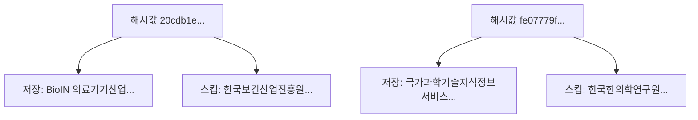

# 데이터 분석 보고서  
## 1. 개요  
본 보고서는 HWP 파일에 대해 **해시(Hash) 기반 중복 검사**를 수행한 결과를 정리한 것이다.  
검사 과정에서 동일한 해시값을 가진 파일은 **저장된 파일**과 **스킵된 파일**로 구분되었다.  

---

## 2. 중복 검사 결과  

### 2.1 해시값: `20cdb1e78194ab2496ca941e3c9a4a2b74558dd007535964517584cab67be0a7`
- 저장된 파일:  
  - `BioIN의료기기산업 종합정보시스템(정보관리기관) 기능개선 사업(2차).hwp`  
- 스킵된 파일:  
  - `한국보건산업진흥원 의료기기산업 종합정보시스템(정보관리기관) 기능.hwp`  

---

### 2.2 해시값: `fe07779f264abfd5f420f332adb65779a33142a5506581345f5cbe4803be53e8`
- 저장된 파일:  
  - `국가과학기술지식정보서비스 통합정보시스템 고도화 용역.hwp`  
- 스킵된 파일:  
  - `한국한의학연구원 통합정보시스템 고도화 용역.hwp`  

---

## 3. 파일 메타데이터 요약  

### 3.1 한국한의학연구원 통합정보시스템 고도화 용역.hwp
- 제목: 한의학연구원 통합정보시스템 고도화 용역 제안요청서  
- 작성자: 한국한의학연구원  
- 최초 작성일: 2005년 2월 28일  
- 최종 저장일: 2024년 5월 30일  

### 3.2 BioIN 의료기기산업 종합정보시스템 기능개선 사업(2차).hwp
- 제목: 제안요청서_서울바이오허브  
- 작성자: 김지승  
- 최초 작성일: 2017년 4월 18일  
- 최종 저장일: 2024년 8월 20일  

---

## 4. mermaid 다이어그램  

---

## 5. 결론  
- 동일 해시값을 통해 중복 파일을 검출하고, 저장/스킵 여부를 구분하였다.  
- 최종적으로, 각 해시값에 대해 **저장된 파일과 스킵된 파일의 매핑 관계**가 명확히 정리되었다.
