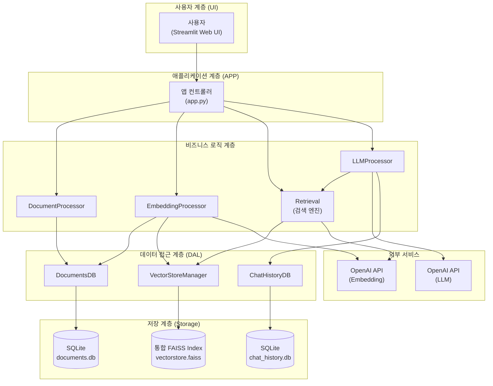
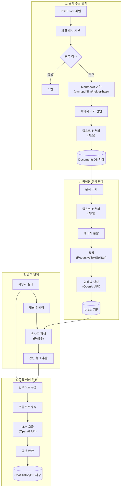

## 1\. 프로젝트 개요

### 1.1. 미션 배경 및 목표

#### 1.1.1. 정부나라장터 환경 분석

**정부나라장터**는 대한민국 정부 및 공공기관의 조달 업무를 전자화한 통합 전자조달 시스템입니다. 2024년 기준 연간 총 거래실적은 약 **156조 7,654억원**에 달하며, 하루에도 수 백 건의 입찰공고가 게시됩니다. 각 공고는 수 십에서 수 백 페이지에 이르는 방대한 분량의 \*\*제안요청서(RFP, Request for Proposal)\*\*를 포함하고 있습니다.

이러한 환경에서 입찰 참여 기업들은 하루에 수백 건씩 쏟아지는 공고를 검토하고, 건당 수십 페이지 분량의 문서를 분석하는 데 막대한 **시간과 인력**을 투입해야 하는 어려움을 겪고 있습니다. 특히, 고객사별 맞춤 입찰 기회 탐색 및 요구사항 정확히 파악하는 과정에서 비효율성이 발생합니다.

#### 1.1.2. 프로젝트 추진 배경

본 프로젝트는 대량의 입찰 문서를 신속하고 정확하게 분석하여 **핵심 정보를 추출**하고, 사용자의 질문에 즉각적으로 답변할 수 있는 **지능형 시스템** 구축을 목표로 합니다. 기존 키워드 기반 검색 방식의 한계(문맥 이해 어려움, 복잡한 요구사항 파악 한계)를 극복하기 위해 **RAG(Retrieval-Augmented Generation)** 기술을 도입했습니다.

RAG 기술은 \*\*벡터 임베딩(Vector Embedding)\*\*을 통해 문서의 의미를 수치화하고, \*\*대규모 언어모델(LLM, Large Language Model)\*\*을 활용하여 자연어 질의에 대해 정확하고 맥락에 맞는 답변을 생성하는 효과적인 접근 방법입니다.

#### 1.1.3. 핵심 해결 과제

본 프로젝트가 해결하고자 하는 핵심 과제는 다음과 같습니다:

1.  **문서 형식 통합 처리**: HWP 및 PDF 형식의 입찰 문서를 자동으로 수집하고 처리 가능한 형태로 변환하는 시스템 구축.
2.  **의미 기반 검색 시스템**: 변환된 문서를 효율적으로 검색할 수 있도록 벡터 임베딩 기반의 검색 시스템 구축.
3.  **LLM 기반 응답 시스템**: 검색된 정보를 기반으로 자연스럽고 정확한 답변을 생성하는 LLM 기반 응답 시스템 개발.
4.  **사용자 친화적 인터페이스**: 복잡한 기술적 구조를 감추고 누구나 쉽게 사용할 수 있는 사용자 친화적인 인터페이스 제공.

-----

### 1.2. 프로젝트 정보

#### 1.2.1. 프로젝트명 및 팀 구성

  * **프로젝트명**: RAG 기반 정부나라장터 입찰공고 분석 시스템
  * **팀명**: PEP(Public E-Procurement Partner)
  * **팀 구성 및 역할**:
      * **신승목 (데이터 엔지니어)**: 문서 수집 및 원본 전처리, PDF/HWP 파일을 Markdown 형식으로 변환, 데이터베이스 파이프라인 구축.
      * **김명환 (머신러닝 엔지니어)**: 임베딩 처리, Markdown 문서를 벡터 임베딩으로 변환, **FAISS(Facebook AI Similarity Search) 인덱스** 저장 시스템 개발.
      * **이민규 (AI 리서처)**: LLM 기반 정보 추출 및 요약 시스템 개발, 프롬프트 엔지니어링, RAG 평가 시스템 구축.
      * **오형주 (프론트엔드 엔지니어)**: **Streamlit** 기반 사용자 인터페이스 개발 및 전체 시스템 통합.

#### 1.2.2. 개발 기간 및 일정

  * **개발 기간**: 2025년 11월 10일 \~ 11월 28일 (총 3주)

| 주차 | 기간 | 단계 | 주요 활동 |
|:---:|:---:|:---:|:---|
| 1주차 | 11월 10일\~14일 | 기반 구축 단계 | 개발 환경 설정, 더미 데이터 생성, DB 스키마 구축, UI 프로토타입 개발, Week 1 통합 테스트 완료. |
| 2주차 | 11월 17일\~21일 | 핵심 기능 개발 단계 | 문서 수집/변환 모듈, 임베딩 처리 모듈, LLM 챗봇 모듈, UI 통합 모듈 병렬 개발, 모듈 통합 작업, Week 2 통합 완료. |
| 3주차 | 11월 24일\~28일 | 최적화 및 마무리 단계 | 전체 통합 테스트, 성능 평가 및 최적화, 문서화, 발표 자료 준비, 최종 발표. |

#### 1.2.3. 기술 스택 개요

본 프로젝트는 Python 기반의 AI 및 데이터 처리 기술을 활용했습니다.

  * **문서 처리**: **PyMuPDF**, **pymupdf4llm** (PDF to Markdown), 자체 개발 **helper-hwp** 라이브러리 (HWP to Markdown).
  * **데이터 저장**: **SQLite** (메타데이터, 채팅 이력).
  * **임베딩/검색**: OpenAI **text-embedding-3-small** 모델, **FAISS** (고속 유사도 검색), **LangChain** (청킹, 벡터스토어 관리).
  * **LLM 계층**: OpenAI **GPT 시리즈 모델** (gpt-5-mini, gpt-4o), **ConversationChain**, **ConversationSummaryMemory** (대화 컨텍스트 관리).
  * **사용자 인터페이스**: **Streamlit** 프레임워크.

-----

### 1.3. 나라장터 사업 현황

#### 1.3.1. 거래 규모 및 입찰 건수

  * **연간 총 거래실적**: 약 156조 7,654억원 (국내 GDP의 약 7% 규모).
  * **월평균 입찰공고 건수**: 약 6,600건 (하루 평균 약 220건, 평일 기준 300건 이상).
  * **공고당 평균 페이지 수**: 20페이지 \~ 100페이지 (복잡한 프로젝트는 200페이지 초과).
  * **공고 유형**: 물품 구매, 용역 발주, 공사 입찰 등 (정보시스템 구축 및 유지보수 용역이 약 15% 차지).

#### 1.3.2. 문서 처리의 어려움

정부나라장터 입찰 문서는 양과 복잡성으로 인해 처리 효율성이 낮습니다.

1.  **물리적 시간 부족**: 하루 수백 건의 RFP 검토는 중소기업 인력으로 사실상 불가능하며, 입찰 기회를 놓치기 쉽습니다.
2.  **막대한 분석 시간**: 숙련된 담당자도 건당 2\~4시간(복잡 건은 하루 이상) 소요.
3.  **비효율적인 탐색**: 고객사별 맞춤 입찰 기회 탐색 과정이 수작업으로 이루어져 비효율적.
4.  **문서 형식의 다양성과 비표준화**: PDF, HWP 등 다양한 형식이 사용되며, 작성 스타일이 기관마다 달라 자동화된 정보 추출의 정확도가 낮아지는 문제.

#### 1.3.3. RAG 시스템 도입 필요성

RAG 시스템은 이러한 문제를 해결하기 위한 필수적인 기술입니다.

  * **의미론적 검색**: 벡터 임베딩 기반으로 사용자의 **질의 의도**를 정확히 파악하고, 방대한 문서 집합에서 관련성 높은 정보를 **신속하게 추출**.
  * **LLM 기반 자연어 응답**: 사용자가 복잡한 문서 구조를 직접 탐색하지 않아도 명확하고 구체적인 답변을 제공 (예: "이 사업의 예산 규모는 얼마인가요?").
  * **신뢰성 확보**: 검색 결과에 대한 **출처 정보** (문서명, 페이지 번호)를 함께 제공하여 답변의 신뢰성을 검증 가능.
  * **대화형 인터페이스**: 연속적인 질의응답 및 이전 대화 **컨텍스트 유지**를 통해 자연스러운 정보 탐색 가능.

-----

### 1.4. 시스템 아키텍처

#### 1.4.1. 전체 구조도

본 시스템은 계층적 구조로 설계되었으며, \`\` 각 계층은 명확히 분리된 책임을 가집니다.



  * **사용자 계층**: Streamlit 기반 웹 인터페이스, 문서 업로드 및 질문 입력.
  * **애플리케이션 계층**: 사용자 요청을 받아 비즈니스 로직 모듈로 라우팅 (app.py).
  * **비즈니스 로직 계층**: 문서 변환, 임베딩 생성, 검색, 응답 생성 등 핵심 로직 처리.
  * **데이터 접근 계층**: 데이터베이스 CRUD 연산 및 벡터 인덱스 관리 추상화.
  * **저장 계층**: 영구 데이터 저장 (SQLite, FAISS 파일).

#### 1.4.2. 데이터 파이프라인 흐름

시스템의 데이터 처리는 4단계로 구성된 파이프라인으로 이루어집니다.



**핵심 특징**:

  * **문서 수집**: 파일 해시 기반 중복 검사를 수행하며, HWP 파일은 `helper_hwp` 라이브러리의 `hwp_to_markdown` 메서드를 사용하여 Markdown 형식으로 변환.
  * **임베딩 생성**: 문서는 RecursiveCharacterTextSplitter로 청킹되며, OpenAI의 `text-embedding-3-small` 모델을 통해 1536차원 벡터로 변환되어 **통합 FAISS 인덱스**에 저장.
  * **검색**: 사용자 질의를 임베딩으로 변환 후, FAISS에서 **L2 거리 기반**의 유사도 검색을 수행.
  * **응답 생성**: 검색된 청크를 컨텍스트로 사용하여 LLM이 자연어 답변을 생성하며, 질의/답변 및 검색된 청크 정보는 ChatHistoryDB에 저장.

#### 1.4.3. 주요 기술 구성 요소

| 모듈 | 역할 | 핵심 기술 및 특징 |
|:---|:---|:---|
| **Config** | 중앙 집중식 설정 관리 | `config.json` 파일, 싱글톤 패턴. |
| **DocumentProcessor** | 문서 변환 | PyMuPDF, `pymupdf4llm`, **`helper-hwp`** (HWP to Markdown), 페이지 마커 삽입. |
| **EmbeddingProcessor** | 청킹 및 임베딩 생성 | 3단계 전처리 파이프라인, RecursiveCharacterTextSplitter, **OpenAI `text-embedding-3-small`**. |
| **VectorStoreManager** | 벡터 인덱스 관리 | **FAISS** (LangChain 래퍼), `IndexFlatL2` 기반 검색, **Document.metadata**에 파일명, 페이지 번호 등 통합 관리. |
| **Retrieval** | 검색 수행 | 청크 기반 검색, 페이지 기반 검색 모드 지원, 메타데이터 필터링. |
| **LLMProcessor** | 응답 생성 | OpenAI **GPT 모델**, LangChain `ConversationChain` 및 `ConversationSummaryMemory`로 컨텍스트 유지. |
| **ChatHistoryDB** | 대화 이력 관리 | SQLite, 세션 기반 그룹화, 검색된 청크 정보(JSON) 저장. |
| **UI Module** | 사용자 인터페이스 | **Streamlit** (세션 상태 관리: `st.session_state`), `@st.cache_resource`를 통한 DB 인스턴스 캐싱. |

-----

### 1.5. 핵심 컴포넌트 상세

#### 1.5.1. 파일 해시 기반 중복 제거

**목적**: 동일 파일 재처리를 방지하고, 저장 공간 및 처리 시간을 절약.
**메커니즘**: 입력 파일의 **SHA-256 해시값**을 계산하여 `TB_DOCUMENTS` 테이블에 저장된 기존 문서와 비교.

#### 1.5.2. 통합 FAISS 인덱스 및 메타데이터 관리

**특징**:

  * **단일 인덱스**: 모든 문서의 임베딩을 하나의 FAISS 인덱스(`vectorstore.faiss`)에 저장하여 전체 문서를 대상으로 통합 검색.
  * **메타데이터 통합**: 벡터 임베딩과 함께 파일 해시, 파일명, 시작 페이지, 종료 페이지 등 모든 출처 정보가 \*\*LangChain `Document.metadata`\*\*에 통합되어 저장.

**메타데이터 구조**:

$$
\text{Document.metadata} = \{ \text{file\_hash}, \text{file\_name}, \text{start\_page}, \text{end\_page}, \text{chunk\_index}, \dots \}
$$

이 구조를 통해 별도의 DB 조회 없이 검색 결과만으로 정확한 출처 추적이 가능합니다.

#### 1.5.3. 유사도 점수 (거리 기반)

검색 결과는 FAISS의 **L2 거리(Euclidean distance)** 값을 그대로 반환합니다.
$$\text{distance} = \sqrt{\sum_{i=1}^{n} (A_i - B_i)^2}$$
여기서 $A$는 쿼리 벡터, $B$는 청크 벡터이며, 거리가 **작을수록** 유사도가 **높음**을 의미합니다. 이 원본 거리 값을 사용함으로써 정규화로 인한 정보 손실 없이 벡터 공간에서의 실제 거리를 반영합니다.

| Distance | 해석 |
|:----------|:---|
| 0.0 | 완전 일치 (가장 유사) |
| 0.1 \~ 0.5 | 매우 높은 유사도 |
| 0.5 \~ 1.0 | 높은 유사도 |
| 1.0 \~ 2.0 | 중간 유사도 |
| 2.0 이상 | 낮은 유사도 |

#### 1.5.4. 검색된 청크 JSON 저장

LLM이 답변을 생성하는 데 사용한 검색된 청크 정보는 `retrieved_chunks` 컬럼에 다음과 같은 JSON 구조로 저장되어 출처를 추적합니다.

```json
[
    {
        "chunk_text": "...",
        "file_name": "document.pdf",
        "file_hash": "abc123...",
        "start_page": 5,
        "distance": 0.176
    },
    ...
]
```
