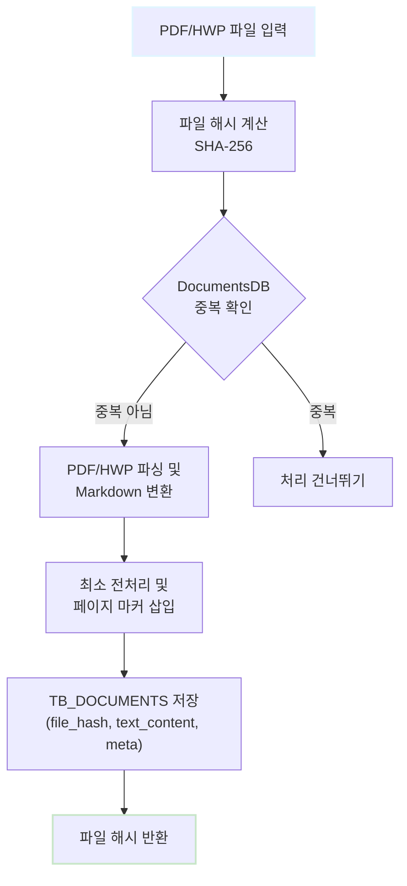
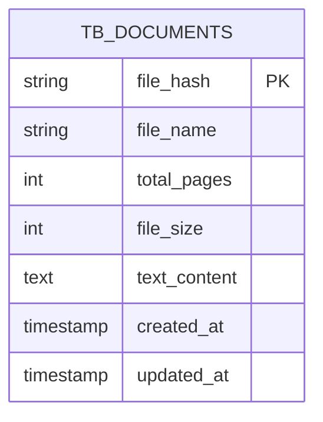

## 2\. 데이터 수집 및 전처리 (신승목)

### 2.1. 문서 수집 전략

#### 2.1.1. PDF 및 HWP 파일 수집 프로세스

본 프로젝트의 데이터 수집은 정부나라장터에서 제공하는 입찰 공고 문서를 **공공데이터포털의 입찰공고목록정보조회 API**를 활용하여 체계적으로 자동화합니다.

**수집 프로세스**:

1.  **API 호출**: 공공데이터포털 API를 호출하여 최신 공고 목록을 조회합니다.
2.  **메타데이터 추출**: 응답으로 받은 공고번호, 공고명, 발주기관, 입찰마감일, 첨부파일 URL 등의 메타데이터를 확보합니다.
3.  **원본 파일 다운로드**: 첨부파일 URL을 통해 제안요청서 원본 파일(PDF, HWP)을 다운로드합니다.
4.  **마크다운 변환 및 저장**: 다운로드된 PDF 파일은 **PyMuPDF** 라이브러리를, HWP 파일은 **자체 개발 라이브러리**를 이용하여 Markdown 텍스트로 변환한 후 DB에 저장합니다.

#### 2.1.2. 파일 해시 기반 중복 검사

대량 문서 처리에 대비하여 중복 처리를 방지하기 위해 **SHA-256 해시 알고리즘**을 기반으로 중복 문서를 감지하고 제거하는 기능을 구현하였습니다.

**SHA-256 해시**:
입력 파일 내용에 기반하여 64자리 16진수 문자열을 생성하며, 파일의 고유한 지문 역할을 수행합니다. 파일명이나 메타데이터가 달라도 내용이 동일하면 같은 해시값을 갖습니다.

**중복 검사 프로세스**:
새 문서 파일 입력 시, `DocumentProcessor`가 해시값을 계산하고, 이 해시값이 `DocumentsDB`에 이미 존재하는 경우 중복으로 판단하여 Markdown 변환 및 DB 저장 작업을 건너뜁니다.

**장점**:

1.  파일명과 무관하게 동일 내용의 문서를 정확히 식별합니다.
2.  데이터베이스 인덱스를 활용하여 매우 빠른 중복 여부 판단이 가능합니다.
3.  해시값은 파일 크기와 무관하게 64자리로 고정되어 저장 공간을 효율적으로 사용합니다.

**중복 검출 사례**:
실제 수집된 문서에서 두 건의 중복 사례가 발견되었으며, 파일명은 다르지만 내용이 동일함을 해시값을 통해 확인했습니다. 이 메커니즘을 통해 불필요한 저장 공간 사용, 중복 임베딩 벡터 생성, 검색 결과의 중복 등의 문제를 사전에 방지할 수 있습니다.

#### 2.1.3. 메타데이터 추출 및 관리

문서 처리 과정에서 원본 파일의 메타데이터를 추출하고 관리하는 것은 향후 검색 및 필터링 기능의 핵심 기반입니다.

**메타데이터 구분**:

  * **파일 수준 메타데이터**: 파일 해시값, 파일명, 파일 크기, 총 페이지 수, 생성 시각, 수정 시각 등 물리적 속성을 나타내며, `DocumentsDB`의 **TB\_DOCUMENTS** 테이블에 저장됩니다. `file_hash`를 기본 키(Primary Key)로 사용합니다.
  * **문서 메타데이터**: PDF 표준에 따른 제목, 저자, 주제 등이 있으나, 나라장터 공고 문서에서는 일관성이 낮아 **파일명에서 발주기관, 사업명, 사업 유형 등의 정보를 추론**하여 보완적으로 활용합니다.

**페이지 수 관리**:

  * **PDF**: **PyMuPDF**의 `page_count` 속성을 통해 전체 페이지 수를 확인합니다.
  * **HWP**: 한글 문서의 특성상 페이지 정보가 없어, 최소 전처리 후의 내용을 기준으로 **40줄마다 임의의 페이지 정보를 추가**하도록 구현하였습니다.

**시각 정보**:
생성 시각과 수정 시각은 **KST (Korean Standard Time)** 기준으로 기록되며, Python의 `datetime` 모듈과 `pytz` 라이브러리를 사용하여 UTC 시각을 KST로 변환하고, 데이터베이스에는 **ISO 8601 형식**의 문자열로 저장됩니다.

-----

### 2.2. 원본 전처리

#### 2.2.1. Markdown 변환 (pymupdf4llm, hwp\_to\_markdown)

RAG 시스템 구축을 위해 복잡한 구조의 원본 문서를 기계 처리가 용이하도록 **Markdown** 텍스트로 변환합니다. Markdown은 문서의 구조(헤더, 리스트, 테이블 등)를 표현하는 경량 마크업 언어로, 원본 문서의 계층 구조와 의미를 최대한 보존합니다.

**PDF to Markdown**:
**pymupdf4llm** 라이브러리를 사용합니다. 이는 LLM(Large Language Model) 친화적인 Markdown 변환에 최적화되어 있으며, 다음과 같은 고급 기능을 제공합니다.

1.  문서의 논리적 구조를 분석하여 적절한 **Markdown 헤더 레벨**을 할당합니다.
2.  **테이블 구조**를 인식하여 Markdown 테이블 문법으로 변환합니다.
3.  **리스트 항목**을 순서 있는 리스트와 순서 없는 리스트로 구분합니다.

변환은 페이지 단위로 수행되며, `pymupdf4llm.to_markdown` 함수를 통해 각 페이지의 레이아웃을 분석하고 Markdown으로 변환합니다.

**HWP to Markdown**:
기존 라이브러리의 텍스트 처리 한계를 극복하고자 **HWP 문서의 텍스트와 표 내용을 파싱**하여 마크다운으로 변환하는 라이브러리 (**helper-hwp**)를 직접 개발하여 활용하였습니다.

**예외 처리**:
스캔된 이미지로만 구성된 페이지, 빈 페이지, 암호화되거나 손상된 페이지에 대해서는 **특수 마커** (`ERROR_PAGE_MARKER`, `EMPTY_PAGE_MARKER`)를 삽입하고 처리하지 않고 건너뛰어 전체 문서 처리가 중단되는 것을 방지합니다.

#### 2.2.2. DocumentProcessor 기반 최소 전처리

Markdown으로 변환된 직후의 텍스트에서 불필요한 요소를 제거하는 **최소 전처리**를 수행합니다. 이 단계는 원본 텍스트의 내용과 구조를 보존하며 형식적인 문제만을 해결하는 것을 목표로 합니다.

**주요 전처리 작업**:

1.  **공백 및 탭의 정규화 (Normalization)**: 연속된 공백이나 탭(`r'[ \t]+'`)을 단일 공백으로 변환하여 불필요한 토큰 낭비를 방지합니다.
2.  **연속된 개행 축소**: 세 번 이상 연속된 개행(`r'\n{3,}'`)을 두 번의 개행으로 축소하여 문단 구분은 유지하되 과도한 빈 공간을 제거합니다.
3.  **각 라인의 앞뒤 공백 제거**: 각 줄의 `strip` 메서드를 호출하여 라인 시작이나 끝의 불필요한 공백을 제거합니다.

**분리 전략**:
텍스트의 의미나 구조를 변경할 수 있는 작업(Markdown 요소 제거, HTML 태그 제거 등)은 이 단계에서 수행하지 않고, 다음 단계인 `EmbeddingProcessor`의 전처리에서 수행하도록 분리하여 **원본 데이터를 최대한 보존**합니다.

#### 2.2.3. 페이지 마커 삽입 전략

RAG 시스템의 검색 결과에 원본 문서의 페이지 정보를 제공하여 사용자 경험을 향상시키기 위해 **페이지 마커**를 삽입합니다.

**마커 형식**:
페이지 마커의 형식은 `"--- 페이지 N ---"`이며, 정규표현식으로 쉽게 감지할 수 있도록 설계되었습니다.

**페이지 마커의 역할**:

1.  **청킹 단계에서의 페이지 단위 분할**: `EmbeddingProcessor`는 페이지 마커를 기준으로 텍스트를 분리하여 청크 생성을 방지하고, 각 청크가 속하는 페이지 범위를 명확히 추적할 수 있게 합니다.
2.  **검색 결과의 출처 표시**: 각 청크의 메타데이터에 `start_page`와 `end_page` 정보가 포함되어, LLM 응답 시 \*"이 정보는 공고문.pdf의 15페이지에서 17페이지에 있습니다"\*와 같은 구체적인 출처를 제공할 수 있습니다.

**특수 마커**:
오류 발생 페이지는 **`ERROR_PAGE_MARKER`** (`"--- [오류페이지] ---"`)로, 텍스트가 없거나 임계값 이하의 텍스트만 포함된 페이지는 **`EMPTY_PAGE_MARKER`** (`"--- [빈페이지] ---"`)로 표시하며, 이들은 임베딩 단계에서 건너뛰어집니다.

**삽입 위치**:
마커는 각 페이지 내용의 시작 부분에 삽입되며, 내용과 분리되도록 전후에 개행이 추가됩니다 (예: `"--- 페이지 5 ---\n\n사업 개요"`).

-----

### 2.3. 데이터베이스 설계

#### 2.3.1. documents\_db 스키마

문서 메타데이터 관리를 위해 **SQLite** 데이터베이스를 사용하는 `DocumentsDB` 클래스가 설계되었습니다.

**TB\_DOCUMENTS 테이블 스키마**:

| 컬럼명 | 타입 | 제약 조건 | 설명 |
| :--- | :--- | :--- | :--- |
| `file_hash` | TEXT | PRIMARY KEY | SHA-256 해시값 (64자리) |
| `chunk_index` | INTEGER | | 텍스트 콘텐츠 분할 저장 인덱스 (0\~4) |
| `file_name` | TEXT | NOT NULL | 원본 파일 이름 |
| `total_pages` | INTEGER | NOT NULL | 원본 문서의 총 페이지 수 |
| `file_size` | INTEGER | NOT NULL | 원본 파일 크기 (바이트) |
| `text_content` | TEXT | NULL 허용 | 변환된 Markdown 텍스트 내용 |
| `created_at` | TIMESTAMP | DEFAULT (KST) | 레코드 생성 시각 |
| `updated_at` | TIMESTAMP | DEFAULT (KST) | 레코드 최종 수정 시각 |

**저장 방식**:
`text_content`는 대용량 텍스트 저장을 위해 설계되었으나, DB 저장 용량 제한을 우회하기 위해 문서 파일을 처리하여 생성한 마크다운을 **5조각으로 분할**하여 `chunk_index`에 맞게 저장합니다. `file_hash`를 호출하면 해당 인덱스에 맞게 `text_content`가 연결되어 전체 내용이 반환되도록 메서드를 구현하였습니다.

#### 2.3.2. 파일 메타데이터 관리

`DocumentsDB` 클래스는 파일 메타데이터에 대한 CRUD(Create, Read, Update, Delete) 작업을 추상화된 인터페이스로 제공합니다.

**주요 메서드**:

  * `insert_text_content()`: 문서 정보 및 텍스트 콘텐츠를 `TB_DOCUMENTS` 테이블에 삽입합니다.
  * `get_document_by_hash()`: `file_hash`를 기준으로 문서 정보를 조회하며, `text_content`를 `chunk_index` 순서대로 합쳐서 반환합니다. 중복 검사 단계에 사용됩니다.
  * `get_document_stats()`: 총 파일 수, 총 페이지 수, 총 파일 크기 등의 통계 정보를 계산하여 반환합니다.
  * `search_documents()`: 파일명 또는 `file_hash`로 문서를 검색합니다.

모든 DB 작업은 context manager 패턴을 사용하여 트랜잭션을 관리하며, 리소스 누수를 방지하고 코드의 안전성을 높입니다.

#### 2.3.3. 재현성 보장 메커니즘

시스템 품질 평가 및 개선을 위해 동일한 입력에 대해 동일한 결과를 재현할 수 있도록 파일 해시 기반의 재현성 보장 메커니즘을 설계했습니다.

  * **파일 해시**: 문서 내용의 지문으로 작용하여, 동일 문서는 시스템에 단 한 번만 저장 및 처리되도록 합니다.
  * **Markdown 원본 보존**: Markdown 변환 결과는 `text_content` 컬럼에 저장되어 원본 데이터로서 보존되므로, 임베딩 전략이 변경되더라도 다시 읽어와 재처리가 가능합니다.
  * **타임스탬프 추적**: `created_at` 및 `updated_at` 타임스탬프를 통해 문서의 생명주기를 추적하고, 증분 업데이트(Incremental Update)를 지원합니다.

-----

### 2.4. 중복 데이터 분석 결과

#### 2.4.1. 해시 기반 중복 검출

프로젝트 진행 중 수집한 정부나라장터 공고 문서에 대해 해시 기반 중복 검사를 수행한 결과, **두 건의 중복 사례**가 발견되었습니다.

  * **사례 1**: 해시값 `20cdb1e...0a7`의 "BioIN의료기기산업..." 파일과 "한국보건산업진흥원..." 파일은 이름은 다르지만 내용이 동일했습니다.
  * **사례 2**: 해시값 `fe07779...3e8`의 "국가과학기술지식정보서비스..." 파일과 "한국한의학연구원..." 파일도 내용이 동일했습니다.

이러한 중복은 유사한 시스템 구축 사업이 여러 기관에 발주되면서 **템플릿이나 표준 제안요청서를 기반**으로 작성되어 발생하는 나라장터 공고의 특성을 반영합니다. 중복 검출 메커니즘을 통해 이러한 문서들은 한 번만 처리됩니다.

#### 2.4.2. 파일 매핑 관계

중복으로 판단된 파일 쌍은 파일명이나 일부 메타데이터는 다르지만 핵심 내용은 동일하여 같은 해시값을 가집니다. 이 매핑 정보는 중복 검사 로그에 기록되어, 나중에 특정 파일을 검색할 때 실제로 저장된 버전을 안내할 수 있습니다.

#### 2.4.3. 데이터 품질 개선 효과

중복 데이터 제거는 전체 시스템의 품질을 다각도로 개선합니다.

  * **저장 공간 절약**: 중복 문서 제거로 데이터베이스 크기가 감소합니다. 본 프로젝트에서는 162MB 중 1.6MB(1%)를 절약했습니다.
  * **비용 절감**: 동일한 문서를 중복 처리하지 않아 임베딩 생성 API 호출 비용(OpenAI API는 토큰 수에 비례 과금)이 절감됩니다.
  * **검색 품질 향상**: FAISS 인덱스 크기 감소로 검색 속도가 향상되고, 중복 내용이 제거되어 상위 검색 결과의 **다양성**이 높아집니다.
  * **사용자 경험 및 신뢰성**: 검색 결과에 동일한 내용이 여러 파일명으로 나타나는 혼란을 방지하고 출처의 신뢰성을 향상시킵니다.

-----

### 2.5. (기능 추가) 나라장터의 특정 기간의 공고에 있는 첨부 문서를 처리하여 DB에 추가

공공데이터포털(data.go.kr)에서 받은 API Key와 검색할 시작일/종료일을 입력하면, 해당 기간의 입찰 공고 정보를 조회하여 첨부 파일을 다운로드하고, 앞서 설명된 전처리 과정을 거쳐 DB에 저장합니다.

#### 2.5.1. Service Key 검증 및 입찰 공고 정보 조회

APP UI 상에서 **Service Key**, 시작 일자, 종료 일자를 입력받아 `api_url`을 생성하여 조달청\_나라장터 입찰공고 서비스의 `"getBidPblancListInfoCnstwk"` 항목에 요청합니다. 네트워크 문제 대비를 위해 10초의 타임아웃을 설정했습니다.

#### 2.5.2. API 응답 중 첨부 문서를 받아서 DB에 저장

API 응답에서 **첨부파일 URL**만을 추출하고 중복 제거 및 유효성 검사를 수행합니다.

**다운로드 및 처리**:

1.  `tempfile.mkdtemp()` 함수를 통해 중복되지 않는 **임시 디렉토리**를 생성하고 파일을 저장합니다.
2.  다운로드 요청 시 30초의 타임아웃을 설정하고, 오류 발생 시 다음 파일을 진행하도록 했습니다.
3.  다운로드가 완료되면 HWP, PDF 처리 모듈을 이용하여 마크다운으로 변환합니다.
4.  **`File_hash` 기준 중복 검사**를 거쳐 중복되지 않은 내용을 DB에 추가합니다.
5.  DB 저장이 완료된 후 임시 디렉토리에 다운로드 받았던 파일들을 제거합니다.

## 시스템 아키텍처 개요

본 데이터 수집 및 전처리 모듈은 RAG 기반 PEP 문서 처리 시스템의 애플리케이션 계층(`DocumentProcessor`, `EmbeddingProcessor`)과 데이터 접근 계층(`DocumentsDB`)에 속하며, 전체 시스템의 초기 데이터 흐름을 담당합니다.

**문서 처리 흐름 다이어그램 (Document Processor)**:

**DocumentsDB 스키마 (ER 다이어그램 발췌)**:

이러한 전처리된 데이터는 이후 `EmbeddingProcessor`에 의해 텍스트 청킹, 임베딩 벡터 생성, 그리고 **통합 FAISS 인덱스**에 저장되어 RAG 파이프라인의 검색 기반을 형성하게 됩니다.

