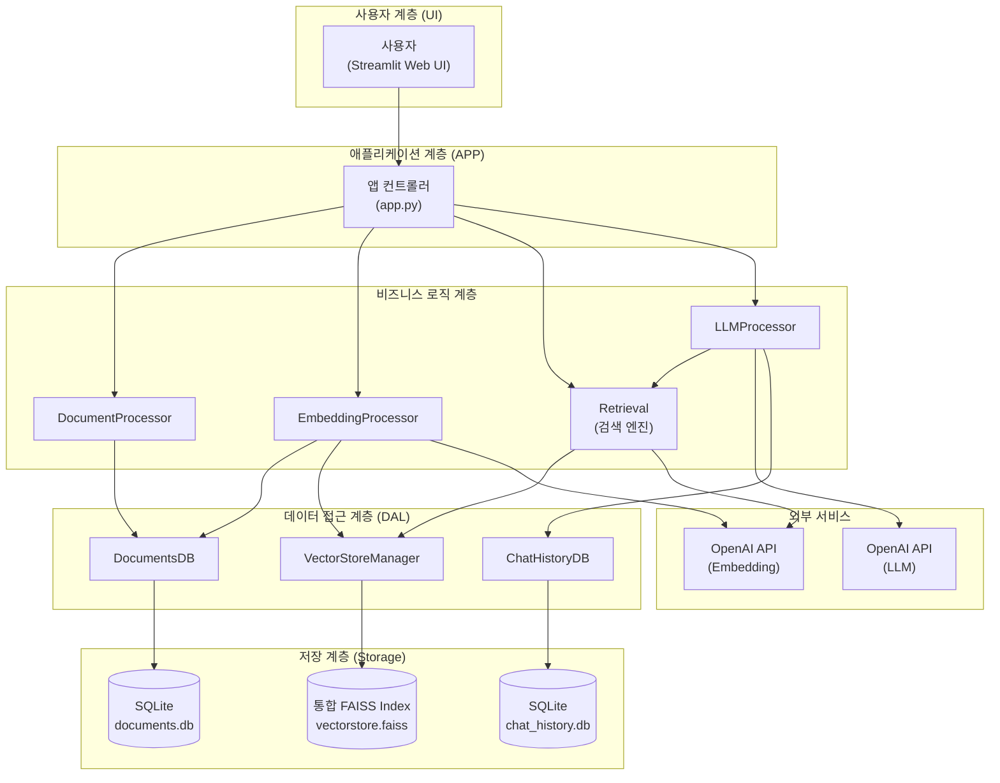
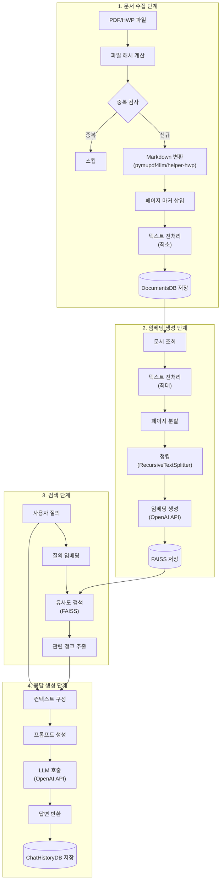
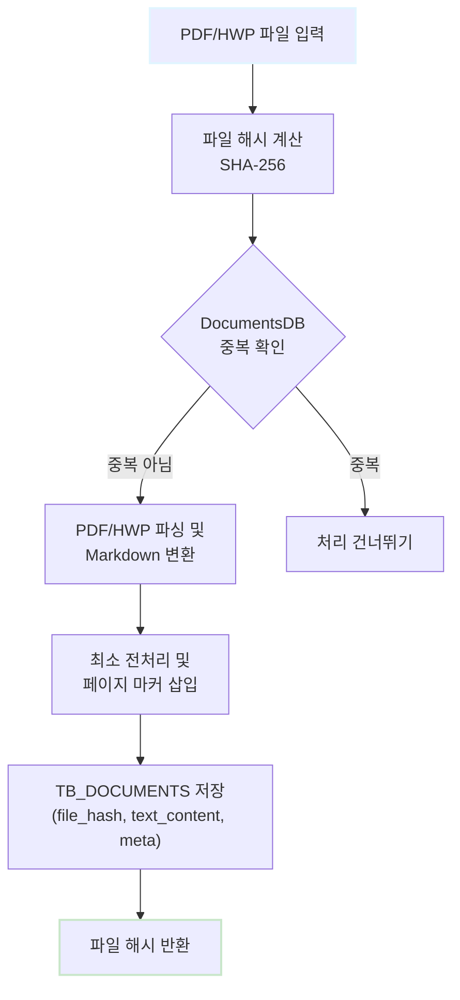
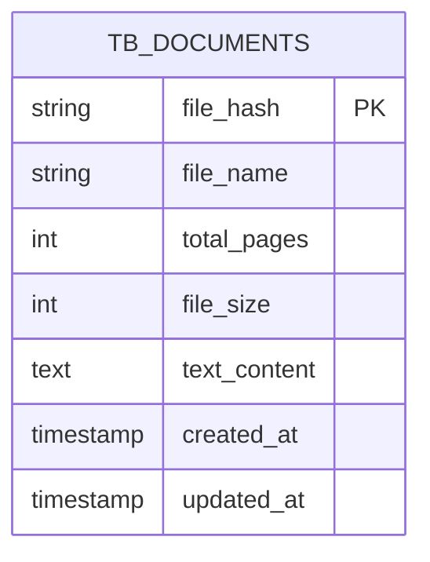

## 1\. 프로젝트 개요

### 1.1. 미션 배경 및 목표

#### 1.1.1. 정부나라장터 환경 분석

**정부나라장터**는 대한민국 정부 및 공공기관의 조달 업무를 전자화한 통합 전자조달 시스템입니다. 2024년 기준 연간 총 거래실적은 약 **156조 7,654억원**에 달하며, 하루에도 수 백 건의 입찰공고가 게시됩니다. 각 공고는 수 십에서 수 백 페이지에 이르는 방대한 분량의 \*\*제안요청서(RFP, Request for Proposal)\*\*를 포함하고 있습니다.

이러한 환경에서 입찰 참여 기업들은 하루에 수백 건씩 쏟아지는 공고를 검토하고, 건당 수십 페이지 분량의 문서를 분석하는 데 막대한 **시간과 인력**을 투입해야 하는 어려움을 겪고 있습니다. 특히, 고객사별 맞춤 입찰 기회 탐색 및 요구사항 정확히 파악하는 과정에서 비효율성이 발생합니다.

#### 1.1.2. 프로젝트 추진 배경

본 프로젝트는 대량의 입찰 문서를 신속하고 정확하게 분석하여 **핵심 정보를 추출**하고, 사용자의 질문에 즉각적으로 답변할 수 있는 **지능형 시스템** 구축을 목표로 합니다. 기존 키워드 기반 검색 방식의 한계(문맥 이해 어려움, 복잡한 요구사항 파악 한계)를 극복하기 위해 **RAG(Retrieval-Augmented Generation)** 기술을 도입했습니다.

RAG 기술은 \*\*벡터 임베딩(Vector Embedding)\*\*을 통해 문서의 의미를 수치화하고, \*\*대규모 언어모델(LLM, Large Language Model)\*\*을 활용하여 자연어 질의에 대해 정확하고 맥락에 맞는 답변을 생성하는 효과적인 접근 방법입니다.

#### 1.1.3. 핵심 해결 과제

본 프로젝트가 해결하고자 하는 핵심 과제는 다음과 같습니다:

1.  **문서 형식 통합 처리**: HWP 및 PDF 형식의 입찰 문서를 자동으로 수집하고 처리 가능한 형태로 변환하는 시스템 구축.
2.  **의미 기반 검색 시스템**: 변환된 문서를 효율적으로 검색할 수 있도록 벡터 임베딩 기반의 검색 시스템 구축.
3.  **LLM 기반 응답 시스템**: 검색된 정보를 기반으로 자연스럽고 정확한 답변을 생성하는 LLM 기반 응답 시스템 개발.
4.  **사용자 친화적 인터페이스**: 복잡한 기술적 구조를 감추고 누구나 쉽게 사용할 수 있는 사용자 친화적인 인터페이스 제공.

-----

### 1.2. 프로젝트 정보

#### 1.2.1. 프로젝트명 및 팀 구성

  * **프로젝트명**: RAG 기반 정부나라장터 입찰공고 분석 시스템
  * **팀명**: PEP(Public E-Procurement Partner)
  * **팀 구성 및 역할**:
      * **신승목 (데이터 엔지니어)**: 문서 수집 및 원본 전처리, PDF/HWP 파일을 Markdown 형식으로 변환, 데이터베이스 파이프라인 구축.
      * **김명환 (머신러닝 엔지니어)**: 임베딩 처리, Markdown 문서를 벡터 임베딩으로 변환, **FAISS(Facebook AI Similarity Search) 인덱스** 저장 시스템 개발.
      * **이민규 (AI 리서처)**: LLM 기반 정보 추출 및 요약 시스템 개발, 프롬프트 엔지니어링, RAG 평가 시스템 구축.
      * **오형주 (프론트엔드 엔지니어)**: **Streamlit** 기반 사용자 인터페이스 개발 및 전체 시스템 통합.

#### 1.2.2. 개발 기간 및 일정

  * **개발 기간**: 2025년 11월 10일 \~ 11월 28일 (총 3주)

| 주차 | 기간 | 단계 | 주요 활동 |
|:---:|:---:|:---:|:---|
| 1주차 | 11월 10일\~14일 | 기반 구축 단계 | 개발 환경 설정, 더미 데이터 생성, DB 스키마 구축, UI 프로토타입 개발, Week 1 통합 테스트 완료. |
| 2주차 | 11월 17일\~21일 | 핵심 기능 개발 단계 | 문서 수집/변환 모듈, 임베딩 처리 모듈, LLM 챗봇 모듈, UI 통합 모듈 병렬 개발, 모듈 통합 작업, Week 2 통합 완료. |
| 3주차 | 11월 24일\~28일 | 최적화 및 마무리 단계 | 전체 통합 테스트, 성능 평가 및 최적화, 문서화, 발표 자료 준비, 최종 발표. |

#### 1.2.3. 기술 스택 개요

본 프로젝트는 Python 기반의 AI 및 데이터 처리 기술을 활용했습니다.

  * **문서 처리**: **PyMuPDF**, **pymupdf4llm** (PDF to Markdown), 자체 개발 **helper-hwp** 라이브러리 (HWP to Markdown).
  * **데이터 저장**: **SQLite** (메타데이터, 채팅 이력).
  * **임베딩/검색**: OpenAI **text-embedding-3-small** 모델, **FAISS** (고속 유사도 검색), **LangChain** (청킹, 벡터스토어 관리).
  * **LLM 계층**: OpenAI **GPT 시리즈 모델** (gpt-5-mini, gpt-4o), **ConversationChain**, **ConversationSummaryMemory** (대화 컨텍스트 관리).
  * **사용자 인터페이스**: **Streamlit** 프레임워크.

-----

### 1.3. 나라장터 사업 현황

#### 1.3.1. 거래 규모 및 입찰 건수

  * **연간 총 거래실적**: 약 156조 7,654억원 (국내 GDP의 약 7% 규모).
  * **월평균 입찰공고 건수**: 약 6,600건 (하루 평균 약 220건, 평일 기준 300건 이상).
  * **공고당 평균 페이지 수**: 20페이지 \~ 100페이지 (복잡한 프로젝트는 200페이지 초과).
  * **공고 유형**: 물품 구매, 용역 발주, 공사 입찰 등 (정보시스템 구축 및 유지보수 용역이 약 15% 차지).

#### 1.3.2. 문서 처리의 어려움

정부나라장터 입찰 문서는 양과 복잡성으로 인해 처리 효율성이 낮습니다.

1.  **물리적 시간 부족**: 하루 수백 건의 RFP 검토는 중소기업 인력으로 사실상 불가능하며, 입찰 기회를 놓치기 쉽습니다.
2.  **막대한 분석 시간**: 숙련된 담당자도 건당 2\~4시간(복잡 건은 하루 이상) 소요.
3.  **비효율적인 탐색**: 고객사별 맞춤 입찰 기회 탐색 과정이 수작업으로 이루어져 비효율적.
4.  **문서 형식의 다양성과 비표준화**: PDF, HWP 등 다양한 형식이 사용되며, 작성 스타일이 기관마다 달라 자동화된 정보 추출의 정확도가 낮아지는 문제.

#### 1.3.3. RAG 시스템 도입 필요성

RAG 시스템은 이러한 문제를 해결하기 위한 필수적인 기술입니다.

  * **의미론적 검색**: 벡터 임베딩 기반으로 사용자의 **질의 의도**를 정확히 파악하고, 방대한 문서 집합에서 관련성 높은 정보를 **신속하게 추출**.
  * **LLM 기반 자연어 응답**: 사용자가 복잡한 문서 구조를 직접 탐색하지 않아도 명확하고 구체적인 답변을 제공 (예: "이 사업의 예산 규모는 얼마인가요?").
  * **신뢰성 확보**: 검색 결과에 대한 **출처 정보** (문서명, 페이지 번호)를 함께 제공하여 답변의 신뢰성을 검증 가능.
  * **대화형 인터페이스**: 연속적인 질의응답 및 이전 대화 **컨텍스트 유지**를 통해 자연스러운 정보 탐색 가능.

-----

### 1.4. 시스템 아키텍처

#### 1.4.1. 전체 구조도

본 시스템은 계층적 구조로 설계되었으며, \`\` 각 계층은 명확히 분리된 책임을 가집니다.



  * **사용자 계층**: Streamlit 기반 웹 인터페이스, 문서 업로드 및 질문 입력.
  * **애플리케이션 계층**: 사용자 요청을 받아 비즈니스 로직 모듈로 라우팅 (app.py).
  * **비즈니스 로직 계층**: 문서 변환, 임베딩 생성, 검색, 응답 생성 등 핵심 로직 처리.
  * **데이터 접근 계층**: 데이터베이스 CRUD 연산 및 벡터 인덱스 관리 추상화.
  * **저장 계층**: 영구 데이터 저장 (SQLite, FAISS 파일).

#### 1.4.2. 데이터 파이프라인 흐름

시스템의 데이터 처리는 4단계로 구성된 파이프라인으로 이루어집니다.



**핵심 특징**:

  * **문서 수집**: 파일 해시 기반 중복 검사를 수행하며, HWP 파일은 `helper_hwp` 라이브러리의 `hwp_to_markdown` 메서드를 사용하여 Markdown 형식으로 변환.
  * **임베딩 생성**: 문서는 RecursiveCharacterTextSplitter로 청킹되며, OpenAI의 `text-embedding-3-small` 모델을 통해 1536차원 벡터로 변환되어 **통합 FAISS 인덱스**에 저장.
  * **검색**: 사용자 질의를 임베딩으로 변환 후, FAISS에서 **L2 거리 기반**의 유사도 검색을 수행.
  * **응답 생성**: 검색된 청크를 컨텍스트로 사용하여 LLM이 자연어 답변을 생성하며, 질의/답변 및 검색된 청크 정보는 ChatHistoryDB에 저장.

#### 1.4.3. 주요 기술 구성 요소

| 모듈 | 역할 | 핵심 기술 및 특징 |
|:---|:---|:---|
| **Config** | 중앙 집중식 설정 관리 | `config.json` 파일, 싱글톤 패턴. |
| **DocumentProcessor** | 문서 변환 | PyMuPDF, `pymupdf4llm`, **`helper-hwp`** (HWP to Markdown), 페이지 마커 삽입. |
| **EmbeddingProcessor** | 청킹 및 임베딩 생성 | 3단계 전처리 파이프라인, RecursiveCharacterTextSplitter, **OpenAI `text-embedding-3-small`**. |
| **VectorStoreManager** | 벡터 인덱스 관리 | **FAISS** (LangChain 래퍼), `IndexFlatL2` 기반 검색, **Document.metadata**에 파일명, 페이지 번호 등 통합 관리. |
| **Retrieval** | 검색 수행 | 청크 기반 검색, 페이지 기반 검색 모드 지원, 메타데이터 필터링. |
| **LLMProcessor** | 응답 생성 | OpenAI **GPT 모델**, LangChain `ConversationChain` 및 `ConversationSummaryMemory`로 컨텍스트 유지. |
| **ChatHistoryDB** | 대화 이력 관리 | SQLite, 세션 기반 그룹화, 검색된 청크 정보(JSON) 저장. |
| **UI Module** | 사용자 인터페이스 | **Streamlit** (세션 상태 관리: `st.session_state`), `@st.cache_resource`를 통한 DB 인스턴스 캐싱. |

-----

### 1.5. 핵심 컴포넌트 상세

#### 1.5.1. 파일 해시 기반 중복 제거

**목적**: 동일 파일 재처리를 방지하고, 저장 공간 및 처리 시간을 절약.
**메커니즘**: 입력 파일의 **SHA-256 해시값**을 계산하여 `TB_DOCUMENTS` 테이블에 저장된 기존 문서와 비교.

#### 1.5.2. 통합 FAISS 인덱스 및 메타데이터 관리

**특징**:

  * **단일 인덱스**: 모든 문서의 임베딩을 하나의 FAISS 인덱스(`vectorstore.faiss`)에 저장하여 전체 문서를 대상으로 통합 검색.
  * **메타데이터 통합**: 벡터 임베딩과 함께 파일 해시, 파일명, 시작 페이지, 종료 페이지 등 모든 출처 정보가 \*\*LangChain `Document.metadata`\*\*에 통합되어 저장.

**메타데이터 구조**:

$$
\text{Document.metadata} = \{ \text{file\_hash}, \text{file\_name}, \text{start\_page}, \text{end\_page}, \text{chunk\_index}, \dots \}
$$

이 구조를 통해 별도의 DB 조회 없이 검색 결과만으로 정확한 출처 추적이 가능합니다.

#### 1.5.3. 유사도 점수 (거리 기반)

검색 결과는 FAISS의 **L2 거리(Euclidean distance)** 값을 그대로 반환합니다.
$$\text{distance} = \sqrt{\sum_{i=1}^{n} (A_i - B_i)^2}$$
여기서 $A$는 쿼리 벡터, $B$는 청크 벡터이며, 거리가 **작을수록** 유사도가 **높음**을 의미합니다. 이 원본 거리 값을 사용함으로써 정규화로 인한 정보 손실 없이 벡터 공간에서의 실제 거리를 반영합니다.

| Distance | 해석 |
|:----------|:---|
| 0.0 | 완전 일치 (가장 유사) |
| 0.1 \~ 0.5 | 매우 높은 유사도 |
| 0.5 \~ 1.0 | 높은 유사도 |
| 1.0 \~ 2.0 | 중간 유사도 |
| 2.0 이상 | 낮은 유사도 |

#### 1.5.4. 검색된 청크 JSON 저장

LLM이 답변을 생성하는 데 사용한 검색된 청크 정보는 `retrieved_chunks` 컬럼에 다음과 같은 JSON 구조로 저장되어 출처를 추적합니다.

```json
[
    {
        "chunk_text": "...",
        "file_name": "document.pdf",
        "file_hash": "abc123...",
        "start_page": 5,
        "distance": 0.176
    },
    ...
]
```

---

## 2\. 데이터 수집 및 전처리 (신승목)

### 2.1. 문서 수집 전략

#### 2.1.1. PDF 및 HWP 파일 수집 프로세스

본 프로젝트의 데이터 수집은 정부나라장터에서 제공하는 입찰 공고 문서를 **공공데이터포털의 입찰공고목록정보조회 API**를 활용하여 체계적으로 자동화합니다.

**수집 프로세스**:

1.  **API 호출**: 공공데이터포털 API를 호출하여 최신 공고 목록을 조회합니다.
2.  **메타데이터 추출**: 응답으로 받은 공고번호, 공고명, 발주기관, 입찰마감일, 첨부파일 URL 등의 메타데이터를 확보합니다.
3.  **원본 파일 다운로드**: 첨부파일 URL을 통해 제안요청서 원본 파일(PDF, HWP)을 다운로드합니다.
4.  **마크다운 변환 및 저장**: 다운로드된 PDF 파일은 **PyMuPDF** 라이브러리를, HWP 파일은 **자체 개발 라이브러리**를 이용하여 Markdown 텍스트로 변환한 후 DB에 저장합니다.

#### 2.1.2. 파일 해시 기반 중복 검사

대량 문서 처리에 대비하여 중복 처리를 방지하기 위해 **SHA-256 해시 알고리즘**을 기반으로 중복 문서를 감지하고 제거하는 기능을 구현하였습니다.

**SHA-256 해시**:
입력 파일 내용에 기반하여 64자리 16진수 문자열을 생성하며, 파일의 고유한 지문 역할을 수행합니다. 파일명이나 메타데이터가 달라도 내용이 동일하면 같은 해시값을 갖습니다.

**중복 검사 프로세스**:
새 문서 파일 입력 시, `DocumentProcessor`가 해시값을 계산하고, 이 해시값이 `DocumentsDB`에 이미 존재하는 경우 중복으로 판단하여 Markdown 변환 및 DB 저장 작업을 건너뜁니다.

**장점**:

1.  파일명과 무관하게 동일 내용의 문서를 정확히 식별합니다.
2.  데이터베이스 인덱스를 활용하여 매우 빠른 중복 여부 판단이 가능합니다.
3.  해시값은 파일 크기와 무관하게 64자리로 고정되어 저장 공간을 효율적으로 사용합니다.

**중복 검출 사례**:
실제 수집된 문서에서 두 건의 중복 사례가 발견되었으며, 파일명은 다르지만 내용이 동일함을 해시값을 통해 확인했습니다. 이 메커니즘을 통해 불필요한 저장 공간 사용, 중복 임베딩 벡터 생성, 검색 결과의 중복 등의 문제를 사전에 방지할 수 있습니다.

#### 2.1.3. 메타데이터 추출 및 관리

문서 처리 과정에서 원본 파일의 메타데이터를 추출하고 관리하는 것은 향후 검색 및 필터링 기능의 핵심 기반입니다.

**메타데이터 구분**:

  * **파일 수준 메타데이터**: 파일 해시값, 파일명, 파일 크기, 총 페이지 수, 생성 시각, 수정 시각 등 물리적 속성을 나타내며, `DocumentsDB`의 **TB\_DOCUMENTS** 테이블에 저장됩니다. `file_hash`를 기본 키(Primary Key)로 사용합니다.
  * **문서 메타데이터**: PDF 표준에 따른 제목, 저자, 주제 등이 있으나, 나라장터 공고 문서에서는 일관성이 낮아 **파일명에서 발주기관, 사업명, 사업 유형 등의 정보를 추론**하여 보완적으로 활용합니다.

**페이지 수 관리**:

  * **PDF**: **PyMuPDF**의 `page_count` 속성을 통해 전체 페이지 수를 확인합니다.
  * **HWP**: 한글 문서의 특성상 페이지 정보가 없어, 최소 전처리 후의 내용을 기준으로 **40줄마다 임의의 페이지 정보를 추가**하도록 구현하였습니다.

**시각 정보**:
생성 시각과 수정 시각은 **KST (Korean Standard Time)** 기준으로 기록되며, Python의 `datetime` 모듈과 `pytz` 라이브러리를 사용하여 UTC 시각을 KST로 변환하고, 데이터베이스에는 **ISO 8601 형식**의 문자열로 저장됩니다.

-----

### 2.2. 원본 전처리

#### 2.2.1. Markdown 변환 (pymupdf4llm, hwp\_to\_markdown)

RAG 시스템 구축을 위해 복잡한 구조의 원본 문서를 기계 처리가 용이하도록 **Markdown** 텍스트로 변환합니다. Markdown은 문서의 구조(헤더, 리스트, 테이블 등)를 표현하는 경량 마크업 언어로, 원본 문서의 계층 구조와 의미를 최대한 보존합니다.

**PDF to Markdown**:
**pymupdf4llm** 라이브러리를 사용합니다. 이는 LLM(Large Language Model) 친화적인 Markdown 변환에 최적화되어 있으며, 다음과 같은 고급 기능을 제공합니다.

1.  문서의 논리적 구조를 분석하여 적절한 **Markdown 헤더 레벨**을 할당합니다.
2.  **테이블 구조**를 인식하여 Markdown 테이블 문법으로 변환합니다.
3.  **리스트 항목**을 순서 있는 리스트와 순서 없는 리스트로 구분합니다.

변환은 페이지 단위로 수행되며, `pymupdf4llm.to_markdown` 함수를 통해 각 페이지의 레이아웃을 분석하고 Markdown으로 변환합니다.

**HWP to Markdown**:
기존 라이브러리의 텍스트 처리 한계를 극복하고자 **HWP 문서의 텍스트와 표 내용을 파싱**하여 마크다운으로 변환하는 라이브러리 (**helper-hwp**)를 직접 개발하여 활용하였습니다.

**예외 처리**:
스캔된 이미지로만 구성된 페이지, 빈 페이지, 암호화되거나 손상된 페이지에 대해서는 **특수 마커** (`ERROR_PAGE_MARKER`, `EMPTY_PAGE_MARKER`)를 삽입하고 처리하지 않고 건너뛰어 전체 문서 처리가 중단되는 것을 방지합니다.

#### 2.2.2. DocumentProcessor 기반 최소 전처리

Markdown으로 변환된 직후의 텍스트에서 불필요한 요소를 제거하는 **최소 전처리**를 수행합니다. 이 단계는 원본 텍스트의 내용과 구조를 보존하며 형식적인 문제만을 해결하는 것을 목표로 합니다.

**주요 전처리 작업**:

1.  **공백 및 탭의 정규화 (Normalization)**: 연속된 공백이나 탭(`r'[ \t]+'`)을 단일 공백으로 변환하여 불필요한 토큰 낭비를 방지합니다.
2.  **연속된 개행 축소**: 세 번 이상 연속된 개행(`r'\n{3,}'`)을 두 번의 개행으로 축소하여 문단 구분은 유지하되 과도한 빈 공간을 제거합니다.
3.  **각 라인의 앞뒤 공백 제거**: 각 줄의 `strip` 메서드를 호출하여 라인 시작이나 끝의 불필요한 공백을 제거합니다.

**분리 전략**:
텍스트의 의미나 구조를 변경할 수 있는 작업(Markdown 요소 제거, HTML 태그 제거 등)은 이 단계에서 수행하지 않고, 다음 단계인 `EmbeddingProcessor`의 전처리에서 수행하도록 분리하여 **원본 데이터를 최대한 보존**합니다.

#### 2.2.3. 페이지 마커 삽입 전략

RAG 시스템의 검색 결과에 원본 문서의 페이지 정보를 제공하여 사용자 경험을 향상시키기 위해 **페이지 마커**를 삽입합니다.

**마커 형식**:
페이지 마커의 형식은 `"--- 페이지 N ---"`이며, 정규표현식으로 쉽게 감지할 수 있도록 설계되었습니다.

**페이지 마커의 역할**:

1.  **청킹 단계에서의 페이지 단위 분할**: `EmbeddingProcessor`는 페이지 마커를 기준으로 텍스트를 분리하여 청크 생성을 방지하고, 각 청크가 속하는 페이지 범위를 명확히 추적할 수 있게 합니다.
2.  **검색 결과의 출처 표시**: 각 청크의 메타데이터에 `start_page`와 `end_page` 정보가 포함되어, LLM 응답 시 \*"이 정보는 공고문.pdf의 15페이지에서 17페이지에 있습니다"\*와 같은 구체적인 출처를 제공할 수 있습니다.

**특수 마커**:
오류 발생 페이지는 **`ERROR_PAGE_MARKER`** (`"--- [오류페이지] ---"`)로, 텍스트가 없거나 임계값 이하의 텍스트만 포함된 페이지는 **`EMPTY_PAGE_MARKER`** (`"--- [빈페이지] ---"`)로 표시하며, 이들은 임베딩 단계에서 건너뛰어집니다.

**삽입 위치**:
마커는 각 페이지 내용의 시작 부분에 삽입되며, 내용과 분리되도록 전후에 개행이 추가됩니다 (예: `"--- 페이지 5 ---\n\n사업 개요"`).

-----

### 2.3. 데이터베이스 설계

#### 2.3.1. documents\_db 스키마

문서 메타데이터 관리를 위해 **SQLite** 데이터베이스를 사용하는 `DocumentsDB` 클래스가 설계되었습니다.

**TB\_DOCUMENTS 테이블 스키마**:

| 컬럼명 | 타입 | 제약 조건 | 설명 |
| :--- | :--- | :--- | :--- |
| `file_hash` | TEXT | PRIMARY KEY | SHA-256 해시값 (64자리) |
| `chunk_index` | INTEGER | | 텍스트 콘텐츠 분할 저장 인덱스 (0\~4) |
| `file_name` | TEXT | NOT NULL | 원본 파일 이름 |
| `total_pages` | INTEGER | NOT NULL | 원본 문서의 총 페이지 수 |
| `file_size` | INTEGER | NOT NULL | 원본 파일 크기 (바이트) |
| `text_content` | TEXT | NULL 허용 | 변환된 Markdown 텍스트 내용 |
| `created_at` | TIMESTAMP | DEFAULT (KST) | 레코드 생성 시각 |
| `updated_at` | TIMESTAMP | DEFAULT (KST) | 레코드 최종 수정 시각 |

**저장 방식**:
`text_content`는 대용량 텍스트 저장을 위해 설계되었으나, DB 저장 용량 제한을 우회하기 위해 문서 파일을 처리하여 생성한 마크다운을 **5조각으로 분할**하여 `chunk_index`에 맞게 저장합니다. `file_hash`를 호출하면 해당 인덱스에 맞게 `text_content`가 연결되어 전체 내용이 반환되도록 메서드를 구현하였습니다.

#### 2.3.2. 파일 메타데이터 관리

`DocumentsDB` 클래스는 파일 메타데이터에 대한 CRUD(Create, Read, Update, Delete) 작업을 추상화된 인터페이스로 제공합니다.

**주요 메서드**:

  * `insert_text_content()`: 문서 정보 및 텍스트 콘텐츠를 `TB_DOCUMENTS` 테이블에 삽입합니다.
  * `get_document_by_hash()`: `file_hash`를 기준으로 문서 정보를 조회하며, `text_content`를 `chunk_index` 순서대로 합쳐서 반환합니다. 중복 검사 단계에 사용됩니다.
  * `get_document_stats()`: 총 파일 수, 총 페이지 수, 총 파일 크기 등의 통계 정보를 계산하여 반환합니다.
  * `search_documents()`: 파일명 또는 `file_hash`로 문서를 검색합니다.

모든 DB 작업은 context manager 패턴을 사용하여 트랜잭션을 관리하며, 리소스 누수를 방지하고 코드의 안전성을 높입니다.

#### 2.3.3. 재현성 보장 메커니즘

시스템 품질 평가 및 개선을 위해 동일한 입력에 대해 동일한 결과를 재현할 수 있도록 파일 해시 기반의 재현성 보장 메커니즘을 설계했습니다.

  * **파일 해시**: 문서 내용의 지문으로 작용하여, 동일 문서는 시스템에 단 한 번만 저장 및 처리되도록 합니다.
  * **Markdown 원본 보존**: Markdown 변환 결과는 `text_content` 컬럼에 저장되어 원본 데이터로서 보존되므로, 임베딩 전략이 변경되더라도 다시 읽어와 재처리가 가능합니다.
  * **타임스탬프 추적**: `created_at` 및 `updated_at` 타임스탬프를 통해 문서의 생명주기를 추적하고, 증분 업데이트(Incremental Update)를 지원합니다.

-----

### 2.4. 중복 데이터 분석 결과

#### 2.4.1. 해시 기반 중복 검출

프로젝트 진행 중 수집한 정부나라장터 공고 문서에 대해 해시 기반 중복 검사를 수행한 결과, **두 건의 중복 사례**가 발견되었습니다.

  * **사례 1**: 해시값 `20cdb1e...0a7`의 "BioIN의료기기산업..." 파일과 "한국보건산업진흥원..." 파일은 이름은 다르지만 내용이 동일했습니다.
  * **사례 2**: 해시값 `fe07779...3e8`의 "국가과학기술지식정보서비스..." 파일과 "한국한의학연구원..." 파일도 내용이 동일했습니다.

이러한 중복은 유사한 시스템 구축 사업이 여러 기관에 발주되면서 **템플릿이나 표준 제안요청서를 기반**으로 작성되어 발생하는 나라장터 공고의 특성을 반영합니다. 중복 검출 메커니즘을 통해 이러한 문서들은 한 번만 처리됩니다.

#### 2.4.2. 파일 매핑 관계

중복으로 판단된 파일 쌍은 파일명이나 일부 메타데이터는 다르지만 핵심 내용은 동일하여 같은 해시값을 가집니다. 이 매핑 정보는 중복 검사 로그에 기록되어, 나중에 특정 파일을 검색할 때 실제로 저장된 버전을 안내할 수 있습니다.

#### 2.4.3. 데이터 품질 개선 효과

중복 데이터 제거는 전체 시스템의 품질을 다각도로 개선합니다.

  * **저장 공간 절약**: 중복 문서 제거로 데이터베이스 크기가 감소합니다. 본 프로젝트에서는 162MB 중 1.6MB(1%)를 절약했습니다.
  * **비용 절감**: 동일한 문서를 중복 처리하지 않아 임베딩 생성 API 호출 비용(OpenAI API는 토큰 수에 비례 과금)이 절감됩니다.
  * **검색 품질 향상**: FAISS 인덱스 크기 감소로 검색 속도가 향상되고, 중복 내용이 제거되어 상위 검색 결과의 **다양성**이 높아집니다.
  * **사용자 경험 및 신뢰성**: 검색 결과에 동일한 내용이 여러 파일명으로 나타나는 혼란을 방지하고 출처의 신뢰성을 향상시킵니다.

-----

### 2.5. (기능 추가) 나라장터의 특정 기간의 공고에 있는 첨부 문서를 처리하여 DB에 추가

공공데이터포털(data.go.kr)에서 받은 API Key와 검색할 시작일/종료일을 입력하면, 해당 기간의 입찰 공고 정보를 조회하여 첨부 파일을 다운로드하고, 앞서 설명된 전처리 과정을 거쳐 DB에 저장합니다.

#### 2.5.1. Service Key 검증 및 입찰 공고 정보 조회

APP UI 상에서 **Service Key**, 시작 일자, 종료 일자를 입력받아 `api_url`을 생성하여 조달청\_나라장터 입찰공고 서비스의 `"getBidPblancListInfoCnstwk"` 항목에 요청합니다. 네트워크 문제 대비를 위해 10초의 타임아웃을 설정했습니다.

#### 2.5.2. API 응답 중 첨부 문서를 받아서 DB에 저장

API 응답에서 **첨부파일 URL**만을 추출하고 중복 제거 및 유효성 검사를 수행합니다.

**다운로드 및 처리**:

1.  `tempfile.mkdtemp()` 함수를 통해 중복되지 않는 **임시 디렉토리**를 생성하고 파일을 저장합니다.
2.  다운로드 요청 시 30초의 타임아웃을 설정하고, 오류 발생 시 다음 파일을 진행하도록 했습니다.
3.  다운로드가 완료되면 HWP, PDF 처리 모듈을 이용하여 마크다운으로 변환합니다.
4.  **`File_hash` 기준 중복 검사**를 거쳐 중복되지 않은 내용을 DB에 추가합니다.
5.  DB 저장이 완료된 후 임시 디렉토리에 다운로드 받았던 파일들을 제거합니다.

## 시스템 아키텍처 개요

본 데이터 수집 및 전처리 모듈은 RAG 기반 PEP 문서 처리 시스템의 애플리케이션 계층(`DocumentProcessor`, `EmbeddingProcessor`)과 데이터 접근 계층(`DocumentsDB`)에 속하며, 전체 시스템의 초기 데이터 흐름을 담당합니다.

**문서 처리 흐름 다이어그램 (Document Processor)**:



**DocumentsDB 스키마 (ER 다이어그램 발췌)**:



이러한 전처리된 데이터는 이후 `EmbeddingProcessor`에 의해 텍스트 청킹, 임베딩 벡터 생성, 그리고 **통합 FAISS 인덱스**에 저장되어 RAG 파이프라인의 검색 기반을 형성하게 됩니다.

---

## 3. 임베딩 처리 및 벡터 저장 (김명환)

### 3.1. 임베딩 전처리 전략 (Embedding Preprocessing Strategy)

RAG (Retrieval-Augmented Generation) 시스템의 성능을 결정짓는 핵심 요소 중 하나는 문서 전처리의 품질입니다. 본 시스템은 **원본 보존**과 **처리 최적화**라는 두 가지 목표를 균형 있게 달성하기 위해 3단계 전처리 파이프라인을 설계하였습니다.

#### 3.1.1. 3단계 전처리 파이프라인 (Three-Stage Preprocessing Pipeline)

| 단계 | 수행 시점 | 주체 (메서드) | 목표 | 주요 작업 | 저장 위치 |
| :--- | :--- | :--- | :--- | :--- | :--- |
| **1차 (최소)** | PDF 변환 직후 | DocumentProcessor.clean_markdown_text | 원본 보존 | 형식 문제 해결 (공백, 개행 축소) | DocumentsDB.text_content |
| **2차 (최대)** | 청킹 직전 | EmbeddingProcessor.clean_markdown_text | 임베딩 품질 최적화 | 공격적인 마크업/노이즈 제거, 보호 블록 마스킹/복원 | 임베딩 입력 |
| **3차 (페이지별)** | 페이지 단위 분할 후 | EmbeddingProcessor.clean_page_text | 최종 정제 | 페이지 마커 제거, 최종 공백 정리 | 청크 텍스트 |

이 3단계 파이프라인 구조는 다음과 같은 장점을 제공합니다:

* **원본 보존:** 원본 데이터는 최소 전처리만 거친 상태로 보존되어 다른 전처리 방식 실험 시 시작점으로 활용 가능합니다.
* **유연성:** 최대 전처리는 임베딩 직전에 수행되므로 설정 변경 시 PDF 변환을 다시 할 필요가 없습니다.
* **기능 분리:** 페이지별 정제는 청킹 이후에 수행되므로 페이지 마커를 활용한 정확한 분할이 가능합니다.

#### 3.1.2. 보호 블록 마스킹 기법 (Protected Block Masking Technique)

Markdown 전처리 과정에서 코드 예제, 수학 공식, 다이어그램 등 중요한 정보가 손실되는 것을 방지하기 위해 **보호 블록 마스킹 (Masking)** 기법이 사용됩니다.

1.  **식별 및 치환:** 정규표현식을 사용하여 보호할 블록을 식별하고, 각 블록을 고유한 플레이스홀더로 치환합니다.
    * **코드 블록:** 4개 백틱 (`...`) 또는 3개 백틱 (`...`) 블록을 `XPROTECTEDXCODE4XnX` 또는 `XPROTECTEDXCODE3XnX` 형식의 플레이스홀더로 치환합니다.
    * **수식 블록:** 이중 달러 기호 (`$$...$$`)의 블록 수식 및 단일 달러 기호 (`$...$`)의 인라인 수식을 각각 `XPROTECTEDXMATHXnX`, `XPROTECTEDXINLINEXnX` 형식으로 치환합니다.
    * **페이지 마커:** `ERROR_PAGE_MARKER`, `EMPTY_PAGE_MARKER`, 페이지 번호 마커를 `XPROTECTEDXMARKERXnX` 형식으로 치환하여 페이지 분할 단계까지 안전하게 전달합니다.
2.  **전처리 수행:** 마스킹 이후 일반적인 전처리 작업이 수행됩니다. 플레이스홀더는 영문자와 숫자로만 구성되어 전처리 작업에 영향을 받지 않습니다.
3.  **복원:** 전처리가 완료되면 `protected_blocks` 및 `protected_markers` 딕셔너리를 역순으로 순회하며 플레이스홀더를 원본 내용으로 치환합니다. 역순 처리는 중첩 블록 및 인덱스 충돌을 방지합니다.

#### 3.1.3. Markdown 요소 제거 및 정제 (Markdown Element Removal and Normalization)

보호 블록 마스킹 완료 후, 문서의 의미를 담고 있는 텍스트만 남기기 위해 형식을 위한 마크업을 제거하고 텍스트를 정제합니다.

주요 정제 작업은 다음과 같습니다:

* **탈출문자 처리:** 백슬래시로 이스케이프된 특수 문자를 원래 문자로 복원.
* **HTML 태그 제거:** `<[^>]+>` 패턴으로 `<사업<div>개요</div>>`를 `사업 개요`와 같이 공백으로 치환.
* **이미지 제거:** Markdown 이미지 문법 ``을 찾아 삭제.
* **링크 제거:** `[나라장터](https://g2b.go.kr)`를 `나라장터`로 변환하여 URL만 제거하고 텍스트 유지.
* **강조 기호 제거:** 볼드체 (`**...**`), 이탤릭체 (`*...*`), 취소선 (`~~...~~`)의 마크업 제거.
* **헤더 제거:** `#` 기호와 뒤따르는 공백 제거 (예: `## 사업 개요` $\rightarrow$ `사업 개요`).
* **인용구 제거:** 라인 시작 부분의 꺾쇠 기호 (`>`) 제거.
* **리스트 마커 제거:** 순서 있는/없는 리스트의 마커 제거.
* **공백 정리:** 연속된 세 줄 이상의 개행을 두 줄로 축소, 연속된 공백/탭을 단일 공백으로 변환, 빈 테이블 행 및 긴 점선 축약.

이러한 정제 작업의 결과로 문서는 순수한 텍스트 형태가 되어 임베딩 모델 (embedding model)이 의미에 집중할 수 있게 됩니다.

---

### 3.2. 청킹 전략 (Chunking Strategy)

문서를 적절한 크기의 청크 (chunk)로 분할하는 것은 RAG 시스템에서 검색 정밀도와 문맥 유지의 균형을 맞추는 핵심 과제입니다.

#### 3.2.1. RecursiveCharacterTextSplitter 설정

LangChain의 **RecursiveCharacterTextSplitter**를 사용하여 균형 잡힌 청킹을 구현했습니다. 이 분할기는 큰 구분자부터 작은 구분자로 재귀적으로 텍스트를 분할합니다.

* **구분자 (Separators):** 이중 개행 (`\n\n`), 단일 개행 (`\n`), 공백 (` `), 빈 문자열 (` `) 순서로 우선순위가 정의되어 문단 $\rightarrow$ 문장 $\rightarrow$ 단어 $\rightarrow$ 문자 단위 분할을 시도합니다.
* **청크 크기 ($chunk\_size$):** 기본값은 **1500**입니다. `CHUNKING_MODE`가 `token`으로 설정되어 토큰 수 (token count)를 기준으로 합니다.
* **청크 중복 ($chunk\_overlap$):** 기본값은 **300**입니다. 인접 청크 간 중복을 허용하여 청크 경계에서의 문맥 단절을 방지합니다.
* **길이 함수 ($length\_function$):** 토큰 기반 청킹을 위해 `tiktoken` 라이브러리를 사용하는 커스텀 함수를 제공하여 정확한 토큰 수 측정을 보장합니다.

#### 3.2.2. 페이지 단위 분할 방식 (Page-Based Splitting Method)

청킹 과정에서 페이지 경계를 고려하여 출처 추적 (source tracking) 및 사용자 경험을 개선합니다.

1.  **페이지 분리:** DocumentProcessor가 삽입한 페이지 마커 (예: `--- 페이지 1 ---`)를 기준으로 전체 텍스트를 페이지 단위 텍스트 리스트로 분할합니다.
2.  **버퍼 누적:** 단일 페이지가 `CHUNK_SIZE`보다 작은 경우가 많으므로, **버퍼 (Buffer)**를 사용하여 인접 페이지의 텍스트를 누적하고 시작/종료 페이지 번호를 기록합니다.
3.  **청킹 트리거:** 버퍼 크기가 `CHUNK_SIZE` 이상이 되거나 마지막 페이지에 도달하면 청킹이 트리거됩니다.
    * **단일/병합 청크:** 버퍼 토큰 수가 `CHUNK_SIZE` 이하인 경우 버퍼 전체를 단일 청크로 추가하고 `chunk_type`을 `single` 또는 `merged`로 설정합니다.
    * **분할 청크:** 버퍼 토큰 수가 `CHUNK_SIZE`를 초과하면 RecursiveCharacterTextSplitter를 사용하여 버퍼를 분할하고 `chunk_type`을 `split`으로 설정합니다.
4.  **페이지 범위 기록:** 각 청크의 메타데이터에 `start_page`와 `end_page` 필드를 저장하여 검색 결과를 사용자에게 제시할 때 출처를 명시합니다.

#### 3.2.3. 메타데이터 보존 전략 (Metadata Preservation Strategy)

각 청크에는 검색 및 추적을 용이하게 하는 풍부한 메타데이터 (metadata)가 첨부됩니다.

| 메타데이터 필드 | 설명 | 활용 목적 |
| :--- | :--- | :--- |
| **file\_hash** | 원본 파일의 SHA-256 해시값 | 특정 파일의 청크 식별, 파일 단위 벡터 삭제 |
| **file\_name** | 사용자 친숙한 파일 이름 | 검색 결과 표시 |
| **start\_page/end\_page** | 청크가 속한 페이지 범위 | 원본 문서의 정확한 위치 추적 |
| **chunk\_type** | 청크 생성 방식 (`single`, `merged`, `split`) | 청킹 전략 분석 및 개선 |
| **chunk\_index** | 동일 파일 내 청크의 순서 인덱스 | 청크 정렬, 인접 청크 검색 |
| **embedding\_config\_hash** | 파일 해시와 임베딩 설정의 통합 해시값 | **재현성 보장 및 재임베딩 필요성 자동 판단** |
| **chunk\_hash** | 청크 텍스트 내용의 SHA-256 해시값 | 증분 업데이트 시 내용 변경 감지 |
| **config\_\*** | 청크 생성 당시의 설정값들 | 나중에 동일한 조건으로 청크 재생성 |
| **embedding\_version** | 사용된 임베딩 모델 이름 | 모델 변경 시 추적 및 마이그레이션 |
| **created\_at** | 청크 생성 시각 (ISO 8601) | 시간 기반 필터링 및 데이터 갱신 분석 |

메타데이터는 JSON 직렬화가 가능한 형태로 저장되어 LangChain의 Document 객체에 포함되며, VectorStoreManager는 이를 FAISS 인덱스와 함께 저장하고 검색 시 반환합니다.

---

### 3.3. 벡터 임베딩 (Vector Embedding)

벡터 임베딩은 텍스트를 고차원 벡터 공간의 점으로 변환하여 의미가 유사한 텍스트가 가까운 위치에 놓이게 하는 과정입니다.

#### 3.3.1. OpenAI text-embedding-3-small 모델

본 시스템에서는 OpenAI의 최신 임베딩 모델인 **text-embedding-3-small**을 사용합니다.

| 특징 | 설명 |
| :--- | :--- |
| **벡터 차원** | 1536차원 |
| **비용 효율성** | 백만 토큰당 0.02달러 (이전 모델 대비 5배 저렴) |
| **처리 속도** | 빠른 API 응답 시간, 배치 처리 지원 |
| **다국어 지원** | 한국어를 포함한 100개 이상의 언어 지원 |
| **컨텍스트 길이** | 최대 8191 토큰 처리 가능 |

임베딩 생성 프로세스는 LangChain의 `OpenAIEmbeddings` 클래스를 통해 추상화되며, `EMBEDDING_BATCH_SIZE` (기본값 100) 설정에 따라 여러 청크를 하나의 API 호출로 처리하는 **배치 처리 (Batch Processing)**를 사용하여 효율성을 높입니다.

#### 3.3.2. 임베딩 설정 해시 (embedding\_config\_hash)

임베딩 벡터의 재현성 (reproducibility)을 보장하고 설정 변경을 추적하기 위해 **`embedding_config_hash`** 메커니즘이 도입되었습니다. 이는 파일 해시와 임베딩 관련 모든 설정을 결합하여 계산한 SHA-256 해시값입니다.

$$
\text{embedding\_config\_hash} = \text{SHA-256}(\text{Sort}(\text{file\_hash}, \text{chunk\_size}, \text{chunk\_overlap}, \text{embedding\_model}, \dots))
$$

* **재현성 보장:** 청크 내용, 임베딩 모델, 청킹/전처리 설정 등 벡터 생성에 영향을 미치는 모든 요소가 포함되므로, 설정이 변경되면 해시값이 달라져 재임베딩이 필요함을 자동 판단합니다.
* **활용:** VectorStoreManager는 이 값을 비교하여 중복 방지, 자동 재임베딩, 실험 추적 등에 사용합니다.

#### 3.3.3. 재현성 보장 메커니즘 (Reproducibility Mechanism)

| 재현성 수준 | 핵심 메커니즘 | 보장 내용 |
| :--- | :--- | :--- |
| **파일 수준** | file\_hash | 동일한 PDF 파일 $\rightarrow$ 동일한 해시값 및 `text_content` |
| **설정 수준** | embedding\_config\_hash | 동일한 설정 $\rightarrow$ 동일한 청크 생성 (Config 파일로 설정 복원 가능) |
| **청크 수준** | chunk\_hash | 동일한 텍스트 $\rightarrow$ 동일한 임베딩 벡터 (OpenAI 모델은 결정론적) |
| **메타데이터 수준** | config\_\* 필드 | 청크 생성 당시의 설정을 완전히 기록 |
| **버전 관리** | embedding\_version | 임베딩 모델 업데이트 시 재임베딩 필요성 판단 |

---

### 3.4. FAISS 벡터 저장소 (FAISS Vector Store)

FAISS (Facebook AI Research Similarity Search)는 고성능 벡터 유사도 검색 라이브러리로 대규모 RAG 시스템에 적합합니다.

#### 3.4.1. 인덱스 구조 및 관리 (Index Structure and Management)

* **인덱스 타입:** **IndexFlatL2** 인덱스를 사용합니다. 이는 L2 거리 (Euclidean distance) 기반의 정확한 최근접 이웃 검색 (Exact Nearest Neighbor Search)을 수행하여 검색 결과의 정확도를 보장합니다.
* **LangChain 래퍼:** LangChain의 `FAISS` 클래스를 사용하여 FAISS 인덱스 외에도 **`docstore`** (Document 객체 저장 딕셔너리)와 **`index_to_docstore_id`** (FAISS 인덱스와 docstore ID 매핑)를 관리하여 벡터와 원본 문서를 연결합니다.
* **저장 및 로드:** `save_local` 및 `load_local` 메서드를 통해 FAISS 인덱스 (`vectorstore.faiss`, 바이너리)와 메타데이터 (`vectorstore.pkl`, pickle)를 저장 및 복원합니다.

#### 3.4.2. 메타데이터 매핑 전략 (Metadata Mapping Strategy)

FAISS 자체는 메타데이터를 지원하지 않으므로, 효율적인 메타데이터 관리를 위해 **`chunk_map`**이라는 추가 자료구조를 도입합니다.

$$
\text{chunk\_map} = \text{Dict}[(\text{file\_hash}, \text{chunk\_index}), (\text{faiss\_idx}, \text{chunk\_hash}, \text{embedding\_config\_hash})]
$$

`chunk_map`의 주요 활용 목적:

* **빠른 중복 검사:** $O(1)$ 시간 복잡도로 새로운 청크의 존재 여부를 즉시 확인.
* **내용 변경 감지:** `chunk_hash` 비교를 통해 문서 업데이트 시 변경된 청크만 재처리.
* **설정 변경 감지:** `embedding_config_hash` 비교를 통해 설정 변경 시 재임베딩 필요성 판단.
* **효율적인 삭제:** 특정 `file_hash`를 가진 항목들의 FAISS 인덱스를 빠르게 수집하고 일괄 삭제.

#### 3.4.3. 검색 성능 최적화 (Search Performance Optimization)

* **인덱스 타입 선택:** 현재는 정확도를 위한 IndexFlatL2를 사용하지만, 향후 대규모 확장 시 **IndexIVFFlat** 또는 **IndexHNSW**와 같은 근사 검색 인덱스 (Approximate Nearest Neighbor Search)로 전환을 고려할 수 있습니다.
* **top\_k 조정:** 필요 이상으로 큰 값을 설정하지 않아 검색 시간을 최소화합니다 (기본값 5).
* **메타데이터 필터링:** FAISS는 사전 필터링을 지원하지 않아 유사도 검색 후 결과를 필터링합니다. 대규모 확장 시 Pinecone, Weaviate 등 메타데이터 필터링을 지원하는 벡터 데이터베이스 마이그레이션을 고려할 수 있습니다.
* **인덱스 재구성 최소화:** FAISS의 벡터 삭제 비용이 크므로, 삭제 작업을 배치 (batch)로 묶어 처리하고 대량 업데이트 시에만 인덱스를 재구성합니다.

---

### 3.5. 다단계 검색 시스템 (Multi-Stage Retrieval System)

사용자 질의에 대해 점진적으로 관련성을 높여가는 전략을 사용하여 검색의 정밀도를 향상시킵니다.

#### 3.5.1. 1차 광범위 검색 (Broad Retrieval)

1차 검색은 전체 문서 집합에서 관련 가능성이 있는 청크를 빠르게 식별하여 재현율 (Recall)을 높이는 것을 목표로 합니다.

1.  **질의 임베딩:** 사용자 질의를 OpenAIEmbeddings를 사용하여 1536차원 벡터로 변환합니다.
2.  **FAISS 검색:** FAISS의 `similarity_search_with_score`를 호출하여 L2 거리 기반의 최근접 이웃 검색을 수행하고, `top_k` 개수 (기본값 5)만큼의 청크와 거리 점수를 반환합니다.
3.  **결과 반환:** 청크의 텍스트와 메타데이터 (file\_hash, start\_page, distance 등)를 포함하는 리스트를 반환합니다.

#### 3.5.2. 2차 심층 검색 (Deep Retrieval)

1차 검색에서 식별된 특정 문서 내에서만 검색을 수행하여 정밀도 (Precision)를 높입니다.

* **메타데이터 필터링 활용:** `filter_metadata={'file_hash': 'abc123'}`와 같이 특정 `file_hash`를 가진 청크만 검색하도록 조건을 전달합니다.
* **검색 후 처리:** FAISS가 사전 필터링을 지원하지 않으므로, 1차 검색 후 결과에 대해 필터 조건을 적용하여 최종 결과를 선택합니다.
* **효과:** "헬륨회수시스템이 사용되는 곳은?"과 같은 세부 질문에 대해 관련 문서 내에서만 검색함으로써 정확한 답변과 위치 정보를 얻을 수 있습니다. 불필요한 노이즈를 효과적으로 제거합니다.

#### 3.5.3. 파일 해시 기반 필터링 효과 (File Hash Based Filtering Effect)

파일 해시 기반 필터링은 2차 심층 검색의 핵심 메커니즘입니다.

* **정밀도 향상:** 전체 문서가 아닌 특정 문서 내에서만 검색하므로, 다른 문서의 유사 표현에 의한 잘못된 매칭 (false positive)을 방지합니다.
* **컨텍스트 일관성:** 대화가 특정 문서에 집중되도록 컨텍스트를 유지하고, LLM에 전달되는 컨텍스트의 일관성을 높여 답변 품질을 향상시킵니다.
* **사용자 경험:** 검색 결과가 모두 동일한 문서에서 나오므로, 사용자는 하나의 문서를 깊이 있게 탐색하는 직관적인 경험을 얻을 수 있습니다.

---

### 3.6. 전처리 효과 분석 (Preprocessing Effect Analysis)

#### 3.6.1. 토큰 절약 효과 (21.5%)

정부나라장터 제안요청서에 대한 전처리 적용 결과, 평균 **21.5%**의 토큰 절약 효과가 확인되었습니다.

* **공백/개행 정리:** 15.4% 절약 (불규칙한 공백/과도한 빈 줄 제거).
* **Markdown 요소 제거:** 23.3% 추가 절약 (HTML 태그, 링크, 강조 기호 등 형식 마크업 제거).
* **빈 테이블 행 제거:** 47.4%의 극적인 효과.

종합적으로 원본 36,146자 $\rightarrow$ 전처리 후 28,359자로 감소.

#### 3.6.2. 비용 절감 분석 (Cost Reduction Analysis)

토큰 절약은 직접적인 비용 절감으로 이어집니다. text-embedding-3-small 모델은 백만 토큰당 0.02달러로 과금됩니다.

| 항목 | 전처리 전 (평균) | 전처리 후 (평균) | 절감 효과 |
| :--- | :--- | :--- | :--- |
| **토큰 수 (문서당)** | 9,036 토큰 (추정) | 7,089 토큰 (추정) | 21.5% |
| **임베딩 비용 (문서당)** | 0.000902 달러 | 0.000709 달러 | 0.000193 달러 |
| **연간 절감액 (79,200건)** | 71.49 달러 | 56.15 달러 | 약 15.3 달러 |

또한, 검색된 청크의 토큰 수 감소는 LLM (Large Language Model) 입력 토큰 수를 줄여 **LLM 응답 생성 비용도 간접적으로 절감**하는 효과를 가져옵니다 (예: GPT-4o 입력 비용 감소).

#### 3.6.3. 검색 품질 개선 (Search Quality Improvement)

전처리는 노이즈 제거를 통해 검색 품질 향상에 기여합니다.

* **노이즈 제거:** Markdown 문법, HTML 태그, 불필요한 공백 등이 제거되어 임베딩 모델이 **순수한 내용에만 집중**할 수 있어 더 정확한 의미 표현이 가능해집니다.
* **의미 밀도 향상:** 동일 청크 크기에 더 많은 실제 내용이 포함되어 정보의 양이 증가하고 관련 정보를 찾을 확률이 높아집니다.
* **일관성 개선:** 다양한 문서 형식이 통일된 형태로 변환되어 임베딩 공간에서 의미적 유사성을 높입니다.
* **False Positive 감소:** 형식적 유사성으로 인한 잘못된 매칭이 줄어듭니다.

실제 테스트에서 전처리 후 상위 검색 결과의 관련성이 더 높고 거리 점수 분포가 더 명확하게 구분되는 것이 확인되었습니다.

---

## 4. LLM 기반 정보 추출 및 요약 (이민규)

---

### 4.1. LLM 프로세서 설계

#### 4.1.1. ChatOpenAI 모델 설정

LLM Processor는 RAG (Retrieval-Augmented Generation) 시스템의 최종 단계에서, 검색된 문서 청크를 기반으로 사용자의 질문에 대한 **자연어 답변을 생성**합니다. 본 시스템은 **OpenAI의 ChatGPT 시리즈 모델**을 활용하며, LangChain의 **ChatOpenAI** 클래스를 통해 통합된 인터페이스를 제공합니다.

* **모델 및 설정:**
    * LLMProcessor 클래스는 초기화 시 모델명과 생성 파라미터를 설정합니다.
    * 기본 모델명은 **gpt-5-mini**로, 2025년 초에 공개된 최신 모델이며, 이전 세대 모델 대비 빠른 **추론 속도**, 낮은 **비용**, 그리고 우수한 **성능**을 보입니다.
    * **Temperature** 파라미터는 생성 텍스트의 **창의성과 일관성**을 조절하며, RAG 시스템의 목표가 사실적인 정보 전달이므로 기본값은 **0.0**으로 설정되었습니다. 이는 동일한 질문과 컨텍스트에 대해 항상 **일관된 답변**을 제공하기 위함입니다.
* **모델별 특수 처리:**
    * **gpt-5-mini** 모델의 경우 temperature 파라미터로 0.0을 지원하지 않으므로, 생성자에서 자동으로 **1.0으로 조정**하고 경고 메시지를 로깅합니다. 이는 API 오류를 사전에 방지하기 위함입니다.
* **API 키 관리 (보안 및 편의성):**
    * API 키의 **우선순위**는 **메서드 파라미터 > 환경 변수 (OPENAI\_API\_KEY) > Config 설정** 순서입니다.
    * API 키가 설정되지 않은 경우 **ValueError 예외**를 발생시켜 문제를 조기에 발견할 수 있도록 합니다.
* **API 호출 추상화 (LangChain):**
    * LangChain의 ChatOpenAI 클래스는 OpenAI API 호출을 추상화하여 **재시도 로직**, **스트리밍 응답**, **토큰 카운팅** 등의 기능을 자동으로 처리합니다.
    * 네트워크 오류 시 **지수 백오프 전략 (exponential backoff strategy)**을 사용하여 **최대 3회**까지 자동으로 재시도합니다.

---

#### 4.1.2. Temperature 및 파라미터 최적화

LLM의 출력 품질을 결정하는 다양한 생성 파라미터는 RAG 애플리케이션의 특성에 맞게 최적화되었습니다.

* **Temperature (온도):**
    * **0.0**으로 설정하여 **결정론적 (deterministic) 답변**을 보장하며, 이는 정확한 정보 전달을 목표로 하는 RAG 시스템에 적합합니다.
    * 실험 결과 0.0은 0.3 대비 문서 내용을 더 충실하게 반영하고 불필요한 추론을 최소화하는 경향을 보였습니다.
* **Max\_tokens (최대 토큰 수):**
    * 생성할 최대 토큰 수를 지정하며, 응답 시간과 비용을 고려하여 **50000 토큰**으로 설정되었습니다. 이는 입찰 공고 문서에 대한 다양한 범위의 질문에 충분한 답변을 제공하기 위한 여유를 확보합니다.
* **모델별 파라미터 처리:**
    * **GPT-5 시리즈, GPT-4.1 시리즈, O1 시리즈** 모델은 **max\_completion\_tokens** 파라미터를 사용하고 temperature를 지원하지 않습니다.
    * **GPT-4o, GPT-4-turbo** 등 이전 세대 모델은 **temperature**와 **max\_tokens**를 모두 지원합니다.
    * `generate_response` 메서드는 모델명을 확인하여 적절한 파라미터 조합을 자동으로 선택합니다.
* **Top\_p (핵심 샘플링):**
    * Nucleus sampling을 제어하며, 기본값인 **1.0**을 사용하여 모든 토큰을 고려 대상에 포함시킵니다.
* **Presence\_penalty 및 Frequency\_penalty (반복 억제):**
    * 문서 내용을 충실히 반영해야 하므로 반복 억제 페널티를 적용하지 않으며, 기본값인 **0.0**을 유지합니다.
* **Stop 시퀀스:**
    * 현재는 사용하지 않지만, 향후 특정 형식의 답변 (예: JSON)을 강제하고 싶을 때 활용할 수 있습니다.

---

#### 4.1.3. gpt-5-mini 호환성 처리

gpt-5-mini는 빠른 응답 속도와 낮은 비용을 제공하지만, 이전 모델과 다른 파라미터 제약을 가집니다.

* **Temperature 제약:**
    * gpt-5-mini는 temperature 값으로 **0.0을 지원하지 않으며**, 최소값은 **0.3**입니다.
    * LLMProcessor 생성자에서 **temperature가 0.0으로 설정된 경우** 자동으로 **1.0으로 변경**하고 경고 로그를 출력합니다.
* **Max\_completion\_tokens 사용:**
    * GPT-5 시리즈부터는 출력 토큰을 명확히 구분하기 위해 **max\_tokens** 대신 **max\_completion\_tokens** 명칭을 사용합니다.
    * `generate_response` 메서드는 모델명에 `gpt-5`, `gpt-4.1`, `o1` 등이 포함되어 있는지 확인하여 적절한 파라미터를 사용합니다.
* **컨텍스트 윈도우:**
    * gpt-5-mini는 최대 **128K 토큰**의 컨텍스트를 지원합니다.
* **응답 시간 및 성능:**
    * gpt-4o나 gpt-4-turbo에 비해 **빠른 응답**을 제공하며, 평균 **2초에서 5초** 내에 답변을 생성합니다.
    * 다만, 복잡한 추론이 필요한 질문에서는 큰 모델 대비 성능이 낮을 수 있습니다.
* **비용 효율성:**
    * gpt-4o 대비 크게 저렴하여 (입력 백만 토큰당 **\$0.075** vs. \$2.5, 출력 백만 토큰당 **\$0.3** vs. \$10), 프로토타입이나 대용량 처리에 유리합니다.
    * 시스템은 기본 모델로 gpt-5-mini를 사용하되, 필요시 Config 설정을 변경하여 모델을 전환할 수 있습니다.

---

### 4.2. 프롬프트 엔지니어링

#### 4.2.1. RAG 프롬프트 템플릿 설계

프롬프트는 LLM에게 수행할 작업을 지시하는 핵심 요소이며, RAG 시스템에서는 검색된 문서를 컨텍스트로 제공하고 답변을 유도하는 구조가 필요합니다.

* **기본 프롬프트 구조:**
    1.  **시스템 역할 정의 지시문:** (예: "다음 컨텍스트를 참고하여 질문에 답변해주세요")
    2.  **컨텍스트 섹션:** 검색된 청크들이 포맷된 형태로 삽입되며, 각 청크는 출처 정보와 함께 제공됩니다.
    3.  **질문 섹션:** 사용자의 원래 질의가 삽입됩니다.
    4.  **답변 유도:** (예: "답변:")과 같은 명시적 라벨을 사용하여 즉시 답변을 시작하도록 합니다.
* **템플릿 관리:**
    * 프롬프트 템플릿은 `src/llm/prompts`에 저장되며, `context`와 `question` 두 개의 변수가 정의됩니다.
    * **PromptLoader** 클래스는 프롬프트 템플릿을 외부 파일에서 로드하는 기능을 제공하여 코드 변경 없이 수정이 가능하며, JSON 형식으로 저장됩니다.
    * **프롬프트 로딩 우선순위:** `templates` 딕셔너리 (`rag_prompt_template` 키 -> `template` 키 -> `default` 키) -> Config의 `RAG_PROMPT_TEMPLATE` 순서로 최종적으로 항상 유효한 프롬프트가 사용되도록 보장합니다.

---

#### 4.2.2. 컨텍스트 구성 전략

검색된 청크를 LLM에 제공하는 방식은 답변 품질에 큰 영향을 미칩니다. 본 시스템에서는 **청크 기반**과 **페이지 기반**의 두 가지 컨텍스트 구성 방식을 지원합니다.

| 구분 | 청크 기반 컨텍스트 | 페이지 기반 컨텍스트 |
| :--- | :--- | :--- |
| **사용 메서드** | Retrieval의 `search` 메서드 결과 | Retrieval의 `search_page` 메서드 결과 |
| **구성 단위** | 각 청크가 독립적으로 포맷되어 순서대로 나열 | 페이지 단위로 병합된 텍스트 제공 (더 넓은 문맥 포함) |
| **출처 정보** | 문서 번호, 파일명 | 파일명, 페이지 번호, 유사도 점수 (소수점 넷째 자리까지) |
| **포맷** | 이중 개행으로 청크 분리 | (예: "출처 1: 공고문.pdf, 페이지 5, 유사도=0.1234") |

* **컨텍스트 크기 제한:**
    * **max\_chunks** 파라미터로 제어되며, 검색 결과가 많을 경우 상위 n개의 청크만 포함하여 LLM의 집중력 분산을 방지합니다.
    * 기본값은 **5**로 설정되어 있습니다.
* **컨텍스트 부재 처리 (환각 방지):**
    * 검색 결과가 없거나 청크 유사도가 임계값 이하인 경우, Config의 **NO\_CONTEXT\_MESSAGE** (예: "검색된 관련 문서가 없습니다")를 사용하여 **LLM이 임의로 답변을 생성하는 환각 현상을 방지**하고 정보 부족을 명확히 알립니다.
* **자동 포맷 감지:**
    * `_build_context` 메서드는 `retrieved_chunks`의 타입을 확인하여 **페이지 기반 (pages 키 포함된 딕셔너리)** 또는 **청크 기반 (리스트)**으로 자동 판단합니다.

---

#### 4.2.3. 한국어 응답 최적화

한국어 입찰 공고 문서를 다루므로, 한국어 응답의 자연스러움과 정확성 향상을 위해 프롬프트 전략이 필요합니다.

* **프롬프트 언어 지정:** 시스템 지시문, 섹션 라벨 등을 **모두 한국어로 작성**하여 LLM이 한국어 모드로 작동하도록 유도합니다.
* **경어 수준 조정:** 입찰 공고의 공식적인 성격을 고려하여, 프롬프트에 "존댓말을 사용하여 답변해주세요"와 같은 명시적 지시를 포함하여 **격식 있는 어투**를 유지하도록 합니다.
* **용어 일관성:** "입찰 및 조달 분야의 전문 용어를 정확히 사용하세요"와 같은 지시를 추가하여 **제안요청서, 과업지시서** 등의 도메인 특화 용어 오용을 줄입니다.
* **문장 구조:** "간결하고 명확한 문장으로 답변해주세요", "핵심 정보를 먼저 제시하세요"와 같은 지시로 지나치게 장황한 답변을 방지하고 답변 구조를 개선합니다.
* **출처 표시:** "답변 후 출처 정보를 제공하세요"와 같은 지시를 포함하여 "이 정보는 공고문.pdf의 5페이지에 있습니다"와 같이 **자연스러운 한국어 문장**으로 출처를 언급하도록 유도합니다.

---

### 4.3. 대화 이력 관리

#### 4.3.1. ChatHistoryDB 스키마

대화형 RAG 시스템은 상호작용 기록 관리가 중요하며, **ChatHistoryDB**는 SQLite 데이터베이스를 사용하여 채팅 세션과 메시지를 저장합니다.

* **데이터베이스 파일:** Config의 `CHAT_HISTORY_DB_PATH`에 지정된 경로 (기본값: `data/chat_history.db`)에 생성됩니다.
* **테이블 구조:**
    1.  `chat_sessions` 테이블 (대화 세션 메타데이터)
        * `session_id` (**UUID 형식 기본 키**)
        * `session_name` (사용자 친화적 세션 이름)
        * `created_at`, `updated_at` (생성/마지막 수정 시각)
        * `is_active` (활성 상태)
    2.  `chat_messages` 테이블 (실제 대화 내용)
        * `message_id` (자동 증가 기본 키)
        * `session_id` (**외래 키**, CASCADE 삭제 옵션 설정)
        * `role` (user 또는 assistant)
        * `content` (메시지 텍스트)
        * `retrieved_chunks` (검색된 청크 정보, **JSON 형식**, user 메시지에만 저장)
        * `timestamp`
* **데이터 무결성 및 성능:** 외래 키 제약으로 데이터 무결성을 보장하며, `session_id`와 `timestamp`에 인덱스가 자동 생성되어 조회 속도가 빠릅니다.

---

#### 4.3.2. 세션 기반 대화 관리

세션은 연속된 대화를 논리적으로 그룹화하는 단위로, 여러 세션을 병렬적으로 관리할 수 있습니다.

* **세션 생성:** `create_session` 메서드를 통해 **UUID**를 사용하여 고유 ID를 생성하며, 세션 이름 미지정 시 현재 시각을 포함한 기본 이름이 자동 생성됩니다.
* **메시지 추가:** `add_message` 메서드는 세션 ID, 역할, 내용, 검색된 청크를 받아 `chat_messages`에 저장하며, 해당 세션의 `updated_at`을 자동으로 갱신합니다.
    * 검색된 청크는 **JSON 문자열로 직렬화**되어 저장됩니다 (`ensure_ascii=False` 옵션으로 한글 이스케이프 방지).
* **세션/메시지 조회:**
    * `list_sessions`: 모든 세션을 `updated_at` 기준 내림차순으로 반환합니다.
    * `get_session_messages`: 특정 세션의 모든 메시지를 시간순으로 정렬하여 반환합니다.
* **세션 삭제:** `delete_session` 메서드는 **CASCADE 삭제 옵션** 덕분에 관련 메시지를 모두 자동으로 삭제합니다.
* **통계 정보:** `get_chat_stats` 메서드는 총 세션 수, 메시지 수 등의 정보를 제공하여 시스템 사용 현황을 파악합니다.

---

#### 4.3.3. 검색 청크 메타데이터 저장

대화 이력에 검색 청크 정보를 함께 저장하면 **답변의 근거 추적**, **검색 품질 평가**, **디버깅 및 개선** 등의 이점을 얻을 수 있습니다.

* **청크 메타데이터 구조:** `file_hash`, `file_name`, `start_page`, `distance` 등의 필드를 포함하며, 리스트 형태의 딕셔너리로 저장됩니다.
* **JSON 직렬화 처리:**
    * LLMProcessor는 저장 전에 `_convert_tuple_keys_to_str` 메서드를 호출하여 **튜플 키를 JSON이 지원하는 문자열로 변환**합니다.
    * `_add_file_hash` 메서드를 통해 `file_hash`가 누락된 경우 청크 텍스트의 MD5 해시를 계산하여 추가함으로써 **데이터 일관성**을 유지합니다.
* **활용:**
    * 사용자에게 원본 문서의 정확한 위치를 안내하는 근거로 사용됩니다.
    * 저장된 `distance` 값을 분석하여 검색 품질을 평가하고 임계값 조정에 활용됩니다.

---

### 4.4. 메모리 및 요약

#### 4.4.1. ConversationSummaryMemory 구현

긴 대화에서 토큰 한도 초과 및 응답 시간 증가 문제를 해결하기 위해 **ConversationSummaryMemory**를 사용하여 대화 이력을 **요약하여 관리**합니다.

* **작동 방식:**
    * 초기에는 전체 대화 이력을 유지하다가, 토큰 수가 설정된 **임계값 (max\_token\_limit)**을 초과하면 가장 오래된 대화를 요약으로 대체합니다.
    * 새로운 메시지는 그대로 유지되어 최근 컨텍스트는 보존됩니다.
* **초기화 설정:**
    * LLMProcessor 생성자에서 ConversationSummaryMemory를 초기화합니다.
    * 요약 생성에 사용할 모델 (ChatOpenAI 인스턴스)을 지정합니다.
    * **max\_token\_limit** (요약 트리거 임계값)의 기본값은 **1500 토큰**입니다.
    * 커스텀 요약 프롬프트로 요약 스타일을 제어할 수 있습니다.
* **요약 프로세스:** 메시지 추가 시 토큰 수 계산 $\to$ 임계값 초과 시 오래된 메시지 선택 $\to$ 요약 프롬프트와 함께 LLM에 전달 $\to$ 요약문 생성 및 메모리 대체.
* **장점:** **토큰 사용량 제한** 및 **비용 절감**, **응답 속도 유지**, 긴 대화에서 **컨텍스트 연속성 유지**.

---

#### 4.4.2. 한국어 요약 프롬프트

한국어 대화에 최적화된 자연스러운 요약 생성을 위해 **한국어 요약 프롬프트**를 구현하였습니다.

* **KOREAN\_SUMMARY\_PROMPT 정의:**
    * `PromptTemplate` 객체로 정의되며, 입력 변수로 `summary` (기존 요약)와 `new_lines` (새로운 대화 내용)를 가집니다.
    * **템플릿 구조:** "기존 대화 요약:", "새로운 대화:" 라벨 제시 후, "위 내용을 바탕으로 **한국어로 업데이트된 대화 요약**을 작성하세요"라는 명확한 지시문을 포함합니다.
* **특징:**
    * "한국어로"라는 명시적 언어 지정으로 영어 혼입을 방지합니다.
    * "업데이트된" 표현으로 누적적인 요약을 유도합니다.
    * 추가 지시를 통해 요약의 길이, 형식, 톤을 제어할 수 있습니다.

---

#### 4.4.3. 대화 컨텍스트 유지 전략

이전 대화를 기억하고 컨텍스트를 유지하여 "그것은 무엇인가요?"와 같은 참조 질문에 효과적으로 답변할 수 있도록 합니다.

* **RunnableWithMessageHistory (LangChain):**
    * 대화 이력을 자동으로 관리하는 메커니즘으로, `ConversationChain`을 래핑하여 각 호출 시 **세션별 대화 이력**을 주입하고 응답을 저장합니다.
    * `invoke` 호출 시 `session_id`를 전달하여 각 세션의 이력을 **독립적으로 관리**하고 병렬 진행을 가능하게 합니다.
* **InMemoryChatMessageHistory:**
    * 대화 이력을 메모리에 저장하는 구현체로, 단일 세션 동안의 대화에 사용됩니다.
* **컨텍스트 주입:**
    * `generate_response` 호출 시, `RunnableWithMessageHistory`가 현재 세션의 이력을 조회하여 프롬프트에 자동으로 포함시킵니다.
* **컨텍스트 윈도우 관리 결합:**
    * **ConversationSummaryMemory**와 결합하여 대화가 길어질 경우 **자동으로 요약을 생성**하고, 요약된 이력과 최근 메시지만 컨텍스트에 포함하여 토큰 사용량을 제어합니다.

---

### 4.5. RAG 평가 시스템

#### 4.5.1. LLM Judge 기반 평가

RAG 시스템의 품질을 객관적으로 평가하기 위해, 의미적 정확성을 더 잘 포착하는 **LLM Judge 기반 평가**를 사용합니다.

* **평가 함수:** `rag_evaluator` 모듈의 `evaluate_rag_performance` 함수가 LLM Judge 기반 평가를 구현합니다.
* **평가 모델:** **gpt-4o-mini** 모델이 기본으로 사용되며, 비용 효율성과 평가 품질의 균형을 맞춥니다.
* **시스템 프롬프트 (평가자 정의):** "당신은 RAG 시스템의 품질을 평가하는 최고 전문가 LLM Judge입니다"라는 문구로 평가자의 전문성을 강조하고, 공정하고 엄격한 평가를 유도합니다.
* **평가 데이터 구조:** 사용자 프롬프트에서 **질의, 문서 전체, 질의 답변**을 각각 명확히 구분하여 제시합니다.
* **JSON 형식 응답 강제:** 평가 결과를 프로그래매틱하게 처리하기 위해, 프롬프트에 명시적으로 JSON 스키마를 제시하고, 순수한 **JSON 형식으로만 출력**하도록 강제합니다.
* **오류 처리:** `try-except` 블록으로 API 호출을 감싸고, 응답 시 JSONDecodeError 등을 포착하여 디버깅 정보를 포함한 오류 딕셔너리를 반환함으로써 시스템 중단을 방지합니다.

---

#### 4.5.2. 4대 평가 지표 (Faithfulness, Context Relevance, Answer Accuracy, Answer Relevance)

RAG 시스템의 품질은 4가지 핵심 지표를 통해 다차원적으로 평가됩니다. LLM Judge는 각 지표에 대해 1점부터 5점까지 점수를 매기고 그 근거를 제공합니다.

| 지표명 | 한글 용어 | 평가 내용 | 핵심 목적/의미 |
| :--- | :--- | :--- | :--- |
| **Faithfulness** | 충실성/근거성 | 생성된 답변이 **제공된 컨텍스트에 얼마나 충실**한가. | **환각 현상 감지** 및 시스템 신뢰성. (5점: 모든 정보가 문서에서 확인 가능) |
| **Context Relevance** | 문맥 관련성 | **검색된 문서가 질의와 얼마나 관련** 있는가. | **검색 단계의 품질** 측정. (낮으면 검색 전략 개선 필요) |
| **Answer Accuracy** | 답변 정확도 | 답변이 질의에 대해 **정확하고 완전**한가. | **전체 시스템의 효용성** (질문에 올바르게 답했는지) |
| **Answer Relevance** | 답변 관련성 | 답변이 **질의와 직접적으로 관련**되는가 (불필요한 정보 배제). | **프롬프트 설계의 효과** 측정 |

* **Reasoning (근거):** 각 지표에 대한 점수의 근거를 제공하여 평가 결과의 투명성과 신뢰성을 높입니다.

---

#### 4.5.3. JSON 형식 결과 반환

평가 결과는 자동화된 분석과 모니터링을 위해 구조화된 **JSON 형식**으로 반환됩니다.

* **응답 스키마:**
    * `Query` (원래 질의)
    * `Generated_Answer` (시스템 생성 답변)
    * `Evaluation_Metrics` (4개 지표를 포함하는 중첩 객체, 각 지표는 `Rating`과 `Reasoning` 필드 가짐)
    * `Overall_Assessment` (종합적인 전반적 평가)
* **파싱 처리:**
    * OpenAI API 응답 content에서 Markdown 코드 블록 (예: ```json ... ```)을 정규표현식으로 제거한 후 `json.loads`로 파싱합니다.
* **활용:**
    * 결과를 데이터베이스에 저장하여 **시간에 따른 품질 추이를 추적**하고, **통계 분석**을 통해 평균 점수 및 지표별 분포를 시각화할 수 있습니다.
    * 자동화된 테스트에 통합하여 CI/CD 파이프라인에서 **품질 저하를 조기에 감지**하는 데 사용됩니다.

---


## RAG 기반 PEP 문서 처리 시스템: 사용자 인터페이스 및 시스템 통합 보고서 (오형주)

-----

### 5\. 사용자 인터페이스 및 시스템 통합

본 보고서는 RAG(Retrieval-Augmented Generation) 기반 PEP(공공데이터 포털) 문서 처리 시스템의 **사용자 인터페이스(UI)** 설계 및 **시스템 통합(System Integration)** 아키텍처에 대해 상세히 기술합니다.

#### 5.1. Streamlit 기반 UI 설계

Streamlit은 데이터 과학 애플리케이션을 위한 Python 기반 오픈소스 프레임워크로, **개발 생산성** 극대화 및 사용자에게 **직관적인 인터페이스** 제공을 위해 채택되었습니다.

##### 5.1.1. 페이지 구조 및 레이아웃

시스템의 페이지 구조는 **단일 페이지(Single Page)** 형태로 설계되었으며, 효율적인 정보 접근을 위해 \*\*사이드바(Sidebar)\*\*와 \*\*메인 영역(Main Area)\*\*으로 구성됩니다.

  * **제목 및 식별**: `set_page_config` 메서드를 통해 시스템 제목이 브라우저 탭에 명확히 표시됩니다.
  * **사이드바**: 주요 **설정** 및 **제어 기능** (세션 관리, 검색 옵션, 고급 설정 등)을 담당하며, 메인 화면의 집중도를 높입니다.
  * **메인 영역**: **채팅 인터페이스**로 구성되어, 사용자 메시지와 어시스턴트 응답을 시간순으로 표시합니다. `chat_message` 컴포넌트를 사용하여 역할(role)별 스타일을 구분합니다.
  * **입력 영역**: 화면 하단에 고정된 `chat_input` 컴포넌트를 통해 텍스트 입력 기능을 제공합니다.
  * **반응형 디자인**: Streamlit 기본 기능을 활용하여 모바일 환경에서도 사용 가능한 레이아웃을 유지합니다.

##### 5.1.2. 채팅 인터페이스 구현

자연스러운 대화 경험을 제공하기 위해 다음과 같은 UX 패턴이 적용되었습니다.

  * **메시지 표시 및 상태 유지**: \*\*`session_state`\*\*를 활용하여 대화 이력(`messages` 리스트)을 저장 및 유지하고, 페이지 렌더링 시 이를 순회하며 표시합니다.
  * **스트리밍 응답 (Streaming Response)**: LLM(Large Language Model)이 답변을 생성하는 즉시 토큰을 화면에 표시하기 위해 Streamlit의 **`write_stream`** 메서드를 활용하여 사용자 대기 시간을 단축합니다.
  * **로딩 인디케이터 (Loading Indicator)**: 검색 및 응답 생성 중에는 `spinner` 컴포넌트를 사용하여 시스템이 작동 중임을 명확히 알립니다.
  * **에러 처리 (Error Handling)**: `error` 컴포넌트를 통해 사용자 친화적인 오류 메시지를 표시하며, 기술적 세부사항을 숨기고 구체적인 해결 방법을 안내합니다.
  * **자동 스크롤**: 새로운 메시지 추가 시 화면이 자동으로 최하단으로 스크롤되어 최신 메시지 확인을 용이하게 합니다.
  * **메시지 컨텍스트 메뉴**: 메시지 옆에 아이콘 버튼을 배치하여 **출처 보기** 등의 추가 액션을 제공하여 답변의 **신뢰성**을 높입니다.

##### 5.1.3. 세션 관리 UI

사용자가 여러 대화를 조직하고 관리할 수 있도록 사이드바에 세션 관리 섹션을 할당했습니다.

  * **새 세션 생성**: 버튼 클릭 시 새로운 세션 ID가 생성되고 `session_state`가 초기화되어 새로운 대화를 시작할 수 있습니다.
  * **세션 목록**: `expander` 컴포넌트로 구현되며, 각 세션의 이름, 마지막 활동 시각 등의 정보와 함께 표시됩니다.
  * **세션 전환**: 선택 시 `ChatHistoryDB`에서 해당 세션의 메시지를 불러와 화면에 표시하며, 현재 세션의 상태는 자동으로 저장됩니다.
  * **세션 삭제**: 확인 대화상자를 표시하여 실수로 인한 데이터 손실을 방지합니다.
  * **활성 세션 표시**: 현재 활성화된 세션을 하이라이트 색상과 아이콘으로 시각적으로 구분합니다.
  * **세션 통계**: `ChatHistoryDB`의 `get_chat_stats` 메서드를 호출하여 총 대화 수, 메시지 수 등의 통계를 사이드바 하단에 제공합니다.

-----

### 5.2. 시스템 통합 아키텍처

#### 5.2.1. 모듈 간 데이터 흐름

시스템은 독립적인 모듈들이 명확한 인터페이스를 통해 통신하는 구조입니다.

**사용자 질의 응답 흐름:**

1.  **사용자 질문** (**Streamlit UI** 입력) $\rightarrow$ `app.py` 이벤트 핸들러 수신.
2.  **`Retrieval` 모듈 호출**: 질의 텍스트를 전달하여 관련 문서 검색을 수행.
3.  **`Retrieval`** $\rightarrow$ **`VectorStoreManager`** 호출: FAISS 인덱스에서 유사도 검색 실행 후, **상위 k개 청크**를 텍스트 및 메타데이터(파일명, 페이지 번호 등)와 함께 딕셔너리 형태로 반환.
4.  **`LLMProcessor` 호출**: 검색 결과 청크를 프롬프트 컨텍스트로 포맷하고 사용자 질의와 함께 LLM에 전달.
5.  **`LLMProcessor`** $\rightarrow$ **OpenAI API** 호출: 응답 생성.
6.  **`LLMProcessor`** $\rightarrow$ **`ChatHistoryDB`** 호출: 질의와 응답(검색 청크 정보 포함)을 기록.
7.  \*\*`app.py`\*\*로 답변 반환 $\rightarrow$ **Streamlit UI**를 통해 사용자에게 표시 (스트리밍 또는 일괄).

**데이터 변환 및 에러 전파**:

  * **데이터 변환 (Data Transformation)**: 모듈 경계에서 발생하며, 예를 들어 `Retrieval`의 출력(딕셔너리 리스트)은 `LLMProcessor`에서 문자열 형태의 컨텍스트로 변환됩니다.
  * **에러 전파 (Error Propagation)**: 하위 모듈에서 발생한 예외는 로깅 후 상위 모듈로 전파되며, `app.py`에서 최종적으로 포착되어 사용자 친화적인 오류 메시지로 변환됩니다.

#### 5.2.2. Config 기반 설정 관리

시스템의 모든 설정은 **Config 클래스**를 통해 중앙 집중식으로 관리됩니다.

  * **Config 클래스**: \*\*싱글톤 패턴(Singleton Pattern)\*\*으로 구현되어 애플리케이션 전체에서 동일한 인스턴스를 공유하며, 설정의 **일관성**과 **메모리 효율성**을 보장합니다.
  * **설정 파일**: 가독성과 편집 용이성을 위해 **JSON 형식**을 사용하며, 설정이 누락되거나 파일이 없을 경우 클래스 내부에 정의된 **기본값**을 사용합니다.
  * **동적 설정 변경**: `top_k`, `temperature` 등 일부 설정은 UI를 통해 **런타임**에 동적으로 조정 가능하며, 즉시 다음 질의부터 적용됩니다.
  * **환경 변수 오버라이드**: OpenAI API 키와 같은 민감 정보는 환경 변수를 우선적으로 확인하여 보안을 강화하고 배포 환경의 유연성을 확보합니다.
  * **설정 검증**: 애플리케이션 시작 시 필수 설정 누락 및 값의 유효성을 검증하여 런타임 에러를 사전에 방지합니다.

#### 5.2.3. 로깅 및 모니터링

포괄적인 로깅 체계를 통해 시스템 동작 추적 및 문제 진단을 용이하게 합니다.

  * **로그 레벨**: **DEBUG, INFO, WARNING, ERROR, CRITICAL** 5단계로 구분하여 중요도에 따라 필터링합니다.
  * **로그 포맷**: 타임스탬프(KST 타임존), 로그 레벨, 모듈명, 함수명, 메시지로 구성된 **일관된 구조**를 사용합니다.
  * **파일 로깅**: \*\*`RotatingFileHandler`\*\*를 사용하여 로그 파일이 일정 크기를 초과하면 자동으로 회전(rotation)하며, `logs/` 디렉토리에 날짜별로 저장됩니다.
  * **콘솔 로깅**: 개발 환경에서 \*\*`StreamHandler`\*\*를 통해 실시간 피드백을 제공하며, 색상 코딩을 적용하여 레벨을 시각적으로 구분합니다.
  * **성능 로깅**: 검색, 임베딩, LLM 응답 생성 등 주요 작업의 **실행 시간**을 측정 및 기록하여 성능 병목 지점을 식별합니다.
  * **에러 로깅**: `logging.exception` 메서드를 사용하여 **스택 트레이스**를 포함한 전체 예외 정보를 상세히 기록합니다.

-----

### 5.3. 검색 옵션 제어

사용자가 상황에 맞게 검색 전략을 선택하고 조정할 수 있도록 사이드바에 검색 옵션 제어 UI를 제공합니다.

#### 5.3.1. 검색 모드 선택

사용자는 라디오 버튼이나 드롭다운을 통해 검색 모드를 전환할 수 있습니다.

  * **표준 검색 모드 (Standard Search Mode)**: 전체 데이터베이스를 대상으로 유사도 검색을 수행하여 광범위한 정보를 발견합니다.
  * **필터링 검색 모드 (Filtered Search Mode)**: 파일명, 날짜 범위, 페이지 범위 등 사용자가 지정한 특정 조건을 만족하는 문서만 검색 대상에 포함하여 **정밀도**를 높입니다.
  * **심층 검색 모드 (In-Depth Search Mode)**: 이전 대화에서 식별된 특정 문서 내에서만 검색을 수행하여 문서 간 혼선을 방지하고 세부 내용을 깊이 탐색합니다.
  * **하이브리드 검색 모드 (Hybrid Search Mode)**: 여러 검색 전략을 조합하여 넓은 범위와 높은 정밀도를 동시에 추구합니다.
  * **모드별 설명**: 정보 아이콘과 툴팁을 통해 각 모드의 작동 방식과 적합한 사용 사례를 안내합니다.

#### 5.3.2. Top-K 파라미터 조정

검색 결과로 반환할 \*\*청크의 개수($k$)\*\*를 지정하는 파라미터로, 검색 품질과 응답 생성 비용의 균형을 조정합니다.

$$
\text{Top-K} = k \quad (1 \le k \le 20)
$$

  * **UI**: **슬라이더(Slider)** 컴포넌트를 사용하여 최소 1에서 최대 20까지의 범위를 설정하며, 기본값은 **5**입니다.
  * **가이드라인**: 값이 높을수록 더 많은 문서를 참조하지만, 응답 시간 및 비용이 증가함을 텍스트로 안내합니다.
  * **실시간 미리보기**: 슬라이더 조정 시 해당 값으로 마지막 질의를 재검색하여 반환될 청크의 제목이나 첫 문장을 미리 보여줍니다.
  * **동적 조정 제안**: 질의의 복잡도를 분석하여 시스템이 자동으로 적절한 Top-K 값을 추천합니다.

#### 5.3.3. 유사도 임계값 설정

검색 결과에 포함할 **최소 유사도**를 정의하는 파라미터로, 관련성이 낮은 청크를 필터링하는 데 사용됩니다.

$$
\text{Distance}_{\text{L2}} \le \text{Threshold}
$$

  * **UI**: **슬라이더** 형태로 제공되며, FAISS의 L2 거리(Euclidean Distance) 기반 유사도 특성을 반영하여 **0.0에서 2.0까지**의 범위를 가집니다. (거리가 0에 가까울수록 유사함)
  * **기본값**: **0.5**로 설정하여 적당히 관련 있는 문서만 포함하도록 합니다.
  * **시각적 피드백**: 슬라이더 조정 시 현재 임계값을 통과하는 청크의 비율을 막대 그래프로 표시하여 결과에 미치는 영향을 직관적으로 이해하도록 돕습니다.
  * **자동 임계값 추정**: 검색 결과의 유사도 분포를 분석하여 최적의 임계값(예: 유사도 분포의 명확한 갭)을 시스템이 자동으로 제안합니다.

-----

### 5.4. 고급 기능

#### 5.4.1. 문서 업로드 및 인덱싱

사용자가 직접 PDF 문서를 시스템에 추가하고 분석할 수 있는 기능을 제공합니다.

  * **파일 업로더**: Streamlit의 `file_uploader` 컴포넌트를 사용하여 PDF 파일만 허용하며, `UploadedFile` 객체로 반환됩니다.
  * **중복 검사**: 파일 내용의 **SHA-256 해시**를 계산하여 `DocumentsDB`에서 중복 여부를 즉시 확인하고, 중복 시 업로드를 중단합니다.
  * **문서 처리 파이프라인**: 업로드 후 PDF 파싱, 전처리, `DocumentsDB` 저장, 임베딩 생성($\rightarrow$ **FAISS Index** 추가)의 전 과정이 순차적으로 실행되며, `progress` 컴포넌트로 진행 상황을 표시합니다.
  * **임베딩 생성 선택**: 문서를 DB에 저장한 후 **즉시 임베딩 생성**할지, **나중에 배치 작업**으로 수행할지 선택할 수 있습니다.
  * **오류 처리**: 파일 손상, 파싱 실패, API 호출 실패 등의 문제가 발생하면 명확한 오류 메시지를 표시하고, 부분 처리된 데이터는 롤백하여 데이터베이스 일관성을 유지합니다.

#### 5.4.2. 검색 결과 시각화

검색 결과를 시각적으로 풍부하게 제공하여 사용자의 결과 이해 및 탐색을 돕습니다.

  * **청크 카드**: `expander`를 사용하여 각 검색 결과를 접을 수 있는 카드 형태로 표현하며, 헤더에는 **문서명, 페이지 번호, 유사도 점수**를 표시합니다. 펼치면 청크 텍스트가 나타나고, 질의와 일치하는 키워드는 하이라이트됩니다.
  * **유사도 점수 시각화**: 각 청크의 유사도를 0에서 1로 **정규화**하고, 색상 막대 그래프로 표현하여 결과 품질을 직관적으로 파악할 수 있습니다.
  * **문서 분포 차트**: 파이 차트나 막대 차트를 사용하여 검색 결과가 어떤 문서에서 왔는지 시각화하고, 특정 문서를 클릭하여 필터링할 수 있습니다.
  * **페이지 위치 표시**: 문서 전체를 세로 막대로 표현하고, 검색된 청크를 해당 페이지 위치에 점으로 표시하여 정보의 문서 내 위치를 한눈에 파악합니다.
  * **원본 문서 링크**: 청크 카드에 **원본 문서 보기 버튼**을 배치하여 `DocumentsDB`에 저장된 전체 텍스트를 별도 페이지에서 표시하고, 검색된 청크 위치로 자동 스크롤됩니다.

#### 5.4.3. 응답 품질 피드백

사용자가 시스템 응답에 대한 피드백을 제공하여 품질을 지속적으로 개선할 수 있도록 합니다.

  * **평점 시스템**: 각 어시스턴트 메시지 하단에 **별점 아이콘**을 배치하여 1점에서 5점까지 평가를 제공합니다.
  * **좋아요/싫어요 버튼**: 단순한 이진 평가(엄지 올림/내림)를 통해 사용자 부담을 줄여 참여율을 높입니다.
  * **상세 피드백 폼**: 평점/좋아요 버튼 클릭 시 추가 의견을 입력할 수 있는 텍스트 영역을 제공합니다.
  * **피드백 카테고리**: 정확성, 완전성, 관련성 등 구조화된 카테고리 선택을 통해 특정 품질 차원에 집중하여 개선 작업을 수행할 수 있도록 데이터를 수집합니다.
  * **피드백 집계 및 분석**: 주기적으로 피드백 데이터를 분석하여 운영자가 품질 수준을 파악하고 개선 우선순위를 결정하는 데 활용합니다.

#### 5.4.4. 다크 모드 및 테마 커스터마이징

사용자 선호에 맞는 시각적 경험과 접근성을 제공합니다.

  * **다크 모드 (Dark Mode)**: `config.toml` 파일 설정을 통해 어두운 배경과 밝은 텍스트로 UI를 전환하며, 런타임에 토글 스위치를 통해 전환 가능합니다.
  * **색상 팔레트 커스터마이징**: 고급 사용자를 위해 UI에서 색상 선택기를 제공하여 **primaryColor, backgroundColor** 등의 설정을 변경하고 테마를 업데이트할 수 있습니다.
  * **프리셋 테마**: 사전에 정의된 조화로운 색상 조합을 드롭다운으로 제공하여 쉽게 테마를 전환할 수 있습니다.
  * **폰트 크기 조정**: 슬라이더를 통해 기본 폰트 크기를 백분율로 조정할 수 있도록 하여 접근성을 향상시킵니다.
  * **테마 내보내기/가져오기**: 현재 테마 설정을 JSON 파일로 내보내거나 가져와 설정을 공유하고 백업할 수 있습니다.

---

## 6\. 결론 및 향후 계획

### 6.1. 프로젝트 성과

본 프로젝트는 RAG(Retrieval-Augmented Generation) 기반 정부나라장터 입찰공고 분석 시스템을 개발하는 과정이었습니다. 4인의 팀원이 협력하여 프로덕션 수준의 시스템을 성공적으로 구축하였습니다.

#### 6.1.1. 기술적 성과

시스템 아키텍처는 **계층화된 설계**를 성공적으로 구현하여 모듈의 독립성과 유지보수성을 확보하였습니다.

  * **데이터 저장 계층**: 문서 원본, 벡터, 대화 이력을 위한 3개의 SQLite 데이터베이스로 구성되었습니다.
  * **데이터 접근 계층**: 각 DB에 대응하는 관리 클래스를 통해 SQL 쿼리를 추상화하였습니다.
  * **비즈니스 로직 계층**: 문서 처리, 임베딩 생성, 검색, LLM 응답 생성 등 핵심 기능을 모듈화하였습니다.
  * **사용자 인터페이스 계층**: Streamlit 기반의 직관적인 웹 애플리케이션을 제공합니다.

**문서 처리 파이프라인**은 완전 자동화되었으며 다음과 같은 성과를 거두었습니다.

  * **중복 제거**: SHA-256 해시 기반으로 2건의 중복 문서를 성공적으로 감지 및 제거하여 저장 공간과 임베딩 비용을 절감하였습니다.
  * **전처리 효율성**: PyMuPDF4LLM을 사용한 Markdown 변환 및 3단계 전처리 과정을 통해 원본 대비 평균 **21.5%의 토큰 절약**을 달성하였습니다.

**임베딩 및 벡터 저장소**는 확장 가능한 구조를 갖추었습니다.

  * **임베딩 모델**: OpenAI $text$-$embedding$-$3$-$small$ 모델을 사용하여 1536차원 벡터를 생성합니다.
  * **벡터 저장소**: FAISS $IndexFlatL2$ 인덱스를 사용하여 정확한 최근접 이웃 검색을 보장합니다.
  * **청킹 전략**: $RecursiveCharacterTextSplitter$를 사용하여 청크 크기 1500 토큰, 오버랩 300 토큰으로 컨텍스트를 보존합니다.
  * **메타데이터**: 파일 해시, 페이지 번호, 청크 인덱스 등 포괄적인 메타데이터를 첨부하여 **출처 추적 및 재현성**을 보장합니다.

**다단계 검색 시스템**은 정밀도(Precision)와 재현율(Recall)의 균형을 달성하였습니다.

  * **1차 광범위 검색**: 전체 DB 대상 유사도 검색
  * **2차 심층 검색**: $file\_hash$ 필터링을 적용하여 특정 문서의 상세 내용을 탐색

**LLM 통합**은 최신 모델을 활용하여 고품질 응답을 제공합니다.

  * **기본 모델**: $gpt$-$5$-$mini$를 채택하여 빠른 응답 속도와 낮은 비용을 실현하였습니다.
  * **컨텍스트 유지**: $ConversationSummaryMemory$를 구현하여 긴 대화에서도 토큰 한도를 준수하며 컨텍스트를 유지합니다.

**평가 시스템**은 객관적인 품질 측정을 가능하게 합니다.

  * **평가 지표**: LLM Judge 기반으로 $Faithfulness$ (신뢰도), $Context$ $Relevance$ (컨텍스트 관련성), $Answer$ $Accuracy$ (답변 정확도), $Answer$ $Relevance$ (답변 관련성)의 4대 지표로 성능을 평가합니다.

**사용자 인터페이스**는 직관성과 기능성을 갖추었습니다.

  * **UI/UX**: Streamlit 기반의 채팅 인터페이스, 세션 관리, 스트리밍 응답, 검색 결과 시각화 기능을 제공합니다.

-----

#### 6.1.2. 정량적 지표

시스템의 정량적 성능 지표는 다음과 같습니다.

| 구분 | 지표 내용 | 정량적 성과 | 출처 |
|:---|:---|:---|:---|
| **전처리 효율성** | 원본 대비 평균 토큰 절약률 | **21.5%** | |
| **비용 절감 효과** | 문서당 임베딩 비용 절감 (USD) | $0.000193$ | |
| **중복 제거 성과** | 감지 및 제거된 중복 문서 수 | 2건 | |
| **응답 생성 시간** | $gpt$-$5$-$mini$ 평균 응답 시간 | 2초 $\sim$ 5초 | |
| **DB 응답 시간** | ChatHistoryDB 메시지 조회 시간 | 10ms 이내 | |
| **FAISS 검색 시간** | 수천 벡터 대상 최근접 이웃 검색 | 10ms $\sim$ 50ms | |

-----

### 6.2. 핵심 인사이트

#### 6.2.1. RAG 시스템 설계 원칙

RAG 시스템의 성공은 각 단계의 품질 누적에 달려 있습니다.

  * **균형 잡힌 전처리**: 노이즈를 제거하면서도 의미를 보존하는 균형이 중요하며, 과도한 전처리는 정보 손실을 초래할 수 있습니다.
  * **효과적인 청킹**: 일률적인 분할보다는 페이지 경계나 의미 단위를 존중하는 접근이 효과적입니다.
  * **다단계 검색**: 1차 검색으로 후보를 좁히고 2차 검색으로 정밀도를 높이는 다단계 접근이 우수한 결과를 제공합니다.
  * **메타데이터의 중요성**: 파일 해시, 청크 해시, 설정 해시는 **재현성**과 **자동 재처리**를 가능하게 합니다.
  * **한국어 처리 고려**: 토크나이저가 한국어 텍스트를 과도하게 분할하는 경향을 고려하여 영어 대비 $20\% \sim 30\%$ 더 큰 청크 크기를 사용하는 것이 적절합니다.

#### 6.2.2. 팀 협업 및 프로젝트 관리

  * **인터페이스 우선 설계**: 프로젝트 초기에 각 모듈의 인터페이스를 문서화하고 합의하여 병렬 개발과 원활한 통합을 가능하게 하였습니다.
  * **점진적 통합**: 모든 모듈 완성 후 통합하는 빅뱅 방식 대신, 주차별로 완성된 모듈을 통합하고 엔드투엔드 테스트를 수행하여 위험을 분산시켰습니다.

#### 6.2.3. 기술 선택의 트레이드오프

  * **OpenAI 모델 의존성**: 강력한 성능을 제공하지만, API 장애 및 비용 증가 위험을 완화하기 위해 $LangChain$ 추상화를 활용하여 향후 오픈소스 모델 전환 가능성을 열어두었습니다.
  * **SQLite의 한계**: 초기 개발과 배포에는 적합하지만, 대규모 데이터 처리 및 동시 쓰기 제한으로 인해 프로덕션 환경으로 확장 시 $PostgreSQL$ 등으로 마이그레이션을 고려해야 합니다.
  * **FAISS IndexFlatL2**: 정확성을 보장하지만, 벡터 수 증가 시 검색 시간이 선형적으로 증가하여 대규모 데이터($\sim 10$만 개 이상)에서는 $IndexIVFFlat$이나 $IndexHNSW$와 같은 **근사 검색(Approximate Nearest Neighbor)** 알고리즘으로 전환이 필요합니다.

-----

### 6.3. 한계점 및 개선 과제

#### 6.3.1. 현재 시스템의 제약

  * **검색 품질**: 단순 유사도 기반 검색은 질의 의도와 맞지 않는 결과를 반환할 수 있어, 의도 분류나 엔티티 인식을 추가하여 질의 이해도를 높여야 합니다.
  * **한국어 처리 품질**: 영어 중심 모델의 한계로 인해 전문 용어 처리가 미흡하여, 한국어 특화 모델 파인튜닝이 필요합니다.
  * **확장성**: 현재 시스템은 소규모 데이터에 최적화되어 있으며, 실제 나라장터 규모의 데이터($\sim$ 수만 건)를 처리하려면 $PostgreSQL$ 및 $IndexHNSW$ 등으로의 업그레이드가 필수적입니다.
  * **보안 및 권한 관리**: 현재 단일 사용자 환경을 가정하고 있으며, 실제 배포를 위해서는 인증, 역할 기반 접근 제어($RBAC$), API 키 보호 등의 보안 기능 구현이 필요합니다.

#### 6.3.2. 사용자 피드백 부재

  * **실사용자 테스트 부족**: 프로젝트 기간 동안 팀 내부 테스트에만 의존하였으므로, 향후 파일럿 사용자 그룹을 모집하여 정성적 및 정량적 피드백을 수집해야 합니다.
  * **도메인 전문가 검증 필요**: 입찰 공고 분석의 전문성 확보를 위해 조달 전문가나 법률 자문을 통한 시스템 출력의 검토 및 개선이 필요합니다.

-----

### 6.4. 향후 개발 계획

#### 6.4.1. 단기 계획 (1개월 이내)

  * **사용자 테스트**: 파일럿 사용자를 통한 사용성, 정확성, 유용성 평가 및 피드백 수집.
  * **검색 품질 개선**: **하이브리드 검색**($BM25$ + 벡터 검색) 및 **재순위화**($Re$-$ranking$) 모델을 도입하여 검색 정밀도 향상.
  * **프롬프트 최적화**: $Few$-$shot$ 예제, $Chain$-$of$-$Thought$ (사고의 흐름) 프롬프팅 적용.
  * **캐싱 메커니즘 구현**: 질의와 응답을 캐싱하여 $LLM$ 호출 중복 방지 및 비용 절감.

#### 6.4.2. 중기 계획 (3개월 이내)

  * **한국어 특화 모델 파인튜닝**: 입찰 공고 도메인 한국어 코퍼스를 활용하여 $LLaMA, Mistral, Solar$ 등 오픈소스 $LLM$을 파인튜닝.
  * **DB 마이그레이션**: $SQLite$에서 $PostgreSQL$로 마이그레이션하여 확장성 확보.
  * **FAISS 인덱스 업그레이드**: $IndexIVFFlat$ 또는 $IndexHNSW$ 적용을 통한 대규모 벡터 검색 성능 최적화.
  * **멀티모달 지원**: $GPT$-$4V$ 또는 $LLaVA$ 모델 통합, $OCR$ 및 표 구조 인식을 통해 이미지와 표 데이터 처리.
  * **보안 기능 구현**: $OAuth$ $2.0$ 기반 인증, $RBAC$, $API$ 키 보호, 감사 로깅 구현.

#### 6.4.3. 장기 계획 (6개월 이상)

  * **자동 문서 업데이트 시스템 구축**: 나라장터 $API$ 연동, 스케줄러를 통한 공고 자동 수집 및 임베딩 업데이트.
  * **대화형 분석 도구 개발**: 자연어 질의를 $SQL$ 또는 $Python$ 코드로 변환하여 데이터 탐색 및 시각화 기능 제공.
  * **추천 시스템 통합**: 사용자의 질의 및 관심 분야를 학습하여 새로운 공고를 능동적으로 추천.
  * **엔터프라이즈 기능**: 팀 단위 협업, 워크플로우 자동화, 대시보드 제공 등 조직 차원의 사용 지원.

-----

### 6.5. 감사의 말

본 프로젝트는 코드잇 $AI$ 4기 교육 과정의 일환으로 수행되었으며, 교육팀의 체계적인 커리큘럼, 멘토님들의 기술적 조언, 그리고 팀원들의 전문성과 헌신 덕분에 성공적으로 마무리될 수 있었습니다.

  * **팀원들의 헌신**:
      * 신승목님 (데이터 엔지니어): 견고한 데이터 파이프라인 및 $DB$ 구축.
      * 김명환님 (머신러닝 엔지니어): 임베딩 처리, $FAISS$ 인덱스 최적화, 다단계 검색 시스템 완성.
      * 이민규님 (AI 리서처): $LLM$ 통합, 프롬프트 엔지니어링, 평가 시스템 구축.
      * 오형주님 (프론트엔드 엔지니어): $Streamlit$ 기반 $UI$ 개발 및 모든 모듈 통합.

오픈소스 커뮤니티와 도구를 제공한 개발자들에게 깊은 감사를 표하며, 본 프로젝트가 $RAG$ 시스템 구축을 고민하는 이들에게 기여하고 $AI$ 기술 민주화에 보탬이 되기를 바랍니다.

-----
