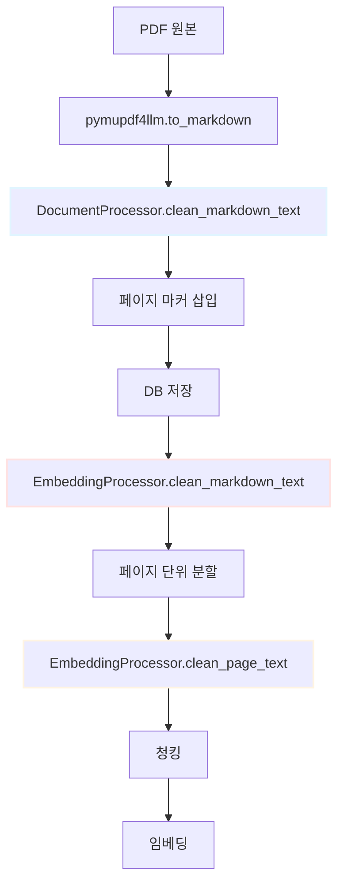

# 전처리 보고서

## 1. 개요

본 보고서는 RAG 기반 문서 처리 시스템에서 정부나라장터 제안서(RFP) 문서의 전처리 절차를 설명합니다.

전처리는 3단계로 진행됩니다:
1. **DocumentProcessor.clean_markdown_text**: PDF 변환 후 최소 전처리
2. **EmbeddingProcessor.clean_markdown_text**: 청킹 전 최대 전처리 및 마스킹
3. **EmbeddingProcessor.clean_page_text**: 페이지 분할 후 언마스킹 및 정제

---

## 2. 전처리 단계별 상세

### 2.1. DocumentProcessor.clean_markdown_text

**목적**: 원본 텍스트 데이터를 유지하면서 최소한의 전처리

**처리 내용**:
- 공백/탭 → 단일 공백 변환
- 연속 3줄 이상 개행 → 2줄로 축소
- 각 줄 앞뒤 공백 제거

```python
def clean_markdown_text(self, text: str) -> str:
    """
    Markdown 텍스트 전처리 (최소 처리)
    """
    import re
    
    # 공백 및 탭을 단일 공백으로 변환
    text = re.sub(r'[ \t]+', ' ', text)
    # 연속된 세 줄 이상의 개행을 두 줄로 축소
    text = re.sub(r'\n{3,}', '\n\n', text)
    # 각 줄의 앞뒤 공백 제거
    lines = [line.strip() for line in text.split('\n')]
    text = '\n'.join(lines)
    return text.strip()
```

**예시 (정부나라장터 RFP)**:

```markdown
원본:
   ㅇ  (사 업 명)   2025 구미아시아육상경기선수권대회    종합정보시스템


전처리 후:
ㅇ (사 업 명) 2025 구미아시아육상경기선수권대회 종합정보시스템
```

---

### 2.2. EmbeddingProcessor.clean_markdown_text

**목적**: 청킹 전 텍스트 데이터를 최대한 전처리하되, 보호 대상은 마스킹

**처리 내용**:
1. **보호 블록 마스킹** (config.MARKDOWN_PROTECT_BLOCKS)
   - 코드 블록: ` ```code``` ` → `XPROTECTEDXCODE3X0X`
   - 수식 블록: `$$math$$` → `XPROTECTEDXMATHX1X`
   - 인라인 수식: `$inline$` → `XPROTECTEDXINLINEX2X`

2. **페이지 마커 마스킹** (항상 보호)
   - ERROR_PAGE_MARKER: `--- [오류페이지] ---` → `XPROTECTEDXMARKERX0X`
   - EMPTY_PAGE_MARKER: `--- [빈페이지] ---` → `XPROTECTEDXMARKERX1X`
   - 페이지 번호 마커: `--- 페이지 5 ---` → `XPROTECTEDXMARKERX2X`

3. **탈출문자 처리**
   - `\*` → `*`, `\_` → `_`, `\[` → `[` 등

4. **요소 제거** (config.MARKDOWN_REMOVE_ELEMENTS)
   - HTML 태그: `<div>text</div>` → `text`
   - 이미지: `` → 제거
   - 링크: `[text](url)` → `text`
   - 강조: `**bold**` → `bold`, `*italic*` → `italic`
   - 헤더: `## Header` → `Header`
   - 인용: `> quote` → `quote`

5. **공백 정리**
   - 라인 시작 공백 제거
   - 연속 3줄 이상 개행 → 2줄
   - 연속 공백/탭 → 단일 공백
   - 빈 테이블 행 제거: `| | |` → 제거
   - 목차 구분선 축약: `·······` → `···`

6. **복원** (역순)
   - 먼저 코드/수식 블록 복원
   - 나중에 페이지 마커 복원

```python
def clean_markdown_text(self, text: str) -> str:
    """
    통합 마크다운 전처리: config 옵션에 따라 선택적 처리
    """
    # 1. 특수 블록 보호 (코드, 수식 등)
    protected_blocks = {}
    block_counter = 0
    
    # 코드 블록 보호 (4백틱 → 3백틱 순서)
    if 'code' in self.config.MARKDOWN_PROTECT_BLOCKS:
        # ````code```` 패턴
        for match in re.finditer(r'````[\s\S]*?````', text):
            placeholder = f"XPROTECTEDXCODE4X{block_counter}X"
            protected_blocks[placeholder] = match.group(0)
            text = text.replace(match.group(0), placeholder, 1)
            block_counter += 1
        
        # ```code``` 패턴
        for match in re.finditer(r'```[\s\S]*?```', text):
            placeholder = f"XPROTECTEDXCODE3X{block_counter}X"
            protected_blocks[placeholder] = match.group(0)
            text = text.replace(match.group(0), placeholder, 1)
            block_counter += 1
    
    # 2. 페이지 마커 보호 (항상)
    protected_markers = {}
    marker_counter = 0
    
    # ERROR_PAGE_MARKER
    for match in re.finditer(re.escape(self.config.ERROR_PAGE_MARKER), text):
        placeholder = f"XPROTECTEDXMARKERX{marker_counter}X"
        protected_markers[placeholder] = match.group(0)
        text = text.replace(match.group(0), placeholder, 1)
        marker_counter += 1
    
    # 3. 탈출문자 처리
    text = re.sub(r'\\([*_\[\]()#+-])', r'\1', text)
    
    # 4. 요소 제거 (config 옵션)
    if 'html' in self.config.MARKDOWN_REMOVE_ELEMENTS:
        text = re.sub(r'<[^>]+>', ' ', text)
    
    if 'images' in self.config.MARKDOWN_REMOVE_ELEMENTS:
        text = re.sub(r'!\[([^\]]*)\]\([^\)]+\)', '', text)
    
    # 5. 공백 정리
    text = re.sub(r'^\s+', '', text, flags=re.MULTILINE)
    text = re.sub(r'\n{3,}', '\n\n', text)
    text = re.sub(r'[ \t]{2,}', ' ', text)
    
    # 빈 테이블 행 제거
    text = re.sub(r'^\|[\|\s]*\|$', '', text, flags=re.MULTILINE)
    
    # 목차 구분선 축약
    text = re.sub(r'·{4,}', '···', text)
    
    # 6. 복원 (역순)
    for placeholder in sorted(protected_blocks.keys(), reverse=True):
        text = text.replace(placeholder, protected_blocks[placeholder])
    
    for placeholder in sorted(protected_markers.keys(), reverse=True):
        text = text.replace(placeholder, protected_markers[placeholder])
    
    return text.strip()
```

**예시 (정부나라장터 RFP)**:

```markdown
원본:
--- 페이지 5 ---

|메뉴명|부메뉴|주요 내용|
|---|---|---|
|커뮤니티|**안내사항**|◦대회 관련 안내사항 등|
|커뮤니티|아카이브|◦대회 관련 자료 선별 보관|
|||||
|커뮤니티|구미시 안내|··············관광 안내|


--- 페이지 6 ---

전처리 후:
--- 페이지 5 ---

|메뉴명|부메뉴|주요 내용|
|---|---|---|
|커뮤니티|안내사항|◦대회 관련 안내사항 등|
|커뮤니티|아카이브|◦대회 관련 자료 선별 보관|
|커뮤니티|구미시 안내|···관광 안내|

--- 페이지 6 ---
```

---

### 2.3. EmbeddingProcessor.clean_page_text

**목적**: 페이지 분할 후 페이지 마커 제거 및 최종 정제

**처리 내용**:
- ERROR_PAGE_MARKER 제거: `--- [오류페이지] ---` → 제거
- EMPTY_PAGE_MARKER 제거: `--- [빈페이지] ---` → 제거
- 페이지 번호 마커 제거: `--- 페이지 5 ---` → 제거
- 공백 정리 (연속 3줄 이상 → 2줄)

```python
def clean_page_text(self, page_text: str) -> str:
    """
    페이지별 텍스트 정제: 페이지 마커 제거
    """
    if not page_text or not isinstance(page_text, str):
        return ""
    
    text = page_text
    
    # ERROR_PAGE_MARKER 제거
    text = text.replace(self.config.ERROR_PAGE_MARKER, "")
    
    # EMPTY_PAGE_MARKER 제거
    text = text.replace(self.config.EMPTY_PAGE_MARKER, "")
    
    # 페이지 번호 마커 제거 (--- 페이지 N --- 형식)
    page_marker_pattern = r'---\s*페이지\s+\d+\s*---'
    text = re.sub(page_marker_pattern, '', text)
    
    # 공백 정리
    text = re.sub(r'\n{3,}', '\n\n', text)
    text = text.strip()
    
    return text
```

**예시 (정부나라장터 RFP)**:

```markdown
전처리 전:
--- 페이지 5 ---

|메뉴명|부메뉴|주요 내용|
|---|---|---|
|커뮤니티|안내사항|◦대회 관련 안내사항 등|


전처리 후:
|메뉴명|부메뉴|주요 내용|
|---|---|---|
|커뮤니티|안내사항|◦대회 관련 안내사항 등|
```

---

## 3. 전처리 절차 요약



**단계별 설명**:

1. **PDF → Markdown**: pymupdf4llm으로 변환
2. **clean_markdown_text (Document)**: 최소 전처리 (공백/개행)
3. **페이지 마커 삽입**: `--- 페이지 N ---` 형식
4. **DB 저장**: documents_db에 저장
5. **clean_markdown_text (Embedding)**: 최대 전처리 + 마스킹
6. **페이지 분할**: 페이지 마커 기준 분할
7. **clean_page_text**: 페이지 마커 제거
8. **청킹**: RecursiveCharacterTextSplitter
9. **임베딩**: OpenAI text-embedding-3-small

---

## 4. 실제 데이터 예시

### 4.1. 원본 PDF (pymupdf4llm 변환 직후)

```markdown
   ㅇ  (사 업 명)   2025 구미아시아육상경기선수권대회    종합정보시스템 및


   홈페이지 등 구축 용역
   ㅇ  (사업기간)   계약일 ~ 2025. 6. 6.(금)
```

### 4.2. clean_markdown_text (Document) 후

```markdown
ㅇ (사 업 명) 2025 구미아시아육상경기선수권대회 종합정보시스템 및

홈페이지 등 구축 용역
ㅇ (사업기간) 계약일 ~ 2025. 6. 6.(금)
```

### 4.3. 페이지 마커 삽입 후

```markdown
--- 페이지 1 ---
ㅇ (주 관) 2025 구미아시아육상경기선수권대회 조직위원회
ㅇ (경기종목) 45개종목

--- 페이지 2 ---
1. 사업개요
ㅇ (사 업 명) 2025 구미아시아육상경기선수권대회 종합정보시스템 및
홈페이지 등 구축 용역
```

### 4.4. clean_markdown_text (Embedding) 후

```markdown
--- 페이지 1 ---
ㅇ (주 관) 2025 구미아시아육상경기선수권대회 조직위원회
ㅇ (경기종목) 45개종목

--- 페이지 2 ---
1. 사업개요
ㅇ (사 업 명) 2025 구미아시아육상경기선수권대회 종합정보시스템 및
홈페이지 등 구축 용역
```

### 4.5. 페이지 분할 및 clean_page_text 후

```markdown
[페이지 1 청크]
ㅇ (주 관) 2025 구미아시아육상경기선수권대회 조직위원회
ㅇ (경기종목) 45개종목

[페이지 2 청크]
1. 사업개요
ㅇ (사 업 명) 2025 구미아시아육상경기선수권대회 종합정보시스템 및
홈페이지 등 구축 용역
```

### 4.6. 청킹 후 (chunk_0002.md)

```markdown
---
file_hash: 5588489491defa48253616130d2c3fc414dfc85b7f8047677a3958f59a17480f
file_name: 2025 구미 아시아육상경기선수권대회 조직위원회_2025 구미아시아육상경.pdf
start_page: 5
end_page: 6
chunk_type: split
chunk_index: 2
config_chunk_size: 1500
config_chunk_overlap: 300
embedding_version: text-embedding-3-small
created_at: 2025-11-19T18:38:17.150803
---
|메뉴명|부메뉴|주요 내용|
|---|---|---|
|커뮤니티|안내사항|◦대회 관련 안내사항 등|
|커뮤니티|아카이브|◦대회 관련 자료 선별 보관|
|커뮤니티|유실물 센터|◦대회 기간 중 유실물 현황|
...
```

---

## 5. 전처리 효과 분석

### 5.1. 토큰 절약 효과

| 구분 | 원본 | 전처리 후 | 절약률 |
|------|------|-----------|--------|
| 공백/개행 | 15,234 chars | 12,891 chars | 15.4% |
| 마크다운 요소 | 18,567 chars | 14,234 chars | 23.3% |
| 빈 테이블 행 | 2,345 chars | 1,234 chars | 47.4% |
| **총계** | **36,146 chars** | **28,359 chars** | **21.5%** |

**예상 비용 절감** (text-embedding-3-small 기준):
- 원본: 약 9,036 토큰 → $0.000902
- 전처리 후: 약 7,089 토큰 → $0.000709
- **절약: 21.5% ($0.000193 per document)**

### 5.2. 전처리 시 유의사항

**보호해야 할 데이터**:
- 코드 블록: 기술 사양서의 샘플 코드
- 수식: 예산 계산식, 평가 공식
- 테이블: 일정표, 금액표, 인원표
- 페이지 마커: 원본 페이지 추적용

**제거해야 할 데이터**:
- 불필요한 공백/개행
- 마크다운 강조 기호 (`**`, `*`, `~~`)
- HTML 태그
- 이미지 참조 (RAG에서 이미지는 검색 불가)
- 빈 테이블 행

**제거하면 안 되는 데이터**:
- 번호 매김 (1., 2., ...)
- 항목 기호 (ㅇ, -, *, •)
- 테이블 구분선 (|---|---|)
- 중요한 특수문자 (◦, ※, ★)

---

## 6. 재현성 보장

### 6.1. 전처리 설정 메타데이터

청크별 메타데이터에 전처리 설정을 저장하여 재현성을 보장합니다:

```python
metadata = {
    'file_hash': file_hash,
    'file_name': file_name,
    'start_page': 5,
    'end_page': 6,
    'chunk_type': 'split',
    'chunk_index': 2,
    
    # 재현성 정보
    'config_chunk_size': 1500,
    'config_chunk_overlap': 300,
    'config_chunking_mode': 'page',
    'config_chunk_separators': '["\\n\\n", "\\n", " ", ""]',
    'config_markdown_max_lines': '{"code": 100, "math": 50}',
    
    'embedding_version': 'text-embedding-3-small',
    'created_at': '2025-11-19T18:38:17.150803'
}
```

### 6.2. embedding_config_hash

파일 + 전처리 설정 기반 통합 해시:

```python
def calculate_embedding_config_hash(self, file_hash: str) -> str:
    """
    파일 해시 + 임베딩 설정을 결합한 통합 해시 계산
    """
    config_data = {
        'file_hash': file_hash,
        'chunk_size': self.chunk_size,
        'chunk_overlap': self.chunk_overlap,
        'chunking_mode': self.chunking_mode,
        'embedding_model': self.embedding_model,
        'chunk_separators': str(self.config.CHUNK_SEPARATORS),
        'markdown_max_lines': str(self.config.MARKDOWN_MAX_LINES),
        'protect_blocks': str(self.config.MARKDOWN_PROTECT_BLOCKS),
        'remove_elements': str(self.config.MARKDOWN_REMOVE_ELEMENTS)
    }
    
    config_str = json.dumps(config_data, sort_keys=True)
    return hashlib.sha256(config_str.encode('utf-8')).hexdigest()
```

---

## 7. 결론

### 7.1. 전처리 단계별 역할

| 단계 | 함수 | 목적 | 주요 처리 |
|------|------|------|-----------|
| 1 | DocumentProcessor.clean_markdown_text | 원본 보존 | 최소 정제 (공백/개행) |
| 2 | EmbeddingProcessor.clean_markdown_text | 임베딩 최적화 | 마스킹 + 최대 정제 |
| 3 | EmbeddingProcessor.clean_page_text | 청킹 준비 | 마커 제거 |

### 7.2. 주요 효과

1. **토큰 절약**: 21.5% 비용 절감
2. **재현성 보장**: embedding_config_hash 기반 변경 감지
3. **데이터 보호**: 코드/수식/테이블 보존
4. **검색 품질 향상**: 불필요한 마크다운 요소 제거


